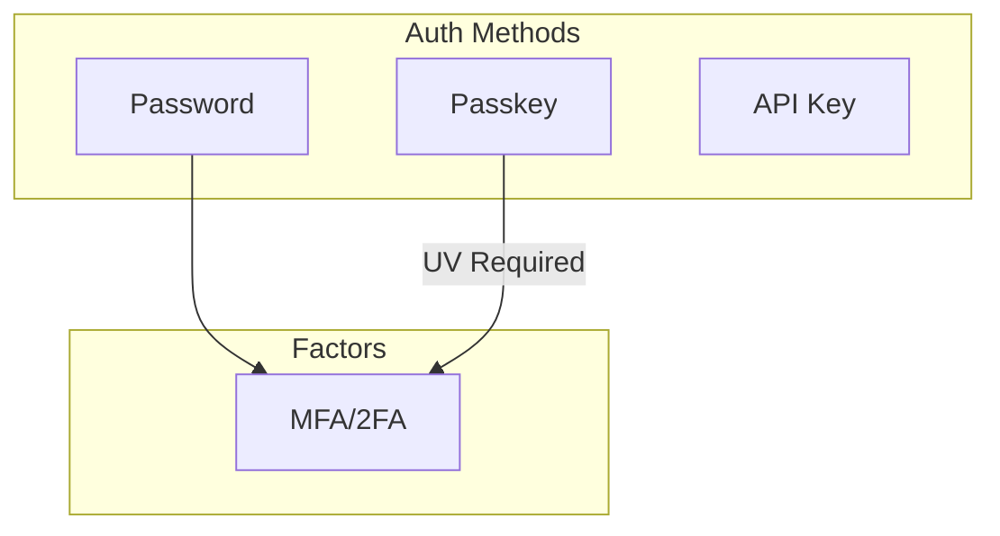
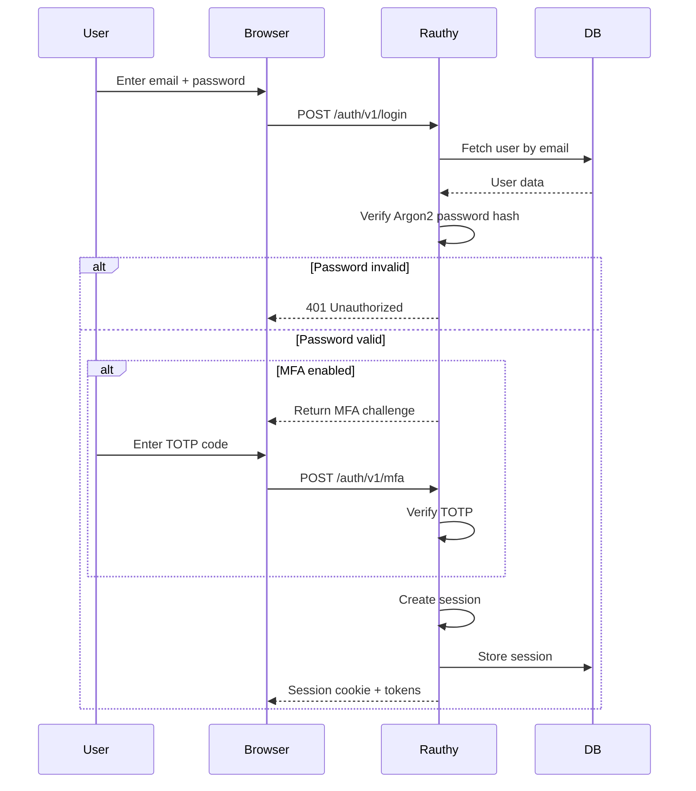
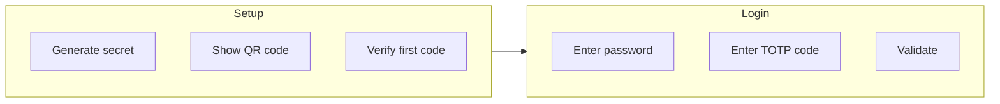
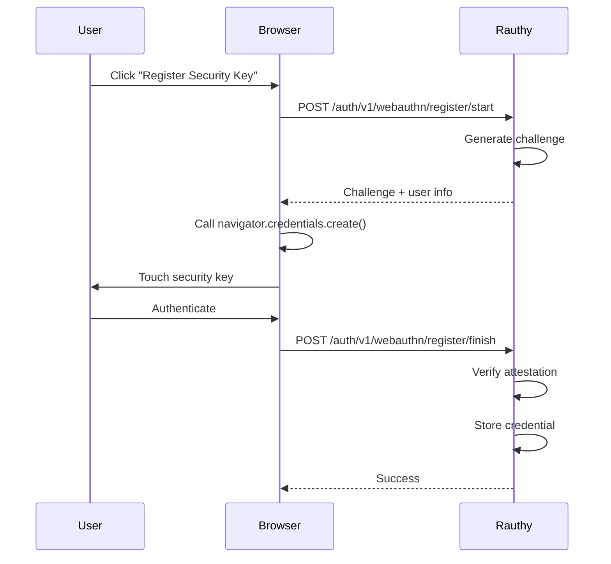
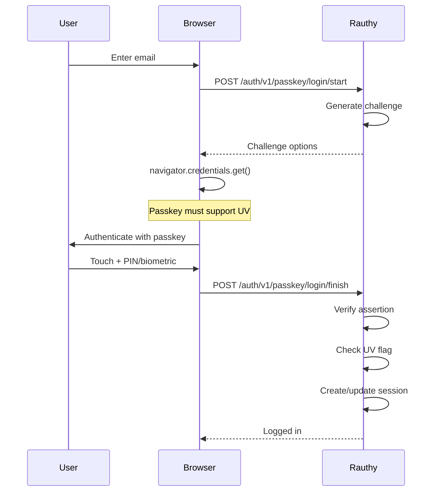
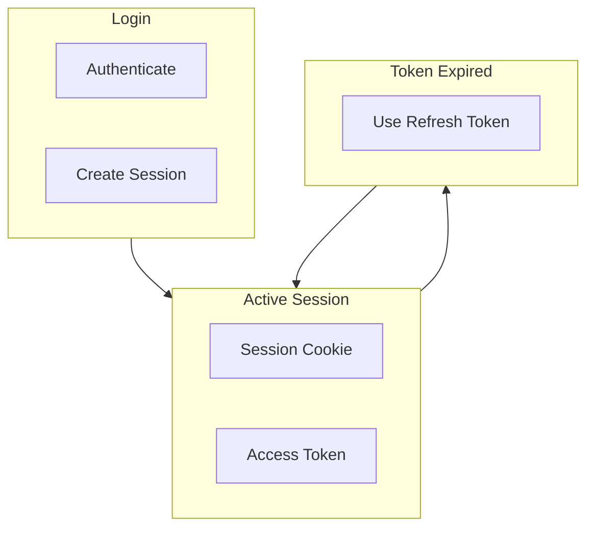

# rauthy Authentication

Authentication flows, MFA, and passkey support.

## Authentication Methods



## Password Authentication

### Login Flow



**Aha:** Passwords use Argon2id hashing (memory-hard, resistant to GPU cracking).

### Password Requirements

Default password policy:
- Minimum 12 characters
- At least one uppercase
- At least one lowercase
- At least one number
- At least one special character

```rust
// src/common/password.rs
pub fn validate_password(password: &str) -> Result<(), Error> {
    if password.len() < 12 {
        return Err(Error::PasswordTooShort);
    }
    if !password.chars().any(|c| c.is_uppercase()) {
        return Err(Error::PasswordNoUppercase);
    }
    if !password.chars().any(|c| c.is_lowercase()) {
        return Err(Error::PasswordNoLowercase);
    }
    if !password.chars().any(|c| c.is_numeric()) {
        return Err(Error::PasswordNoNumber);
    }
    if !password.chars().any(|c| !c.is_alphanumeric()) {
        return Err(Error::PasswordNoSpecial);
    }
    Ok(())
}
```

## Multi-Factor Authentication (MFA)

### TOTP (Time-based One-Time Password)



**Implementation:**

```rust
// src/service/mfa.rs
use totp_rs::{Algorithm, TOTP};

pub struct MfaService;

impl MfaService {
    pub fn generate_secret() -> String {
        let secret = Secret::generate_secret();
        secret.to_encoded().to_string()
    }
    
    pub fn generate_totp(secret: &str) -> Result<TOTP, Error> {
        TOTP::new(
            Algorithm::SHA1,
            6,
            1,
            30,
            Secret::from_encoded(secret)?.to_bytes()?,
        )
    }
    
    pub fn verify_totp(secret: &str, code: &str) -> Result<bool, Error> {
        let totp = Self::generate_totp(secret)?;
        Ok(totp.check_current(code)?)
    }
}
```

### WebAuthn/FIDO2 (Security Keys)

Registration flow:



**Aha:** Security keys provide phishing-resistant MFA using public key cryptography.

## Passkey Authentication

### Passkey-Only Accounts

Users can create accounts with only a passkey (no password):



**Requirements:**
- Passkey must support User Verification (UV)
- UV = PIN, biometric, or device password
- Provides 2FA: something you have (key) + something you are/know (UV)

### Discoverable Credentials

**Aha:** rauthy **discourages** discoverable credentials by default:

- **Standard passkeys:** Require entering email each time
- **Discoverable credentials:** Store user ID on authenticator (uses YubiKey slots)

Benefits of non-discoverable:
- No storage used on authenticator
- No limit on number of passkeys
- Better privacy (no username enumeration)

## Session Management

### Session Types

| Type | Purpose | Duration |
|------|---------|----------|
| **Access Token** | API access | 15 minutes (configurable) |
| **Refresh Token** | Get new access token | 7 days (configurable) |
| **Session Cookie** | Web UI | Configurable |

### Session Flow



## API Key Authentication

For service-to-service authentication:

```rust
// src/api/api_key.rs
pub async fn validate_api_key(
    headers: &HeaderMap,
) -> Result<Client, Error> {
    let key = headers
        .get("X-API-Key")
        .ok_or(Error::MissingApiKey)?;
    
    // Hash and validate
    let hash = sha256(key.as_bytes());
    let client = Client::find_by_api_key(&hash).await?;
    
    Ok(client)
}
```

## Security Features

### Brute Force Protection

- Rate limiting on login attempts
- Account lockout after failed attempts
- Exponential backoff

### Session Security

- Secure, HttpOnly cookies
- CSRF protection
- SameSite strict
- Session binding to IP/browser fingerprint

### Audit Logging

All authentication events logged:
- Login attempts (success/failure)
- MFA challenges
- Passkey registrations
- Session creations
- Password changes

## Next Steps

Continue to [OIDC & OAuth2 →](03-oidc-oauth.html) for protocol implementation.
