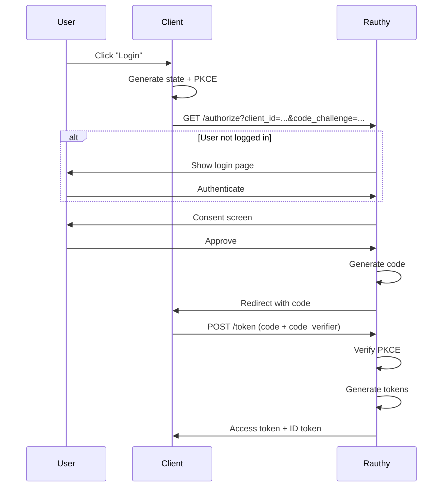
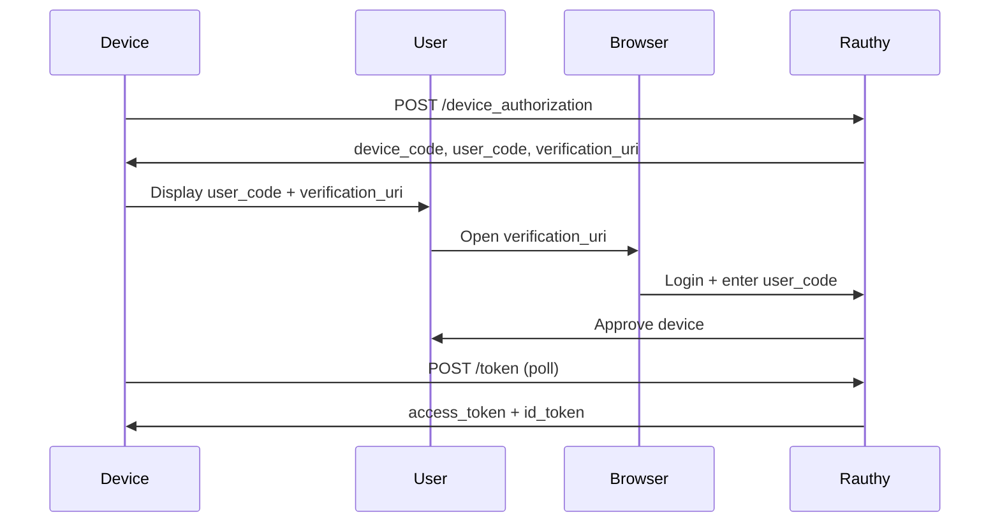

# OIDC & OAuth2

OpenID Connect and OAuth 2.0 implementation.

## Overview

rauthy implements:
- **OpenID Connect Core 1.0** — Authentication layer on OAuth2
- **OAuth 2.0 Authorization Framework** — Authorization protocol
- **PKCE (RFC 7636)** — Proof Key for Code Exchange
- **Device Authorization Grant (RFC 8628)** — Device flow

## OIDC Endpoints

| Endpoint | Path | Purpose |
|----------|------|---------|
| Authorization | `/oidc/authorize` | Start login flow |
| Token | `/oidc/token` | Exchange code for tokens |
| UserInfo | `/oidc/userinfo` | Get user info |
| JWKS | `/oidc/jwks` | Public keys |
| Discovery | `/.well-known/openid-configuration` | Metadata |

## Authorization Code Flow

### Flow Overview



### PKCE (Proof Key for Code Exchange)

**Aha:** PKCE prevents authorization code interception attacks.

```rust
// src/oidc/pkce.rs
pub struct Pkce {
    code_challenge: String,
    code_challenge_method: String, // S256
}

impl Pkce {
    pub fn verify(&self, code_verifier: &str) -> Result<bool, Error> {
        if self.code_challenge_method != "S256" {
            return Err(Error::InvalidPkceMethod);
        }
        
        let hash = sha256(code_verifier.as_bytes());
        let challenge = base64_url_encode(&hash);
        
        Ok(challenge == self.code_challenge)
    }
}
```

**Default:** S256 (SHA-256) required, plaintext discouraged

## Token Request

### Request

```http
POST /oidc/token
Content-Type: application/x-www-form-urlencoded

grant_type=authorization_code
&code=AUTH_CODE
&redirect_uri=https://client.example.com/callback
&client_id=CLIENT_ID
&client_secret=CLIENT_SECRET
&code_verifier=VERIFIER
```

### Response

```json
{
  "access_token": "eyJhbGciOiJFZERTQSJ9...",
  "token_type": "Bearer",
  "expires_in": 900,
  "refresh_token": "dGhpcyBpcyBhIHJlZnJlc2g...",
  "id_token": "eyJhbGciOiJFZERTQSJ9..."
}
```

## ID Token Claims

| Claim | Description | Example |
|-------|-------------|---------|
| `iss` | Issuer | `https://auth.example.com` |
| `sub` | Subject (user ID) | `user_123` |
| `aud` | Audience (client ID) | `client_456` |
| `exp` | Expiration time | `1640995200` |
| `iat` | Issued at | `1640995100` |
| `email` | User email | `user@example.com` |
| `name` | Full name | `John Doe` |
| `groups` | User groups | `["admins", "users"]` |

```rust
// src/oidc/claims.rs
#[derive(Debug, Serialize)]
pub struct IdTokenClaims {
    pub iss: String,
    pub sub: String,
    pub aud: String,
    pub exp: i64,
    pub iat: i64,
    pub email: Option<String>,
    pub name: Option<String>,
    pub groups: Vec<String>,
}

impl IdTokenClaims {
    pub fn new(user: &User, client: &Client) -> Self {
        Self {
            iss: config::issuer_url(),
            sub: user.id.clone(),
            aud: client.id.clone(),
            exp: Utc::now().timestamp() + 900,
            iat: Utc::now().timestamp(),
            email: Some(user.email.clone()),
            name: user.display_name.clone(),
            groups: user.groups.clone(),
        }
    }
}
```

## Client Configuration

### Client Types

| Type | Use Case | Secret Required |
|------|----------|-----------------|
| **Confidential** | Server-side apps | Yes |
| **Public** | SPAs, mobile apps | No |
| **Device** | IoT, CLI tools | No |

### Client Settings

```toml
# Client configuration
[client.myapp]
name = "My Application"
client_id = "myapp"
client_secret = "secret123"  # For confidential clients
redirect_uris = ["https://app.example.com/callback"]
grant_types = ["authorization_code", "refresh_token"]
response_types = ["code"]
token_endpoint_auth_method = "client_secret_post"

# Security settings
[client.myapp.security]
allowed_signing_alg = ["EdDSA", "RS256"]
require_pkce = true
pkce_challenge_method = "S256"
```

## Discovery Document

```http
GET /.well-known/openid-configuration
```

```json
{
  "issuer": "https://auth.example.com",
  "authorization_endpoint": "https://auth.example.com/oidc/authorize",
  "token_endpoint": "https://auth.example.com/oidc/token",
  "userinfo_endpoint": "https://auth.example.com/oidc/userinfo",
  "jwks_uri": "https://auth.example.com/oidc/jwks",
  "response_types_supported": ["code"],
  "grant_types_supported": [
    "authorization_code",
    "refresh_token",
    "client_credentials"
  ],
  "subject_types_supported": ["public"],
  "id_token_signing_alg_values_supported": ["EdDSA", "RS256", "ES256"],
  "code_challenge_methods_supported": ["S256", "plain"]
}
```

## Device Authorization Grant

For devices without browsers (IoT, CLI):



## Client Credentials Flow

For service-to-service authentication:

```http
POST /oidc/token
Content-Type: application/x-www-form-urlencoded

grant_type=client_credentials
&client_id=SERVICE_ID
&client_secret=SERVICE_SECRET
&scope=api:read api:write
```

## Scopes

| Scope | Description |
|-------|-------------|
| `openid` | Required for OIDC |
| `profile` | Access to profile info |
| `email` | Access to email |
| `groups` | Access to user groups |
| `api:read` | Read API access |
| `api:write` | Write API access |

## Refresh Tokens

```http
POST /oidc/token
Content-Type: application/x-www-form-urlencoded

grant_type=refresh_token
&refresh_token=REFRESH_TOKEN
&client_id=CLIENT_ID
&client_secret=CLIENT_SECRET
```

**Aha:** Refresh tokens rotate on each use for security.

## Next Steps

Continue to [JWT Tokens →](04-jwt-tokens.html) for token implementation.
