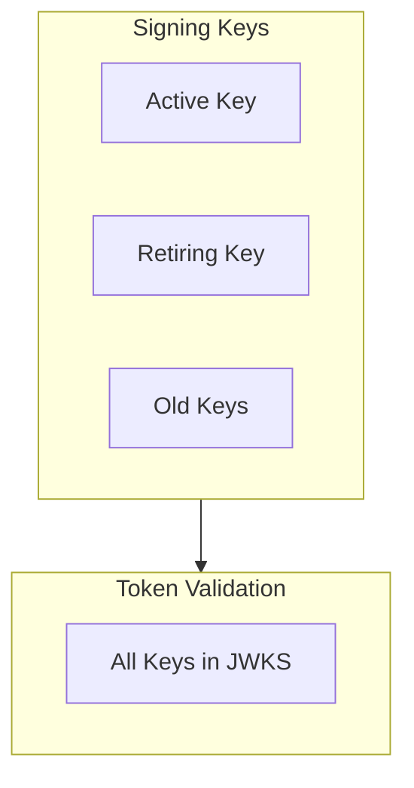

# JWT Tokens

JSON Web Token handling and signing.

## Token Types

| Token | Purpose | Lifetime |
|-------|---------|----------|
| **Access Token** | API authorization | 15 minutes (default) |
| **ID Token** | User identity (OIDC) | 15 minutes (default) |
| **Refresh Token** | Get new access token | 7 days (default) |

## Signing Algorithms

### Default: EdDSA (ed25519)

**Aha:** Ed25519 provides best security with compact signatures.

```rust
// src/jwt/eddsa.rs
use ed25519_dalek::{Keypair, Signer, Verifier};

pub struct Ed25519Signer {
    keypair: Keypair,
}

impl Ed25519Signer {
    pub fn new() -> Self {
        let mut csprng = OsRng {};
        let keypair = Keypair::generate(&mut csprng);
        Self { keypair }
    }
    
    pub fn sign(&self, message: &[u8]) -> Vec<u8> {
        self.keypair.sign(message).to_bytes().to_vec()
    }
    
    pub fn verify(&self, message: &[u8], signature: &[u8]) -> Result<(), Error> {
        let signature = Signature::from_bytes(signature)?;
        self.keypair.public.verify(message, &signature)?;
        Ok(())
    }
}
```

**Benefits of Ed25519:**
- Faster than ECDSA
- Compact signatures (64 bytes)
- No nonce reuse issues
- Side-channel resistant

### Alternative: RS256 (RSA)

For compatibility with older clients:

```rust
// src/jwt/rsa.rs
use rsa::{RsaPrivateKey, RsaPublicKey, PaddingScheme};

pub struct RsaSigner {
    private_key: RsaPrivateKey,
    public_key: RsaPublicKey,
}

impl RsaSigner {
    pub fn new() -> Result<Self, Error> {
        let mut rng = OsRng;
        let bits = 2048;
        let private_key = RsaPrivateKey::new(&mut rng, bits)?;
        let public_key = RsaPublicKey::from(&private_key);
        
        Ok(Self { private_key, public_key })
    }
    
    pub fn sign(&self, message: &[u8]) -> Result<Vec<u8>, Error> {
        let padding = PaddingScheme::new_pkcs1v15_sign(None);
        self.private_key.sign(padding, message)
    }
}
```

## JWT Structure

```
base64url(header) + "." + base64url(payload) + "." + base64url(signature)
```

### Header

```json
{
  "alg": "EdDSA",
  "typ": "JWT",
  "kid": "key-2025-01"
}
```

### Payload (Claims)

```json
{
  "iss": "https://auth.example.com",
  "sub": "user_123",
  "aud": "myapp",
  "exp": 1640995200,
  "iat": 1640995100,
  "jti": "token-uuid",
  "scope": "openid profile",
  "groups": ["users", "admins"]
}
```

## Token Validation

```rust
// src/jwt/validation.rs
pub struct TokenValidator {
    issuer: String,
    allowed_algs: Vec<Algorithm>,
}

impl TokenValidator {
    pub fn validate(&self, token: &str) -> Result<Claims, Error> {
        // Split token
        let parts: Vec<&str> = token.split('.').collect();
        if parts.len() != 3 {
            return Err(Error::InvalidToken);
        }
        
        // Decode header
        let header_json = base64url_decode(parts[0])?;
        let header: Header = serde_json::from_slice(&header_json)?;
        
        // Check algorithm
        if !self.allowed_algs.contains(&header.alg) {
            return Err(Error::InvalidAlgorithm);
        }
        
        // Decode payload
        let payload_json = base64url_decode(parts[1])?;
        let claims: Claims = serde_json::from_slice(&payload_json)?;
        
        // Validate claims
        self.validate_claims(&claims)?;
        
        // Verify signature
        self.verify_signature(token, &header)?;
        
        Ok(claims)
    }
    
    fn validate_claims(&self, claims: &Claims) -> Result<(), Error> {
        // Check issuer
        if claims.iss != self.issuer {
            return Err(Error::InvalidIssuer);
        }
        
        // Check expiration
        let now = Utc::now().timestamp();
        if claims.exp < now {
            return Err(Error::TokenExpired);
        }
        
        // Check not before
        if let Some(nbf) = claims.nbf {
            if nbf > now {
                return Err(Error::TokenNotYetValid);
            }
        }
        
        Ok(())
    }
}
```

## JWKS (JSON Web Key Set)

Public keys for token validation:

```http
GET /oidc/jwks
```

```json
{
  "keys": [
    {
      "kty": "OKP",
      "crv": "Ed25519",
      "x": "base64-public-key",
      "kid": "key-2025-01",
      "use": "sig",
      "alg": "EdDSA"
    }
  ]
}
```

```rust
// src/jwt/jwks.rs
pub struct Jwks {
    keys: Vec<Jwk>,
}

impl Jwks {
    pub fn get_key(&self, kid: &str) -> Option<&Jwk> {
        self.keys.iter().find(|k| k.kid == kid)
    }
    
    pub fn to_json(&self) -> Result<String, Error> {
        serde_json::to_string(self).map_err(|e| e.into())
    }
}
```

## Key Rotation



**Aha:** Keep old keys in JWKS for token validation, but only sign with active key.

## Token Storage

### Access Tokens

Cached in memory for fast validation:

```rust
// src/cache/token_cache.rs
pub struct TokenCache {
    tokens: DashMap<String, CachedToken>,
}

impl TokenCache {
    pub fn get(&self, token: &str) -> Option<Claims> {
        self.tokens.get(token).map(|t| t.claims.clone())
    }
    
    pub fn insert(&self, token: String, claims: Claims) {
        let cached = CachedToken {
            claims,
            inserted_at: Instant::now(),
        };
        self.tokens.insert(token, cached);
    }
}
```

### Refresh Tokens

Stored hashed in database:

```rust
// src/data/refresh_token.rs
#[derive(sqlx::FromRow)]
pub struct RefreshToken {
    pub id: String,
    pub user_id: String,
    pub client_id: String,
    pub token_hash: String,  // Hashed!
    pub expires_at: DateTime<Utc>,
    pub rotated_at: Option<DateTime<Utc>>,
}

impl RefreshToken {
    pub fn verify(&self, token: &str) -> Result<bool, Error> {
        let hash = sha256(token.as_bytes());
        Ok(self.token_hash == hash)
    }
}
```

**Aha:** Refresh tokens are hashed (not stored plaintext) for security.

## Token Introspection

OAuth2 token introspection endpoint:

```http
POST /oidc/token/introspection
Authorization: Basic base64(client_id:client_secret)
Content-Type: application/x-www-form-urlencoded

token=ACCESS_TOKEN
```

```json
{
  "active": true,
  "scope": "openid profile",
  "client_id": "myapp",
  "username": "user@example.com",
  "exp": 1640995200
}
```

## Security Considerations

### Short-Lived Tokens

- Access tokens: 15 minutes (default)
- ID tokens: 15 minutes (default)
- Refresh tokens: 7 days with rotation

### Audience Restriction

```rust
// Validate audience
if !claims.aud.contains(&client_id) {
    return Err(Error::InvalidAudience);
}
```

### Binding

Tokens can be bound to:
- Client ID
- Device fingerprint
- IP address

## Next Steps

Continue to [Database →](05-database.html) for persistence layer.
