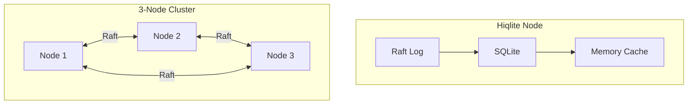
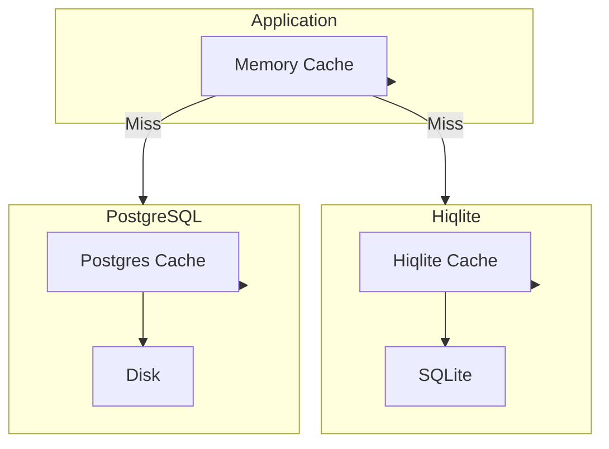

# Database & Caching

Persistence and caching architecture.

## Database Options

| Database | Use Case | HA Support |
|----------|----------|------------|
| **Hiqlite** | Default, embedded | Yes (Raft) |
| **PostgreSQL** | External, existing | Yes (Replication) |

## Hiqlite (Default)

**Aha:** Hiqlite is an embedded, distributed SQLite with Raft consensus.

### Architecture



### Features

- **Embedded** — No external database needed
- **Distributed** — Raft consensus for HA
- **SQLite compatible** — Full SQL support
- **Memory caching** — Hot data cached
- **Automatic failover** — Leader election

### Configuration

```toml
# config.toml
[database]
type = "hiqlite"

[database.hiqlite]
node_id = 1
nodes = [
    "node1:2380",
    "node2:2380",
    "node3:2380"
]
data_dir = "/data/rauthy"
```

### Single Node

```toml
[database]
type = "hiqlite"

[database.hiqlite]
node_id = 1
nodes = ["localhost:2380"]
data_dir = "/data/rauthy"
```

### Memory Usage

| Mode | Memory | Notes |
|------|--------|-------|
| Single | ~57 MB | Includes cache |
| HA (3 nodes) | ~65 MB | Per node |

## PostgreSQL

### When to Use

- Existing Postgres infrastructure
- Need external database management
- Prefer separate database service

### Configuration

```toml
# config.toml
[database]
type = "postgres"

[database.postgres]
host = "localhost"
port = 5432
user = "rauthy"
password = "secret"
database = "rauthy"
pool_size = 10
```

### Memory Usage

| Mode | Memory |
|------|--------|
| With Postgres | ~35 MB |

**Aha:** Lower memory because cache is smaller (relies on Postgres cache).

## Schema

### Users Table

```sql
CREATE TABLE users (
    id TEXT PRIMARY KEY,
    email TEXT UNIQUE NOT NULL,
    password_hash TEXT,
    mfa_enabled BOOLEAN DEFAULT FALSE,
    mfa_secret TEXT,
    email_verified BOOLEAN DEFAULT FALSE,
    created_at TIMESTAMP DEFAULT CURRENT_TIMESTAMP,
    updated_at TIMESTAMP DEFAULT CURRENT_TIMESTAMP
);

CREATE INDEX idx_users_email ON users(email);
```

### Sessions Table

```sql
CREATE TABLE sessions (
    id TEXT PRIMARY KEY,
    user_id TEXT NOT NULL REFERENCES users(id),
    client_id TEXT NOT NULL,
    access_token_hash TEXT NOT NULL,
    refresh_token_hash TEXT,
    expires_at TIMESTAMP NOT NULL,
    created_at TIMESTAMP DEFAULT CURRENT_TIMESTAMP,
    last_used_at TIMESTAMP
);

CREATE INDEX idx_sessions_user ON sessions(user_id);
CREATE INDEX idx_sessions_expires ON sessions(expires_at);
```

### Clients Table

```sql
CREATE TABLE clients (
    id TEXT PRIMARY KEY,
    name TEXT NOT NULL,
    client_secret_hash TEXT,
    redirect_uris TEXT NOT NULL, -- JSON array
    grant_types TEXT NOT NULL,   -- JSON array
    scopes TEXT NOT NULL,        -- JSON array
    is_public BOOLEAN DEFAULT FALSE,
    created_at TIMESTAMP DEFAULT CURRENT_TIMESTAMP
);
```

## Caching Strategy

### Cache Layers



### Cached Data

| Data | Cache Duration | Invalidation |
|------|----------------|--------------|
| User sessions | 1-4 hours | Logout, expiry |
| Client configs | 24 hours | Config change |
| JWKS keys | Configurable | Key rotation |
| Group memberships | 1 hour | Membership change |
| API keys | Until expiry | Revocation |

### Cache Implementation

```rust
// src/cache/mod.rs
pub struct Cache {
    inner: DashMap<String, CacheEntry>,
}

struct CacheEntry {
    value: Box<dyn Any + Send + Sync>,
    expires_at: Instant,
}

impl Cache {
    pub fn get<T: Clone + 'static>(&self, key: &str) -> Option<T> {
        let entry = self.inner.get(key)?;
        if entry.expires_at < Instant::now() {
            self.inner.remove(key);
            return None;
        }
        entry.value.downcast_ref::<T>().cloned()
    }
    
    pub fn set<T: Send + Sync + 'static>(
        &self,
        key: &str,
        value: T,
        ttl: Duration,
    ) {
        let entry = CacheEntry {
            value: Box::new(value),
            expires_at: Instant::now() + ttl,
        };
        self.inner.insert(key.to_string(), entry);
    }
    
    pub fn invalidate(&self, key: &str) {
        self.inner.remove(key);
    }
    
    pub fn invalidate_prefix(&self, prefix: &str) {
        let keys_to_remove: Vec<String> = self
            .inner
            .iter()
            .filter(|e| e.key().starts_with(prefix))
            .map(|e| e.key().clone())
            .collect();
        
        for key in keys_to_remove {
            self.inner.remove(&key);
        }
    }
}
```

### Cache Invalidation

**Aha:** Proper invalidation is critical for data consistency.

```rust
// src/cache/invalidation.rs
pub async fn invalidate_user_cache(user_id: &str) {
    let cache = get_cache();
    
    // Invalidate all user-related caches
    cache.invalidate(&format!("user:{}", user_id));
    cache.invalidate(&format!("user:sessions:{}", user_id));
    cache.invalidate(&format!("user:groups:{}", user_id));
    
    // Invalidate sessions
    cache.invalidate_prefix(&format!("session:user:{}", user_id));
}

pub async fn invalidate_client_cache(client_id: &str) {
    let cache = get_cache();
    cache.invalidate(&format!("client:{}", client_id));
    cache.invalidate(&format!("client:jwks:{}", client_id));
}
```

## Migrations

```rust
// src/data/migrations.rs
use sqlx::migrate;

pub async fn run_migrations(pool: &DbPool) -> Result<(), Error> {
    migrate!("./migrations")
        .run(pool)
        .await?;
    Ok(())
}
```

Migration files:
```
migrations/
├── 001_initial.sql
├── 002_add_mfa.sql
├── 003_add_passkeys.sql
└── 004_add_sessions.sql
```

## Backup & Recovery

### Hiqlite Backup

```bash
# Backup via SQL dump
rauthy-cli backup --output backup.sql

# Restore
rauthy-cli restore --input backup.sql
```

### PostgreSQL Backup

```bash
# Standard pg_dump
pg_dump -U rauthy rauthy > backup.sql

# Restore
psql -U rauthy rauthy < backup.sql
```

## Performance Tuning

### Hiqlite

```toml
[database.hiqlite]
cache_size = 10000          -- Cache entries
wal_autocheckpoint = 1000   -- WAL checkpoint pages
busy_timeout = 5000         -- Busy timeout ms
```

### PostgreSQL

```toml
[database.postgres]
pool_size = 10
min_connections = 2
max_connections = 20
```

## Monitoring

### Cache Metrics

| Metric | Description |
|--------|-------------|
| `cache_hits` | Successful cache reads |
| `cache_misses` | Failed cache reads |
| `cache_evictions` | Evicted entries |
| `cache_size` | Current cache size |

### Database Metrics

| Metric | Description |
|--------|-------------|
| `db_query_time` | Query latency |
| `db_connections` | Active connections |
| `db_transactions` | Transactions/sec |

## Next Steps

Continue to [PAM →](06-pam.html) for system authentication.
