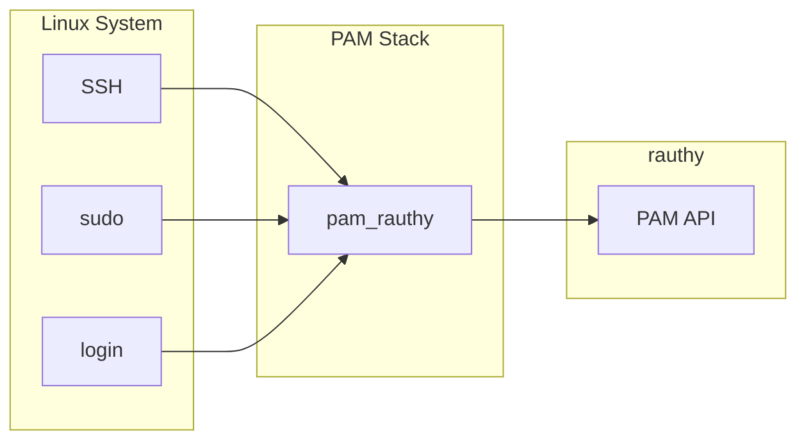
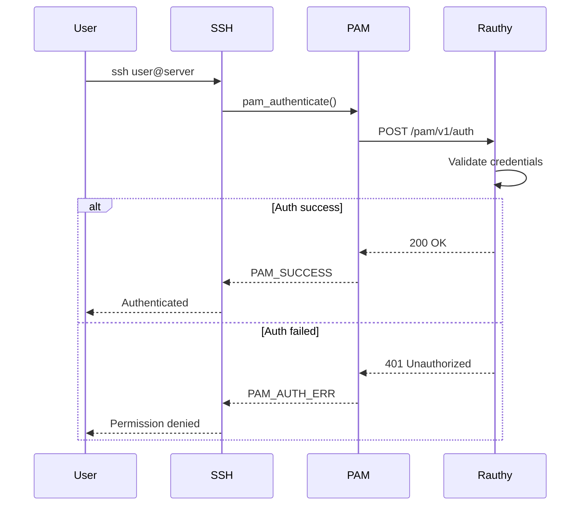

# PAM Integration

System authentication via PAM (Pluggable Authentication Modules).

## Overview

**Aha:** PAM allows rauthy to authenticate system users (SSH, sudo, etc.).



## rauthy-pam-nss Crate

**Location:** `/home/darkvoid/Boxxed/@formulas/src.rust/src.auth/src.rauthy/rauthy-pam-nss/`

### Components

| Component | Purpose | Location |
|-----------|---------|----------|
| `pam_rauthy.so` | PAM module | `/lib/security/` |
| `libnss_rauthy.so` | NSS module | `/lib/` |
| `rauthy-pam` | CLI tool | `/usr/bin/` |

### PAM Module

```rust
// rauthy-pam-nss/src/pam.rs
use pam::module::{PamHandle, PamResult};

#[pam_hooks]
impl PamHooks for RauthyPam {
    fn authenticate(pamh: &mut PamHandle, args: &[&str]) -> PamResult {
        // Get username
        let user = pamh.get_user(None)?;
        
        // Get password/passkey
        let auth_token = pamh.get_authtok(None)?;
        
        // Validate against rauthy
        match validate_with_rauthy(&user, &auth_token) {
            Ok(true) => PamResult::SUCCESS,
            Ok(false) => PamResult::AUTH_ERR,
            Err(e) => {
                log::error!("PAM auth error: {}", e);
                PamResult::AUTH_ERR
            }
        }
    }
    
    fn open_session(pamh: &mut PamHandle, args: &[&str]) -> PamResult {
        // Session opened
        PamResult::SUCCESS
    }
    
    fn close_session(pamh: &mut PamHandle, args: &[&str]) -> PamResult {
        // Session closed
        PamResult::SUCCESS
    }
}
```

### Authentication Flow



## Installation

### Build PAM Module

```bash
cd rauthy-pam-nss
cargo build --release

# Install
sudo cp target/release/libpam_rauthy.so /lib/security/pam_rauthy.so
sudo cp target/release/libnss_rauthy.so /lib/libnss_rauthy.so.2
```

### Configure PAM

Edit `/etc/pam.d/sshd`:

```
# Standard Unix authentication
# @include common-auth

# rauthy authentication
auth    sufficient    pam_rauthy.so    url=https://auth.example.com

# Fallback to local auth
auth    required      pam_unix.so
```

Edit `/etc/pam.d/sudo`:

```
# rauthy authentication for sudo
auth    sufficient    pam_rauthy.so    url=https://auth.example.com
auth    required        pam_unix.so
```

### Configure NSS

Edit `/etc/nsswitch.conf`:

```
passwd:         files rauthy
shadow:         files
group:          files rauthy
```

## Configuration

### PAM Module Options

| Option | Description | Default |
|--------|-------------|---------|
| `url` | rauthy server URL | Required |
| `api_key` | API key for auth | Required |
| `timeout` | Request timeout | 30s |
| `cache` | Cache duration | 5m |

### Example

```
auth    sufficient    pam_rauthy.so    
    url=https://auth.example.com 
    api_key=rauthy_api_key_xxx
    timeout=30
    cache=300
```

## NSS Module

**Purpose:** Resolve users from rauthy.

```rust
// rauthy-pam-nss/src/nss.rs
use libnss::passwd::{Passwd, PasswdHooks};
use libnss::group::{Group, GroupHooks};

struct NssRauthy;

impl PasswdHooks for NssRauthy {
    fn get_all_entries() -> Vec<Passwd> {
        // Fetch all users from rauthy
        match fetch_users_from_rauthy() {
            Ok(users) => users.into_iter().map(|u| Passwd {
                name: u.email,
                passwd: "x".to_string(),
                uid: u.uid,
                gid: u.gid,
                gecos: u.display_name,
                dir: format!("/home/{}", u.email),
                shell: "/bin/bash".to_string(),
            }).collect(),
            Err(_) => vec![],
        }
    }
    
    fn get_entry_by_name(name: &str) -> Option<Passwd> {
        // Fetch user by name
        match fetch_user_from_rauthy(name) {
            Ok(Some(u)) => Some(Passwd {
                name: u.email,
                passwd: "x".to_string(),
                uid: u.uid,
                gid: u.gid,
                gecos: u.display_name,
                dir: format!("/home/{}", u.email),
                shell: "/bin/bash".to_string(),
            }),
            _ => None,
        }
    }
}
```

## rauthy-pam CLI

### Commands

```bash
# Check authentication
rauthy-pam auth --user alice --token "my-password"

# Check with API key
rauthy-pam auth --user alice --token "my-password" --api-key "xxx"

# Interactive mode
rauthy-pam interactive --url https://auth.example.com

# Configure
rauthy-pam config set url https://auth.example.com
rauthy-pam config set api-key "xxx"
```

## Use Cases

### Headless CLI Tools

```bash
# SSH to server
ssh alice@server.example.com
# Password: [enters rauthy password]
# Or: [uses FIDO2 security key]

# Sudo command
sudo apt update
# Authenticates via rauthy
```

### IoT Devices

```bash
# Device authenticates via API key
rauthy-pam auth --user device-001 --token "api-key"
```

### Service Accounts

```bash
# Service user with API key
rauthy-pam auth --user service --token "service-api-key"
```

## Security Considerations

### API Key Storage

- Store API keys in `/etc/rauthy/pam.conf` (root only)
- Use file permissions 600
- Rotate keys regularly

```bash
# /etc/rauthy/pam.conf
URL=https://auth.example.com
API_KEY=rauthy_pam_api_key_xxx
```

### Fallback Auth

Always configure fallback to local auth:

```
auth    sufficient    pam_rauthy.so    ...
auth    required      pam_unix.so
```

### Network Security

- Use HTTPS only
- Validate certificates
- Use VPN for remote access

## Troubleshooting

### Debug Mode

```bash
# Enable debug logging
sudo pam_rauthy --debug --url https://auth.example.com

# Check logs
journalctl -u sshd | grep pam_rauthy
```

### Common Issues

| Issue | Solution |
|-------|----------|
| Connection refused | Check rauthy URL |
| SSL error | Verify certificate |
| User not found | Check NSS configuration |
| Timeout | Increase timeout value |

## Next Steps

Continue to [Admin API →](07-admin-api.html) for management API.
