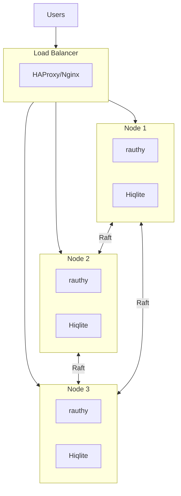

# Deployment

Setup, configuration, and high availability.

## Configuration File

Main configuration in `config.toml`:

```toml
# config.toml

[server]
# HTTP server bind address
bind = "0.0.0.0:8080"
# Public URL (used in tokens)
public_url = "https://auth.example.com"
# Cookie domain
cookie_domain = "auth.example.com"

[database]
# Database type: "hiqlite" or "postgres"
type = "hiqlite"

[database.hiqlite]
# Hiqlite node ID (1, 2, 3 for HA)
node_id = 1
# Cluster nodes (include self)
nodes = ["192.168.1.10:2380", "192.168.1.11:2380", "192.168.1.12:2380"]
# Data directory
data_dir = "/data/rauthy"

[encryption]
# Argon2id params for password hashing
argon2_memory = 65536
argon2_iterations = 3
argon2_parallelism = 4

[sessions]
# Session lifetime
access_token_lifetime = 900      # 15 minutes
refresh_token_lifetime = 604800  # 7 days
session_cookie_lifetime = 28800  # 8 hours

[security]
# MFA settings
mfa_required = false
# Allowed signing algorithms
allowed_signing_algs = ["EdDSA", "RS256", "ES256"]
# Require PKCE
require_pkce = true
```

## Single Node Deployment

### Docker

```yaml
# docker-compose.yml
version: '3'

services:
  rauthy:
    image: ghcr.io/sebadob/rauthy:latest
    ports:
      - "8080:8080"
    volumes:
      - ./config.toml:/app/config.toml
      - rauthy-data:/data/rauthy
    environment:
      - RUST_LOG=info

volumes:
  rauthy-data:
```

```bash
# Start
docker-compose up -d

# View logs
docker-compose logs -f rauthy
```

### Binary

```bash
# Download
curl -L https://github.com/sebadob/rauthy/releases/download/v0.32.0/rauthy -o rauthy
chmod +x rauthy

# Run
./rauthy --config config.toml
```

## High Availability Deployment

### 3-Node Cluster with Hiqlite



### Node Configuration

**Node 1** (`config.toml`):
```toml
[database.hiqlite]
node_id = 1
nodes = [
    "192.168.1.10:2380",
    "192.168.1.11:2380",
    "192.168.1.12:2380"
]
data_dir = "/data/rauthy"
```

**Node 2** (`config.toml`):
```toml
[database.hiqlite]
node_id = 2
nodes = [
    "192.168.1.10:2380",
    "192.168.1.11:2380",
    "192.168.1.12:2380"
]
data_dir = "/data/rauthy"
```

**Node 3** (`config.toml`):
```toml
[database.hiqlite]
node_id = 3
nodes = [
    "192.168.1.10:2380",
    "192.168.1.11:2380",
    "192.168.1.12:2380"
]
data_dir = "/data/rauthy"
```

### Docker Compose HA

```yaml
# docker-compose.ha.yml
version: '3'

services:
  rauthy-1:
    image: ghcr.io/sebadob/rauthy:latest
    hostname: rauthy-1
    volumes:
      - ./config-1.toml:/app/config.toml
      - rauthy-data-1:/data/rauthy
    networks:
      - rauthy

  rauthy-2:
    image: ghcr.io/sebadob/rauthy:latest
    hostname: rauthy-2
    volumes:
      - ./config-2.toml:/app/config.toml
      - rauthy-data-2:/data/rauthy
    networks:
      - rauthy

  rauthy-3:
    image: ghcr.io/sebadob/rauthy:latest
    hostname: rauthy-3
    volumes:
      - ./config-3.toml:/app/config.toml
      - rauthy-data-3:/data/rauthy
    networks:
      - rauthy

  haproxy:
    image: haproxy:latest
    ports:
      - "8080:8080"
    volumes:
      - ./haproxy.cfg:/usr/local/etc/haproxy/haproxy.cfg
    networks:
      - rauthy

networks:
  rauthy:
    driver: bridge

volumes:
  rauthy-data-1:
  rauthy-data-2:
  rauthy-data-3:
```

### HAProxy Config

```
# haproxy.cfg
global
    maxconn 4096

defaults
    mode http
    timeout connect 5s
    timeout client 30s
    timeout server 30s

frontend rauthy
    bind *:8080
    default_backend rauthy_nodes

backend rauthy_nodes
    balance roundrobin
    option httpchk GET /health
    server rauthy-1 rauthy-1:8080 check
    server rauthy-2 rauthy-2:8080 check
    server rauthy-3 rauthy-3:8080 check
```

## Client Branding

### Per-Client Theme

```toml
# config.toml
[branding.default]
primary_color = "#2563eb"
secondary_color = "#1e40af"
logo_url = "/assets/logo-default.png"

[branding.myapp]
primary_color = "#dc2626"
secondary_color = "#991b1b"
logo_url = "/assets/logo-myapp.png"
custom_css = """
    .login-button { border-radius: 8px; }
    .input-field { border: 2px solid #dc2626; }
"""
```

### Login Page Customization

```toml
[branding.myapp]
# HTML in login page
header_html = "<h2>Welcome to MyApp</h2>"
footer_html = "<p>Need help? Contact support@myapp.com</p>"

# CSS variables
css_variables = """
    --primary: #dc2626;
    --secondary: #991b1b;
    --background: #f3f4f6;
    --text: #1f2937;
"""
```

## SSL/TLS

### Let's Encrypt

```toml
[tls]
enabled = true
# Let's Encrypt
cert_type = "acme"
acme_email = "admin@example.com"
acme_domains = ["auth.example.com"]
```

### Custom Certificate

```toml
[tls]
enabled = true
cert_type = "custom"
cert_file = "/etc/rauthy/cert.pem"
key_file = "/etc/rauthy/key.pem"
```

## Monitoring

### Metrics Endpoint

```toml
[metrics]
enabled = true
bind = "0.0.0.0:9090"
path = "/metrics"
```

### Prometheus Scraping

```yaml
# prometheus.yml
scrape_configs:
  - job_name: 'rauthy'
    static_configs:
      - targets: ['auth.example.com:9090']
```

### Health Check

```http
GET /health
```

```json
{
  "status": "healthy",
  "database": "connected",
  "cache": "connected",
  "version": "0.32.0"
}
```

## Backup & Restore

### Backup

```bash
# Create backup
rauthy-cli backup --output backup-$(date +%Y%m%d).sql

# Or via API
curl -H "Authorization: Bearer ADMIN_TOKEN" \
  https://auth.example.com/api/v1/backup \
  > backup.sql
```

### Restore

```bash
# Stop rauthy
docker-compose stop rauthy

# Restore database
rauthy-cli restore --input backup.sql

# Start rauthy
docker-compose start rauthy
```

## Upgrading

### Docker Upgrade

```bash
# Pull new image
docker-compose pull rauthy

# Restart
docker-compose up -d rauthy

# Check logs
docker-compose logs -f rauthy
```

### Binary Upgrade

```bash
# Download new version
curl -L https://github.com/sebadob/rauthy/releases/download/v0.33.0/rauthy -o rauthy.new
chmod +x rauthy.new

# Replace (during maintenance window)
mv rauthy.new rauthy
systemctl restart rauthy
```

## Troubleshooting

### Check Logs

```bash
# Docker
docker-compose logs -f rauthy

# Systemd
journalctl -u rauthy -f

# Binary
RUST_LOG=debug ./rauthy
```

### Common Issues

| Issue | Solution |
|-------|----------|
| Port in use | Change `bind` address |
| Database error | Check permissions, disk space |
| Raft timeout | Check network connectivity |
| SSL error | Verify certificate chain |

### Debug Mode

```bash
RUST_LOG=debug ./rauthy --config config.toml
```

## Summary

| Deployment | Users | Memory | Complexity |
|------------|-------|--------|------------|
| Single (Hiqlite) | < 1M | ~57 MB | Low |
| HA 3-node (Hiqlite) | > 1M | ~65 MB | Medium |
| Single (Postgres) | < 1M | ~35 MB | Low |

**Aha:** Start with single Hiqlite, scale to HA when needed.
