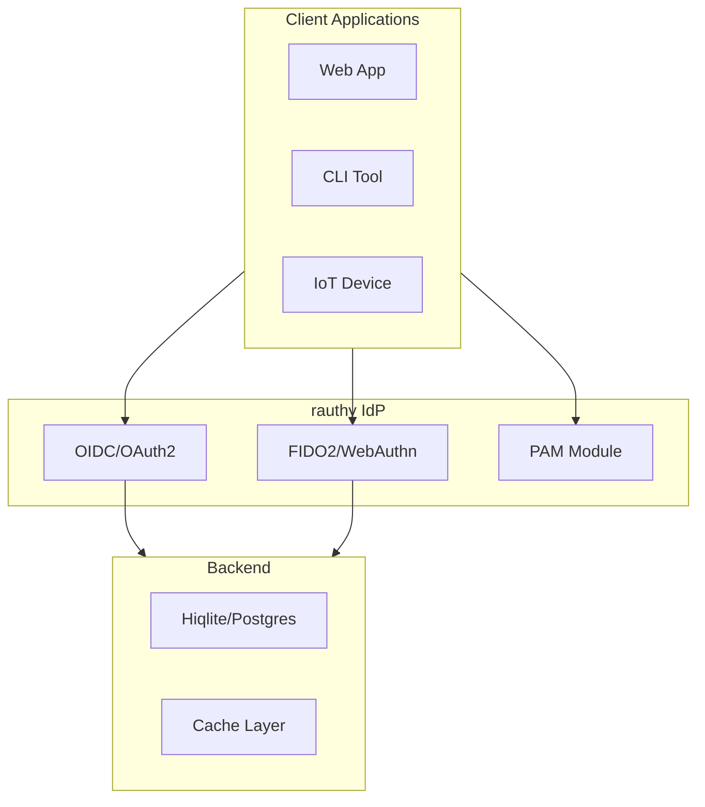

# rauthy Documentation

Lightweight, secure Identity Provider with OIDC, OAuth 2, and PAM.

## Document Index

| # | Document | Description |
|---|----------|-------------|
| 00 | [Overview](00-overview.html) | Philosophy, features |
| 01 | [Architecture](01-architecture.html) | System architecture |
| 02 | [Authentication](02-authentication.html) | Auth flows, MFA, passkeys |
| 03 | [OIDC & OAuth2](03-oidc-oauth.html) | OIDC/OAuth2 implementation |
| 04 | [JWT Tokens](04-jwt-tokens.html) | JWT handling, signing |
| 05 | [Database](05-database.html) | Hiqlite, Postgres, caching |
| 06 | [PAM](06-pam.html) | PAM integration |
| 07 | [Admin API](07-admin-api.html) | Admin API, user management |
| 08 | [Deployment](08-deployment.html) | HA, config, branding |

## Quick Links

- **Source:** `/home/darkvoid/Boxxed/@formulas/src.rust/src.auth/src.rauthy/rauthy/`
- **Repository:** https://github.com/sebadob/rauthy.git
- **Security Audit:** [Report PDF](https://raw.githubusercontent.com/sebadob/rauthy/refs/heads/main/assets/security_audit_report_v0.32.pdf)

## What is rauthy?

rauthy is an Identity Provider (IdP) implementing:
- **OpenID Connect (OIDC)** — Modern authentication standard
- **OAuth 2.0** — Authorization framework
- **FIDO2/WebAuthn** — Passwordless authentication with passkeys
- **PAM** — System authentication for headless/CLI tools

## Key Features

| Feature | Description |
|---------|-------------|
| **OIDC/OAuth2** | Full OpenID Connect provider |
| **Passkeys** | FIDO2/WebAuthn passwordless login |
| **MFA** | Multi-factor authentication |
| **PAM** | System authentication |
| **HA Mode** | High availability deployment |
| **Admin UI** | Web-based administration |
| **User Dashboard** | Self-service account management |
| **Client Branding** | Per-client theming |
| **Events/Audit** | Comprehensive logging |

## Memory Footprint

| Deployment | Memory |
|------------|--------|
| Hiqlite single | ~57 MB |
| Hiqlite HA | ~65 MB |
| Postgres | ~35 MB |

## Next Steps

Start with [Overview →](00-overview.html) to understand rauthy's philosophy.
