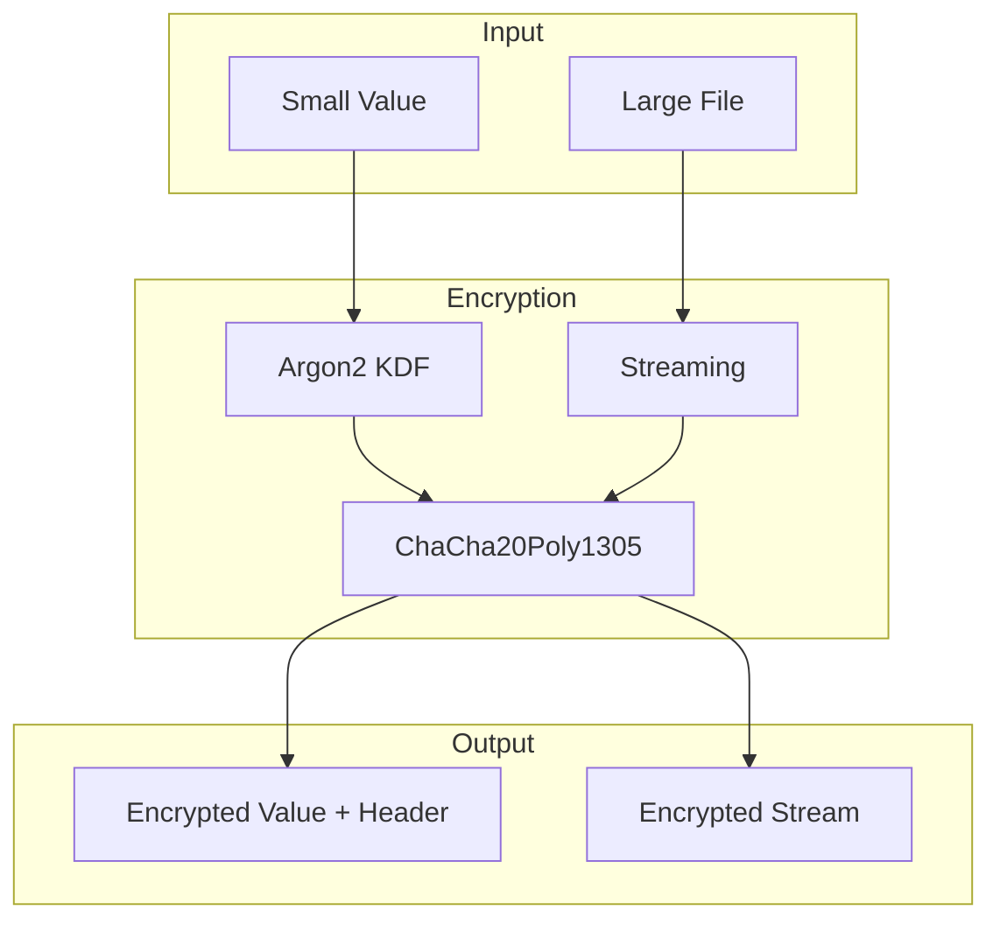
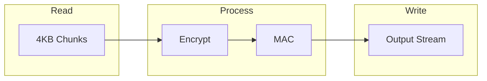

# Project Exploration: cryptr

## Overview

cryptr is a Rust library and CLI tool for simple encrypted (streaming) values. It provides a fast, efficient, and robust way to encrypt small values and large files using ChaCha20Poly1305 AEAD encryption.

### Key Features

- **Small value encryption** — Encrypt database columns with ~40 byte header overhead
- **Streaming encryption** — Encrypt files of any size with minimal memory usage
- **ChaCha20Poly1305** — Modern AEAD encryption algorithm
- **Key rotation support** — Built-in versioning for seamless key rotation
- **Tamper resistant** — MAC validation on each chunk
- **S3 integration** — Stream encrypted data directly to S3
- **Multi-core** — Parallel encryption across CPU cores

## Repository

- **Location:** `/home/darkvoid/Boxxed/@formulas/src.rust/src.auth/src.rauthy/cryptr`
- **Remote:** https://github.com/sebadob/cryptr.git
- **Version:** 0.10.0
- **License:** Apache-2.0
- **Author:** Sebastian Dobe <sebastiandobe@mailbox.org>

## Directory Structure

```
cryptr/
├── Cargo.toml           # Package manifest
├── Cargo.lock          # Dependency lock
├── README.md           # Project readme
├── CHANGELOG.md        # Version history
├── LICENSE             # Apache-2.0 license
├── justfile            # Build tasks
├── TESTING.md          # Testing notes
├── examples/           # Usage examples
│   ├── cli/           # CLI examples
│   └── lib/           # Library examples
├── out/               # Build output
└── src/               # Source code
    ├── lib.rs         # Library entry
    ├── main.rs        # CLI entry
    ├── cli/           # CLI implementation
    ├── encryption.rs  # Core encryption logic
    ├── kdf.rs         # Key derivation (Argon2)
    ├── keys.rs        # Key management
    ├── stream/        # Streaming encryption
    ├── utils.rs       # Utilities
    └── value.rs       # Value handling
```

## Architecture

### Core Components



### Module Breakdown

| Module | Purpose | Key Items |
|--------|---------|-----------|
| `encryption.rs` | Core encryption/decryption | `encrypt()`, `decrypt()` |
| `kdf.rs` | Key derivation | Argon2id, key stretching |
| `keys.rs` | Key management | Key rotation, versioning |
| `value.rs` | Small value handling | In-memory encryption |
| `stream/` | Streaming encryption | Large files, S3 |
| `cli/` | CLI implementation | Commands, UX |

## Encryption Format

### Header Structure

```
+--------+--------+--------+--------+
| Magic  | Version| Key ID | Nonce  |
| 4 bytes| 1 byte | 4 bytes| 12 bytes|
+--------+--------+--------+--------+
| Encrypted Data... |
+-------------------+
| Auth Tag (16 bytes)|
+-------------------+
```

**Total header overhead:** ~40 bytes (with default key ID)

### Key Features

1. **Magic bytes** — Identify cryptr-encrypted data
2. **Version** — Algorithm versioning for migration
3. **Key ID** — Identifies which key was used
4. **Nonce** — Unique per encryption
5. **Auth Tag** — ChaCha20Poly1305 MAC

## Streaming Architecture



**Memory usage:** ~4 small buffers (minimal overhead)
**Concurrency:** Multi-core spread

## Dependencies

| Crate | Purpose | Version |
|-------|---------|---------|
| `chacha20poly1305` | AEAD encryption | 0.10.1 |
| `argon2` | Key derivation | 0.5.2 |
| `tokio` | Async runtime | 1.35.0 |
| `clap` | CLI parsing | 4.4.10 |
| `s3-simple` | S3 integration | 0.8.0 |
| `base64` | Encoding | 0.22.0 |
| `flume` | Channels | 0.12 |

## CLI Features

### Commands

| Command | Purpose |
|---------|---------|
| `encrypt` | Encrypt value/file |
| `decrypt` | Decrypt value/file |
| `key` | Key management |
| `config` | Configuration |

### S3 Integration

```bash
# Stream encrypt to S3
cryptr encrypt --input large-file.tar.gz --s3 s3://bucket/backup.tar.gz.enc

# Decrypt from S3
cryptr decrypt --s3 s3://bucket/backup.tar.gz.enc --output restore.tar.gz
```

## Use Cases

1. **Database encryption** — Encrypt columns with small overhead
2. **Backup encryption** — Stream encrypted backups to S3
3. **Secrets management** — Store encrypted secrets
4. **File encryption** — General purpose file encryption

## Key Insights

### Why cryptr?

Created to solve:
- Copy-paste encryption functions across projects
- Manual migration handling on algorithm changes
- No standard way to track encryption keys with values

### Design Decisions

1. **Header with metadata** — Self-describing encrypted values
2. **Streaming** — Handle files of any size
3. **Argon2** — Memory-hard key derivation
4. **ChaCha20Poly1305** — Modern, fast AEAD

## Open Questions

1. Performance benchmarks vs alternatives?
2. Key storage best practices?
3. Integration patterns with other rauthy projects?
