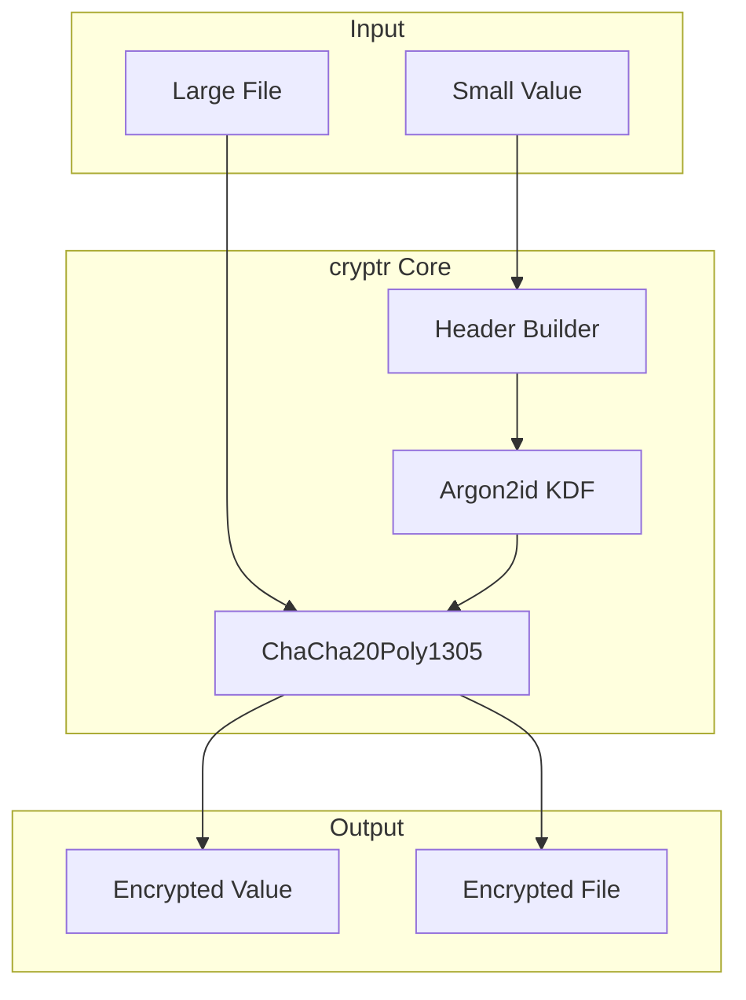

# cryptr Overview

Simple encrypted (streaming) values in Rust.

## Philosophy

**Encryption should be simple, fast, and future-proof.**

### The Problem

- Copy-pasting encryption functions across projects
- Manual handling of key metadata (version, ID)
- Manual migration on algorithm changes
- No standard way to handle key rotation

### The Solution

**Aha:** Self-describing encrypted values with built-in versioning.

```
+--------+--------+--------+--------+------------------+--------+
| Magic  |Version | Key ID | Nonce | Encrypted Data   | Auth  |
| 4 bytes| 1 byte | 4 bytes|12 bytes|                  | 16b   |
+--------+--------+--------+--------+------------------+--------+
```

~40 byte header contains everything needed.

## Key Features

### 1. Small Value Encryption

```rust
use cryptr::value::encrypt;

// Encrypt a small value
let encrypted = encrypt(b"sensitive data", &key)?;

// Result: ~40 bytes header + ciphertext
// Store in database column directly
```

### 2. Streaming Encryption

```rust
use cryptr::stream::encrypt_file;

// Encrypt 100GB file with ~16MB memory
encrypt_file("input.tar.gz", "output.enc", &key).await?;
```

### 3. Key Rotation

```rust
// Header contains key ID - no need to track separately
let decrypted = decrypt(&encrypted, |key_id| {
    // Look up key by ID
    load_key(key_id)
})?;
```

## Architecture



## Algorithm

| Component | Algorithm | Purpose |
|-----------|-----------|---------|
| **Encryption** | ChaCha20Poly1305 | AEAD encryption |
| **Key Derivation** | Argon2id | Memory-hard KDF |
| **MAC** | Poly1305 | Authentication |
| **Header** | Custom | Metadata + versioning |

## Performance

| Operation | Speed | Memory |
|-----------|-------|--------|
| Small value | ~μs | In-place |
| Streaming | ~GB/s | ~16MB |

**Aha:** Multi-core parallel encryption with minimal memory.

## Use Cases

| Use Case | Example |
|----------|---------|
| **Database columns** | Encrypt user data column |
| **Backups** | Stream encrypted to S3 |
| **Secrets** | Store API keys encrypted |
| **Files** | General file encryption |

## Next Steps

Continue to [Encryption →](01-encryption.html) for algorithm details.
