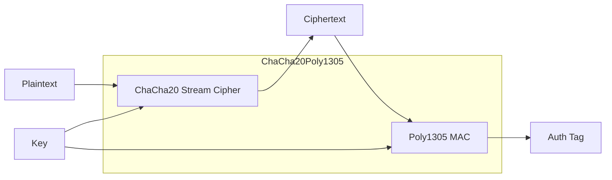

# Encryption

ChaCha20Poly1305 AEAD encryption and format.

## ChaCha20Poly1305

**Aha:** Modern AEAD cipher — fast, secure, parallelizable.

```rust
// src/encryption.rs
use chacha20poly1305::{
    ChaCha20Poly1305, 
    Key, Nonce,
    aead::{Aead, Payload}
};

pub fn encrypt(data: &[u8], key: &Key, nonce: &Nonce) -> Vec<u8> {
    let cipher = ChaCha20Poly1305::new(key);
    cipher.encrypt(nonce, data)
        .expect("encryption failure")
}

pub fn decrypt(ciphertext: &[u8], key: &Key, nonce: &Nonce) -> Vec<u8> {
    let cipher = ChaCha20Poly1305::new(key);
    cipher.decrypt(nonce, ciphertext)
        .expect("decryption failure")
}
```

## Encryption Format

### Header Structure

```
 0                   1                   2                   3
 0 1 2 3 4 5 6 7 8 9 0 1 2 3 4 5 6 7 8 9 0 1 2 3 4 5 6 7 8 9 0 1
+-+-+-+-+-+-+-+-+-+-+-+-+-+-+-+-+-+-+-+-+-+-+-+-+-+-+-+-+-+-+-+-+
| Magic "CRYP" |  Version   |           Key ID                |
+-+-+-+-+-+-+-+-+-+-+-+-+-+-+-+-+-+-+-+-+-+-+-+-+-+-+-+-+-+-+-+-+
|                              Nonce                            |
+-+-+-+-+-+-+-+-+-+-+-+-+-+-+-+-+-+-+-+-+-+-+-+-+-+-+-+-+-+-+-+-+
|                                                               |
|                        Encrypted Data                         |
|                                                               |
+-+-+-+-+-+-+-+-+-+-+-+-+-+-+-+-+-+-+-+-+-+-+-+-+-+-+-+-+-+-+-+-+
|                          Auth Tag (16)                        |
+-+-+-+-+-+-+-+-+-+-+-+-+-+-+-+-+-+-+-+-+-+-+-+-+-+-+-+-+-+-+-+-+
```

| Field | Size | Description |
|-------|------|-------------|
| **Magic** | 4 bytes | "CRYP" identifier |
| **Version** | 1 byte | Algorithm version |
| **Key ID** | 4 bytes | Key identifier |
| **Nonce** | 12 bytes | Unique per encryption |
| **Data** | variable | Ciphertext |
| **Auth Tag** | 16 bytes | Poly1305 MAC |

**Total overhead:** 37 bytes (default key ID)

## Value Encryption

**Source:** `src/value.rs`

```rust
pub fn encrypt(value: &[u8], key: &EncryptionKey) -> Vec<u8> {
    // Generate nonce
    let nonce = generate_nonce();
    
    // Build header
    let header = Header {
        magic: *b"CRYP",
        version: 1,
        key_id: key.id(),
        nonce,
    };
    
    // Encrypt
    let ciphertext = chacha_encrypt(value, key, &nonce);
    
    // Concatenate: header + ciphertext + auth_tag
    [header.as_bytes(), ciphertext.as_slice()].concat()
}

pub fn decrypt(encrypted: &[u8], key_lookup: impl Fn(u32) -> Option<Key>) -> Vec<u8> {
    // Parse header
    let header = Header::parse(&encrypted[..37])?;
    
    // Look up key
    let key = key_lookup(header.key_id)?;
    
    // Decrypt
    chacha_decrypt(&encrypted[37..], &key, &header.nonce)
}
```

## AEAD Properties



**Properties:**
- **Confidentiality** — Data is encrypted
- **Integrity** — MAC detects tampering
- **Authentication** — Verify sender

## Versioning

```rust
// src/encryption.rs
const CURRENT_VERSION: u8 = 1;

pub enum EncryptionVersion {
    V1 = 1,  // ChaCha20Poly1305
    // Future versions...
}

pub fn encrypt_v1(data: &[u8], key: &Key) -> Vec<u8> {
    // Current encryption
}

pub fn decrypt(data: &[u8], key: &Key) -> Vec<u8> {
    let version = data[4];
    match version {
        1 => decrypt_v1(data, key),
        // Future versions...
        _ => Err(Error::UnknownVersion),
    }
}
```

**Aha:** Version in header enables seamless algorithm migration.

## Security

### Nonce Generation

```rust
use rand::RngCore;

fn generate_nonce() -> Nonce {
    let mut nonce = [0u8; 12];
    rand::thread_rng().fill_bytes(&mut nonce);
    nonce.into()
}
```

- 12 bytes = 96 bits
- Random generation (not counter-based)
- Unique per encryption

### Key Requirements

- ChaCha20Poly1305 uses 256-bit keys
- Keys derived via Argon2id (see [Keys →](02-keys.html))

## Next Steps

Continue to [Keys →](02-keys.html) for key derivation and management.
