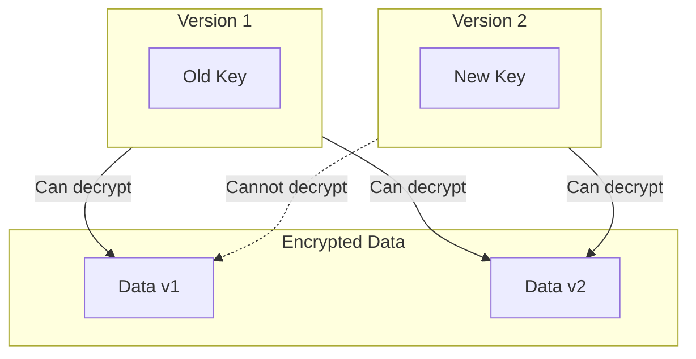

# Keys

Key derivation and management.

## Key Derivation

### Argon2id

**Source:** `src/kdf.rs`

```rust
use argon2::{
    Argon2, Algorithm, Version, Params,
    password_hash::{
        rand_core::OsRng,
        PasswordHasher, Salt, PasswordHash
    }
};

pub struct KeyDerivation;

impl KeyDerivation {
    pub fn derive_key(password: &[u8], salt: &[u8]) -> [u8; 32] {
        let params = Params::new(
            65536,  // Memory (64KB)
            3,      // Iterations
            4,      // Parallelism
            Some(32) // Output length
        ).expect("valid params");
        
        let argon2 = Argon2::new(
            Algorithm::Argon2id,
            Version::V0x13,
            params
        );
        
        let mut key = [0u8; 32];
        argon2.hash_password_into(
            password, 
            salt, 
            &mut key
        ).expect("hashing success");
        
        key
    }
}
```

### Argon2 Parameters

| Parameter | Value | Purpose |
|-----------|-------|---------|
| **Memory** | 64 KB | Memory-hardness |
| **Iterations** | 3 | Time cost |
| **Parallelism** | 4 | Parallel threads |
| **Output** | 32 bytes | 256-bit key |

**Aha:** Argon2id provides resistance to GPU/ASIC attacks.

## Key Management

### Key Structure

**Source:** `src/keys.rs`

```rust
pub struct EncryptionKey {
    id: u32,           // Key identifier
    key: [u8; 32],     // 256-bit key
    created_at: DateTime<Utc>,
    algorithm: Algorithm,
}

pub struct KeyRing {
    keys: HashMap<u32, EncryptionKey>,
    active_key: u32,
}

impl KeyRing {
    pub fn generate_key(&mut self) -> EncryptionKey {
        let key = EncryptionKey {
            id: self.next_id(),
            key: generate_random_key(),
            created_at: Utc::now(),
            algorithm: Algorithm::ChaCha20Poly1305,
        };
        
        self.keys.insert(key.id, key.clone());
        self.active_key = key.id;
        key
    }
    
    pub fn get_key(&self, id: u32) -> Option<&EncryptionKey> {
        self.keys.get(&id)
    }
    
    pub fn active_key(&self) -> &EncryptionKey {
        self.keys.get(&self.active_key).unwrap()
    }
}
```

## Key Rotation



**Aha:** Keep old keys to decrypt legacy data, encrypt with new key.

### Rotation Flow

```rust
// Rotate keys: keep old, encrypt with new
pub fn rotate_encrypted_value(
    encrypted: &[u8], 
    key_ring: &KeyRing
) -> Vec<u8> {
    // Decrypt with old key
    let plaintext = decrypt(encrypted, |id| {
        key_ring.get_key(id)
    }).expect("decrypt success");
    
    // Re-encrypt with new active key
    encrypt(&plaintext, key_ring.active_key())
}
```

## Key Storage

### Config File

```toml
# cryptr.toml
[key.v1]
id = 1
created_at = "2025-01-15T10:00:00Z"
key = "base64encodedkey=="

[key.v2]
id = 2
created_at = "2025-06-01T12:00:00Z"
key = "base64encodedkey=="

[active]
key_id = 2
```

### Environment Variables

```bash
export CRYPTR_KEY_V1="base64key"
export CRYPTR_KEY_V2="base64key"
export CRYPTR_ACTIVE_KEY_ID="2"
```

## Key Lookup

```rust
// Decrypt with automatic key lookup
let decrypted = decrypt(&encrypted, |key_id| {
    // Load key from storage
    match key_id {
        1 => Some(load_key_from_config(1)),
        2 => Some(load_key_from_config(2)),
        _ => None,
    }
})?;
```

## Best Practices

### Key Generation

1. **Random generation** — Use OsRng or similar
2. **256 bits** — ChaCha20Poly1305 requirement
3. **Version tracking** — Always include key ID

### Key Rotation

1. **Generate new key** — Add to key ring
2. **Mark as active** — New encryptions use it
3. **Keep old keys** — For decrypting legacy data
4. **Migrate gradually** — Re-encrypt on access

### Security

| Risk | Mitigation |
|------|------------|
| Key exposure | Store in secure vault |
| Key loss | Keep backups |
| Brute force | Argon2id memory-hard |

## Next Steps

Continue to [Streaming →](03-streaming.html) for file encryption.
