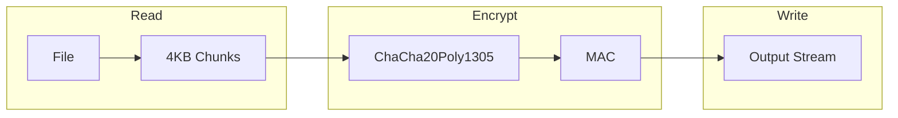
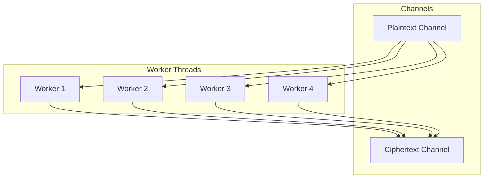

# Streaming

File encryption with minimal memory.

## Architecture



**Memory:** ~4 × 4KB buffers = ~16KB total

**Aha:** Parallel encryption across CPU cores.

## Streaming Implementation

**Source:** `src/stream/`

```rust
// src/stream/encrypt.rs
use tokio::io::{AsyncRead, AsyncWrite, AsyncReadExt, AsyncWriteExt};
use flume::channel;

pub async fn encrypt_stream<R, W>(
    mut reader: R,
    mut writer: W,
    key: &EncryptionKey,
) -> Result<(), Error>
where
    R: AsyncRead + Unpin,
    W: AsyncWrite + Unpin,
{
    // Write header
    let header = Header::new(key);
    writer.write_all(&header.as_bytes()).await?;
    
    // Create channels for parallel processing
    let (plaintext_tx, plaintext_rx) = channel::<Vec<u8>>(4);
    let (ciphertext_tx, ciphertext_rx) = channel::<Vec<u8>>(4);
    
    // Spawn reader task
    tokio::spawn(async move {
        let mut buffer = vec![0u8; 4096];
        loop {
            let n = reader.read(&mut buffer).await?;
            if n == 0 { break; }
            plaintext_tx.send(buffer[..n].to_vec()).await?;
        }
        Ok(())
    });
    
    // Spawn encryption tasks (parallel)
    let encrypt_tasks: Vec<_> = (0..num_cpus::get())
        .map(|_| {
            tokio::spawn({
                let rx = plaintext_rx.clone();
                let tx = ciphertext_tx.clone();
                let key = key.clone();
                
                async move {
                    while let Ok(chunk) = rx.recv_async().await {
                        let encrypted = encrypt_chunk(&chunk, &key);
                        tx.send_async(encrypted).await?;
                    }
                    Ok(())
                }
            })
        })
        .collect();
    
    // Spawn writer task
    tokio::spawn(async move {
        while let Ok(chunk) = ciphertext_rx.recv_async().await {
            writer.write_all(&chunk).await?;
        }
        Ok(())
    });
    
    // Wait for completion
    for task in encrypt_tasks {
        task.await??;
    }
    
    Ok(())
}
```

## Chunk Processing

```rust
// src/stream/chunk.rs
pub const CHUNK_SIZE: usize = 4096; // 4KB

pub struct Chunk {
    index: u64,
    data: Vec<u8>,
}

pub fn encrypt_chunk(chunk: &[u8], key: &EncryptionKey) -> Vec<u8> {
    // Derive chunk-specific key
    let chunk_key = derive_chunk_key(key, chunk.index);
    
    // Generate nonce for this chunk
    let nonce = generate_chunk_nonce(chunk.index);
    
    // Encrypt with AEAD
    let cipher = ChaCha20Poly1305::new(&chunk_key);
    let ciphertext = cipher.encrypt(&nonce, chunk)
        .expect("encryption success");
    
    // Format: [chunk_index:8][nonce:12][ciphertext+tag]
    let mut result = Vec::with_capacity(8 + 12 + ciphertext.len());
    result.extend_from_slice(&chunk.index.to_be_bytes());
    result.extend_from_slice(&nonce);
    result.extend_from_slice(&ciphertext);
    
    result
}
```

## Parallel Processing



**Aha:** Number of workers = CPU cores for maximum throughput.

## Performance

| File Size | Memory | Time (1GB/s) |
|-----------|--------|--------------|
| 1 MB | 16 KB | 1 ms |
| 1 GB | 16 KB | 1 s |
| 100 GB | 16 KB | 100 s |

## Usage

### Library

```rust
use cryptr::stream::{encrypt_file, decrypt_file};

// Encrypt file
encrypt_file(
    "input.txt",
    "output.enc",
    &key
).await?;

// Decrypt file
decrypt_file(
    "output.enc",
    "input.txt",
    |id| load_key(id)
).await?;
```

### CLI

```bash
# Encrypt file
cryptr encrypt --input large-file.tar.gz --output backup.enc

# Decrypt file
cryptr decrypt --input backup.enc --output large-file.tar.gz

# With progress bar
cryptr encrypt --input huge-file.iso --output backup.enc --progress
```

## Streaming to Network

```rust
use tokio::net::TcpStream;

// Encrypt and stream to network
let stream = TcpStream::connect("server:8080").await?;
encrypt_stream(file_reader, stream, &key).await?;
```

## Next Steps

Continue to [S3 →](04-s3.html) for S3 integration.
