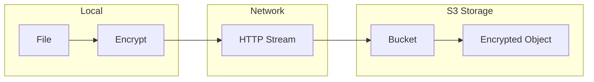

# S3 Integration

Stream encrypted data directly to S3.

## Architecture



**Aha:** Zero local storage, stream directly to cloud.

## S3 Streaming

**Source:** `src/stream/s3.rs`

```rust
use s3_simple::S3Client;
use reqwest::Body;
use tokio_util::io::ReaderStream;

pub async fn encrypt_to_s3<R>(
    reader: R,
    s3_url: &str,
    key: &EncryptionKey,
) -> Result<(), Error>
where
    R: AsyncRead + Unpin + Send + 'static,
{
    // Parse S3 URL: s3://bucket/key
    let (bucket, object_key) = parse_s3_url(s3_url)?;
    
    // Create S3 client
    let client = S3Client::new(
        &config.s3_endpoint,
        &config.s3_access_key,
        &config.s3_secret_key,
    );
    
    // Create encryption stream
    let enc_stream = EncryptionStream::new(reader, key);
    
    // Convert to HTTP body
    let body = Body::wrap_stream(ReaderStream::new(enc_stream));
    
    // Upload to S3
    client.put_object(&bucket, &object_key, body).await?;
    
    Ok(())
}
```

## Configuration

```toml
# cryptr.toml
[s3]
endpoint = "https://s3.amazonaws.com"
region = "us-east-1"
access_key_id = "AKIA..."
secret_access_key = "..."
```

Or environment variables:

```bash
export S3_ENDPOINT="https://s3.amazonaws.com"
export S3_ACCESS_KEY_ID="AKIA..."
export S3_SECRET_ACCESS_KEY="..."
```

## Usage

### Library

```rust
use cryptr::stream::s3::{
    encrypt_to_s3, 
    decrypt_from_s3
};

// Encrypt and upload
let file = tokio::fs::File::open("backup.tar.gz").await?;
encrypt_to_s3(
    file,
    "s3://my-bucket/backups/backup.tar.gz.enc",
    &key
).await?;

// Download and decrypt
let output = tokio::fs::File::create("restore.tar.gz").await?;
decrypt_from_s3(
    "s3://my-bucket/backups/backup.tar.gz.enc",
    output,
    |id| load_key(id)
).await?;
```

### CLI

```bash
# Encrypt and upload
cryptr encrypt \
    --input backup.tar.gz \
    --s3 s3://my-bucket/backups/backup.tar.gz.enc

# Download and decrypt
cryptr decrypt \
    --s3 s3://my-bucket/backups/backup.tar.gz.enc \
    --output restore.tar.gz
```

## Use Case: Database Backups

```rust
// Stream database backup to S3 with encryption
async fn backup_database() -> Result<(), Error> {
    // Start database dump
    let dump = tokio::process::Command::new("pg_dump")
        .arg("mydb")
        .stdout(std::process::Stdio::piped())
        .spawn()?;
    
    // Stream encrypt to S3
    encrypt_to_s3(
        dump.stdout.unwrap(),
        "s3://backups/db/mydb-2025-01-15.sql.enc",
        &backup_key
    ).await?;
    
    Ok(())
}
```

**Aha:** Backup, encrypt, and upload in one stream — no temporary files.

## Multi-Part Uploads

For large files, use multipart uploads:

```rust
pub async fn encrypt_multipart_to_s3<R>(
    reader: R,
    s3_url: &str,
    key: &EncryptionKey,
) -> Result<(), Error>
where
    R: AsyncRead + Unpin + Send + 'static,
{
    let (bucket, object_key) = parse_s3_url(s3_url)?;
    let client = S3Client::new(...);
    
    // Start multipart upload
    let upload_id = client
        .create_multipart_upload(&bucket, &object_key)
        .await?;
    
    // Upload parts
    let mut part_number = 1;
    let mut parts = vec![];
    
    let enc_stream = EncryptionStream::new(reader, key);
    let mut chunks = enc_stream.chunks(10 * 1024 * 1024); // 10MB parts
    
    while let Some(chunk) = chunks.next().await {
        let etag = client
            .upload_part(
                &bucket, 
                &object_key, 
                &upload_id, 
                part_number, 
                chunk
            )
            .await?;
        
        parts.push((part_number, etag));
        part_number += 1;
    }
    
    // Complete multipart upload
    client
        .complete_multipart_upload(
            &bucket, 
            &object_key, 
            &upload_id, 
            parts
        )
        .await?;
    
    Ok(())
}
```

## Next Steps

Continue to [CLI →](05-cli.html) for command-line usage.
