# Project Exploration: hiqlite

## Overview

Hiqlite is an embeddable SQLite database that can form a Raft cluster to provide strong consistency, high availability, replication, automatic leader fail-over, and self-healing features.

### Key Features

- **Embedded SQLite** — Local data, no separate database process
- **Raft consensus** — Strong consistency, automatic failover
- **High performance** — Up to 24.5k inserts/s on M2 SSD
- **Self-healing** — Automatic recovery from crashes
- **Encrypted backups** — To S3 with cryptr
- **K/V caches** — In-memory with disk-backed WAL
- **Distributed locks** — `dlock` feature
- **Dashboard UI** — Built-in debugging interface

## Repository

- **Location:** `/home/darkvoid/Boxxed/@formulas/src.rust/src.auth/src.rauthy/hiqlite`
- **Remote:** https://github.com/sebadob/hiqlite.git
- **License:** Apache-2.0
- **Author:** Sebastian Dobe

## Directory Structure

```
hiqlite/
├── Cargo.toml              # Package manifest
├── Cargo.lock             # Dependencies
├── README.md              # Main readme
├── ARCHITECTURE.md        # Detailed architecture
├── CHANGELOG.md           # Version history
├── LICENSE                # Apache-2.0
├── justfile               # Build tasks
├── hiqlite.env            # Environment template
├── hiqlite.toml           # Config template
├── Dockerfile             # Container build
├── examples/              # Usage examples
│   └── bench/            # Benchmarks
├── dashboard/             # Web UI
├── hiqlite/              # Main crate
│   └── src/
│       ├── lib.rs        # Library entry
│       ├── main.rs       # Server binary
│       ├── app_state.rs  # Application state
│       ├── backup.rs     # Backup logic
│       ├── client/       # Client API
│       ├── config.rs     # Configuration
│       ├── dashboard/    # Web UI
│       ├── error.rs      # Error types
│       ├── helpers.rs    # Utilities
│       ├── http_client.rs # HTTP client
│       ├── init.rs       # Initialization
│       ├── macros.rs     # Rust macros
│       ├── migration.rs  # DB migrations
│       ├── network/      # Raft networking
│       ├── query/        # Query handling
│       ├── s3.rs         # S3 backups
│       ├── server/       # HTTP server
│       ├── split_brain_check.rs
│       └── start.rs      # Startup
├── hiqlite-derive/       # Derive macros
└── hiqlite-wal/          # WAL storage
```

## Architecture

### High-Level

```mermaid
flowchart TB
    subgraph Raft["Raft Cluster"]
        N1[Node 1]
        N2[Node 2]
        N3[Node 3]
    end

    subgraph Storage["Storage"]
        SQLITE[SQLite]
        WAL[hiqlite-wal]
    end

    subgraph Features["Features"]
        CACHE[KV Cache]
        LOCK[Distributed Locks]
        NOTIFY[Listen/Notify]
    end

    N1 <-->|Raft| N2
    N2 <-->|Raft| N3
    N3 <-->|Raft| N1

    N1 --> STORAGE
    N2 --> STORAGE
    N3 --> STORAGE

    N1 --> CACHE
    N2 --> CACHE
    N3 --> CACHE
```



### Components

| Component | Purpose | Key Files |
|-----------|---------|-----------|
| `hiqlite-wal` | Raft logs storage | `src/lib.rs` |
| `network/` | WebSocket networking | `src/network/` |
| `query/` | SQL queries | `src/query/` |
| `client/` | Client API | `src/client/` |
| `backup.rs` | S3 backups | `src/backup.rs` |

## Raft Implementation

Based on [openraft](https://github.com/datafuselabs/openraft):

- **Storage** — hiqlite-wal (custom WAL)
- **Network** — Multiplexing WebSockets
- **State Machine** — SQLite via rusqlite

## Performance

| Setup | Throughput | Notes |
|-------|------------|-------|
| M2 SSD | 24.5k inserts/s | 3-node cluster, localhost |
| SATA SSD | 16.5k inserts/s | 3-node cluster |
| Cache (disk) | ~100k ops/s | Limited by IOPS |
| Cache (memory) | ~500k ops/s | Pure in-memory |

## Features

### SQLite Features

- `journal_mode=WAL`
- `synchronous=OFF` (with Raft safety)
- Automatic migrations
- Single writer task (lock-free)

### Cache Features

- Disk-backed KV stores
- Optional TTL per entry
- WAL + Snapshots for persistence
- Rebuild from disk after restart

### Advanced Features

- Distributed locks (`dlock`)
- Distributed counters (`counters`)
- Listen/notify through Raft
- Encrypted S3 backups

## Dependencies

| Crate | Purpose | Version |
|-------|---------|---------|
| `rusqlite` | SQLite bindings | latest |
| `openraft` | Raft consensus | latest |
| `tokio` | Async runtime | 1.x |
| `axum` | HTTP server | 0.7.x |
| `flume` | Channels | latest |

## Open Questions

1. How does split-brain detection work?
2. Backup/restore performance characteristics?
3. Dashboard UI capabilities?
