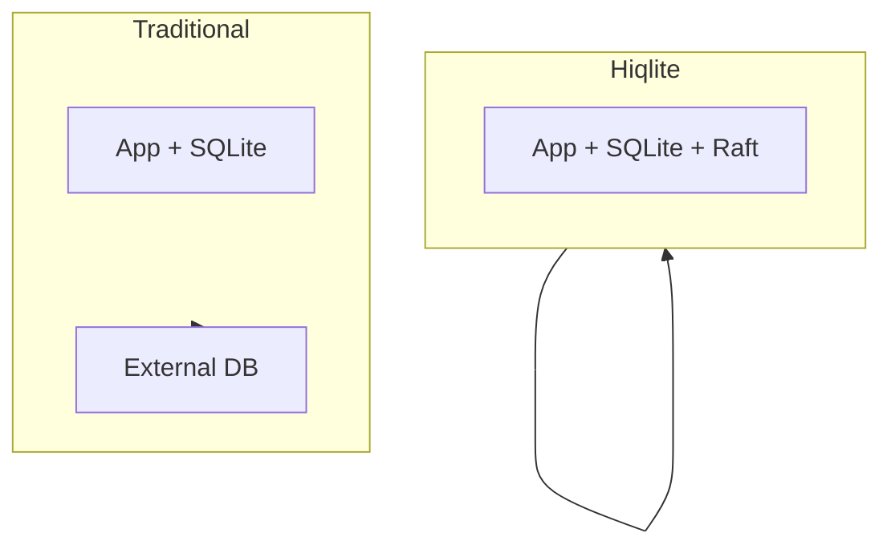
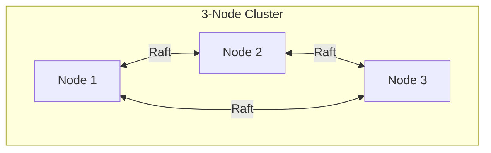
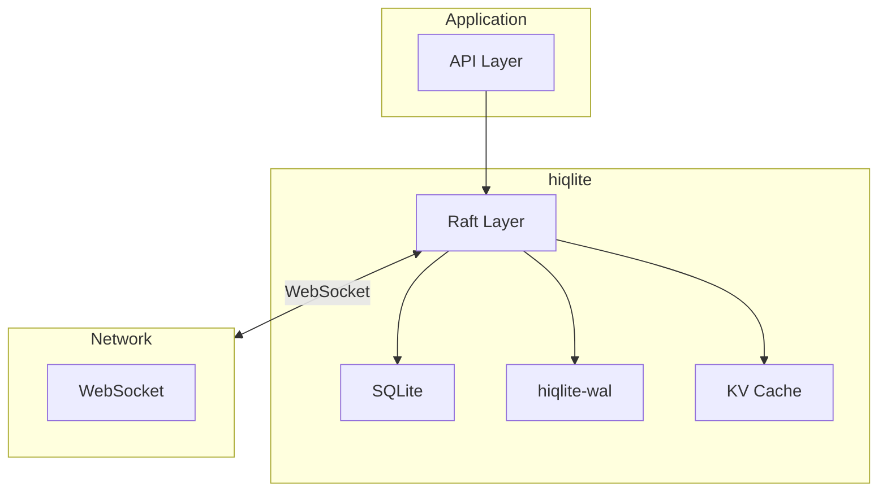

# hiqlite Overview

Embeddable SQLite with Raft consensus.

## Philosophy

**SQLite is fast — let's make it distributed.**

### The Problem

- SQLite is single-node only
- Need HA for production
- External databases add complexity
- Existing solutions are async or server-based

### The Solution

**Aha:** Embed Raft consensus directly in the application.



**Keep SQLite's strengths:**
- Local, fast reads (no network)
- No separate process
- Zero external dependencies

**Add HA features:**
- Raft consensus
- Automatic failover
- Self-healing

## Key Features

### 1. Embeddable

```rust
// SQLite is embedded
let node = start_node(config).await?;

// Local reads (no network)
let users = node.query_as::<User>("SELECT * FROM users").await?;
```

### 2. Raft Consensus



**Properties:**
- Strong consistency
- Automatic leader election
- Fault tolerant (tolerates (n-1)/2 failures)

### 3. Self-Healing

- **Crash recovery** — Rebuild from WAL + snapshots
- **Data loss** — Sync from other nodes
- **Split brain** — Automatic detection

### 4. High Performance

| Metric | Value |
|--------|-------|
| Inserts/s | 24.5k (M2 SSD) |
| Inserts/s | 16.5k (SATA SSD) |
| Cache ops/s | ~500k (memory) |

**Aha:** Near physical disk limits despite single SQLite writer.

### 5. KV Cache

```rust
// In-memory KV cache
node.cache_set("key", "value", Some(Duration::from_secs(300))).await?;

// Disk-backed (rebuilds after restart)
let value: Option<String> = node.cache_get("key").await?;
```

### 6. Encrypted Backups

```rust
// Backup to S3
node.backup_to_s3(
    "s3://bucket/backups/db-2025-01-15.sql",
    &encryption_key,
).await?;
```

## Architecture



## Use Cases

| Use Case | Benefit |
|----------|---------|
| **Identity Provider** | HA for rauthy |
| **Microservices** | Embedded DB per service |
| **Edge Computing** | Distributed at edge |
| **IoT** | Local + replicated |

## Next Steps

Continue to [Architecture →](01-architecture.html).
