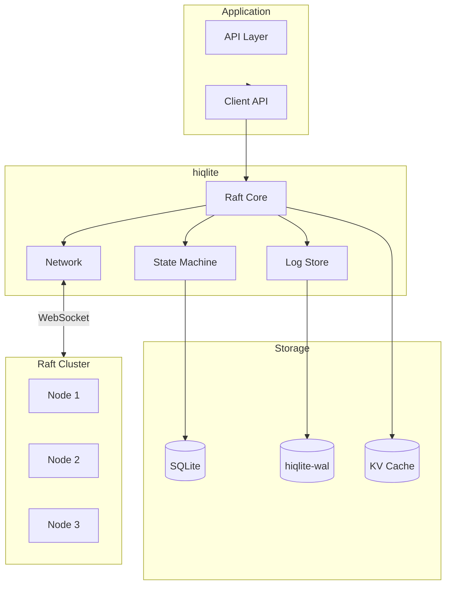
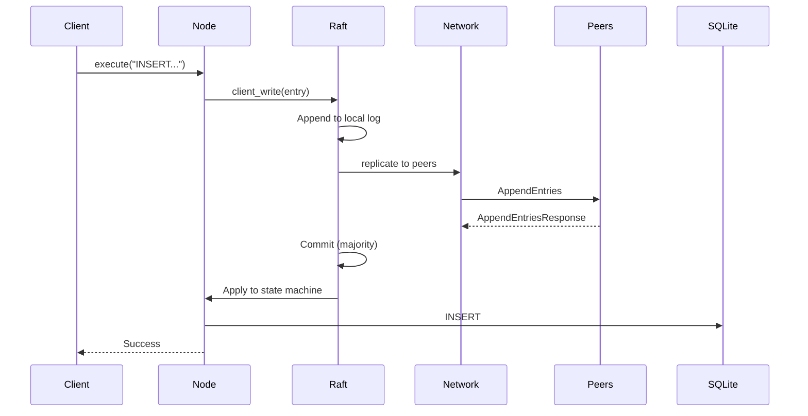
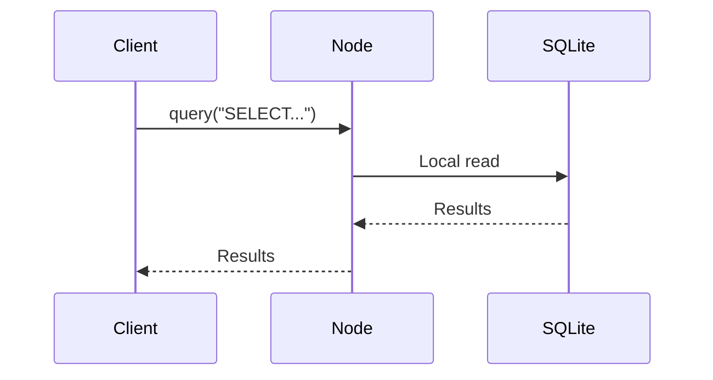
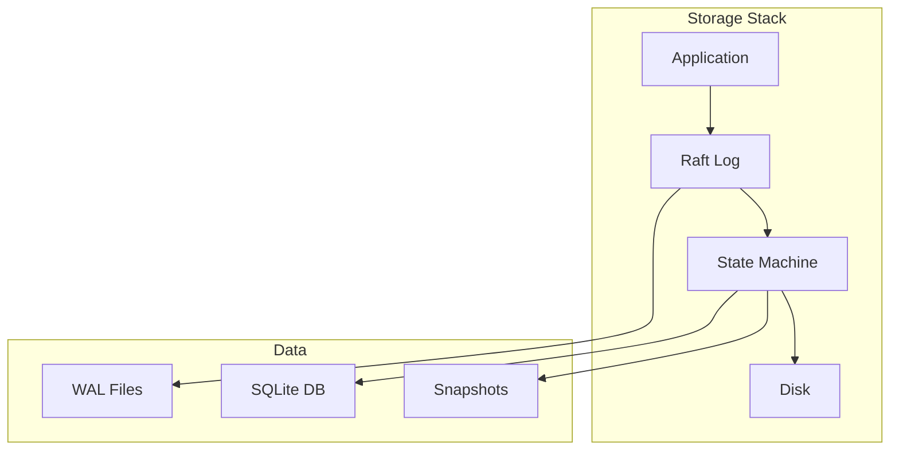

# Architecture

System design and component overview.

## High-Level Architecture



## Component Breakdown

### 1. Raft Core (openraft)

**Purpose:** Consensus algorithm implementation

```rust
// hiqlite/src/raft/mod.rs
use openraft::Raft;

pub struct HiqliteRaft {
    inner: Raft<HiqliteData, HiqliteNetwork, HiqliteStorage>,
}

impl HiqliteRaft {
    pub async fn propose(&self, entry: LogEntry) -> Result<(), Error> {
        // Propose entry to Raft cluster
        self.inner.client_write(entry).await?;
        Ok(())
    }
}
```

**Responsibilities:**
- Leader election
- Log replication
- Commit coordination
- Membership changes

### 2. State Machine

**Purpose:** Apply committed log entries to SQLite

```rust
// hiqlite/src/state_machine.rs
pub struct StateMachine {
    db: rusqlite::Connection,
}

impl StateMachine {
    pub fn apply(&mut self, entry: &LogEntry) -> Result<(), Error> {
        match entry {
            LogEntry::Execute(sql) => {
                self.db.execute(sql, [])?;
            }
            LogEntry::Set { key, value } => {
                // Apply to KV cache
            }
        }
        Ok(())
    }
}
```

### 3. Log Store (hiqlite-wal)

**Purpose:** Persistent storage for Raft logs

```rust
// hiqlite-wal/src/lib.rs
pub struct WalStorage {
    writer: WalWriter,
    readers: Vec<WalReader>,
}

impl LogStore for WalStorage {
    async fn append(&mut self, entries: Vec<LogEntry>) -> Result<(), Error> {
        self.writer.append_entries(entries).await?;
        Ok(())
    }

    async fn read(&self, index: u64) -> Result<Option<LogEntry>, Error> {
        self.readers[0].read_entry(index).await
    }
}
```

**Design:**
- Single writer thread (lock-free)
- Multiple reader threads
- CRC checksums per entry
- Automatic log rotation

### 4. Network Layer

**Purpose:** WebSocket connections between nodes

```rust
// hiqlite/src/network/mod.rs
pub struct Network {
    peers: HashMap<NodeId, WebSocketStream>,
}

impl Network {
    pub async fn send(&mut self, to: NodeId, msg: RaftMessage) -> Result<(), Error> {
        let conn = self.peers.get_mut(&to)?;
        conn.send(msg.serialize()).await?;
        Ok(())
    }
}
```

**Features:**
- Multiplexing WebSockets
- TLS support
- Separate Raft network
- Automatic reconnection

## Data Flow

### Write Path



### Read Path



**Aha:** Reads are local (fast), writes are replicated (consistent).

## Storage Layers



| Layer | Purpose | Persistence |
|-------|---------|-------------|
| Raft Log | Command log | WAL files |
| State Machine | SQLite state | SQLite DB |
| Snapshots | Point-in-time | Snapshot files |

## Next Steps

Continue to [Raft →](02-raft.html) for consensus details.
