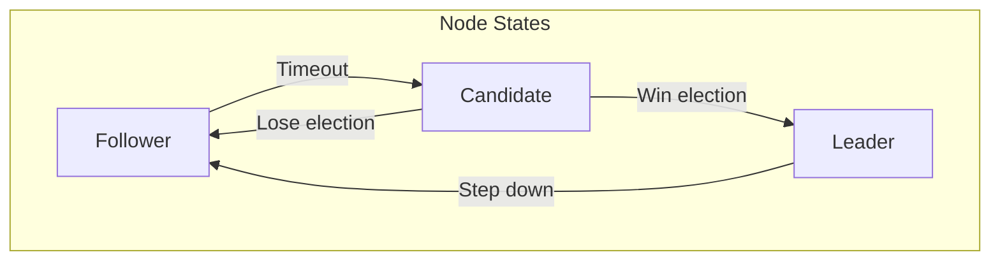
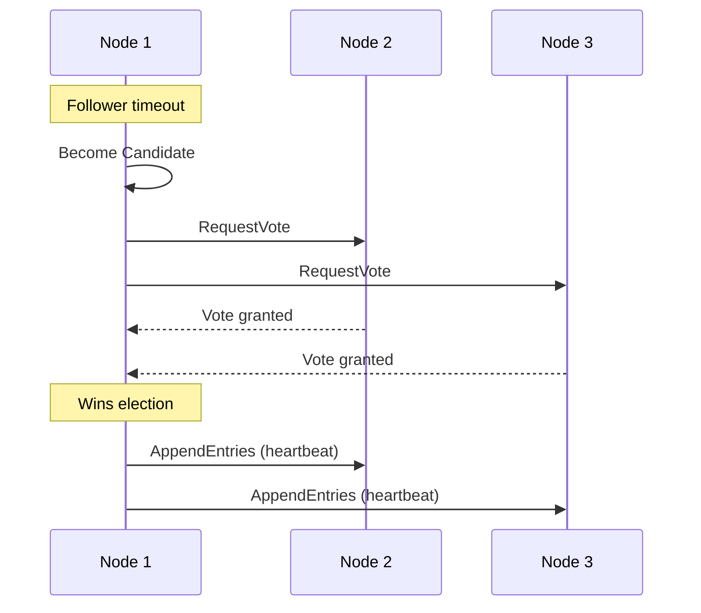
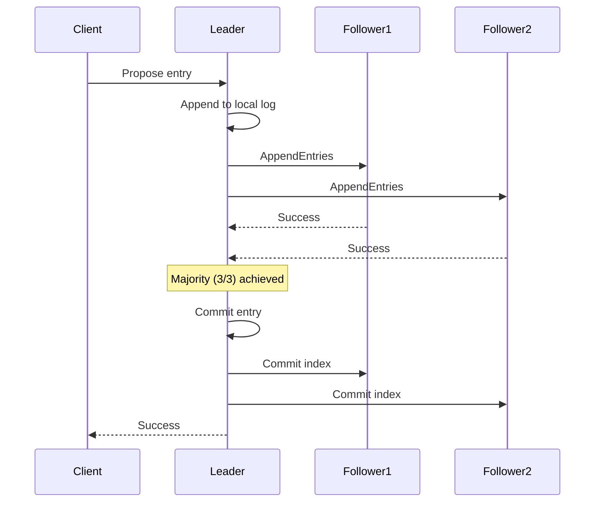

# Raft

Raft consensus implementation.

## Overview

Raft is a consensus algorithm for managing a replicated log. It provides:
- **Leader election** — One leader at a time
- **Log replication** — Leader replicates to followers
- **Safety** — Committed entries are durable



## Implementation

Based on [openraft](https://github.com/datafuselabs/openraft):

```rust
// hiqlite/src/raft/mod.rs
use openraft::{
    Raft, Config, 
    async_trait::async_trait,
    storage::{LogStore, SnapshotStore},
    network::RaftNetwork,
};

pub struct HiqliteRaft {
    raft: Raft<LogEntry, HiqliteNetwork, HiqliteStorage>,
    config: Config,
}

impl HiqliteRaft {
    pub async fn new(
        node_id: NodeId,
        config: Config,
        network: HiqliteNetwork,
        storage: HiqliteStorage,
    ) -> Self {
        let raft = Raft::new(node_id, config, network, storage);
        Self { raft, config }
    }
}
```

## Leader Election

### Election Flow



### Election Timeout

```rust
// Election timeout randomized to avoid split votes
let timeout = Duration::from_millis(150 + rand::random::<u64>() % 150);
```

**Aha:** Randomized timeout reduces split votes.

## Log Replication

### Replication Flow



### Log Structure

```rust
// hiqlite/src/raft/log.rs
pub struct LogEntry {
    pub index: u64,      // Position in log
    pub term: u64,       // Leader's term
    pub data: Vec<u8>,   // Serialized command
}

pub struct RaftLog {
    entries: Vec<LogEntry>,
    committed: u64,      // Last committed index
    applied: u64,        // Last applied to state machine
}
```

## Safety Guarantees

### Election Safety

- At most one leader per term
- Leader must have up-to-date log

### Log Matching

If two entries have same index and term, they contain the same command.

### State Machine Safety

If a leader has committed an entry, all future leaders will have that entry.

## Membership Changes

### Add Node

```rust
// Add new node to cluster
raft.add_learner(new_node_id, new_node_addr).await?;
raft.change_membership(
    MembershipConfig::new(vec![1, 2, 3, 4])
).await?;
```

### Remove Node

```rust
// Remove node from cluster
raft.change_membership(
    MembershipConfig::new(vec![1, 2, 3])
).await?;
```

**Aha:** Membership changes use joint consensus for safety.

## Client Interaction

### Leader Node

```rust
// On leader: execute locally
if node.is_leader() {
    node.execute("INSERT INTO users VALUES ('Alice')").await?;
}
```

### Follower Node

```rust
// On follower: forward to leader
if !node.is_leader() {
    let leader = node.get_leader()?;
    let client = HttpClient::new(leader);
    client.forward_execute(sql).await?;
}
```

**Aha:** Non-leaders automatically forward to current leader.

## Configuration

```rust
// hiqlite/src/raft/config.rs
let config = Config::build("node-1")
    .election_timeout_min(Duration::from_millis(150))
    .election_timeout_max(Duration::from_millis(300))
    .heartbeat_interval(Duration::from_millis(50))
    .snapshot_max_chunk_size(1024 * 1024)
    .validate()
    .unwrap();
```

| Parameter | Default | Purpose |
|-----------|---------|---------|
| `election_timeout_min` | 150ms | Min election timeout |
| `election_timeout_max` | 300ms | Max election timeout |
| `heartbeat_interval` | 50ms | Leader heartbeat |
| `snapshot_max_chunk_size` | 1MB | Snapshot chunk size |

## Next Steps

Continue to [WAL →](03-wal.html) for log storage.
