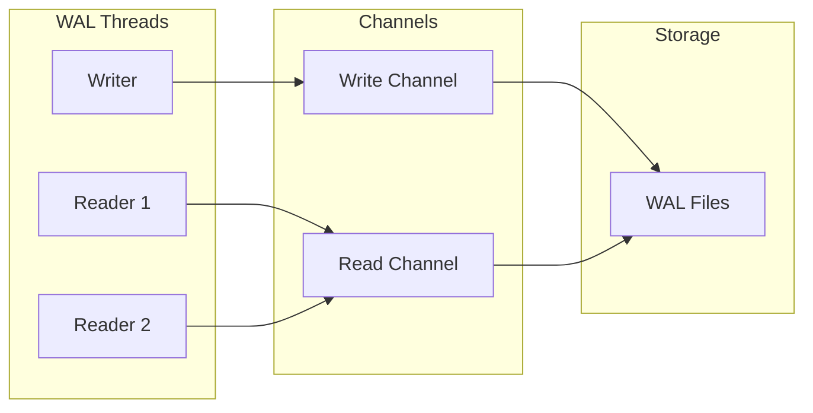

# WAL (Write-Ahead Log)

Custom WAL storage for Raft logs.

## Overview

**Aha:** Single writer, multiple readers — lock-free design.



## Design

### Single Writer

```rust
// hiqlite-wal/src/writer.rs
pub struct WalWriter {
    file: File,
    current_offset: u64,
}

impl WalWriter {
    pub fn append(&mut self, entry: &LogEntry) -> Result<(), Error> {
        // Serialize entry
        let bytes = entry.serialize()?;
        
        // Calculate CRC
        let crc = crc32c(&bytes);
        
        // Write: [length:4][crc:4][data:N]
        let header = (bytes.len() as u32).to_le_bytes();
        self.file.write_all(&header)?;
        self.file.write_all(&crc.to_le_bytes())?;
        self.file.write_all(&bytes)?;
        
        // Sync to disk
        self.file.sync_data()?;
        
        self.current_offset += 8 + bytes.len() as u64;
        Ok(())
    }
}
```

**Aha:** Writer runs on dedicated thread, no async/await.

### Multiple Readers

```rust
// hiqlite-wal/src/reader.rs
pub struct WalReader {
    file: File,
    read_offset: u64,
}

impl WalReader {
    pub fn read(&mut self, index: u64) -> Result<Option<LogEntry>, Error> {
        // Seek to position
        self.file.seek(SeekFrom::Start(self.read_offset))?;
        
        // Read header
        let mut header = [0u8; 8];
        self.file.read_exact(&mut header)?;
        let len = u32::from_le_bytes([header[0], header[1], header[2], header[3]]);
        let crc_expected = u32::from_le_bytes([header[4], header[5], header[6], header[7]]);
        
        // Read data
        let mut data = vec![0u8; len as usize];
        self.file.read_exact(&mut data)?;
        
        // Verify CRC
        let crc_actual = crc32c(&data);
        if crc_expected != crc_actual {
            return Err(Error::CorruptedEntry);
        }
        
        // Deserialize
        let entry = LogEntry::deserialize(&data)?;
        Ok(Some(entry))
    }
}
```

## Log Format

### File Structure

```
wal-000000001.hql
wal-000000002.hql
wal-000000003.hql
...
```

### Entry Format

```
+--------+--------+------------------+
| Length |  CRC   |      Data        |
| 4 bytes| 4 bytes|     N bytes      |
+--------+--------+------------------+
```

| Field | Size | Description |
|-------|------|-------------|
| Length | 4 bytes | Data length |
| CRC | 4 bytes | CRC32C checksum |
| Data | N bytes | Serialized entry |

## Lock File

```rust
// hiqlite-wal/src/lock.rs
pub struct WalLock {
    file: File,
}

impl WalLock {
    pub fn acquire(data_dir: &Path) -> Result<Self, Error> {
        let path = data_dir.join("lock.hql");
        let file = OpenOptions::new()
            .create(true)
            .write(true)
            .open(&path)?;
        
        // Try to acquire exclusive lock
        file.lock_exclusive()?;
        
        Ok(Self { file })
    }
    
    pub fn graceful_shutdown(&self, data_dir: &Path) -> Result<(), Error> {
        // Remove lock file on clean shutdown
        let path = data_dir.join("lock.hql");
        fs::remove_file(&path)?;
        Ok(())
    }
}
```

**Aha:** Lock file serves dual purpose:
1. Prevent multiple processes
2. Detect crash vs graceful shutdown

## Log Rotation

```rust
// hiqlite-wal/src/rotation.rs
pub const MAX_WAL_SIZE: u64 = 100 * 1024 * 1024; // 100MB

impl WalWriter {
    pub fn maybe_rotate(&mut self) -> Result<(), Error> {
        if self.current_offset >= MAX_WAL_SIZE {
            // Close current file
            self.file.sync_all()?;
            
            // Create new file
            let new_id = self.current_id + 1;
            let new_path = self.data_dir.join(format!("wal-{:09}.hql", new_id));
            self.file = OpenOptions::new()
                .create(true)
                .write(true)
                .open(&new_path)?;
            
            self.current_id = new_id;
            self.current_offset = 0;
        }
        Ok(())
    }
}
```

## Recovery

### Crash Recovery

```rust
// hiqlite-wal/src/recovery.rs
pub fn recover(data_dir: &Path) -> Result<(), Error> {
    let lock_path = data_dir.join("lock.hql");
    
    if lock_path.exists() {
        // Crash detected
        info!("Crash detected, recovering WAL...");
        
        // Verify last WAL file
        let wal_files = list_wal_files(data_dir)?;
        let last_wal = wal_files.last()?;
        
        verify_wal_file(last_wal)?;
        
        // Recover orphaned entries
        recover_orphaned_entries(last_wal)?;
    }
    
    Ok(())
}

fn verify_wal_file(path: &Path) -> Result<(), Error> {
    let mut file = File::open(path)?;
    let mut offset = 0;
    
    while offset < file.metadata()?.len() {
        // Read entry
        let entry = match read_entry_at(&mut file, offset) {
            Ok(e) => e,
            Err(_) => {
                // Corrupted entry, truncate here
                file.set_len(offset)?;
                break;
            }
        };
        
        offset += entry.size();
    }
    
    Ok(())
}
```

**Aha:** WAL recovery ensures consistency even with `synchronous=OFF`.

## Performance

| Metric | Value |
|--------|-------|
| Throughput | 50k+ entries/s |
| Latency | < 1ms per write |
| Readers | Unlimited |

## Next Steps

Continue to [SQLite →](04-sqlite.html) for database integration.
