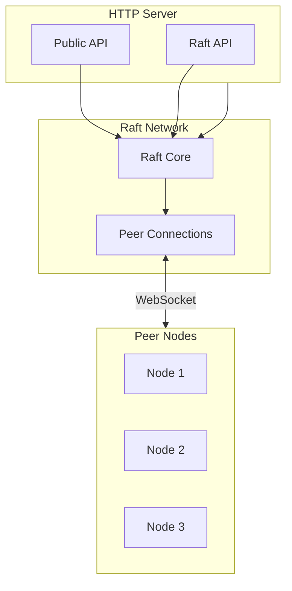

# Network

WebSocket networking for Raft.

## Architecture



**Aha:** Separate Raft network for security and load distribution.

## WebSocket Protocol

### Connection

```rust
// hiqlite/src/network/websocket.rs
use tokio_tungstenite::{connect_async, WebSocketStream};

pub struct RaftNetwork {
    peers: HashMap<NodeId, WebSocketStream>,
}

impl RaftNetwork {
    pub async fn connect(&mut self, node_id: NodeId, addr: &str) -> Result<(), Error> {
        let url = format!("wss://{}/raft", addr);
        let (ws, _) = connect_async(&url).await?;
        
        // Authenticate
        self.authenticate(&mut ws, node_id).await?;
        
        self.peers.insert(node_id, ws);
        Ok(())
    }
    
    async fn authenticate(&self, ws: &mut WebSocketStream, node_id: NodeId) -> Result<(), Error> {
        let challenge = generate_challenge();
        
        // Send challenge
        ws.send(Message::Binary(challenge.to_vec())).await?;
        
        // Receive response
        let response = ws.next().await.unwrap()?;
        
        // Verify signature
        verify_response(&challenge, &response, node_id)?;
        
        Ok(())
    }
}
```

## Message Protocol

### Raft Messages

```rust
// hiqlite/src/network/message.rs
#[derive(Serialize, Deserialize)]
pub enum RaftMessage {
    // Leader election
    RequestVote {
        term: u64,
        candidate_id: NodeId,
        last_log_index: u64,
        last_log_term: u64,
    },
    
    RequestVoteResponse {
        term: u64,
        vote_granted: bool,
    },
    
    // Log replication
    AppendEntries {
        term: u64,
        leader_id: NodeId,
        prev_log_index: u64,
        prev_log_term: u64,
        entries: Vec<LogEntry>,
        leader_commit: u64,
    },
    
    AppendEntriesResponse {
        term: u64,
        success: bool,
        match_index: u64,
    },
    
    // Heartbeat
    Heartbeat {
        term: u64,
        leader_id: NodeId,
    },
}
```

### Serialization

```rust
impl RaftMessage {
    pub fn serialize(&self) -> Vec<u8> {
        bincode::serialize(self).expect("serialize")
    }
    
    pub fn deserialize(bytes: &[u8]) -> Result<Self, Error> {
        bincode::deserialize(bytes).map_err(|e| e.into())
    }
}
```

**Aha:** Bincode for fast, compact serialization.

## Multiplexing

### Single Connection

```rust
// hiqlite/src/network/multiplex.rs
pub struct MultiplexedSocket {
    socket: WebSocketStream,
    channels: HashMap<ChannelId, flume::Sender<RaftMessage>>,
}

impl MultiplexedSocket {
    pub async fn run(&mut self) {
        loop {
            match self.socket.next().await {
                Some(Ok(msg)) => {
                    let raft_msg = RaftMessage::deserialize(&msg);
                    
                    // Route to appropriate channel
                    if let Some(tx) = self.channels.get(&raft_msg.channel()) {
                        tx.send_async(raft_msg).await.ok();
                    }
                }
                Some(Err(e)) => {
                    error!("WebSocket error: {}", e);
                    break;
                }
                None => break,
            }
        }
    }
}
```

## TLS

### Certificate Configuration

```toml
# hiqlite.toml
[tls]
enabled = true
cert_path = "/etc/hiqlite/cert.pem"
key_path = "/etc/hiqlite/key.pem"
ca_path = "/etc/hiqlite/ca.pem"
```

```rust
// hiqlite/src/network/tls.rs
pub fn configure_tls(config: &TlsConfig) -> Result<TlsAcceptor, Error> {
    let cert = load_cert(&config.cert_path)?;
    let key = load_key(&config.key_path)?;
    let ca = load_ca(&config.ca_path)?;
    
    let tls_config = rustls::ServerConfig::builder()
        .with_safe_defaults()
        .with_client_cert_verifier(
            AllowAnyAuthenticatedClient::new(ca)
        )
        .with_single_cert(cert, key)?;
    
    Ok(TlsAcceptor::from(Arc::new(tls_config)))
}
```

## Reconnection

### Automatic Reconnect

```rust
// hiqlite/src/network/reconnect.rs
pub async fn maintain_connection(
    node_id: NodeId,
    addr: String,
    network: Arc<Mutex<RaftNetwork>>,
) {
    loop {
        match connect_and_auth(&addr, node_id).await {
            Ok(mut ws) => {
                info!("Connected to {}", addr);
                
                // Run until disconnect
                while let Some(msg) = ws.next().await {
                    match msg {
                        Ok(m) => handle_message(m).await,
                        Err(e) => {
                            error!("WebSocket error: {}", e);
                            break;
                        }
                    }
                }
            }
            Err(e) => {
                error!("Connection failed: {}", e);
            }
        }
        
        // Wait before reconnect
        tokio::time::sleep(Duration::from_secs(5)).await;
    }
}
```

## Server

### HTTP Server

```rust
// hiqlite/src/server/mod.rs
pub async fn start_server(config: &ServerConfig) -> Result<(), Error> {
    let app = Router::new()
        // Public API
        .route("/api/*", get(api_handler).post(api_handler))
        // Raft internal
        .route("/raft", get(raft_handler))
        // Dashboard
        .route("/dashboard/*", get(dashboard_handler));
    
    let addr = format!("{}:{}", config.bind, config.port);
    axum::Server::bind(&addr.parse()?)
        .serve(app.into_make_service())
        .await?;
    
    Ok(())
}
```

## Next Steps

Continue to [Queries →](06-queries.html).
