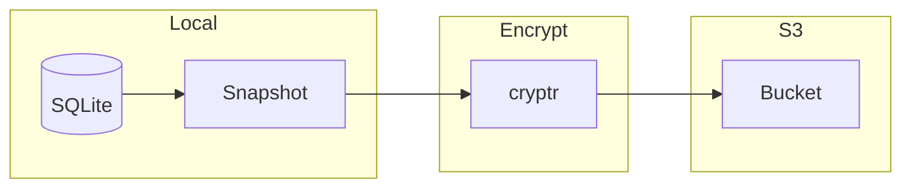

# Backup & Restore

Encrypted backups to S3.

## Overview



## Backup

### Manual Backup

```rust
// hiqlite/src/backup.rs
pub async fn backup(&self, s3_url: &str) -> Result<(), Error> {
    // Create snapshot
    let snapshot = self.create_snapshot().await?;
    
    // Encrypt with cryptr
    let encrypted = cryptr::encrypt_file(
        &snapshot,
        &self.encryption_key(),
    )?;
    
    // Upload to S3
    upload_to_s3(&encrypted, s3_url).await?;
    
    // Cleanup
    fs::remove_file(&snapshot)?;
    fs::remove_file(&encrypted)?;
    
    Ok(())
}
```

### Automated Backups

```toml
# hiqlite.toml
[backup]
enabled = true
schedule = "0 2 * * *"  # Daily at 2 AM
s3_url = "s3://bucket/backups/"
retention_days = 30
```

```rust
pub async fn start_backup_scheduler(&self) {
    let schedule = Schedule::from_str("0 2 * * *").unwrap();
    
    for datetime in schedule.upcoming(Utc) {
        let delay = datetime - Utc::now();
        tokio::time::sleep(delay.to_std().unwrap()).await;
        
        if let Err(e) = self.backup().await {
            error!("Backup failed: {}", e);
        }
    }
}
```

## Restore

### From Snapshot

```rust
pub async fn restore(&self, s3_url: &str) -> Result<(), Error> {
    // Download from S3
    let encrypted = download_from_s3(s3_url).await?;
    
    // Decrypt
    let snapshot = cryptr::decrypt_file(
        &encrypted,
        |key_id| self.get_key(key_id),
    )?;
    
    // Restore database
    restore_snapshot(&snapshot, self.data_dir()).await?;
    
    // Replay logs from snapshot index
    let last_index = get_snapshot_last_index(&snapshot)?;
    self.replay_logs(last_index).await?;
    
    Ok(())
}
```

## S3 Integration

### S3-simple

```rust
// hiqlite/src/s3.rs
use s3_simple::S3Client;

pub struct S3Storage {
    client: S3Client,
}

impl S3Storage {
    pub async fn upload(
        &self,
        local_path: &Path,
        s3_key: &str,
    ) -> Result<(), Error> {
        let body = tokio::fs::read(local_path).await?;
        
        self.client
            .put_object(s3_key, body)
            .await?;
        
        Ok(())
    }
    
    pub async fn download(
        &self,
        s3_key: &str,
        local_path: &Path,
    ) -> Result<(), Error> {
        let body = self.client
            .get_object(s3_key)
            .await?;
        
        tokio::fs::write(local_path, body).await?;
        Ok(())
    }
}
```

## Encryption

### Key Management

```rust
pub struct BackupKey {
    id: u32,
    key: [u8; 32],
}

impl BackupKey {
    pub fn generate() -> Self {
        let mut key = [0u8; 32];
        OsRng.fill_bytes(&mut key);
        
        Self {
            id: generate_key_id(),
            key,
        }
    }
}
```

**Aha:** Backup encrypted with cryptr before leaving the node.

## Next Steps

Continue to [Deployment →](08-deployment.html).
