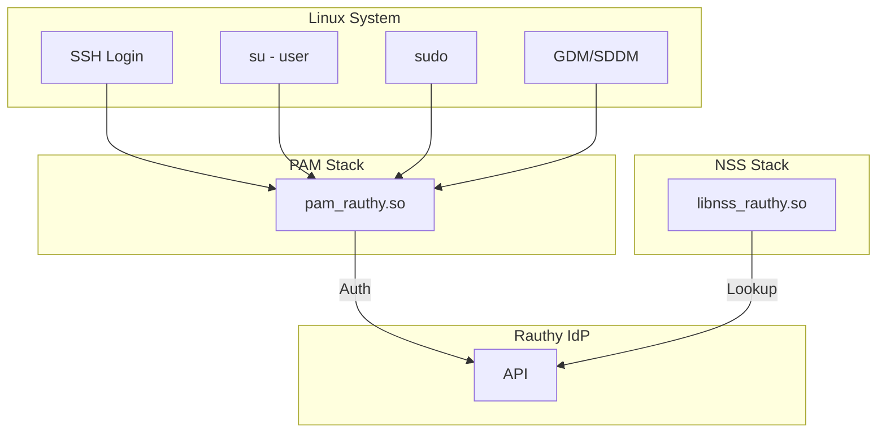

# Project Exploration: rauthy-pam-nss

## Overview

rauthy-pam-nss provides PAM (Pluggable Authentication Modules) and NSS (Name Service Switch) modules for rauthy, enabling system-level authentication with rauthy-managed accounts.

### Key Features

- **NSS module** — Resolve users, groups, hosts from rauthy (`getent passwd`, `getent group`, `getent hosts`)
- **PAM module** — Authenticate users via rauthy (password, Yubikey/passkeys)
- **SSH support** — SSH login with rauthy accounts
- **Remote authentication** — PAM passwords from rauthy account dashboard
- **SELinux support** — Custom policies included
- **Home directory creation** — Custom `/etc/skel_rauthy` support

## Repository

- **Location:** `/home/darkvoid/Boxxed/@formulas/src.rust/src.auth/src.rauthy/rauthy-pam-nss`
- **Remote:** https://github.com/sebadob/rauthy-pam-nss.git
- **License:** AGPL-3.0
- **Author:** Sebastian Dobe

## Directory Structure

```
rauthy-pam-nss/
├── Cargo.toml              # Package manifest
├── Cargo.lock             # Dependencies
├── README.md              # Main readme
├── CHANGELOG.md           # Version history
├── LICENSE                # AGPL-3.0
├── justfile               # Build tasks
├── rauthy-pam-nss.toml    # Config template
├── Cargo.toml             # Rust dependencies
├── install/               # Installation scripts
│   └── install.sh        # Main installer
├── selinux/               # SELinux policies
├── src/                   # Source code
│   ├── nss-module/        # NSS module
│   ├── pam-module/        # PAM module
│   ├── rauthy-nss/        # NSS library
│   └── rauthy-authorized-keys/  # SSH authorized keys
└── templates/             # Config templates
```

## Components

| Component | Purpose | Output |
|-----------|---------|--------|
| `nss-module` | NSS library | `libnss_rauthy.so` |
| `pam-module` | PAM module | `pam_rauthy.so` |
| `rauthy-authorized-keys` | SSH authorized keys | `rauthy-authorized-keys` |

## NSS Module

Resolves users, groups, hosts from rauthy:

- `getent passwd` — List users
- `getent passwd <username>` — Get specific user
- `getent group` — List groups
- `getent hosts` — List hosts

## PAM Module

Authentication via rauthy:

- Password authentication
- Yubikey/passkey (local)
- PAM Remote Password (via SSH)
- `su` support
- `sudo` support
- Window manager login (gdm, sddm)

## Integration Flow



## Open Questions

1. SELinux policy details
2. SSH AuthorizedKeysCommand integration
3. PAM Remote Password flow
