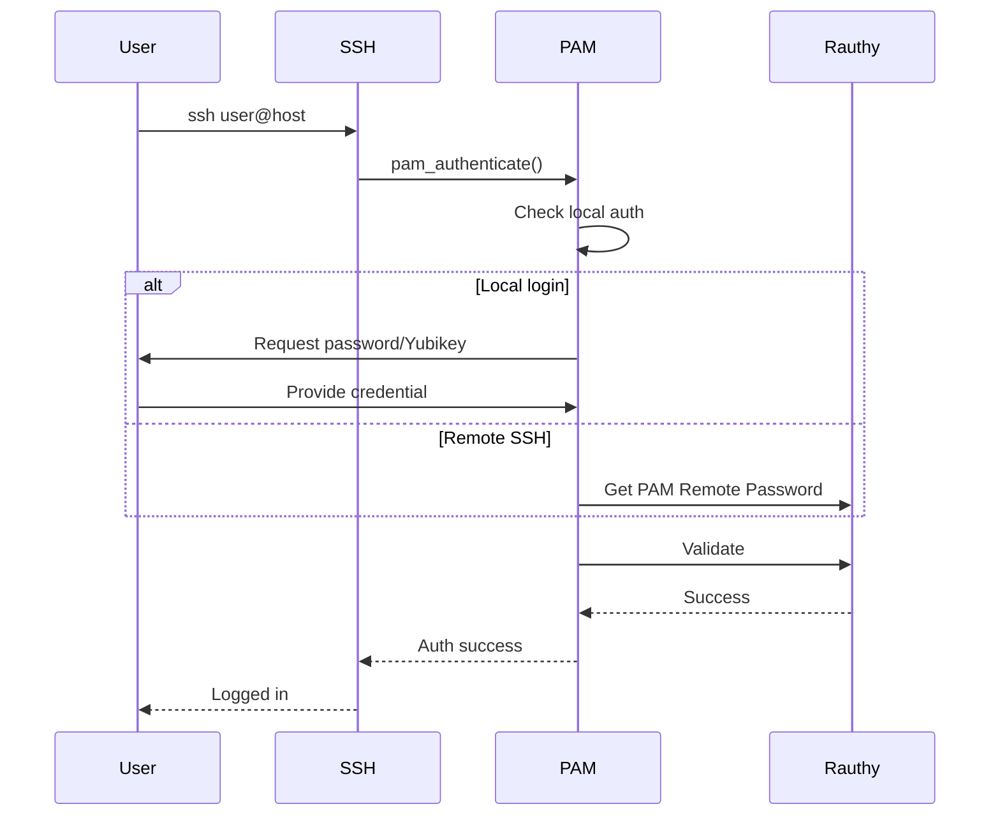

# rauthy-pam-nss Overview

System authentication with rauthy.

## Philosophy

**Bring rauthy to the system level.**

### The Problem

- rauthy manages web authentication
- System auth uses separate users
- No single sign-on for servers
- SSH needs local accounts

### The Solution

```
┌─────────────────┐
│   Rauthy IdP    │
│  ┌───────────┐  │
│  │  Users    │  │
│  │  Groups   │  │
│  │  Hosts    │  │
│  └─────┬─────┘  │
└────────┼────────┘
         │
┌────────┴─────────────────────────┐
│      PAM/NSS Modules             │
│  ┌─────────────┐ ┌─────────────┐│
│  │ pam_rauthy  │ │libnss_rauthy││
│  │             │ │             ││
│  │ authenticate│ │ getent      ││
│  └──────┬──────┘ └──────┬──────┘│
└─────────┼───────────────┼───────┘
          │               │
    ┌─────┴─────┐   ┌─────┴─────┐
    │   SSH     │   │  getent   │
    │   su      │   │  groups   │
    │   sudo    │   │           │
    └───────────┘   └───────────┘
```

**Aha:** Single source of truth for system and web auth.

## Components

### 1. NSS Module (libnss_rauthy.so)

Resolves names from rauthy:

| Command | Purpose |
|---------|---------|
| `getent passwd` | List users |
| `getent passwd <user>` | Get user |
| `getent group` | List groups |
| `getent hosts` | List hosts |

### 2. PAM Module (pam_rauthy.so)

Authenticates users:

- Password authentication
- Yubikey/passkey (local)
- PAM Remote Password (SSH)

### 3. Authorized Keys

SSH public key lookup:

```
AuthorizedKeysCommand /usr/bin/rauthy-authorized-keys
```

## Features

| Feature | Status | Notes |
|---------|--------|-------|
| NSS users | ✅ | `getent passwd` |
| NSS groups | ✅ | Merged groups |
| NSS hosts | ✅ | Host resolution |
| PAM password | ✅ | Local auth |
| PAM passkey | ✅ | Yubikey |
| SSH remote | ✅ | PAM password |
| SSH keys | ✅ | AuthorizedKeysCommand |
| SELinux | ✅ | Custom policies |

## Authentication Flow



## Limitations

- No chained `su -` via SSH (passkey limitation)
- SELinux policies may need tweaking
- PAM Remote Password required for remote MFA

## Next Steps

Continue to [NSS →](01-nss.html).
