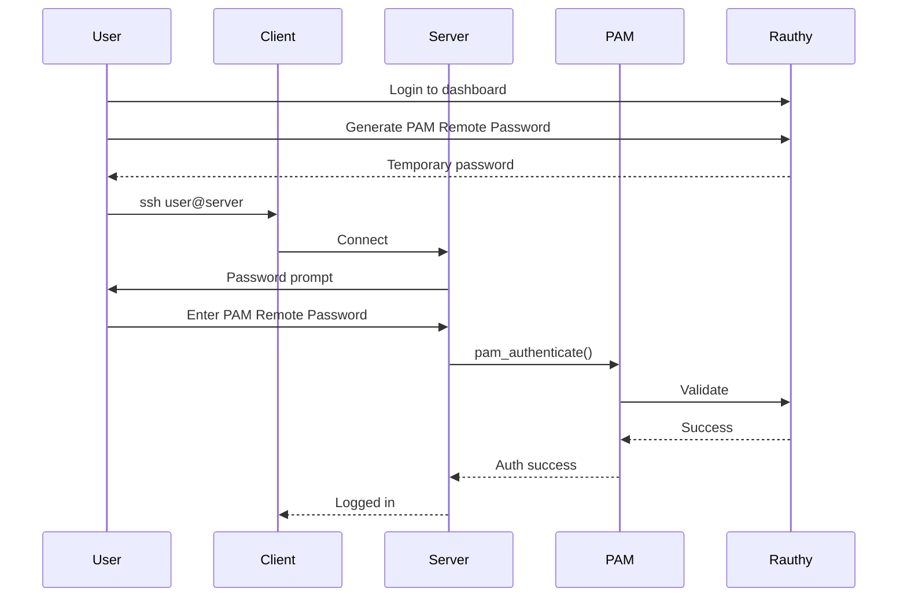

# SSH Integration

SSH login with rauthy.

## Overview

Two SSH authentication methods:

1. **PAM Remote Password** — Password via rauthy
2. **Public Keys** — Uploaded to rauthy

## PAM Remote Password

### Flow



### Configuration

```
# /etc/pam.d/sshd
auth    sufficient    pam_rauthy.so
auth    required      pam_unix.so
```

## Public Key Authentication

### AuthorizedKeysCommand

```
# /etc/ssh/sshd_config
AuthorizedKeysCommand /usr/bin/rauthy-authorized-keys %u
AuthorizedKeysCommandUser root
```

### Implementation

```rust
// src/rauthy-authorized-keys/main.rs
fn main() {
    let username = env::args().nth(1).expect("username required");
    
    // Fetch keys from rauthy
    let keys = rauthy_client::get_user_ssh_keys(&username)
        .expect("fetch keys");
    
    // Print authorized_keys format
    for key in keys {
        println!("{} {}", key.algorithm, key.key);
    }
}
```

## SSH Config

### Server Configuration

```
# /etc/ssh/sshd_config
# Authentication
PasswordAuthentication yes
PubkeyAuthentication yes

# PAM
UsePAM yes

# Authorized keys command
AuthorizedKeysCommand /usr/bin/rauthy-authorized-keys %u
AuthorizedKeysCommandUser root

# Allow rauthy users
AllowUsers *@rauthy
```

## sudo Access

```
# /etc/sudoers
%wheel-rauthy   ALL=(ALL)   ALL
```

Rauthy groups can be mapped to local sudo access.

## Use Cases

| Scenario | Method |
|----------|--------|
| Password only | PAM Remote Password |
| MFA required | PAM Remote Password + MFA in rauthy |
| Key-based | AuthorizedKeysCommand |
| sudo | Group mapping |

## Next Steps

Continue to [Installation →](04-install.html).
