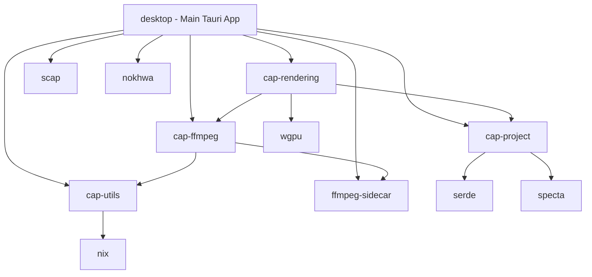
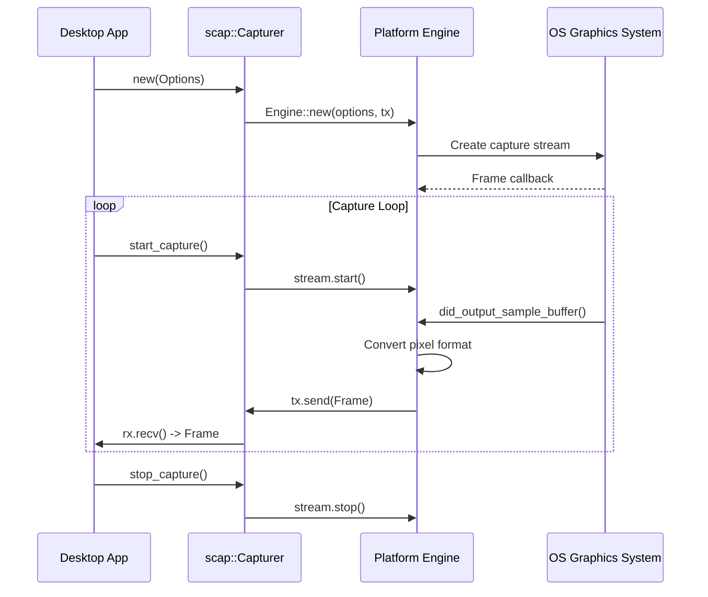
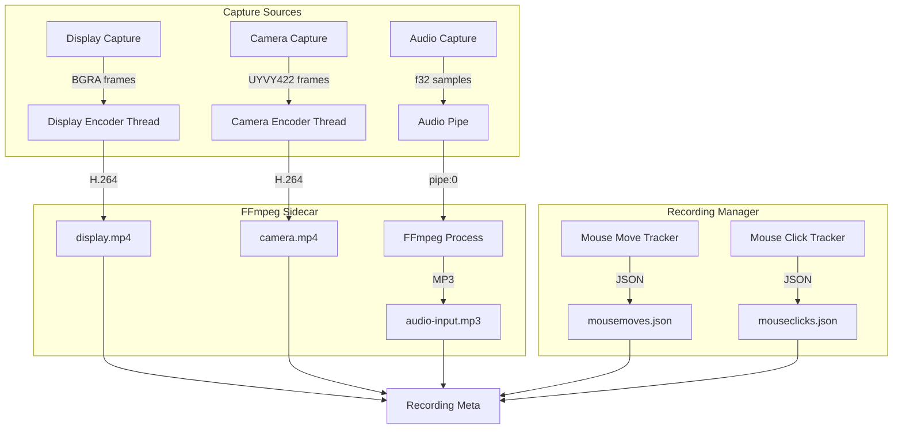
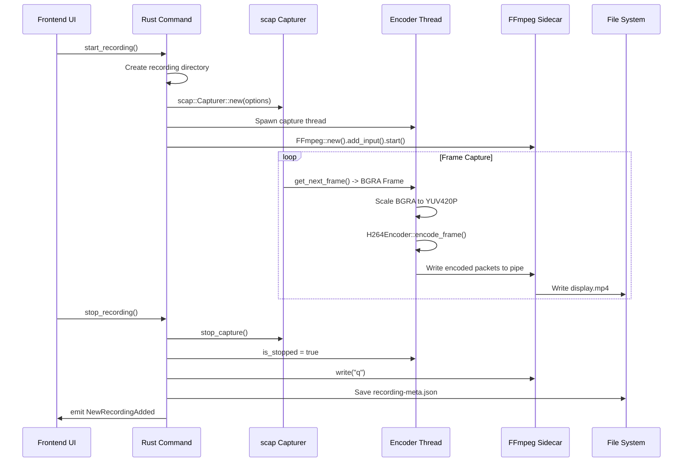

# Deep Exploration: src.cap Screen Recording System

## Overview

Cap (src.cap) is a modern, open-source screen recording application built with Rust and Tauri. It provides high-quality screen capture capabilities with real-time encoding, multi-source recording (display, camera, audio), and a sophisticated GPU-accelerated rendering pipeline for video composition and editing.

**Repository Structure:** `/home/darkvoid/Boxxed/@formulas/src.rust/src.cap/`

---

## 1. Project Structure

### Root Directory Layout

```
src.cap/
├── Cap/                          # Main application monorepo
│   ├── apps/desktop/             # Tauri desktop application
│   │   └── src-tauri/            # Rust backend for desktop app
│   ├── crates/                   # Shared Rust crates
│   │   ├── ffmpeg/               # FFmpeg integration layer
│   │   ├── project/              # Project configuration & metadata
│   │   ├── rendering/            # GPU-accelerated video rendering
│   │   └── utils/                # Cross-platform utilities
│   └── Cargo.toml                # Workspace configuration
├── cap-raycast/                  # Raycast extension for macOS
├── ffmpeg-sidecar/               # Standalone FFmpeg wrapper library
├── nokhwa/                       # Camera capture library (fork)
├── rust-ffmpeg/                  # FFmpeg Rust bindings (fork)
└── scap/                         # Screen capture library (fork)
```

### Workspace Members (Cargo.toml)

```toml
[workspace]
resolver = "2"
members = [
    "apps/desktop/src-tauri",
    "crates/rendering",
    "crates/ffmpeg",
    "crates/utils",
    "crates/project",
]
```

### Crate Dependency Graph



### Individual Crate Responsibilities

| Crate | Purpose | Key Dependencies |
|-------|---------|------------------|
| `desktop` | Main Tauri application backend | tauri, scap, nokhwa, cpal, wgpu, ffmpeg-next |
| `cap-ffmpeg` | FFmpeg process management & CLI wrapper | ffmpeg-sidecar, tauri, nix |
| `cap-rendering` | GPU video composition using wgpu | wgpu, bytemuck, ffmpeg-next, cap-project |
| `cap-project` | Project metadata & configuration structures | serde, specta, serde_json |
| `cap-utils` | Cross-platform utilities (named pipes, etc.) | nix, winapi |
| `scap` | Screen capture engine (ScreenCaptureKit, PipeWire, Windows) | screencapturekit (macOS), pipewire (Linux) |
| `nokhwa` | Cross-platform camera capture | AVFoundation (macOS), V4L2 (Linux) |

---

## 2. Screen Capture Pipeline

### 2.1 Platform-Specific Capture Backends

The capture system uses the `scap` crate which provides platform-specific implementations:

#### macOS - ScreenCaptureKit
**File:** `/home/darkvoid/Boxxed/@formulas/src.rust/src.cap/scap/src/capturer/engine/mac/mod.rs`

```rust
// Core capture flow using ScreenCaptureKit
pub fn create_capturer(options: &Options, tx: mpsc::Sender<Frame>) -> SCStream {
    let sc_shareable_content = SCShareableContent::current();

    // Filter selection: Display or Window
    let params = match target {
        Target::Window(window) => InitParams::DesktopIndependentWindow(sc_window),
        Target::Display(display) => InitParams::DisplayExcludingWindows(sc_display, excluded_windows),
    };

    let filter = SCContentFilter::new(params);

    // Configure stream with pixel format, resolution, frame rate
    let stream_config = SCStreamConfiguration {
        width,
        height,
        source_rect,
        pixel_format: PixelFormat::ARGB8888,
        shows_cursor: options.show_cursor,
        minimum_frame_interval: CMTime { value: 1, timescale: options.fps as CMTimeScale, .. },
        ..Default::default()
    };

    let mut stream = SCStream::new(filter, stream_config, ErrorHandler);
    stream.add_output(Capturer::new(tx, options.output_type), SCStreamOutputType::Screen);
    stream
}
```

**Key Features:**
- Uses `SCShareableContent` to enumerate displays and windows
- `SCContentFilter` for selective capture (display/window with exclusions)
- `SCStream` for actual frame capture with configurable output
- Supports pixel formats: `YCbCr420v`, `ARGB8888`
- Frame callback via `StreamOutput::did_output_sample_buffer()`

#### Linux - PipeWire + Portal
**File:** `/home/darkvoid/Boxxed/@formulas/src.rust/src.cap/scap/src/capturer/engine/linux/portal.rs`

```rust
// PipeWire-based capture through XDG Desktop Portal
// Uses DBus for portal communication
// Supports screen and window selection via portal dialog
```

**Key Features:**
- XDG Desktop Portal integration for Wayland compatibility
- PipeWire for low-latency frame streaming
- DBus for session management

#### Windows - Windows.Graphics.Capture
**File:** `/home/darkvoid/Boxxed/@formulas/src.rust/src.cap/scap/src/capturer/engine/win/mod.rs`

```rust
// Windows Graphics Capture API
// Uses windows-capture crate
```

### 2.2 Capture Options Structure

```rust
#[derive(Debug, Default, Clone)]
pub struct Options {
    pub fps: u32,                    // Target frame rate (typically 30)
    pub show_cursor: bool,           // Include cursor in capture
    pub show_highlight: bool,        // Window highlight for selection
    pub target: Option<Target>,      // Screen or Window target
    pub crop_area: Option<Area>,     // Optional crop region
    pub output_type: FrameType,      // BGRAFrame, YUVFrame, RGB, BGR0
    pub output_resolution: Resolution, // _480p.._4320p, Captured
    pub excluded_targets: Option<Vec<Target>>, // Windows to exclude
}
```

### 2.3 Frame Capture Flow



### 2.4 Memory Management & Performance

**Frame Buffer Handling:**
- Frames are transmitted via `mpsc::channel<Frame>`
- Zero-copy design where possible (CMSampleBuffer directly referenced)
- BGRA format preferred for direct memory access

**Key Optimizations:**
1. **Resolution Scaling:** Output resolution configurable to reduce processing
2. **Crop Area:** Hardware-accelerated crop at capture time
3. **Excluded Targets:** System-level window exclusion reduces post-processing
4. **Frame Type Selection:** BGRA for direct use, YUV for encoding efficiency

**Display Capture (desktop/src-tauri/src/display.rs):**

```rust
pub async fn start_capturing(
    output_path: PathBuf,
    capture_target: &CaptureTarget,
    start_writing_rx: watch::Receiver<bool>,
) -> CaptureController {
    let mut capturer = {
        let crop_area = match capture_target {
            CaptureTarget::Window { id } => get_window_bounds(*id).map(|bounds| Area { ... }),
            _ => None,
        };

        let options = Options {
            fps: FPS,  // 30
            show_cursor: true,
            output_type: FrameType::BGRAFrame,
            output_resolution: Resolution::Captured,
            crop_area,
            excluded_targets: Some(excluded_targets),
            ..Default::default()
        };

        Capturer::new(options)
    };

    // Spawn encoding thread
    std::thread::spawn({
        move || {
            let capture_format = avformat::Pixel::BGRA;
            let output_format = H264Encoder::output_format();  // YUV420P

            // FFmpeg scaler for format conversion
            let mut scaler = software::scaling::Context::get(
                capture_format, capture_size[0], capture_size[1],
                output_format, frame_size.0, frame_size.1,
                software::scaling::Flags::FAST_BILINEAR,
            ).unwrap();

            capturer.start_capture();

            loop {
                if controller.is_stopped() { break; }
                if controller.is_paused() { continue; }

                match capturer.get_next_frame() {
                    Ok(Frame::BGRA(frame)) => {
                        let rgb_frame = bgra_frame(&frame.data, width, height);
                        let mut yuv_frame = Video::empty();
                        scaler.run(&rgb_frame, &mut yuv_frame).unwrap();
                        encoder.encode_frame(yuv_frame, frame.display_time / 1_000_000);
                    }
                    _ => println!("Failed to get frame"),
                }
            }
            encoder.close();
        }
    });

    controller
}
```

---

## 3. Encoding Pipeline

### 3.1 FFmpeg Sidecar Architecture

Cap uses a custom `ffmpeg-sidecar` library for managing FFmpeg processes:

**File:** `/home/darkvoid/Boxxed/@formulas/src.rust/src.cap/ffmpeg-sidecar/src/lib.rs`

```rust
pub struct FFmpegProcess {
    pub ffmpeg_stdin: ChildStdin,  // Direct pipe for raw frame data
    cmd: Child,
}

impl FFmpegProcess {
    pub fn spawn(mut command: Command) -> Self {
        let mut cmd = command.stdin(Stdio::piped()).spawn().unwrap();
        let ffmpeg_stdin = cmd.stdin.take().unwrap();
        Self { ffmpeg_stdin, cmd }
    }

    pub fn write(&mut self, data: &[u8]) -> std::io::Result<()> {
        self.ffmpeg_stdin.write_all(data)
    }

    pub fn stop(&mut self) {
        self.ffmpeg_stdin.write_all(b"q").ok();  // Send 'q' to quit
    }

    // Pause/Resume via SIGSTOP/SIGCONT (Unix only)
    pub fn pause(&mut self) -> std::io::Result<()> {
        #[cfg(unix)]
        {
            use nix::sys::signal::{kill, Signal};
            use nix::unistd::Pid;
            kill(Pid::from_raw(self.cmd.id() as i32), Signal::SIGSTOP)?;
        }
        Ok(())
    }

    pub fn resume(&mut self) -> std::io::Result<()> {
        #[cfg(unix)]
        {
            kill(Pid::from_raw(self.cmd.id() as i32), Signal::SIGCONT)?;
        }
        Ok(())
    }
}
```

### 3.2 FFmpeg Integration Layer

**File:** `/home/darkvoid/Boxxed/@formulas/src.rust/src.cap/Cap/crates/ffmpeg/src/lib.rs`

```rust
pub struct FFmpeg {
    pub command: Command,
    source_index: u8,
}

impl FFmpeg {
    pub fn new() -> Self {
        Self {
            command: Command::new(relative_command_path("ffmpeg").unwrap()),
            source_index: 0,
        }
    }

    pub fn add_input<S: ApplyFFmpegArgs>(&mut self, source: S) -> FFmpegInput<S> {
        let source_index = self.source_index;
        self.source_index += 1;
        source.apply_ffmpeg_args(&mut self.command);
        FFmpegInput { inner: source, index: source_index }
    }

    pub fn start(self) -> FFmpegProcess {
        FFmpegProcess::spawn(self.command)
    }
}

// Raw video input from named pipe
#[derive(Debug, Default)]
pub struct FFmpegRawVideoInput {
    pub width: u32,
    pub height: u32,
    pub fps: u32,
    pub pix_fmt: &'static str,  // "rgba", "bgra"
    pub input: OsString,         // Pipe path
}

impl ApplyFFmpegArgs for FFmpegRawVideoInput {
    fn apply_ffmpeg_args(&self, command: &mut Command) {
        let size = format!("{}x{}", self.width, self.height);
        command
            .args(["-f", "rawvideo", "-pix_fmt", self.pix_fmt])
            .args(["-s", &size])
            .args(["-r", &self.fps.to_string()])
            .args(["-thread_queue_size", "4096", "-i"])
            .arg(&self.input);
    }
}

// Raw audio input from named pipe
#[derive(Debug, Default)]
pub struct FFmpegRawAudioInput {
    pub sample_format: String,  // "f32le", "s16le"
    pub sample_rate: u32,
    pub channels: u16,
    pub input: OsString,
}
```

### 3.3 H.264 Video Encoder

**File:** `/home/darkvoid/Boxxed/@formulas/src.rust/src.cap/Cap/apps/desktop/src-tauri/src/encoder.rs`

```rust
pub struct H264Encoder {
    pub output: ffmpeg::format::context::Output,
    pub context: ffmpeg::encoder::Video,
    pub stream_index: usize,
    pub fps: f64,
    pub start_time: Option<u64>,
    last_frame: Option<ffmpeg::util::frame::Video>,
}

impl H264Encoder {
    pub fn output_format() -> ffmpeg::format::Pixel {
        ffmpeg::format::Pixel::YUV420P  // Standard for H.264
    }

    pub fn new(path: &PathBuf, width: u32, height: u32, fps: f64) -> Self {
        let mut output = ffmpeg::format::output(path).unwrap();
        let codec = ffmpeg::encoder::find(ffmpeg::codec::Id::H264).unwrap();
        let mut stream = output.add_stream(codec).unwrap();

        let mut encoder = ffmpeg::codec::context::Context::new_with_codec(codec)
            .encoder().video().unwrap();

        encoder.set_width(width);
        encoder.set_height(height);
        encoder.set_format(Self::output_format());
        encoder.set_frame_rate(Some(fps));
        encoder.set_time_base(1.0 / fps);
        encoder.set_gop(fps as u32);  // Keyframe every second
        encoder.set_max_bit_rate(8000);

        // Low-latency encoding settings
        let encoder = encoder.open_as_with(
            codec,
            dict!("preset" => "ultrafast", "tune" => "zerolatency"),
        ).unwrap();

        output.write_header().unwrap();

        Self { output, context: encoder, stream_index, fps, start_time: None, last_frame: None }
    }

    pub fn encode_frame(&mut self, mut frame: ffmpeg::util::frame::Video, timestamp: u64) {
        // Calculate PTS (Presentation Time Stamp)
        let pts = {
            let delta_time = if let Some(start_time) = self.start_time {
                (timestamp - start_time) as i64
            } else {
                self.start_time = Some(timestamp);
                0
            };
            (delta_time as f64 / (1000.0 / self.fps)).round() as i64
        };

        // Handle duplicate frame detection
        if let Some(last_frame) = &mut self.last_frame {
            if Some(pts) <= last_frame.pts() { return; }  // Skip old frames

            // Duplicate previous frame if gap > 1 frame
            while Some(pts - 1) > last_frame.pts() {
                last_frame.set_pts(Some(last_frame.pts().unwrap() + 1));
                self.context.send_frame(&last_frame).unwrap();
            }
        }

        frame.set_pts(Some(pts));
        self.context.send_frame(&frame).unwrap();
        self.last_frame = Some(frame);
        self.receive_and_process_packets();
    }

    fn receive_and_process_packets(&mut self) {
        let mut encoded = ffmpeg::Packet::empty();
        while self.context.receive_packet(&mut encoded).is_ok() {
            encoded.set_stream(self.stream_index);
            encoded.rescale_ts(1.0 / self.fps, self.output.stream(self.stream_index).unwrap().time_base());
            encoded.write_interleaved(&mut self.output).unwrap();
        }
    }

    pub fn close(mut self) {
        self.context.send_eof().unwrap();
        self.receive_and_process_packets();
        self.output.write_trailer().unwrap();
    }
}
```

### 3.4 MP3 Audio Encoder

```rust
pub struct MP3Encoder {
    pub output: ffmpeg::format::context::Output,
    pub context: ffmpeg::encoder::Audio,
    pub stream_index: usize,
    pub sample_rate: u32,
    sample_number: i64,
}

impl MP3Encoder {
    pub fn new(path: &PathBuf, sample_rate: u32) -> Self {
        let mut output = ffmpeg::format::output(path).unwrap();
        let codec = ffmpeg::encoder::find(ffmpeg::codec::Id::MP3).unwrap();
        let audio_codec = codec.audio().unwrap();
        let mut stream = output.add_stream(audio_codec).unwrap();

        let mut encoder = ffmpeg::codec::context::Context::new_with_codec(codec)
            .encoder().audio().unwrap();

        encoder.set_rate(sample_rate as i32);
        encoder.set_bit_rate(128000);
        encoder.set_channel_layout(ffmpeg::ChannelLayout::MONO);
        encoder.set_time_base((1, sample_rate as i32));
        encoder.set_format(ffmpeg::format::Sample::F32(ffmpeg::format::sample::Type::Packed));

        let encoder = encoder.open_as(codec).unwrap();

        Self { output, context: encoder, stream_index, sample_rate, sample_number: 0 }
    }

    pub fn encode_frame(&mut self, mut frame: ffmpeg::frame::Audio) {
        frame.set_pts(Some(self.sample_number as i64));
        self.context.send_frame(&frame).unwrap();
        self.sample_number += frame.samples() as i64;
        self.receive_and_process_packets();
    }
}
```

### 3.5 Named Pipe IPC

Cross-process communication uses named pipes (FIFOs on Unix):

**File:** `/home/darkvoid/Boxxed/@formulas/src.rust/src.cap/Cap/crates/utils/src/lib.rs`

```rust
#[cfg(unix)]
pub fn create_named_pipe(path: &Path) -> Result<(), Box<dyn std::error::Error>> {
    use nix::sys::stat;
    use nix::unistd;
    std::fs::remove_file(path).ok();
    unistd::mkfifo(path, stat::Mode::S_IRWXU)?;  // Create FIFO
    Ok(())
}
```

**Recording Pipeline (recording.rs):**

```rust
pub async fn start(
    recording_dir: PathBuf,
    recording_options: &RecordingOptions,
) -> InProgressRecording {
    let content_dir = recording_dir.join("content");
    std::fs::create_dir_all(&content_dir).unwrap();

    let mut ffmpeg = FFmpeg::new();
    let (start_writing_tx, start_writing_rx) = watch::channel(false);

    // Create pipe paths
    let audio_pipe_path = content_dir.join("audio-input.pipe");

    // Start capture threads concurrently
    let (display, camera, audio) = tokio::join!(
        display::start_capturing(
            content_dir.join("display.mp4"),
            &recording_options.capture_target,
            start_writing_rx.clone(),
        ),
        OptionFuture::from(camera_option.map(|info|
            camera::start_capturing(
                content_dir.join("camera.mp4"),
                info,
                start_writing_rx.clone(),
            )
        )),
        OptionFuture::from(audio_option.map(|capturer|
            audio::start_capturing(capturer, audio_pipe_path.clone(), start_writing_rx)
        )),
    );

    // Configure FFmpeg for audio encoding
    if let Some((controller, capturer)) = audio {
        let output_path = content_dir.join("audio-input.mp3");
        let ffmpeg_input = ffmpeg.add_input(FFmpegRawAudioInput {
            input: audio_pipe_path.into_os_string(),
            sample_format: capturer.sample_format().to_string(),
            sample_rate: capturer.sample_rate(),
            channels: capturer.channels(),
        });

        ffmpeg.command
            .args(["-f", "mp3", "-map", &format!("{}:a", ffmpeg_input.index)])
            .args(["-b:a", "128k"])
            .args(["-ar", &capturer.sample_rate().to_string()])
            .args(["-ac", &capturer.channels().to_string(), "-async", "1"])
            .args(["-af", "aresample=async=1:min_hard_comp=0.100000:first_pts=0"])
            .arg(&output_path);
    }

    let ffmpeg_process = ffmpeg.start();
    tokio::time::sleep(Duration::from_secs(1)).await;
    start_writing_tx.send(true).unwrap();  // Signal capture threads to begin

    InProgressRecording {
        recording_dir,
        ffmpeg_process,
        display,
        camera,
        audio,
        segments: vec![SystemTime::now().duration_since(UNIX_EPOCH).unwrap().as_secs_f64()],
        mouse_moves: Arc::new(Mutex::new(Vec::new())),
        mouse_clicks: Arc::new(Mutex::new(Vec::new())),
        stop_signal: Arc::new(Mutex::new(false)),
    }
}
```

### 3.6 Multi-Track Recording Architecture



---

## 4. Rendering Pipeline

### 4.1 Video Decoding with Hardware Acceleration

**File:** `/home/darkvoid/Boxxed/@formulas/src.rust/src.cap/Cap/crates/rendering/src/decoder.rs`

```rust
pub struct AsyncVideoDecoder;

impl AsyncVideoDecoder {
    pub fn spawn(path: PathBuf) -> AsyncVideoDecoderHandle {
        let (tx, rx) = mpsc::channel();

        std::thread::spawn(move || {
            let mut input = ffmpeg_next::format::input(&path).unwrap();
            let input_stream = input.streams().best(Video).unwrap();

            let decoder_codec = ff_find_decoder(&input, &input_stream, input_stream.parameters().id()).unwrap();
            let mut context = codec::context::Context::new_with_codec(decoder_codec);
            context.set_parameters(input_stream.parameters()).unwrap();

            // Hardware acceleration (VideoToolbox on macOS)
            let hw_device: Option<HwDevice> = {
                #[cfg(target_os = "macos")]
                {
                    context.try_use_hw_device(
                        AVHWDeviceType::AV_HWDEVICE_TYPE_VIDEOTOOLBOX,
                        Pixel::NV12,
                    ).ok()
                }
                #[cfg(not(target_os = "macos"))]
                None
            };

            let mut decoder = context.decoder().video().unwrap();

            // Scaler for format conversion to RGBA
            let mut scaler = Context::get(
                scaler_input_format, decoder.width(), decoder.height(),
                Pixel::RGBA, decoder.width(), decoder.height(),
                Flags::BILINEAR,
            ).unwrap();

            // LRU cache for frame seeking
            let mut cache = BTreeMap::<u32, Arc<Vec<u8>>>::new();
            const FRAME_CACHE_SIZE: usize = 50;

            while let Ok(r) = rx.recv() {
                match r {
                    VideoDecoderMessage::GetFrame(frame_number, sender) => {
                        // Check cache first
                        if let Some(cached) = cache.get(&frame_number) {
                            sender.send(Some(cached.clone())).ok();
                            continue;
                        }

                        // Seek if frame is far from current position
                        if should_seek(frame_number, last_decoded_frame) {
                            let timestamp_us = ((frame_number as f32 / frame_rate.numerator() as f32) * 1_000_000.0) as i64;
                            let position = timestamp_us.rescale((1, 1_000_000), rescale::TIME_BASE);
                            input.seek(position, ..position).unwrap();
                            decoder.flush();
                            cache.clear();
                        }

                        // Decode frames until target
                        while let Some((stream, packet)) = packets.next() {
                            if stream.index() == input_stream_index {
                                decoder.send_packet(&packet).ok();

                                while decoder.receive_frame(&mut temp_frame).is_ok() {
                                    let current_frame = ts_to_frame(temp_frame.pts().unwrap(), time_base, frame_rate);

                                    // Convert to RGBA
                                    let mut rgb_frame = frame::Video::empty();
                                    scaler.run(frame, &mut rgb_frame).unwrap();

                                    // Extract frame data
                                    let mut frame_buffer = Vec::with_capacity(width * height * 4);
                                    for line_data in data.chunks_exact(stride) {
                                        frame_buffer.extend_from_slice(&line_data[0..width * 4]);
                                    }

                                    let frame = Arc::new(frame_buffer);

                                    if current_frame == frame_number {
                                        sender.send(Some(frame.clone())).ok();
                                    }

                                    // Cache management
                                    if !too_small_for_cache_bounds {
                                        if cache.len() >= FRAME_CACHE_SIZE {
                                            // Evict oldest from active frame
                                            cache.remove(&evict_key);
                                        }
                                        cache.insert(current_frame, frame);
                                    }
                                }
                            }
                        }
                    }
                }
            }
        });

        AsyncVideoDecoderHandle { sender: tx }
    }

    pub async fn get_frame(&self, frame_number: u32) -> Option<Arc<Vec<u8>>> {
        let (tx, rx) = tokio::sync::oneshot::channel();
        self.sender.send(VideoDecoderMessage::GetFrame(frame_number, tx)).unwrap();
        rx.await.ok().flatten()
    }
}
```

### 4.2 GPU Video Composition with wgpu

**File:** `/home/darkvoid/Boxxed/@formulas/src.rust/src.cap/Cap/crates/rendering/src/lib.rs`

```rust
pub struct RenderVideoConstants {
    pub _instance: wgpu::Instance,
    pub _adapter: wgpu::Adapter,
    pub queue: wgpu::Queue,
    pub device: wgpu::Device,
    pub options: RenderOptions,
    composite_video_frame_pipeline: CompositeVideoFramePipeline,
    gradient_or_color_pipeline: GradientOrColorPipeline,
}

impl RenderVideoConstants {
    pub async fn new(options: RenderOptions) -> Result<Self, String> {
        let instance = wgpu::Instance::new(wgpu::InstanceDescriptor::default());
        let adapter = instance.request_adapter(&wgpu::RequestAdapterOptions::default()).await.unwrap();
        let (device, queue) = adapter
            .request_device(&wgpu::DeviceDescriptor::default(), None)
            .await
            .map_err(|e| e.to_string())?;

        Ok(Self {
            composite_video_frame_pipeline: CompositeVideoFramePipeline::new(&device),
            gradient_or_color_pipeline: GradientOrColorPipeline::new(&device),
            _instance: instance,
            _adapter: adapter,
            queue,
            device,
            options,
        })
    }
}

// Uniforms for video composition
#[derive(Debug, Clone, Copy, Pod, Zeroable, Default)]
#[repr(C)]
struct CompositeVideoFrameUniforms {
    pub crop_bounds: [f32; 4],      // Source crop rectangle
    pub target_bounds: [f32; 4],    // Destination rectangle
    pub output_size: [f32; 2],      // Final output dimensions
    pub frame_size: [f32; 2],       // Original frame dimensions
    pub velocity_uv: [f32; 2],      // For motion blur (future)
    pub target_size: [f32; 2],      // Scaled size
    pub rounding_px: f32,           // Corner radius in pixels
    pub mirror_x: f32,              // Horizontal flip flag
    _padding: [f32; 3],
}
```

### 4.3 Frame Rendering Pipeline

```rust
pub async fn produce_frame(
    constants: &RenderVideoConstants,
    screen_frame: &Vec<u8>,
    camera_frame: &Option<DecodedFrame>,
    background: Background,
    uniforms: &ProjectUniforms,
) -> Result<Vec<u8>, String> {
    let mut encoder = device.create_command_encoder(&CommandEncoderDescriptor { label: Some("Render Encoder") });

    // Create double-buffered intermediate textures for ping-pong rendering
    let textures = (
        device.create_texture(&output_texture_desc),
        device.create_texture(&output_texture_desc),
    );

    let mut output_is_left = true;

    // Pass 1: Render background (gradient or solid color)
    {
        do_render_pass(
            &mut encoder,
            get_either(texture_views, output_is_left),
            &gradient_or_color_pipeline.render_pipeline,
            gradient_or_color_pipeline.bind_group(device, &GradientOrColorUniforms::from(background).to_buffer(device)),
        );
        output_is_left = !output_is_left;
    }

    // Pass 2: Composite display video frame
    {
        // Upload screen frame to GPU texture
        let texture = device.create_texture(&(wgpu::TextureDescriptor {
            size: wgpu::Extent3d { width: screen_size.0, height: screen_size.1, .. },
            format: wgpu::TextureFormat::Rgba8UnormSrgb,
            usage: TextureUsages::TEXTURE_BINDING | RENDER_ATTACHMENT | COPY_DST,
            ..
        }));

        queue.write_texture(
            ImageCopyTexture { texture: &texture, .. },
            screen_frame,
            ImageDataLayout { bytes_per_row: Some(screen_size.0 * 4), .. },
            Extent3d { width: screen_size.0, height: screen_size.1, .. },
        );

        do_render_pass(
            &mut encoder,
            get_either(texture_views, output_is_left),
            &composite_video_frame_pipeline.render_pipeline,
            composite_video_frame_pipeline.bind_group(device, &uniforms.display.to_buffer(device), &texture_view, intermediate),
        );
        output_is_left = !output_is_left;
    }

    // Pass 3: Composite camera (picture-in-picture) if present
    if let (Some(camera_size), Some(camera_frame), Some(camera_uniforms)) =
        (options.camera_size, camera_frame, &uniforms.camera)
    {
        // Upload camera frame
        let texture = device.create_texture(..);
        queue.write_texture(.., camera_frame, ..);

        do_render_pass(
            &mut encoder,
            get_either(texture_views, output_is_left),
            &composite_video_frame_pipeline.render_pipeline,
            composite_video_frame_pipeline.bind_group(device, &camera_uniforms.to_buffer(device), &texture_view, intermediate),
        );
    }

    queue.submit(std::iter::once(encoder.finish()));

    // Read back final frame
    let output_buffer = device.create_buffer(&(BufferDescriptor {
        size: output_buffer_size,
        usage: COPY_DST | MAP_READ,
        ..
    }));

    encoder.copy_texture_to_buffer(
        ImageCopyTexture { texture: get_either(textures, !output_is_left), .. },
        ImageCopyBuffer { buffer: &output_buffer, layout: .. },
        output_texture_size,
    );

    queue.submit(std::iter::once(encoder.finish()));

    // Map buffer and read pixel data
    let buffer_slice = output_buffer.slice(..);
    let (tx, rx) = oneshot_channel();
    buffer_slice.map_async(MapMode::Read, move |result| { tx.send(result).ok(); });
    device.poll(Maintain::Wait);

    rx.receive().await.unwrap().ok();

    let data = buffer_slice.get_mapped_range();
    let mut image_data = Vec::with_capacity(width * height * 4);

    // Remove padding from each row
    for chunk in data.chunks(padded_bytes_per_row) {
        image_data.extend_from_slice(&chunk[..unpadded_bytes_per_row]);
    }

    drop(data);
    output_buffer.unmap();

    Ok(image_data)
}
```

### 4.4 WGSL Shaders

**Video Composition Shader:** `/home/darkvoid/Boxxed/@formulas/src.rust/src.cap/Cap/crates/rendering/src/shaders/composite-video-frame.wgsl`

```wgsl
struct Uniforms {
    crop_bounds: vec4<f32>,
    target_bounds: vec4<f32>,
    output_size: vec2<f32>,
    frame_size: vec2<f32>,
    velocity_uv: vec2<f32>,
    target_size: vec2<f32>,
    rounding_px: f32,
    mirror_x: f32,
};

@group(0) @binding(0) var<uniform> uniforms: Uniforms;
@group(0) @binding(1) var frame_texture: texture_2d<f32>;
@group(0) @binding(2) var intermediate_texture: texture_2d<f32>;
@group(0) @binding(3) var frame_sampler: sampler;

@vertex
fn vs_main(@builtin(vertex_index) vertex_index: u32) -> @builtin(position) vec4<f32> {
    // Full-screen triangle
    var pos = array<vec2<f32>, 3>(
        vec2<f32>(-1.0, -1.0),
        vec2<f32>(3.0, -1.0),
        vec2<f32>(-1.0, 3.0)
    );
    return vec4<f32>(pos[vertex_index], 0.0, 1.0);
}

@fragment
fn fs_main() -> @location(0) vec4<f32> {
    let uv = /* Calculate UV with crop and transform */;

    // Apply rounded corners
    let rounded_uv = apply_rounded_corners(uv, uniforms.rounding_px);

    // Sample frame texture
    let color = textureSample(frame_texture, frame_sampler, uv);

    return color;
}
```

### 4.5 Timeline-Based Playback

**File:** `/home/darkvoid/Boxxed/@formulas/src.rust/src.cap/Cap/apps/desktop/src-tauri/src/playback.rs`

```rust
pub struct Playback {
    pub audio: Option<AudioData>,
    pub renderer: Arc<editor::RendererHandle>,
    pub render_constants: Arc<RenderVideoConstants>,
    pub decoders: RecordingDecoders,
    pub start_frame_number: u32,
    pub project: watch::Receiver<ProjectConfiguration>,
    pub recordings: ProjectRecordings,
}

impl Playback {
    pub async fn start(self) -> PlaybackHandle {
        let (stop_tx, mut stop_rx) = watch::channel(false);
        let (event_tx, mut event_rx) = watch::channel(PlaybackEvent::Start);

        tokio::spawn(async move {
            let start = Instant::now();
            let mut frame_number = self.start_frame_number + 1;

            // Audio playback thread
            if let Some(audio) = self.audio.clone() {
                AudioPlayback {
                    audio,
                    stop_rx: stop_rx.clone(),
                    start_frame_number: self.start_frame_number,
                    project: self.project.clone(),
                }.spawn();
            }

            loop {
                let project = self.project.borrow().clone();

                // Get recording time from timeline (handles pauses/segments)
                let time = if let Some(timeline) = project.timeline() {
                    match timeline.get_recording_time(frame_number as f64 / FPS as f64) {
                        Some(time) => time,
                        None => break,
                    }
                } else {
                    frame_number as f64 / FPS as f64
                };

                tokio::select! {
                    _ = stop_rx.changed() => break,

                    Some((screen_frame, camera_frame)) = self.decoders.get_frames((time * FPS as f64) as u32) => {
                        let uniforms = ProjectUniforms::new(&self.render_constants, &project);

                        self.renderer
                            .render_frame(screen_frame, camera_frame, project.background.source.clone(), uniforms)
                            .await;

                        // Frame timing for accurate playback
                        tokio::time::sleep_until(
                            start + (frame_number - self.start_frame_number) * Duration::from_secs_f32(1.0 / FPS as f32)
                        ).await;

                        event_tx.send(PlaybackEvent::Frame(frame_number)).ok();
                        frame_number += 1;
                    }
                }
            }

            event_tx.send(PlaybackEvent::Stop).ok();
        });

        PlaybackHandle { stop_tx, event_rx }
    }
}
```

### 4.6 Real-Time Audio Resampling

```rust
struct AudioPlayback {
    audio: AudioData,
    stop_rx: watch::Receiver<bool>,
    start_frame_number: u32,
    duration: f64,
    project: watch::Receiver<ProjectConfiguration>,
}

impl AudioPlayback {
    fn spawn(mut self) {
        std::thread::spawn(move || {
            let host = cpal::default_host();
            let device = host.default_output_device().unwrap();
            let mut config = device.default_output_config().unwrap().config();
            config.channels = 1;

            let data = self.audio.buffer.clone();
            let mut time = self.start_frame_number as f64 / FPS as f64;
            let time_inc = 1.0 / config.sample_rate.0 as f64;
            let mut clock = data.len() as f64 * self.start_frame_number as f64 / (FPS as f64 * self.duration);
            let resample_ratio = self.audio.sample_rate as f64 / config.sample_rate.0 as f64;

            let next_sample = move || {
                time += time_inc;

                // Apply timeline time remapping (for pause segments)
                let time = self.project.borrow().timeline()?.get_recording_time(time)?;

                let index = time / self.duration * data.len() as f64;
                clock += resample_ratio;

                if clock >= data.len() as f64 { return None; }

                let index_int = index as usize;
                if index_int >= data.len() - 1 { return None; }

                // Linear interpolation for resampling
                let frac = index.fract();
                let current = data[index_int];
                let next = data[(index_int + 1) % data.len()];
                Some(current * (1.0 - frac) + next * frac)
            };

            // Build output stream with appropriate sample format
            let stream = match config.sample_format() {
                SampleFormat::F32 => create_stream::<f32>(&device, &config, next_sample),
                SampleFormat::I16 => create_stream::<i16>(&device, &config, next_sample),
                // ... other formats
            };

            stream.play().unwrap();
            self.stop_rx.changed().await.ok();
            stream.pause().ok();
        });
    }
}
```

---

## 5. Tauri Desktop App Architecture

### 5.1 Application State Management

```rust
pub struct App {
    start_recording_options: RecordingOptions,
    handle: AppHandle,
    current_recording: Option<InProgressRecording>,
}

#[derive(Clone, Serialize, Deserialize)]
pub struct RecordingOptions {
    capture_target: CaptureTarget,  // Screen or Window
    camera_label: Option<String>,
    audio_input_name: Option<String>,
}
```

### 5.2 IPC Command Structure

Commands use `tauri_specta` for type-safe Rust-TypeScript bindings:

```rust
#[tauri::command]
#[specta::specta]
async fn start_recording(app: AppHandle, state: MutableState<'_, App>) -> Result<(), String> {
    let mut state = state.write().await;
    let id = uuid::Uuid::new_v4().to_string();

    let recording_dir = app.path().app_data_dir().unwrap()
        .join("recordings")
        .join(format!("{id}.cap"));

    let recording = recording::start(recording_dir, &state.start_recording_options).await;
    state.set_current_recording(recording);

    app.get_webview_window("main").map(|w| w.minimize().ok());
    app.get_webview_window("in-progress-recordings").unwrap().show().unwrap();

    RecordingStarted.emit(&app).ok();
    Ok(())
}

#[tauri::command]
#[specta::specta]
async fn stop_recording(app: AppHandle, state: MutableState<'_, App>) -> Result<(), String> {
    let Some(mut current_recording) = state.write().await.clear_current_recording() else {
        return Err("Recording not in progress".to_string());
    };

    current_recording.stop();  // Stop all captures, save metadata

    // Generate thumbnails
    FFmpeg::new()
        .command
        .args(["-ss", "0:00:00", "-i"])
        .arg(&current_recording.display.output_path)
        .args(["-frames:v", "1", "-q:v", "2"])
        .arg(current_recording.recording_dir.join("screenshots/display.jpg"))
        .output()
        .unwrap();

    NewRecordingAdded { path: current_recording.recording_dir.clone() }.emit(&app).ok();
    RecordingStopped { path: current_recording.recording_dir }.emit(&app).ok();

    Ok(())
}
```

### 5.3 Project & Recording Metadata

**File:** `/home/darkvoid/Boxxed/@formulas/src.rust/src.cap/Cap/crates/project/src/lib.rs`

```rust
#[derive(Debug, Clone, Serialize, Deserialize, Type)]
pub struct RecordingMeta {
    #[serde(skip_serializing, default)]
    pub project_path: PathBuf,
    pub pretty_name: String,
    #[serde(default)]
    pub sharing: Option<SharingMeta>,  // Upload link
    pub display: Display,
    #[serde(default)]
    pub camera: Option<CameraMeta>,
    #[serde(default)]
    pub audio: Option<AudioMeta>,
    #[serde(default)]
    pub segments: Vec<RecordingSegment>,  // Pause/resume segments
}

impl RecordingMeta {
    pub fn load_for_project(project_path: &PathBuf) -> Result<Self, String> {
        let meta_path = project_path.join("recording-meta.json");
        let meta = std::fs::read_to_string(&meta_path)?;
        let mut meta: Self = serde_json::from_str(&meta)?;
        meta.project_path = project_path.clone();
        Ok(meta)
    }

    pub fn save_for_project(&self) {
        let meta_path = &self.project_path.join("recording-meta.json");
        std::fs::write(meta_path, serde_json::to_string_pretty(&self).unwrap()).unwrap();
    }
}
```

### 5.4 Editor Instance Management

```rust
pub struct EditorInstance {
    pub project_path: PathBuf,
    pub id: String,
    pub audio: Option<AudioData>,
    pub ws_port: u16,  // WebSocket port for frame streaming
    pub decoders: RecordingDecoders,
    pub renderer: Arc<editor::RendererHandle>,
    pub render_constants: Arc<RenderVideoConstants>,
    pub state: Mutex<EditorState>,
    pub preview_tx: watch::Sender<Option<PreviewFrameInstruction>>,
    pub project_config: (watch::Sender<ProjectConfiguration>, watch::Receiver<ProjectConfiguration>),
}

impl EditorInstance {
    pub async fn new(
        projects_path: PathBuf,
        video_id: String,
        on_state_change: impl Fn(&EditorState) + Send + Sync + 'static,
    ) -> Arc<Self> {
        let project_path = projects_path.join(format!("{}{}", video_id, if video_id.ends_with(".cap") { "" } else { ".cap" }));

        let meta = RecordingMeta::load_for_project(&project_path).unwrap();
        let recordings = ProjectRecordings::new(&meta);

        // Spawn decoder threads
        let screen_decoder = AsyncVideoDecoder::spawn(project_path.join(&meta.display.path));
        let camera_decoder = meta.camera.as_ref().map(|c|
            AsyncVideoDecoder::spawn(project_path.join(&c.path))
        );

        // Load audio data into memory
        let audio = meta.audio.as_ref().zip(recordings.audio).map(|(m, r)| {
            let stdout = FFmpeg::new()
                .command
                .arg("-i").arg(project_path.join(&m.path))
                .args(["-f", "f64le", "-acodec", "pcm_f64le"])
                .args(["-ar", &r.sample_rate.to_string()])
                .args(["-ac", &r.channels.to_string(), "-"])
                .output().unwrap().stdout;

            let buffer = stdout
                .chunks_exact(8)
                .map(|c| f64::from_le_bytes([c[0], c[1], c[2], c[3], c[4], c[5], c[6], c[7]]))
                .collect::<Vec<_>>();

            AudioData { buffer: Arc::new(buffer), sample_rate: r.sample_rate }
        });

        // Start WebSocket server for frame streaming to frontend
        let (frame_tx, frame_rx) = tokio::sync::mpsc::unbounded_channel();
        let ws_port = create_frames_ws(frame_rx).await;

        let render_constants = RenderVideoConstants::new(render_options).await.unwrap();
        let renderer = Arc::new(editor::Renderer::spawn(render_constants.clone(), frame_tx));

        Arc::new(Self {
            project_path, id: video_id,
            decoders: RecordingDecoders::new(screen_decoder, camera_decoder),
            recordings, ws_port, renderer, render_constants, audio,
            state: Mutex::new(EditorState { playhead_position: 0, playback_task: None, preview_task: None }),
            on_state_change: Box::new(on_state_change),
            preview_tx: watch::channel(None).0,
            project_config: watch::channel(load_project_config(&project_path)),
        })
    }
}
```

### 5.5 WebSocket Frame Streaming

```rust
pub const FRAMES_WS_PATH: &str = "/frames-ws";

async fn create_frames_ws(frame_rx: mpsc::UnboundedReceiver<SocketMessage>) -> u16 {
    async fn ws_handler(ws: WebSocketUpgrade, State(state): State<RouterState>) -> impl IntoResponse {
        ws.on_upgrade(move |socket| handle_socket(socket, state))
    }

    async fn handle_socket(mut socket: WebSocket, state: RouterState) {
        let mut rx = state.lock().await;

        loop {
            tokio::select! {
                _ = socket.recv() => break,  // Client disconnected
                msg = rx.recv() => {
                    let Some(SocketMessage::Frame { width, height, mut data }) = msg else { continue; };

                    // Append dimensions to binary message
                    data.extend_from_slice(&height.to_le_bytes());
                    data.extend_from_slice(&width.to_le_bytes());

                    socket.send(Message::Binary(data)).await.unwrap();
                }
            }
        }
    }

    let router = axum::Router::new()
        .route(FRAMES_WS_PATH, get(ws_handler))
        .with_state(Arc::new(Mutex::new(frame_rx)));

    let listener = tokio::net::TcpListener::bind("127.0.0.1:0").await.unwrap();
    let port = listener.local_addr().unwrap().port();

    tokio::spawn(async move {
        axum::serve(listener, router.into_make_service()).await.unwrap();
    });

    port
}
```

### 5.6 Tray Integration

**File:** `/home/darkvoid/Boxxed/@formulas/src.rust/src.cap/Cap/apps/desktop/src-tauri/src/tray.rs`

```rust
pub fn create_tray<R: Runtime>(app: &AppHandle<R>) -> tauri::Result<()> {
    let menu = Menu::with_items(app, &[
        &MenuItem::with_id(app, "version", format!("Cap v{}", version), false, None)?,
        &MenuItem::with_id(app, "new_recording", "Start New Recording", true, None)?,
        &MenuItem::with_id(app, "take_screenshot", "Take Screenshot", true, None)?,
        &MenuItem::with_id(app, "previous_recordings", "Previous Recordings", true, None)?,
        &MenuItem::with_id(app, "quit", "Quit Cap", true, None)?,
    ])?;

    let is_recording = Arc::new(AtomicBool::new(false));

    TrayIconBuilder::with_id("tray")
        .icon(Image::from_bytes(include_bytes!("../icons/tray-default-icon.png"))?)
        .menu(&menu)
        .on_menu_event(move |app, event| {
            match event.id.as_ref() {
                "new_recording" => RequestStartRecording.emit(app).ok(),
                "take_screenshot" => RequestNewScreenshot.emit(app).ok(),
                "quit" => app.exit(0),
                _ => {}
            }
        })
        .on_tray_icon_event({
            let is_recording = Arc::clone(&is_recording);
            move |tray, event| {
                if let TrayIconEvent::Click { .. } = event {
                    if is_recording.load(Ordering::Relaxed) {
                        RequestStopRecording.emit(&app_handle).ok();
                    } else {
                        tray.set_visible(true).ok();
                    }
                }
            }
        })
        .build(app)?;

    // Update tray icon on recording state change
    RecordingStarted::listen_any(app, {
        let is_recording = Arc::clone(&is_recording);
        move |_| {
            is_recording.store(true, Ordering::Relaxed);
            tray.set_icon(Some(Image::from_bytes(include_bytes!("../icons/tray-stop-icon.png"))?)).ok();
        }
    });

    RecordingStopped::listen_any(app, {
        let is_recording = Arc::clone(&is_recording);
        move |_| {
            is_recording.store(false, Ordering::Relaxed);
            tray.set_icon(Some(Image::from_bytes(include_bytes!("../icons/tray-default-icon.png"))?)).ok();
        }
    });

    Ok(())
}
```

### 5.7 Permission System (macOS)

**File:** `/home/darkvoid/Boxxed/@formulas/src.rust/src.cap/Cap/apps/desktop/src-tauri/src/permissions.rs`

```rust
#[derive(Serialize, Deserialize, specta::Type)]
pub enum OSPermission {
    ScreenRecording,
    Camera,
    Microphone,
    Accessibility,
}

#[derive(Serialize, Deserialize, Debug, specta::Type)]
pub enum OSPermissionStatus {
    NotNeeded,   // Platform doesn't require this permission
    Empty,       // User hasn't granted or denied
    Granted,
    Denied,
}

#[tauri::command]
pub fn do_permissions_check(initial_check: bool) -> OSPermissionsCheck {
    #[cfg(target_os = "macos")]
    {
        OSPermissionsCheck {
            screen_recording: {
                let result = scap::has_permission();
                match (result, initial_check) {
                    (true, _) => OSPermissionStatus::Granted,
                    (false, true) => OSPermissionStatus::Empty,
                    (false, false) => OSPermissionStatus::Denied,
                }
            },
            microphone: check_av_permission(AVMediaType::Audio),
            camera: check_av_permission(AVMediaType::Video),
            accessibility: check_accessibility_permission(),
        }
    }
}

#[tauri::command]
pub async fn request_permission(permission: OSPermission) {
    #[cfg(target_os = "macos")]
    {
        match permission {
            OSPermission::ScreenRecording => scap::request_permission(),
            OSPermission::Camera => request_av_permission(AVMediaType::Video),
            OSPermission::Microphone => request_av_permission(AVMediaType::Audio),
            OSPermission::Accessibility => request_accessibility_permission(),
        }
    }
}

fn request_av_permission(media_type: AVMediaType) {
    let cls = class!(AVCaptureDevice);
    let callback = move |_: BOOL| {};
    let objc_fn_block: ConcreteBlock<(BOOL,), (), _> = ConcreteBlock::new(callback).copy();
    unsafe {
        let _: () = msg_send![cls, requestAccessForMediaType:media_type.into_ns_str() completionHandler:objc_fn_pass];
    }
}

pub fn check_accessibility_permission() -> OSPermissionStatus {
    #[cfg(target_os = "macos")]
    {
        if unsafe { AXIsProcessTrusted() } {
            OSPermissionStatus::Granted
        } else {
            OSPermissionStatus::Denied
        }
    }
    #[cfg(not(target_os = "macos"))]
    OSPermissionStatus::NotNeeded
}
```

---

## 6. Raycast Extension

### 6.1 Extension Structure

**Directory:** `/home/darkvoid/Boxxed/@formulas/src.rust/src.cap/cap-raycast/`

```
cap-raycast/
├── package.json           # Extension metadata & commands
├── src/
│   ├── start-recording.tsx    # Device selection form
│   ├── stop-recording.ts      # Stop command
│   ├── open-dashboard.ts      # Open web dashboard
│   └── utils.ts               # Cap launcher utilities
├── swift/
│   └── cap-extension-helper/  # Swift bridge for device enumeration
└── assets/
    └── cap-icon.png
```

### 6.2 Commands Definition

**File:** `package.json`

```json
{
  "name": "cap-recorder",
  "title": "Cap Recorder",
  "commands": [
    {
      "name": "start-recording",
      "title": "Start Recording",
      "description": "Choose Camera and Microphone to start recording",
      "mode": "view"
    },
    {
      "name": "stop-recording",
      "title": "Stop Recording",
      "description": "Stop the current recording",
      "mode": "no-view"
    },
    {
      "name": "open-dashboard",
      "title": "Open Dashboard",
      "description": "Open your Cap account dashboard",
      "mode": "no-view"
    }
  ],
  "dependencies": {
    "@raycast/api": "^1.72.1"
  }
}
```

### 6.3 Start Recording Command

**File:** `/home/darkvoid/Boxxed/@formulas/src.rust/src.cap/cap-raycast/src/start-recording.tsx`

```tsx
import { Action, ActionPanel, Form, Icon } from "@raycast/api";
import { useEffect, useState } from "react";
import { resolveAudioInputDevices, resolveVideoInputDevices } from "swift:../swift/cap-extension-helper";
import { launchCap } from "./utils";

export default function Command() {
  const [audioInputDevices, setAudioInputDevices] = useState<string[]>([]);
  const [videoInputDevices, setVideoInputDevices] = useState<string[]>([]);
  const [selectedAudioDevice, setSelectedAudioDevice] = useState<string>("none");
  const [selectedVideoDevice, setSelectedVideoDevice] = useState<string>("none");

  useEffect(() => {
    Promise.all([resolveAudioInputDevices(), resolveVideoInputDevices()]).then(([audio, video]) => {
      setAudioInputDevices(audio);
      setVideoInputDevices(video);
    });
  }, []);

  return (
    <Form
      navigationTitle="Select Devices to Start Recording"
      actions={
        <ActionPanel>
          <Action.SubmitForm
            title="Start Recording"
            icon={Icon.Camera}
            onSubmit={(values) =>
              launchCap("start-recording", {
                params: {
                  mic_in_label: values["selected-audio"],
                  vid_in_label: values["selected-video"],
                },
                feedbackMessage: "Launching Cap…",
              })
            }
          />
        </ActionPanel>
      }
    >
      <Form.Dropdown id="selected-audio" title="Audio Device" onChange={setSelectedAudioDevice}>
        <Form.Dropdown.Item value="none" title="No Audio" icon={Icon.MicrophoneDisabled} />
        {audioInputDevices.map((device) => (
          <Form.Dropdown.Item value={device} title={device} key={device} />
        ))}
      </Form.Dropdown>

      <Form.Dropdown id="selected-video" title="Video Device" onChange={setSelectedVideoDevice}>
        <Form.Dropdown.Item value="none" title="No Camera" icon={Icon.CircleDisabled} />
        {videoInputDevices.map((device) => (
          <Form.Dropdown.Item value={device} title={device} key={device} />
        ))}
      </Form.Dropdown>
    </Form>
  );
}
```

### 6.4 Swift Device Enumeration Helper

**File:** `/home/darkvoid/Boxxed/@formulas/src.rust/src.cap/cap-raycast/swift/cap-extension-helper/Sources/helper.swift`

```swift
// swift/cap-extension-helper/Sources/helper.swift
import Foundation
import AVFoundation
import ScreenCaptureKit

@_cdecl("resolveAudioInputDevices")
public func resolveAudioInputDevices() -> [String] {
    let audioEngine = AVAudioEngine()
    let devices = AVCaptureDevice.devices(for: .audio)
    return devices.compactMap { $0.localizedName }
}

@_cdecl("resolveVideoInputDevices")
public func resolveVideoInputDevices() -> [String] {
    let devices = AVCaptureDevice.devices(for: .video)
    return devices.compactMap { $0.localizedName }
}
```

### 6.5 Cap Launcher Utility

```typescript
// utils.ts
import { launchCommand } from "@raycast/api";

export async function launchCap(
  command: string,
  options: {
    params?: Record<string, string>;
    feedbackMessage?: string;
  }
) {
  const params = options.params || {};

  // Build URL scheme: cap://command?param1=value1&param2=value2
  const url = new URL(`cap://${command}`);
  Object.entries(params).forEach(([key, value]) => {
    url.searchParams.set(key, value);
  });

  await launchCommand({
    command: "open",
    arguments: [url.toString()],
    feedbackMessage: options.feedbackMessage,
  });
}
```

---

## 7. Data Flow Summary

### 7.1 Complete Capture → Encode → Save Pipeline



### 7.2 Recording File Structure

```
recordings/{uuid}.cap/
├── content/
│   ├── display.mp4         # Main screen recording (H.264)
│   ├── camera.mp4          # Picture-in-picture camera (H.264)
│   └── audio-input.mp3     # Microphone audio (MP3)
├── screenshots/
│   ├── display.jpg         # Thumbnail for listing
│   └── thumbnail.png       # Small preview
├── mousemoves.json         # Cursor position data
├── mouseclicks.json        # Click event data
├── project-config.json     # Editor configuration
└── recording-meta.json     # Recording metadata
```

---

## 8. Platform-Specific Code Summary

### 8.1 macOS-Specific Features

| Feature | Framework | Implementation |
|---------|-----------|----------------|
| Screen Capture | ScreenCaptureKit | `SCStream`, `SCContentFilter` |
| Camera | AVFoundation | `AVCaptureDevice`, `nokhwa-bindings-macos` |
| Window List | CoreGraphics | `CGWindowListCopyWindowInfo` |
| Cursor ID | AppKit | `NSCursor.currentSystemCursor` |
| Clipboard | AppKit | `NSPasteboard` |
| Permissions | SystemPreferences | `AXIsProcessTrusted`, `AVCaptureDevice.authorizationStatus` |
| Hardware Decode | VideoToolbox | `AVHWDeviceType::AV_HWDEVICE_TYPE_VIDEOTOOLBOX` |
| Tray Icon | Cocoa | Native system tray |
| Panel UI | tauri-nspanel | NSPanel for floating windows |

### 8.2 Linux Support (Planned/Partial)

| Feature | Framework |
|---------|-----------|
| Screen Capture | PipeWire + XDG Desktop Portal |
| Audio | cpal (ALSA/PulseAudio) |
| Camera | V4L2 via nokhwa |

### 8.3 Windows Support (Planned)

| Feature | Framework |
|---------|-----------|
| Screen Capture | Windows.Graphics.Capture |
| Audio | cpal (WASAPI) |
| Camera | Media Foundation |

---

## 9. Key Performance Optimizations

1. **Hardware-Accelerated Decoding:** VideoToolbox on macOS for H.264 decoding
2. **GPU Composition:** wgpu-based video composition with double-buffered rendering
3. **Zero-Copy Frame Path:** CMSampleBuffer references avoid memory copies
4. **Frame Caching:** LRU cache (50 frames) for efficient seeking
5. **Named Pipe IPC:** Efficient cross-process frame transfer
6. **Ultrafast Encoding:** `preset=ultrafast, tune=zerolatency` for minimal recording overhead
7. **Adaptive Frame Duplication:** Encoder fills gaps with duplicate frames instead of dropping
8. **Async Architecture:** Capture, encode, and muxing run in separate threads

---

## 10. Dependencies Overview

### Core Rust Dependencies

```toml
# Tauri ecosystem
tauri = "2.0.0-rc"
tauri-plugin-shell = "2.0.0-rc"
tauri-plugin-store = "2.0.0-rc"
tauri-plugin-dialog = "2.0.0-rc"
tauri-plugin-global-shortcut = "2.0.0-rc"
tauri-specta = "=2.0.0-rc.14"

# Media handling
scap = { git = "https://github.com/CapSoftware/scap" }
nokhwa = { git = "https://github.com/Brendonovich/nokhwa" }
ffmpeg-next = { git = "https://github.com/CapSoftware/rust-ffmpeg" }
cpal = "0.15.3"
rodio = "0.19.0"

# GPU rendering
wgpu = "22.1.0"
bytemuck = { version = "1.7", features = ["derive"] }

# Async runtime
tokio = { version = "1.39.2", features = ["macros", "process", "fs"] }
futures = "0.3.30"
futures-intrusive = "0.5.0"

# Serialization
serde = { version = "1", features = ["derive"] }
serde_json = "1"
specta = "=2.0.0-rc.19"

# Image processing
image = "0.25.2"
fast_image_resize = "4.2.1"
png = "0.17.13"

# Networking
axum = { version = "0.7.5", features = ["ws"] }
reqwest = { version = "0.12.7", features = ["json", "stream", "multipart"] }

# Utilities
uuid = { version = "1.10.0", features = ["v4"] }
chrono = "0.4.38"
tempfile = "3.12.0"
anyhow = "1.0.86"
device_query = "2.1.0"
indexmap = "2.5.0"
```

---

## Conclusion

The Cap screen recording system represents a sophisticated Rust-based approach to cross-platform screen capture. Its architecture separates concerns cleanly between:

1. **Capture Layer (scap):** Platform-specific screen/window capture
2. **Encoding Layer (ffmpeg-sidecar, encoder.rs):** Real-time H.264/MP3 encoding
3. **Rendering Layer (cap-rendering):** GPU-accelerated video composition
4. **Application Layer (Tauri):** Desktop app with IPC to frontend

Key architectural decisions include:
- Using named pipes for zero-copy IPC between Rust and FFmpeg
- Hardware-accelerated decoding via VideoToolbox
- wgpu for cross-platform GPU rendering
- Type-safe IPC via tauri-specta
- Separate encoder threads per source (display, camera, audio)

The system achieves high performance through careful memory management, hardware acceleration, and parallel processing while maintaining clean separation between platform-specific and cross-platform code.
