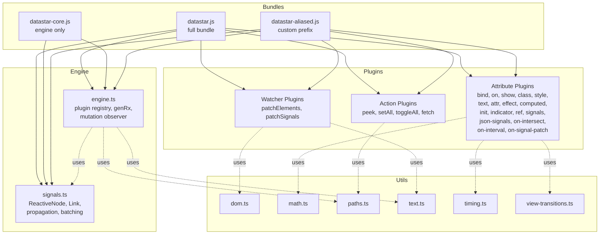
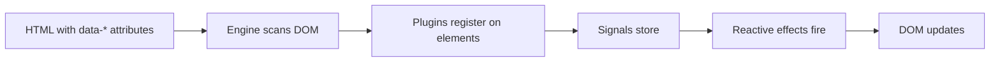

# Datastar -- Overview

## What Is Datastar

Datastar is a reactive frontend framework that lets you build interactive UIs using only HTML `data-*` attributes. Drop a single 11.80 KiB script into your HTML and start adding reactivity without any build step, JSX, or component framework.

```html
<script type="module" src="https://cdn.jsdelivr.net/gh/starfederation/datastar@v1.0.1/bundles/datastar.js"></script>
<input data-bind:title />
<div data-text="$title.toUpperCase()"></div>
<button data-on:click="@post('/endpoint')">Save</button>
```

Underneath the simple API shape lies a sophisticated architecture: a fine-grained reactive signal system with lazy propagation and diamond dependency resolution, a DOM morphing algorithm that preserves component state across patches, and an SSE-based streaming protocol that lets servers push DOM updates and signal patches directly to the browser.

**Aha:** Datastar looks like Alpine.js on the surface (declarative `data-*` attributes on HTML elements), but underneath it uses a Solid.js-style signal system with versioned dependency graphs and lazy dirty-checking. This gives you the developer experience of "just add attributes" with the runtime performance of fine-grained reactivity — no virtual DOM diffing needed.

Source: `library/src/bundles/datastar.js` — 11.80 KiB bundle

## Architecture at a Glance



## Three Layers

| Layer | What it does | Key files |
|-------|-------------|-----------|
| **Engine** | Plugin registration, DOM mutation observation, expression compilation (`genRx`) | `engine/engine.ts`, `engine/signals.ts`, `engine/consts.ts`, `engine/types.ts` |
| **Plugins** | Concrete behaviors — 4 actions, 17 attributes, 2 watchers | `plugins/actions/*.ts`, `plugins/attributes/*.ts`, `plugins/watchers/*.ts` |
| **Utils** | Case conversion, timing wrappers, math helpers, path utilities | `utils/*.ts` |

## Bundles

Datastar ships three pre-built bundles:

| Bundle | Purpose |
|--------|---------|
| `datastar.js` | Full bundle — engine + all plugins. Use this for most projects. |
| `datastar-core.js` | Engine only — just `signal()`, `computed()`, `effect()`, `beginBatch()`, `endBatch()`, and plugin registration APIs. Use this to build custom plugin sets. |
| `datastar-aliased.js` | Same as `datastar.js` but with a custom `data-*` prefix (e.g., `data-myapp-*` instead of `data-*`). The `ALIAS` global is set at build time via esbuild `define`. |

## Quick Start Mental Model



1. **Scan**: Engine walks the DOM looking for `data-*` attributes
2. **Register**: Each attribute plugin claims elements matching its `data-*` pattern
3. **Compile**: Attribute expressions are compiled to JS Functions via `genRx`
4. **Execute**: Effects run, signals react, DOM updates

See [Architecture](01-architecture.md) for the full module dependency graph.
See [Reactive Signals](02-reactive-signals.md) for the signal system deep dive.
