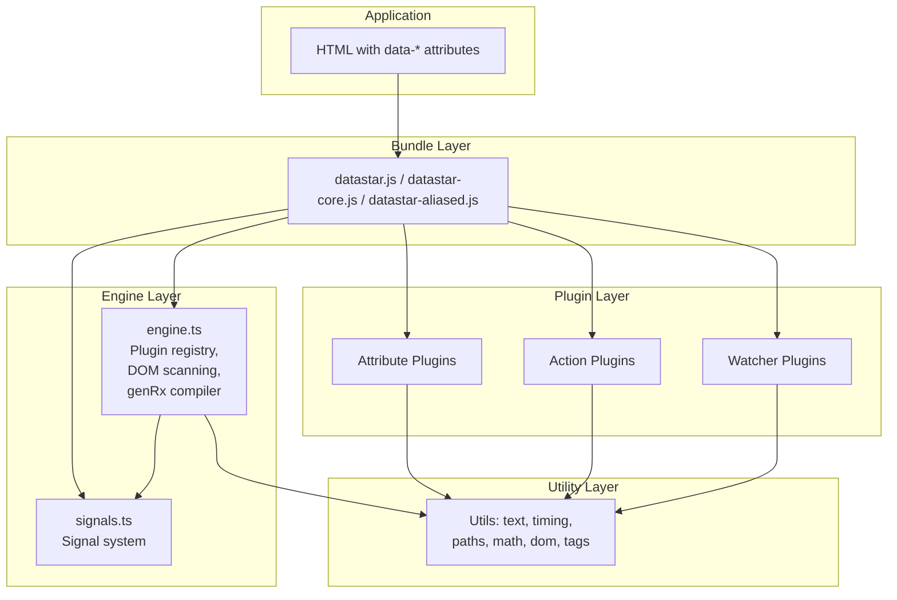
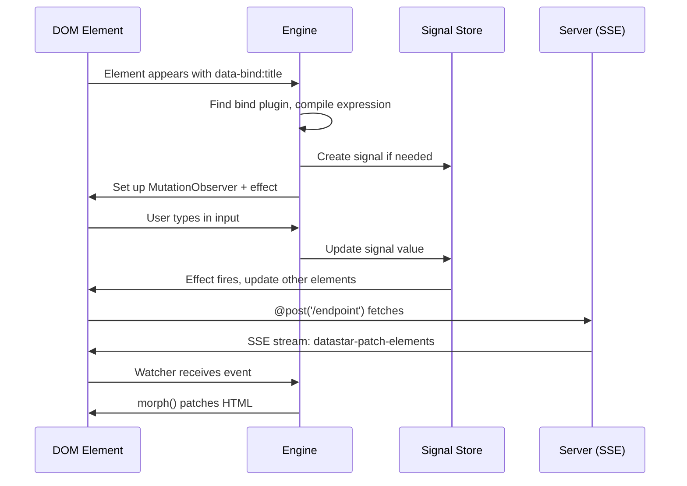

# Datastar -- Architecture

## Module Dependency Graph

Datastar's source is organized into four top-level directories under `library/src/`:

```
library/src/
├── engine/          # Core engine (4 files)
│   ├── engine.ts    # Plugin registration, genRx compiler, mutation observer (551 lines)
│   ├── signals.ts   # Reactive signal system (781 lines)
│   ├── consts.ts    # Delimiters, event names
│   └── types.ts     # Full TypeScript surface (137 lines)
├── plugins/         # Behavior plugins (23 files)
│   ├── actions/     # 4 action plugins: fetch, peek, setAll, toggleAll
│   ├── attributes/  # 17 attribute plugins: attr, bind, class, computed,
│   │                #   effect, indicator, init, jsonSignals, on, onIntersect,
│   │                #   onInterval, onSignalPatch, ref, show, signals, style, text
│   └── watchers/    # 2 watcher plugins: patchElements, patchSignals
├── utils/           # Shared utilities (8 files)
│   ├── dom.ts        # Type guard: isHTMLOrSVG
│   ├── math.ts       # clamp, lerp, inverseLerp, fit
│   ├── paths.ts      # isPojo, isEmpty, updateLeaves, pathToObj
│   ├── polyfills.ts  # Object.hasOwn polyfill
│   ├── tags.ts       # tagToMs, tagHas, tagFirst
│   ├── text.ts       # kebab, camel, snake, pascal, jsStrToObject, aliasify
│   ├── timing.ts     # delay, throttle, modifyTiming
│   └── view-transitions.ts  # modifyViewTransition
├── bundles/          # Pre-built entry points (3 files)
│   ├── datastar.ts       # Full bundle
│   ├── datastar-core.ts  # Engine only
│   └── datastar-aliased.ts  # Custom prefix
└── globals.d.ts     # declare const ALIAS: string | null
```

## Layer Diagram



## Entry Points and Initialization

When `datastar.js` loads, module-level side effects do all the work:

```typescript
// bundles/datastar.ts
import '@plugins/actions/peek'
import '@plugins/actions/setAll'
import '@plugins/actions/toggleAll'
import '@plugins/actions/fetch'
import '@plugins/attributes/attr'
import '@plugins/attributes/bind'
// ... all 17 attribute plugins
import '@plugins/watchers/patchElements'
import '@plugins/watchers/patchSignals'
```

Each plugin file calls `action()`, `attribute()`, or `watcher()` at module load time. These registration functions (defined in `engine.ts:316-324`) add the plugin to a `Map<string, Plugin>`:

```typescript
// engine/engine.ts:316-324
const actionPlugins = new Map<string, ActionPlugin>()
const attributePlugins = new Map<string, AttributePlugin>()
const watcherPlugins = new Map<string, WatcherPlugin>()

export const action = (plugin: ActionPlugin) => actionPlugins.set(plugin.name, plugin)
export const attribute = (plugin: AttributePlugin) => attributePlugins.set(plugin.name, plugin)
export const watcher = (plugin: WatcherPlugin) => watcherPlugins.set(plugin.name, plugin)
```

**Aha:** There is no `Datastar.create()` or `app.mount()` call. The framework auto-initializes purely through ES module side effects — each plugin file registers itself when imported. This means the bundle file IS the configuration: import only the plugins you need, and the engine only knows about those.

## DOM Scanning

The engine uses a `MutationObserver` to watch the document for new elements with `data-*` attributes. When an element appears, the engine:

1. Walks all attributes on the element
2. Matches each attribute name against registered plugin names (handling both `data-{name}` and `data-{name}:key` patterns)
3. Calls the plugin's `apply()` function with the element, compiled expression, and modifiers
4. When the element is removed from the DOM, the engine calls the cleanup function returned by `apply()`

## Communication Patterns



## Constants and Delimiters

```typescript
// engine/consts.ts
const lol = /🖕JS_DS🚀/.source
export const DSP = lol.slice(0, 5)  // "🖕JS" — expression prefix
export const DSS = lol.slice(4)     // "S🚀" — expression suffix
export const DATASTAR_FETCH_EVENT = 'datastar-fetch'
export const DATASTAR_PROP_CHANGE_EVENT = 'datastar-prop-change'
export const DATASTAR_READY_EVENT = 'datastar-ready'
export const DATASTAR_SCOPE_CHILDREN_EVENT = 'datastar-scope-children'
export const DATASTAR_SIGNAL_PATCH_EVENT = 'datastar-signal-patch'
```

**Aha:** The expression delimiters `DSP` and `DSS` use emoji characters (`🖕JS` and `S🚀`) extracted from a regex source. This is deliberately obscure — the chances of these character sequences appearing in user content are essentially zero, making them perfect sentinel markers for expression extraction and re-injection.

See [Reactive Signals](02-reactive-signals.md) for the signal system.
See [Expression Compiler](03-expression-compiler.md) for how genRx compiles data-* values.
See [Plugin System](04-plugin-system.md) for how plugins register and execute.
