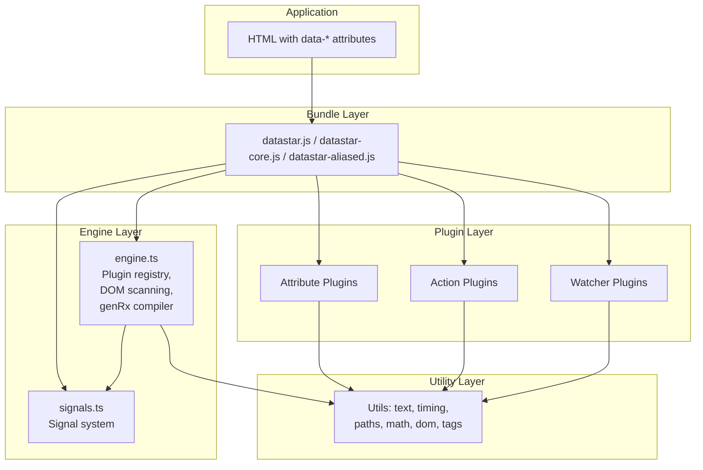
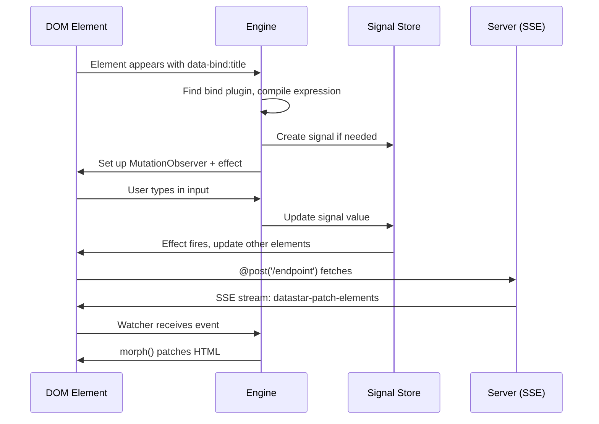

# Datastar -- Architecture

## Module Dependency Graph

Datastar's source is organized into four top-level directories under `library/src/`:

```
library/src/
├── engine/          # Core engine (4 files)
│   ├── engine.ts    # Plugin registration, genRx compiler, mutation observer (551 lines)
│   ├── signals.ts   # Reactive signal system (781 lines)
│   ├── consts.ts    # Delimiters, event names (9 lines)
│   └── types.ts     # Full TypeScript surface (136 lines)
├── plugins/         # Behavior plugins (23 files)
│   ├── actions/     # 4 action plugins: fetch, peek, setAll, toggleAll
│   ├── attributes/  # 17 attribute plugins: attr, bind, class, computed,
│   │                #   effect, indicator, init, jsonSignals, on, onIntersect,
│   │                #   onInterval, onSignalPatch, ref, show, signals, style, text
│   └── watchers/    # 2 watcher plugins: patchElements, patchSignals
├── utils/           # Shared utilities (8 files)
│   ├── dom.ts        # Type guard: isHTMLOrSVG
│   ├── math.ts       # clamp, lerp, inverseLerp, fit
│   ├── paths.ts      # isPojo, isEmpty, updateLeaves, pathToObj
│   ├── polyfills.ts  # Object.hasOwn polyfill
│   ├── tags.ts       # tagToMs, tagHas, tagFirst
│   ├── text.ts       # kebab, camel, snake, pascal, jsStrToObject, aliasify
│   ├── timing.ts     # delay, throttle, modifyTiming
│   └── view-transitions.ts  # modifyViewTransition
├── bundles/          # Pre-built entry points (3 files)
│   ├── datastar.ts       # Full bundle
│   ├── datastar-core.ts  # Engine only
│   └── datastar-aliased.ts  # Custom prefix
└── globals.d.ts     # declare const ALIAS: string | null
```

## Layer Diagram



## Bundle Entry Points

Three bundles exist, each with different import sets:

### Full Bundle (`datastar.ts`)

```typescript
// bundles/datastar.ts
export { action, actions, attribute, watcher } from '@engine'
export { signal, computed, effect, root, getPath, mergePatch, ... } from '@engine/signals'

import '@plugins/actions/peek'
import '@plugins/actions/setAll'
import '@plugins/actions/toggleAll'
import '@plugins/actions/fetch'
// ... all 17 attribute plugins
import '@plugins/watchers/patchElements'
import '@plugins/watchers/patchSignals'
```

Imports and re-exports the engine API plus all plugins. Each `import` statement triggers a module-level side effect that registers the plugin.

### Core Bundle (`datastar-core.ts`)

```typescript
// bundles/datastar-core.ts
export { action, actions, attribute, watcher } from '@engine'
export { signal, computed, effect, root, getPath, mergePatch, ... } from '@engine/signals'
```

No plugins imported — just the engine and signal system. Use this when you want to selectively import only specific plugins.

### Aliased Bundle (`datastar-aliased.ts`)

```typescript
// bundles/datastar-aliased.ts
// Same as datastar.ts but with ALIAS global set
```

Identical to the full bundle but with a custom `ALIAS` global that prefixes all `data-*` attributes (e.g., `data-ds-bind` instead of `data-bind`).

**Aha:** There is no `Datastar.create()` or `app.mount()` call. The framework auto-initializes purely through ES module side effects — each plugin file registers itself when imported. This means the bundle file IS the configuration: import only the plugins you need, and the engine only knows about those.

## Plugin Registration — Line by Line

### The Three Maps (engine.ts:40-42)

```typescript
const actionPlugins: Map<string, ActionPlugin> = new Map()
const attributePlugins: Map<string, AttributePlugin> = new Map()
const watcherPlugins: Map<string, WatcherPlugin> = new Map()
```

Three module-level Maps store all registered plugins. The key is the plugin name (e.g., `"bind"`, `"on"`, `"fetch"`).

### The `actions` Proxy (engine.ts:44-56)

```typescript
export const actions: Record<string, (ctx: ActionContext, ...args: any[]) => any> =
  new Proxy({}, {
    get: (_, prop: string) => actionPlugins.get(prop)?.apply,
    has: (_, prop: string) => actionPlugins.has(prop),
    ownKeys: () => Reflect.ownKeys(actionPlugins),
    set: () => false,
    deleteProperty: () => false,
  })
```

**What:** A read-only Proxy that acts as a facade over `actionPlugins`. When you access `actions.peek`, it returns the `apply` function of the "peek" plugin. `set` and `deleteProperty` always return `false` — you can only register plugins via the `action()` function, not by direct assignment.

### Attribute Plugin Registration with Queue (engine.ts:66-87)

```typescript
const queuedAttributes: AttributePlugin[] = []
const queuedAttributeNames = new Set<string>()

export const attribute = <R extends Requirement, B extends boolean>(
  plugin: AttributePlugin<R, B>,
): void => {
  queuedAttributes.push(plugin as unknown as AttributePlugin)

  if (queuedAttributes.length === 1) {
    setTimeout(() => {
      for (const attribute of queuedAttributes) {
        queuedAttributeNames.add(attribute.name)
        attributePlugins.set(attribute.name, attribute)
      }
      queuedAttributes.length = 0
      const roots = observedRoots.size ? [...observedRoots] : [document.documentElement]
      for (const root of roots) {
        applyQueued(root, !observedRoots.has(root))
      }
      queuedAttributeNames.clear()
    })
  }
}
```

**Aha:** Attribute plugins are queued and registered in a `setTimeout(0)` rather than immediately. This means if multiple plugins are imported in the same tick, they all get registered together, and the DOM is scanned once after all of them are available. The `queuedAttributeNames` set is used during `applyAttributePlugin` to only apply newly-registered plugins when re-scanning.

### Action Plugin Registration (engine.ts:89-91)

```typescript
export const action = <T>(plugin: ActionPlugin<T>): void => {
  actionPlugins.set(plugin.name, plugin)
}
```

Actions register immediately — no queue needed.

### Watcher Registration and Event Dispatch (engine.ts:93-115)

```typescript
document.addEventListener(DATASTAR_FETCH_EVENT, ((
  evt: CustomEvent<DatastarFetchEvent>,
) => {
  const plugin = watcherPlugins.get(evt.detail.type)
  if (plugin) {
    plugin.apply(
      {
        error: error.bind(0, {
          plugin: { type: 'watcher', name: plugin.name },
          element: {
            id: (evt.target as Element).id,
            tag: (evt.target as Element).tagName,
          },
        }),
      },
      evt.detail.argsRaw,
    )
  }
}) as EventListener)

export const watcher = (plugin: WatcherPlugin): void => {
  watcherPlugins.set(plugin.name, plugin)
}
```

**What:** Watchers don't register a callback at registration time. Instead, there's a single global listener on `datastar-fetch` events. When an SSE stream dispatches a `datastar-fetch` event with `detail.type` matching a watcher name (e.g., `"datastar-patch-elements"`), the engine dispatches to that watcher's `apply` function. The `argsRaw` from the SSE event become the watcher's arguments.

## Removals Map — Cleanup Tracking (engine.ts:59)

```typescript
const removals = new Map<HTMLOrSVG, Map<string, Map<string, () => void>>>()
```

A three-level Map: Element → attribute name → cleanup name → cleanup function. When an element is removed from the DOM, all its cleanup functions are called. Structure:

```
removals:
  <div#foo> →
    "bind" → "attribute" → () => { observer.disconnect(); cleanup() }
    "on:click" → "attribute" → () => { el.removeEventListener(...) }
    "effect" → "attribute" → () => { cleanup() }
  <span#bar> → ...
```

## DOM Scanning — applyEls (engine.ts:135-152)

```typescript
const applyEls = (els: Iterable<HTMLOrSVG>, onlyNew?: boolean): void => {
  for (const el of els) {
    if (!shouldIgnore(el)) {
      const appliedKeys = new Set<string>()
      for (const key in el.dataset) {
        const attrKey = key.replace(/[A-Z]/g, '-$&').toLowerCase()
        appliedKeys.add(attrKey)
        applyAttributePlugin(el, attrKey, el.dataset[key]!, onlyNew)
      }
      for (const attr of Array.from(el.attributes)) {
        if (!attr.name.startsWith('data-')) continue
        const attrKey = attr.name.slice(5)
        if (appliedKeys.has(attrKey)) continue
        applyAttributePlugin(el, attrKey, attr.value, onlyNew)
      }
    }
  }
}
```

**What:** Iterates over elements, skipping those with `data-ignore` or `data-ignore__self` attributes. Two-pass attribute scanning:

1. **Dataset pass:** Uses `el.dataset` (camelCase keys). Converts `camelCase` to `kebab-case` via regex. This catches `data-bind-title` → `{ bindTitle: "title" }`.
2. **Attributes pass:** Scans all `data-*` attributes directly. Skips anything already handled by the dataset pass. This catches attributes that don't appear in `dataset` (e.g., those with invalid characters).

The `onlyNew` flag (used by `applyQueued`) skips applying plugins that were already registered before this scan.

## Ignore Logic (engine.ts:130-133)

```typescript
const aliasedIgnore = aliasify('ignore')
const aliasedIgnoreAttr = `[${aliasedIgnore}]`
const shouldIgnore = (el: HTMLOrSVG) =>
  el.hasAttribute(`${aliasedIgnore}__self`) || !!el.closest(aliasedIgnoreAttr)
```

An element is ignored if it has `data-ignore__self` or is a descendant of an element with `data-ignore`. The `__self` suffix means "ignore this element but not its children."

## MutationObserver Callback (engine.ts:154-203)

```typescript
const observe = (mutations: MutationRecord[]) => {
  for (const { type, target, attributeName, addedNodes, removedNodes } of mutations) {
    if (type === 'childList') {
      // Cleanup removed nodes
      for (const node of removedNodes) {
        if (isHTMLOrSVG(node)) {
          cleanupEls([node])
          cleanupEls(node.querySelectorAll<HTMLOrSVG>('*'))
        }
      }
      // Apply new nodes
      for (const node of addedNodes) {
        if (isHTMLOrSVG(node)) {
          applyEls([node])
          applyEls(node.querySelectorAll<HTMLOrSVG>('*'))
        }
      }
    } else if (type === 'attributes' && attributeName!.startsWith('data-')
        && isHTMLOrSVG(target) && !shouldIgnore(target)) {
      const rawAttrKey = attributeName!.slice(5)
      const key = unaliasify(rawAttrKey)
      if (!key) continue
      const value = target.getAttribute(attributeName!)
      if (value === null) {
        // Attribute removed — run cleanup
        const elCleanups = removals.get(target)
        if (elCleanups) {
          const attrCleanups = elCleanups.get(key)
          if (attrCleanups) {
            for (const cleanup of attrCleanups.values()) { cleanup() }
            elCleanups.delete(key)
          }
        }
      } else {
        // Attribute changed — re-apply plugin
        applyAttributePlugin(target, rawAttrKey, value)
      }
    }
  }
}
```

**What:** Three mutation types handled:

1. **childList (removed):** Calls `cleanupEls` on the removed node AND all its descendants. This ensures all effects, event listeners, and observers are torn down.
2. **childList (added):** Calls `applyEls` on the new node AND all its descendants. This applies plugins to the entire subtree.
3. **attributes:** If a `data-*` attribute changes, either cleanup (if removed) or re-apply (if changed).

## applyQueued vs apply (engine.ts:236-274)

```typescript
const applyQueued = (root, observeRoot = true): void => {
  if (isHTMLOrSVG(root)) { applyEls([root], true) }
  applyEls(root.querySelectorAll<HTMLOrSVG>('*'), true)
  if (observeRoot) {
    mutationObserver.observe(root, { subtree: true, childList: true, attributes: true })
    observedRoots.add(root)
    dispatchDatastarReady()
  }
}

export const apply = (root, observeRoot = true): void => {
  if (isHTMLOrSVG(root)) { applyEls([root]) }
  applyEls(root.querySelectorAll<HTMLOrSVG>('*'))
  if (observeRoot) {
    mutationObserver.observe(root, { subtree: true, childList: true, attributes: true })
    observedRoots.add(root)
    dispatchDatastarReady()
  }
}
```

**Difference:** `applyQueued` passes `onlyNew = true` to `applyEls`, meaning it only applies plugins that were just registered. `apply` applies ALL plugins to ALL elements. `apply` is the public API for manually applying Datastar to a specific element or root.

## applyAttributePlugin — Full Flow (engine.ts:280-386)

This is the heart of plugin execution:

```typescript
const applyAttributePlugin = (el, attrKey, value, onlyNew): void => {
  // 1. Unaliasify the key (handle custom prefixes)
  const rawKey = unaliasify(attrKey)
  if (!rawKey) return

  // 2. Parse the attribute key: pluginName, key, modifiers
  const { pluginName, key, mods } = parseAttributeKey(rawKey)

  // 3. Look up the plugin
  const plugin = attributePlugins.get(pluginName)
  const shouldApply = (!onlyNew || queuedAttributeNames.has(pluginName)) && !!plugin
  if (!shouldApply) return

  // 4. Build the context object
  const ctx = {
    el, rawKey, mods,
    error: error.bind(0, { plugin, element, expression }),
    key, value,
    loadedPluginNames: { actions: ..., attributes: ... },
    rx: undefined,
  } as AttributeContext

  // 5. Validate requirements (key/value must/denied/exclusive)
  // ... requirement checking logic ...

  // 6. Create the rx function (genRx) — cached per attribute
  if (valueProvided) {
    let cachedRx: GenRxFn
    ctx.rx = (...args) => {
      if (!cachedRx) {
        cachedRx = genRx(value, { returnsValue: plugin.returnsValue, argNames: plugin.argNames, cleanups })
      }
      return cachedRx(el, ...args)
    }
  }

  // 7. Call plugin.apply(ctx)
  const cleanup = plugin.apply(ctx)

  // 8. Store cleanup function
  if (cleanup) {
    cleanups.set('attribute', cleanup)
  }
  // ... store in removals Map ...
}
```

**Aha:** The `rx` function is lazily compiled — `genRx` is only called on the first invocation, not during registration. This means if an effect never fires (e.g., a hidden element), the expression is never compiled. The `cachedRx` closure ensures it's compiled exactly once per attribute.

## parseAttributeKey — Attribute Parsing (engine.ts:208-225)

```typescript
export const parseAttributeKey = (rawKey: string): {
  pluginName: string, key: string | undefined, mods: Modifiers
} => {
  const [namePart, ...rawModifiers] = rawKey.split('__')
  const [pluginName, key] = namePart.split(/:(.+)/)
  const mods: Modifiers = new Map()

  for (const rawMod of rawModifiers) {
    const [label, ...mod] = rawMod.split('.')
    mods.set(label, new Set(mod))
  }

  return { pluginName, key, mods }
}
```

**What:** Parses `data-on:click__delay.500ms.passive` into:
- `pluginName`: `"on"`
- `key`: `"click"`
- `mods`: `{"delay" => {"500ms"}, "passive" => {}}`

The `__` separator divides the plugin name from modifiers. The `:` separates the plugin name from its key. Modifiers use `.` for sub-tags (e.g., `delay.500ms`).

## Error Builder (engine.ts:24-38)

```typescript
const error = (ctx, reason, metadata = {}) => {
  Object.assign(metadata, ctx)
  const e = new Error()
  const r = snake(reason)
  const q = new URLSearchParams({ metadata: JSON.stringify(metadata) }).toString()
  const c = JSON.stringify(metadata, null, 2)
  e.message = `${reason}\nMore info: ${url}/${r}?${q}\nContext: ${c}`
  return e
}
```

**What:** Creates detailed error messages with a URL to the Datastar docs (`https://data-star.dev/errors/{snake_reason}?metadata=...`) and the full context as JSON. The `snake()` function converts the reason to snake_case for URL compatibility.

## datastar:ready Event (engine.ts:230-234)

```typescript
let datastarReadyDispatched = false
const dispatchDatastarReady = () => {
  if (datastarReadyDispatched || !isDocumentObserverActive()) return
  datastarReadyDispatched = true
  document.dispatchEvent(new Event(DATASTAR_READY_EVENT))
}
```

Dispatched once after the first `applyQueued` or `apply` call that observes the document. Subsequent calls are no-ops. Use `document.addEventListener('datastar-ready', ...)` to know when Datastar is fully initialized.

## genRx Expression Compiler (engine.ts:396-551)

The expression compiler is defined within `engine.ts`. See [Expression Compiler](03-expression-compiler.md) for full details. Briefly:

```typescript
export const genRx = (value, { returnsValue, argNames, cleanups }) => {
  // 1. Handle returnsValue: wrap last statement in `return (...)`
  // 2. Escape DSP/DSS sentinel-protected expressions
  // 3. Rewrite $foo.bar → $['foo']['bar'] (signal references)
  // 4. Rewrite ${...} template interpolation with signal references
  // 5. Rewrite @actionName( → __action("actionName",evt,
  // 6. Restore escaped sentinels
  // 7. Create Function('el', '$', '__action', 'evt', ...argNames, expr)
  // 8. Return a wrapper that passes (el, root, action, undefined, ...args)
}
```

The `Function` constructor creates a new function with parameters `el` (the element), `$` (the signal root), `__action` (action dispatcher), `evt` (event object), plus any plugin-specific `argNames`.

## Communication Patterns



## Constants and Delimiters

```typescript
// engine/consts.ts
const lol = /🖕JS_DS🚀/.source
export const DSP = lol.slice(0, 5)  // "🖕JS" — expression prefix
export const DSS = lol.slice(4)     // "S🚀" — expression suffix
export const DATASTAR_FETCH_EVENT = 'datastar-fetch'
export const DATASTAR_PROP_CHANGE_EVENT = 'datastar-prop-change'
export const DATASTAR_READY_EVENT = 'datastar-ready'
export const DATASTAR_SCOPE_CHILDREN_EVENT = 'datastar-scope-children'
export const DATASTAR_SIGNAL_PATCH_EVENT = 'datastar-signal-patch'
```

**Aha:** The expression delimiters `DSP` and `DSS` use emoji characters (`🖕JS` and `S🚀`) extracted from a regex source. This is deliberately obscure — the chances of these character sequences appearing in user content are essentially zero, making them perfect sentinel markers for expression extraction and re-injection. The `/.../.source` trick is used because directly embedding emoji in a string literal can cause encoding issues in some build pipelines.

## Utility System Overview

Each utility module handles a specific concern:

| Module | Functions | Purpose |
|--------|-----------|---------|
| `dom.ts` | `isHTMLOrSVG` | Type guard for HTMLElement/SVGElement/MathMLElement |
| `math.ts` | `clamp`, `lerp`, `inverseLerp`, `fit` | Numeric range transformations |
| `paths.ts` | `isPojo`, `isEmpty`, `updateLeaves`, `pathToObj` | Object/patch manipulation |
| `polyfills.ts` | `hasOwn` | `Object.hasOwn` polyfill for older browsers |
| `tags.ts` | `tagToMs`, `tagHas`, `tagFirst` | Modifier tag parsing (time, boolean, first value) |
| `text.ts` | `kebab`, `camel`, `snake`, `pascal`, `jsStrToObject`, `aliasify`, `unaliasify` | Case conversion, JSON parsing, attribute aliasing |
| `timing.ts` | `delay`, `throttle`, `modifyTiming` | Event timing wrappers (delay, debounce, throttle) |
| `view-transitions.ts` | `supportsViewTransitions`, `modifyViewTransition` | CSS View Transitions API integration |

### modifyTiming — Modifier-Aware Timing (timing.ts:47-74)

```typescript
export const modifyTiming = (callback, mods): EventCallbackHandler => {
  const delayArgs = mods.get('delay')
  if (delayArgs) { callback = delay(callback, tagToMs(delayArgs)) }

  const debounceArgs = mods.get('debounce')
  if (debounceArgs) {
    callback = throttle(callback, tagToMs(debounceArgs),
      tagHas(debounceArgs, 'leading', false),
      !tagHas(debounceArgs, 'notrailing', false), true)
  }

  const throttleArgs = mods.get('throttle')
  if (throttleArgs) {
    callback = throttle(callback, tagToMs(throttleArgs),
      !tagHas(throttleArgs, 'noleading', false),
      tagHas(throttleArgs, 'trailing', false))
  }

  return callback
}
```

**What:** Chains timing wrappers based on modifiers. Applied in order: delay → debounce → throttle. Each can coexist (though unusual). `debounce` is implemented as `throttle(..., debounce=true)` which cancels the previous timer on each call.

### throttle — Unified Timing Primitive (timing.ts:15-45)

```typescript
export const throttle = (callback, wait, leading = true, trailing = false, debounce = false) => {
  let lastArgs = null
  let timer = 0

  return (...args) => {
    if (leading && !timer) { callback(...args); lastArgs = null }
    else { lastArgs = args }
    if (!timer || debounce) {
      if (timer) clearTimeout(timer)
      timer = setTimeout(() => {
        if (trailing && lastArgs !== null) { callback(...lastArgs) }
        lastArgs = null; timer = 0
      }, wait)
    }
  }
}
```

**Aha:** A single `throttle` function implements both throttling AND debouncing. When `debounce = true`, the timer is reset on every call (`clearTimeout` then new `setTimeout`), which is the definition of debounce. When `debounce = false`, the timer only starts if not already running, which is throttling.

See [Reactive Signals](02-reactive-signals.md) for the signal system.
See [Expression Compiler](03-expression-compiler.md) for how genRx compiles data-* values.
See [Plugin System](04-plugin-system.md) for how plugins register and execute.
