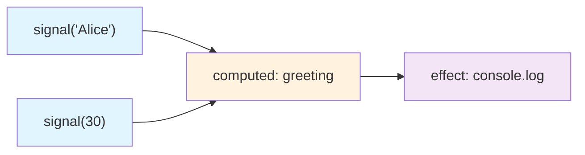
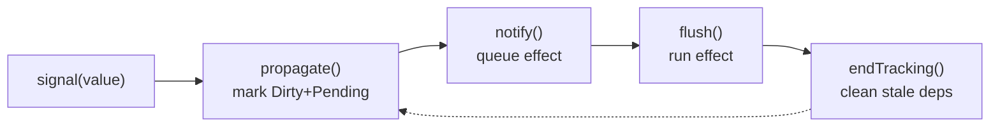
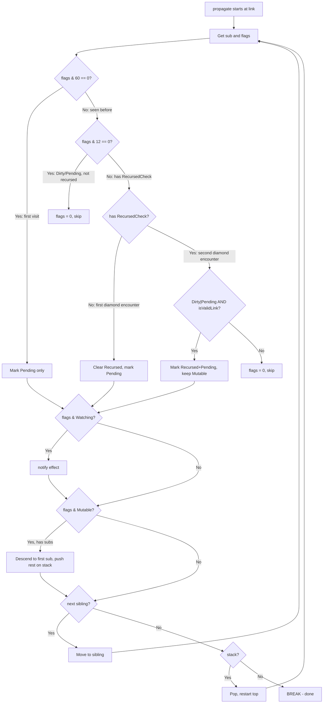
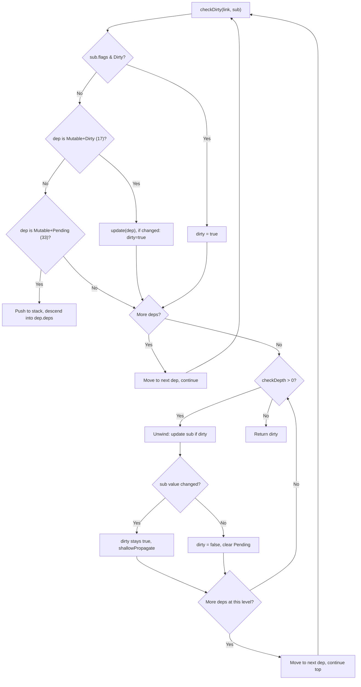

# Datastar -- Reactive Signals

The signal system in `engine/signals.ts` (781 lines) is the heart of Datastar. It implements fine-grained reactivity: instead of re-rendering a virtual DOM on every change, individual DOM nodes update only when the specific signals they depend on change.

**Aha:** Datastar's signal system is built from *interfaces* and *module-level state*, not classes. ReactiveNode and Link are pure interfaces — all the state lives in module-level variables (`activeSub`, `version`, `batchDepth`, etc.) and the actual signal objects are minimal records with underscore-prefixed fields. Operations like `signal()`, `computed()`, and `effect()` return *bound functions*, not node instances. This keeps the runtime overhead per signal extremely low.

Source: `library/src/engine/signals.ts` — 781 lines

## Core Interfaces

### ReactiveNode

The fundamental building block. Every signal, computed value, and effect is a `ReactiveNode` — but it's an interface, not a class:

```typescript
// engine/signals.ts:14-20
interface ReactiveNode {
  deps_?: Link       // Head of dependency linked list (what I depend on)
  depsTail_?: Link   // Tail of dependency list (for O(1) appending)
  subs_?: Link       // Head of subscription list (what depends on me)
  subsTail_?: Link   // Tail of subscription list
  flags_: ReactiveFlags
}
```

**What each field means at runtime:**

| Field | Type | Purpose |
|-------|------|---------|
| `deps_` | `Link \| undefined` | Pointer to the FIRST link in my dependency chain. Walk `nextDep_` to visit everything I read. |
| `depsTail_` | `Link \| undefined` | Pointer to the LAST link in my dependency chain. Used by `link()` for O(1) fast-path insertion and by `endTracking()` to find stale links. |
| `subs_` | `Link \| undefined` | Pointer to the FIRST link in my subscription chain. Walk `nextSub_` to find everything that needs to know when I change. |
| `subsTail_` | `Link \| undefined` | Pointer to the LAST link in my subscription chain. Used by `link()` for fast-path checks. |
| `flags_` | `ReactiveFlags` | Bit-field encoding the node's state (Mutable, Watching, Dirty, Pending, RecursedCheck, Recursed). |

**Aha:** `ReactiveNode` has no `value_`, no `getter`, no `fn_`. It's a pure graph node — just edges and state. The actual data (value, computation function, effect function) lives in the specialized `Alien*` interfaces. This means the core propagation algorithm in `propagate()` and `unlink()` only ever touches `deps_`, `subs_`, and `flags_` — it doesn't care if a node is a signal, computed, or effect.

**How to distinguish node types at runtime:**

```typescript
// It's a computed if it has a getter:
'getter' in node  // → AlienComputed

// It's an effect if it has fn_ but no getter:
'fn_' in node && !('getter' in node)  // → AlienEffect

// It's a plain signal if it has previousValue:
'previousValue' in node  // → AlienSignal
```

This duck-typed detection is used throughout — e.g., `unlink()` cascade logic (line 339: `'getter' in dep_`), `update()` dispatch (line 144: `'getter' in signal`), `notify()` queuing.

### Link

A directed edge connecting a source (dependency) to a consumer (subscriber):

```typescript
// engine/signals.ts:22-30
interface Link {
  version_: number          // Global version at link creation
  dep_: ReactiveNode        // The source (producer)
  sub_: ReactiveNode        // The consumer
  prevSub_?: Link           // Previous link in source's sub list
  nextSub_?: Link           // Next link in source's sub list
  prevDep_?: Link           // Previous link in consumer's dep list
  nextDep_?: Link           // Next link in consumer's dep list
}
```

**Aha: One object serves as a node in TWO doubly-linked lists simultaneously.** This is the key insight. A single `Link` object is both:
1. A node in `dep_.subs_` — the subscription list of the source signal
2. A node in `sub_.deps_` — the dependency list of the consumer

This means there's no duplication — one `Link` object maintains four pointers (`prevSub_`, `nextSub_`, `prevDep_`, `nextDep_`) that stitch it into two independent doubly-linked lists. When the link is removed, it must be unspliced from both lists at once.

**Memory layout of a Link connecting signal A to computed B:**

```
Signal A (dep_)                          Computed B (sub_)
┌─────────────────────┐                  ┌─────────────────────┐
│ deps_:   null       │                  │ deps_:   ────────────┐
│ depsTail: null      │                  │ depsTail: ──────────┐│
│ subs_: ─────────────┼──┐              │ subs_:   null       ││
│ subsTail: ──────────┼──┐              │ subsTail: null      ││
│ flags_: Mutable     │  │              │ flags_: Dirty       ││
└─────────────────────┘  │              └─────────────────────┘
                         │
                    ┌────▼────┐
              ┌─────│  LINK   │─────┐
              │     └─────────┘     │
         prevSub_  version_: 42  prevDep_
         nextSub_: null  dep_: A  prevDep_: null
         nextDep_: null  sub_: B  nextDep_: null
```

The same Link object's `prevSub_`/`nextSub_` pointers link it into A's subscriber chain, while `prevDep_`/`nextDep_` link it into B's dependency chain.

**The `version_` field — stale link detection:**

Each time `startTracking()` is called, the global `version` counter increments. When `link()` creates or reuses a link, it sets `link.version_ = version`. During `endTracking()`, any link whose `version_` is older than the current global `version` is stale — the dependency was not read during this evaluation and should be removed. This avoids a full rebuild of the dependency graph on every re-evaluation.

**Field-by-field purpose:**

| Field | Used by | Purpose |
|-------|---------|---------|
| `version_` | `link()` fast paths, `endTracking()` | Detect stale links from previous evaluations |
| `dep_` | All algorithms | Navigate from a link to the source signal |
| `sub_` | All algorithms | Navigate from a link to the consumer |
| `prevSub_` | `link()`, `unlink()` | Previous node in dep's subscriber chain |
| `nextSub_` | `propagate()`, `unlink()` | Walk dep's subscriber chain during propagation |
| `prevDep_` | `link()`, `unlink()`, `isValidLink()` | Walk sub's dependency list backward |
| `nextDep_` | `link()`, `unlink()`, `checkDirty()` | Walk sub's dependency list forward |

### ReactiveFlags

```typescript
// engine/signals.ts:37-45
enum ReactiveFlags {
  None = 0,
  Mutable = 1 << 0,       // 0b000001 = 1
  Watching = 1 << 1,      // 0b000010 = 2
  RecursedCheck = 1 << 2, // 0b000100 = 4
  Recursed = 1 << 3,      // 0b001000 = 8
  Dirty = 1 << 4,         // 0b010000 = 16
  Pending = 1 << 5,       // 0b100000 = 32
}
```

**Flag usage by node type at creation:**

| Type | Initial flags | Binary | Why |
|------|--------------|--------|-----|
| `signal()` | `Mutable` (1) | `0b000001` | Plain signal — can be written to |
| `computed()` | `Mutable \| Dirty` (17) | `0b010001` | Needs initial evaluation |
| `effect()` | `Watching` (2) | `0b000010` | Execution target — `propagate()` queues it |

**Flag combinations used throughout the code:**

| Value | Flags | Where checked | Meaning |
|-------|-------|--------------|---------|
| `1` | `Mutable` | `unlink()` cascade | "This node is a plain signal" |
| `2` | `Watching` | `propagate()` line 393 | "This node is an effect, queue it" |
| `16` | `Dirty` | `signalOper`, `computedOper`, `run` | "Value is stale, re-evaluate" |
| `17` | `Mutable \| Dirty` | `checkDirty` line 460 | "Mutable node that needs re-eval" |
| `32` | `Pending` | `propagate()` line 363, `computedOper` | "Marked by propagation walk" |
| `33` | `Mutable \| Pending` | `checkDirty` line 471 | "Mutable node, might be dirty" |
| `48` | `Dirty \| Pending` | `propagate()` line 383 | "Already marked for re-eval" |
| `60` | `RecursedCheck \| Recursed \| Dirty \| Pending` | `propagate()` line 364 | "Any propagation-relevant flag" |
| `12` | `RecursedCheck \| Recursed` | `propagate()` line 375 | "Recursion detection flags" |
| `56` | `Recursed \| Dirty \| Pending` | `startTracking` line 432 | "Flags to clear before re-evaluation" |

**How each flag participates in the lifecycle:**

| Flag | Set by | Cleared by | Consumed by |
|------|--------|------------|-------------|
| `Mutable` | `signal()`, `updateSignal`, `unlink()` cascade | — (sticky for signals) | `propagate()`, `checkDirty` |
| `Watching` | `effect()` | `effectOper` | `propagate()`, `shallowPropagate` |
| `RecursedCheck` | `startTracking` | `endTracking` | `propagate()` diamond detection |
| `Recursed` | `propagate()` Case 4 | `propagate()` Case 3 | `propagate()` diamond detection |
| `Dirty` | `signalOper` SET, `unlink()` cascade, `shallowPropagate` | `startTracking`, computed re-eval | `signalOper` GET, `computedOper`, `run` |
| `Pending` | `propagate()` all cases | `endTracking`, `computedOper`, `checkDirty` unwind | `computedOper`, `checkDirty`, `run` |

### EffectFlags

```typescript
// engine/signals.ts:47-49
enum EffectFlags {
  Queued = 1 << 6,       // Scheduled for execution
}
```

### Specialized Interfaces

```typescript
// engine/signals.ts:51-63
interface AlienEffect extends ReactiveNode {
  fn_(): void
}

interface AlienComputed<T = unknown> extends ReactiveNode {
  value_?: T
  getter(previousValue?: T): T
}

interface AlienSignal<T = unknown> extends ReactiveNode {
  previousValue: T
  value_: T
}
```

**Concrete object shapes at runtime:**

**AlienSignal** — returned by `signal(42)`:
```typescript
{
  previousValue: 42,    // Stores the old value for change detection
  value_: 42,           // Current value
  flags_: 1,            // Mutable (1 << 0)
  deps_: undefined,     // Signals have no dependencies
  depsTail_: undefined,
  subs_: undefined,     // Populated when something reads this signal
  subsTail_: undefined,
}
```
Signals are leaf nodes — they have no `deps_` because they don't depend on anything. Their `subs_` list is populated when effects or computed values read them.

**AlienComputed** — returned by `computed(() => $name() + ' is ' + $age())`:
```typescript
{
  value_: undefined,    // Cached result (stale if Dirty flag is set)
  getter: (prev) => ...,  // The user-supplied computation function
  flags_: 17,           // Mutable | Dirty — starts dirty so it evaluates on first read
  deps_: ...,           // Links to signals it reads (e.g., $name, $age)
  depsTail_: ...,
  subs_: ...,           // Links to effects/computed that read this computed
  subsTail_: ...,
}
```
Computeds are intermediate nodes — they have both `deps_` (what they read) and `subs_` (what reads them). The `getter` receives the previous value to enable efficient updates.

**AlienEffect** — created by `effect(() => { el.textContent = $count() })`:
```typescript
{
  fn_: () => { ... },   // The user-supplied effect function
  flags_: 2,            // Watching (1 << 1)
  deps_: ...,           // Links to all signals/computed it read
  depsTail_: ...,
  subs_: undefined,     // Effects are leaf nodes in the subscription graph
  subsTail_: undefined,
}
```
Effects are consumers only — they have `deps_` (signals they read) but no `subs_` because nothing subscribes to an effect. The `Watching` flag marks them as execution targets for `propagate()` and `flush()`.

**How node type is detected at runtime (duck typing, no instanceof):**

| Check | Type | Where used |
|-------|------|------------|
| `'getter' in dep_` | AlienComputed | `unlink()` cascade (line 339), `update()` dispatch (line 144) |
| `'previousValue' in dep_` | AlienSignal | `unlink()` cascade (line 347) — "plain signals persist, no cleanup" |
| `!'previousValue' in dep_` (and no getter) | AlienEffect | `unlink()` cascade (line 347) — dispose the effect |
| `'fn_' in node` | AlienEffect | `notify()` type cast (line 173) |

### Stack<T> — Linked-List Stack (Not an Array)

```typescript
// engine/signals.ts:32-35
interface Stack<T> {
  value_: T
  prev_?: Stack<T>
}
```

**Aha:** This is NOT an array-based stack — it's a singly-linked list. Each push creates a new `Stack<T>` object with a `prev_` pointer to the previous top. This avoids array allocation and resizing in the tight propagation loop.

**Push:**
```typescript
stack = { value_: next, prev_: stack }
```
Creates a new Stack node whose `prev_` points to the current top, then replaces `stack`. O(1), no allocation beyond the single object.

**Pop:**
```typescript
link = stack.value_!
stack = stack.prev_
```
Extracts `value_`, then moves `stack` to `prev_`. The old Stack node becomes garbage.

**Used in two places:**

1. **`propagate()`** — `Stack<Link | undefined>` saves sibling subscribers when descending into a node's subscription chain. If a signal has subscribers A, B, C, the algorithm descends into A first and saves B and C on the stack. After A's branch is fully processed, it pops B and continues.

2. **`checkDirty()`** — `Stack<Link>` saves the caller's position when recursively descending into a dependency's own dependencies. After checking if a deeper source is dirty, it pops back to continue checking sibling dependencies.

The `undefined` in `Stack<Link | undefined>` for `propagate()` allows pushing a "null" slot — when the current node has only one subscriber (no siblings), the stack gets `{ value_: undefined, prev_: stack }` to maintain the depth counter, and when popped, the `if (link)` guard skips it.

## Module-Level State

The entire reactive system runs on these module-level variables (lines 65-72):

```typescript
// engine/signals.ts:65-72
const currentPatch: Paths = []                          // Accumulates path changes
const queuedEffects: (AlienEffect | undefined)[] = []   // Effects waiting to run
let batchDepth = 0                                      // Nested batch counter
let notifyIndex = 0                                     // Position in queuedEffects
let queuedEffectsLength = 0                             // Current queue length
let prevSub: ReactiveNode | undefined                   // Previous active subscriber
let activeSub: ReactiveNode | undefined                 // Current tracking context
let version = 0                                         // Global link version counter
```

**Aha:** There are no class instances holding state — the entire reactive system is driven by these 8 module-level variables plus the interfaces above. `activeSub` is the key: when a signal is read, it checks `activeSub` and links itself to whatever is currently tracking. This is how dependencies are discovered implicitly — no explicit `.subscribe()` calls needed.

**Detailed breakdown of each variable:**

| Variable | Type | Lifetime | Used by | Purpose |
|----------|------|----------|---------|---------|
| `currentPatch` | `Paths` (array of `[string, any]`) | Module-scope, cleared after each dispatch | `dispatch()`, `mergePatch` | Accumulates path changes during a batch. When the batch ends, `dispatch()` converts it to an object via `pathToObj()` and fires a DOM event. |
| `queuedEffects` | `(AlienEffect \| undefined)[]` | Module-scope, cleared after each `flush()` | `notify()`, `flush()` | Array-based queue of effects waiting to run. `undefined` slots indicate effects that have been consumed. |
| `batchDepth` | `number` | Module-scope | `beginBatch()`, `endBatch()`, `signalOper`, `dispatch` | Nested batch counter. `0` = no batch active. Incremented by `beginBatch()`, decremented by `endBatch()`. Only when reaching 0 do effects flush and patches dispatch. |
| `notifyIndex` | `number` | Reset to 0 after each `flush()` | `flush()` | Current position in `queuedEffects`. Advances as effects are executed. Allows `flush()` to resume if new effects are queued during execution. |
| `queuedEffectsLength` | `number` | Reset to 0 after each `flush()` | `notify()`, `flush()` | Number of valid effects in the queue. `notify()` increments this when adding. `flush()` reads this as the upper bound. |
| `prevSub` | `ReactiveNode \| undefined` | Transient — saved/restored by peeking | `startPeeking()`, `stopPeeking()` | Saves the previous `activeSub` during `startPeeking()`. Allows nested tracking contexts to restore the outer context when `stopPeeking()` is called. |
| `activeSub` | `ReactiveNode \| undefined` | Transient — set during tracking | `link()`, `signalOper`, `computedOper`, `effect()`, `updateComputed` | The current tracking context. When a signal is read and `activeSub` is set, the signal links itself to `activeSub`. This is the core of implicit dependency tracking. |
| `version` | `number` | Monotonically increasing | `startTracking()`, `link()`, `endTracking()` | Global version counter. Incremented each time `startTracking()` is called. Used to detect stale links — a link with `version_ < version` was not created during the current evaluation. |

**Why `queuedEffects` has `undefined` slots:**

```typescript
queuedEffects[notifyIndex++] = undefined  // Slot cleared before execution
```

When `flush()` starts executing an effect, it sets the slot to `undefined`. This prevents stale references — if the effect re-queues itself during execution, it goes into a new slot. The `undefined` value also allows the `while (notifyIndex < queuedEffectsLength)` loop to skip consumed slots.

**The peeking stack:**

`prevSub` and `activeSub` form a two-element stack for tracking contexts:
```
startPeeking(newSub):  prevSub = activeSub; activeSub = newSub   // push
stopPeeking():         activeSub = prevSub; prevSub = undefined  // pop
```

This is NOT a general-purpose stack — it only supports depth 1 nesting. If you call `startPeeking()` twice without `stopPeeking()`, the first context is lost. But this is intentional: `startPeeking` is always paired with `stopPeeking` in a try/finally block, so nesting is safe in practice.

## Creating Signals — Bound Operations

### signal() — Creates a bound setter/getter function

```typescript
// engine/signals.ts:95-101
export const signal = <T>(initialValue?: T): Signal<T> => {
  return signalOper.bind(0, {
    previousValue: initialValue,
    value_: initialValue,
    flags_: 1 satisfies ReactiveFlags.Mutable,
  }) as Signal<T>
}
```

**Aha:** `signal()` does NOT return a ReactiveNode — it returns `signalOper` bound to a minimal object. Calling the returned function with no arguments *reads* the value; calling it with an argument *sets* it. The binding avoids creating closures per signal.

### computed() — Creates a bound evaluator

```typescript
// engine/signals.ts:103-112
const computedSymbol = Symbol('computed')
export const computed = <T>(getter: (previousValue?: T) => T): Computed<T> => {
  const c = computedOper.bind(0, {
    flags_: 17 as ReactiveFlags.Mutable | ReactiveFlags.Dirty,
    getter,
  }) as Computed<T>
  // @ts-expect-error
  c[computedSymbol] = 1
  return c
}
```

`flags_: 17` = `Mutable | Dirty` — computed starts dirty so it evaluates on first read. The `computedSymbol` marker distinguishes computed nodes during cleanup.

### effect() — Creates a bound disposer with auto-tracking

```typescript
// engine/signals.ts:114-131
export const effect = (fn: () => void): Effect => {
  const e: AlienEffect = {
    fn_: fn,
    flags_: 2 satisfies ReactiveFlags.Watching,
  }
  if (activeSub) {
    link(e, activeSub)
  }
  startPeeking(e)
  beginBatch()
  try {
    e.fn_()
  } finally {
    endBatch()
    stopPeeking()
  }
  return effectOper.bind(0, e)
}
```

Effect immediately runs its function inside a tracking context (`startPeeking` + `beginBatch`). Any signals read during `fn()` automatically link to this effect. Returns a bound disposer function.

## The Dependency Graph



When `effect` runs, it calls `computed.greeting`, which reads both `signal('Alice')` and `signal(30)`. Each read triggers `signalOper`, which checks `activeSub` and calls `link(signal, activeSub)`. The bidirectional `Link` structure means:
- From effect → follow `deps_` → find computed → follow its `deps_` → find both signals
- From signal → follow `subs_` → find computed → follow its `subs_` → find effect

## Peeking — Read Without Subscribing

```typescript
// engine/signals.ts:85-93
export const startPeeking = (sub?: ReactiveNode): void => {
  prevSub = activeSub
  activeSub = sub
}

export const stopPeeking = (): void => {
  activeSub = prevSub
  prevSub = undefined
}
```

`startPeeking` replaces `activeSub` temporarily. Used by `effect()` to set itself as the tracking context, and by `updateComputed`/`updateSignal` so they don't accidentally subscribe to signals they're reading internally. `stopPeeking` restores the previous context.

## Batching

```typescript
// engine/signals.ts:74-83
export const beginBatch = (): void => {
  batchDepth++
}

export const endBatch = (): void => {
  if (!--batchDepth) {
    flush()
    dispatch()
  }
}
```

Nested batches increment `batchDepth`. Only when the outermost batch ends (`batchDepth` reaches 0) do effects flush and patches dispatch. This coalesces multiple signal changes into a single propagation cycle.

## The Four-Phase Cycle

Every signal change goes through four phases:



1. **SET** — `signalOper` detects a value change, calls `propagate()`
2. **MARK** — `propagate()` walks the sub graph, setting Dirty/Pending flags
3. **QUEUE** — `notify()` puts Watching effects into the queue
4. **RUN** — `flush()` executes each effect, which re-evaluates, calls `endTracking()` to clean up

The complexity lives in phases 2 and 4 — walking the graph correctly and handling diamond dependencies.

## link() — Line by Line (Lines 274-313)

Creates or reuses a bidirectional Link between a dependency and subscriber. Heavily optimized for the common case of sequential re-evaluation.

### Fast path: dep is already the tail (lines 275-278)

```typescript
const prevDep = sub.depsTail_
if (prevDep && prevDep.dep_ === dep) {
  return
}
```

**What:** The last dependency in the consumer's list IS this dep. No-op.

**Why:** During re-evaluation, signals are typically read in the same order. If the dep was just added, it's at the tail. This is O(1) for the common case.

### Second fast path: dep is next in line (lines 279-284)

```typescript
const nextDep = prevDep ? prevDep.nextDep_ : sub.deps_
if (nextDep && nextDep.dep_ === dep) {
  nextDep.version_ = version
  sub.depsTail_ = nextDep
  return
}
```

**What:** The dep is the next one after the tail. Update its version to the current global version and bump the tail. O(1).

**Why:** When a computed re-evaluates and reads its deps in the same order, they'll appear sequentially. This moves the tail forward without creating a new link — the version bump marks it as "still valid this round."

### Third fast path: already on source's sub side (lines 285-288)

```typescript
const prevSub = dep.subsTail_
if (prevSub && prevSub.version_ === version && prevSub.sub_ === sub) {
  return
}
```

**What:** The dep's last subscriber is this sub at the current version. No-op.

**Why:** Same logic as the dep-side check but from the source's perspective. Avoids creating duplicate links when the same dep-sub pair is encountered from different angles.

### Create new link (lines 289-312)

```typescript
const newLink =
  (sub.depsTail_ = dep.subsTail_ = {
    version_: version,
    dep_: dep,
    sub_: sub,
    prevDep_: prevDep,
    nextDep_: nextDep,
    prevSub_: prevSub,
  })
```

**What:** Create the Link object and assign it to both tails simultaneously. The JavaScript assignment chain `a = b = { ... }` evaluates right-to-left, so both `sub.depsTail_` and `dep.subsTail_` point to the same new object.

Then splice it into both doubly-linked lists:

```typescript
if (nextDep) { nextDep.prevDep_ = newLink }
if (prevDep) { prevDep.nextDep_ = newLink }
else { sub.deps_ = newLink }        // New head of dep list
if (prevSub) { prevSub.nextSub_ = newLink }
else { dep.subs_ = newLink }        // New head of sub list
```

**What:** Standard doubly-linked list insertion. The link appears in two lists:
- sub's dep list (what I depend on)
- dep's sub list (what depends on me)

**Aha:** The link function is heavily optimized for the common case — when the same signals are read in the same order during re-evaluation, it's O(1) with no allocation. It uses `version` to detect stale links vs. re-used ones, avoiding a full rebuild of the dependency graph on every re-evaluation.

## unlink() — Line by Line (Lines 315-352)

Removes a link from both doubly-linked lists and handles cascading cleanup when a node loses all subscribers.

### Extract all neighbors (lines 316-320)

```typescript
const dep_ = link.dep_
const prevDep_ = link.prevDep_
const nextDep_ = link.nextDep_
const nextSub_ = link.nextSub_
const prevSub_ = link.prevSub_
```

Save all pointers before modifying anything.

### Remove from consumer's dep list (lines 321-329)

```typescript
if (nextDep_) { nextDep_.prevDep_ = prevDep_ }
else { sub.depsTail_ = prevDep_ }    // Was tail, new tail is prev
if (prevDep_) { prevDep_.nextDep_ = nextDep_ }
else { sub.deps_ = nextDep_ }        // Was head, new head is next
```

Standard doubly-linked list removal for the dep side. Four pointer updates cover all edge cases: removing head, tail, middle, or the only element.

### Remove from source's sub list (lines 331-338)

```typescript
if (nextSub_) { nextSub_.prevSub_ = prevSub_ }
else { dep_.subsTail_ = prevSub_ }
if (prevSub_) { prevSub_.nextSub_ = nextSub_ }
else if (!(dep_.subs_ = nextSub_)) {
```

Same for the sub side. The `else if` chain is clever: if this was the last subscriber (no `prevSub_`, and `nextSub_` is also null), then `dep_.subs_ = nextSub_` assigns `undefined`, which is falsy — the `if` body executes because the dep now has zero subscribers.

### Cascade: dep lost all subscribers (lines 338-349)

```typescript
if ('getter' in dep_) {
  // It's a computed — mark Dirty and unlink all its deps
  let toRemove = dep_.deps_
  if (toRemove) {
    dep_.flags_ = 17 as Mutable | Dirty
    do { toRemove = unlink(toRemove, dep_) } while (toRemove)
  }
} else if (!('previousValue' in dep_)) {
  // It's an effect — dispose it
  effectOper(dep_ as AlienEffect)
}
// Plain signals: value persists, no cleanup needed
```

**What:** When a computed loses its last subscriber:
1. Mark it Dirty + Mutable (value is stale, needs re-eval if subscribed again)
2. Unlink all its dependencies recursively — each `unlink` call may trigger further cascading

When an effect loses its last subscriber: dispose it entirely via `effectOper`.

Plain signals retain their value — no cleanup needed since signals are the root data sources.

**Aha:** This is "lazy resource cleanup." A computed that nobody subscribes to doesn't need to stay connected to its sources. The resources release automatically through recursive unlinking. A computed can be garbage collected once all its links are removed.

## signalOper — Read/Write Operation

This is the function bound to every signal. Calling a signal with no args reads it; calling it with an arg sets it. The same function handles both via the `value` rest parameter.

```typescript
// engine/signals.ts:211-239
const signalOper = <T>(s: AlienSignal<T>, ...value: [T]): T | boolean => {
  if (value.length) {
    // SET path
    if (s.value_ !== (s.value_ = value[0])) {
      s.flags_ = 17 as ReactiveFlags.Mutable | ReactiveFlags.Dirty
      const subs = s.subs_
      if (subs) {
        propagate(subs)
        if (!batchDepth) {
          flush()
        }
      }
      return true
    }
    return false
  }
  // GET path
  const currentValue = s.value_
  if (s.flags_ & (16 satisfies ReactiveFlags.Dirty)) {
    if (updateSignal(s, currentValue)) {
      const subs_ = s.subs_
      if (subs_) {
        shallowPropagate(subs_)
      }
    }
  }
  if (activeSub) {
    link(s, activeSub)
  }
  return currentValue
}
```

### SET Path — Lines 212-224

**The assignment-then-compare trick:**
```typescript
if (s.value_ !== (s.value_ = value[0])) {
```
This is a single expression that:
1. Assigns `value[0]` to `s.value_`
2. Compares the OLD `s.value_` (left side) against the NEW `s.value_` (right side, result of assignment)
3. Only enters the if-block if the value actually changed

**Aha:** This avoids a separate "compare old vs new" step — the assignment happens inline, and the comparison uses the pre-assignment value from the left side. If `s.value_` was `42` and `value[0]` is `42`, the assignment still happens but the comparison is `42 !== 42` → `false`, so propagation is skipped entirely.

**When the value changes (line 213-221):**
```typescript
s.flags_ = 17 as ReactiveFlags.Mutable | ReactiveFlags.Dirty
```
Resets flags to `Mutable | Dirty` (17 = `0b010001`). This clears any `Pending`, `Recursed`, or `Watching` flags that might have been set during previous propagation cycles — the signal is now a clean source of truth that needs propagation.

```typescript
const subs = s.subs_
if (subs) { propagate(subs) }
```
If anything subscribes to this signal, start propagation from the first subscriber link. `propagate()` walks the entire subscriber tree iteratively.

```typescript
if (!batchDepth) { flush() }
```
If we're not inside a nested batch, immediately flush queued effects. This ensures that a standalone `signal(value)` call triggers all downstream effects synchronously. But if `batchDepth > 0`, the flush is deferred — the caller will call `endBatch()` which triggers it.

**Return value:** Returns `true` if the value changed (propagation occurred), `false` if it was the same value (no-op).

### GET Path — Lines 225-238

**Step 1: Snapshot current value (line 225)**
```typescript
const currentValue = s.value_
```
This reads `s.value_` directly — NOT through any getter or trap. It's the raw cached value.

**Step 2: Lazy re-evaluation check (lines 226-233)**
```typescript
if (s.flags_ & (16 satisfies ReactiveFlags.Dirty)) {
  if (updateSignal(s, currentValue)) {
    const subs_ = s.subs_
    if (subs_) { shallowPropagate(subs_) }
  }
}
```
If the signal is Dirty, re-run `updateSignal` to confirm the value truly changed (not just flagged dirty but same value). `updateSignal` resets the `Mutable` flag and compares `previousValue` to the new value. If the value did change, `shallowPropagate` marks direct subscribers as Dirty — but only direct ones, not the full tree. Full propagation happens later when `flush()` runs effects.

**Aha:** The GET path can trigger propagation! If a signal is Dirty when read, it re-evaluates and marks subscribers. This is different from the SET path which calls `propagate()` (full tree walk). The GET path uses `shallowPropagate()` because the full propagation will happen when effects are flushed — the GET is just ensuring the signal's own value is up to date before returning it.

**Step 3: Dependency tracking (lines 234-236)**
```typescript
if (activeSub) { link(s, activeSub) }
```
If `activeSub` is set (we're inside an effect or computed), create a link from this signal to the active subscriber. This is how dependencies are discovered implicitly — reading a signal inside a tracking context automatically subscribes.

**Return value:** Returns the current value (the signal's data, not a boolean).

### Why signals don't have `getter` or `fn_`

Plain signals are data sources — they don't compute anything. They have `value_` and `previousValue` for change detection. Computed values have `getter` because they need to re-evaluate. Effects have `fn_` because they need to execute. The `signalOper` function is the simplest of the three operations because signals are the simplest node type.

## computedOper — Lazy Evaluation

This is the function bound to every computed. Unlike `signalOper`, it takes no arguments — it's always a getter.

```typescript
// engine/signals.ts:241-260
const computedOper = <T>(c: AlienComputed<T>): T => {
  const flags = c.flags_
  if (
    flags & (16 satisfies ReactiveFlags.Dirty) ||
    (flags & (32 satisfies ReactiveFlags.Pending) && checkDirty(c.deps_!, c))
  ) {
    if (updateComputed(c)) {
      const subs = c.subs_
      if (subs) {
        shallowPropagate(subs)
      }
    }
  } else if (flags & (32 satisfies ReactiveFlags.Pending)) {
    c.flags_ = flags & ~(32 satisfies ReactiveFlags.Pending)
  }
  if (activeSub) {
    link(c, activeSub)
  }
  return c.value_!
}
```

### The decision tree — three possible states when a computed is read

**State 1: Dirty** — `flags & Dirty` is true
```typescript
flags & (16 satisfies ReactiveFlags.Dirty)
```
The computed's value is definitely stale. This happens when:
- It was just created (flags start as `Mutable | Dirty` = 17)
- A direct dependency was set to a new value
- `shallowPropagate` marked it Dirty after a dependency changed

→ Proceed to `updateComputed()` — re-evaluate unconditionally.

**State 2: Pending but not Dirty** — `flags & Pending && checkDirty(...)` 
```typescript
flags & (32 satisfies ReactiveFlags.Pending) && checkDirty(c.deps_!, c)
```
The computed was marked Pending by `propagate()` but not Dirty. This means an upstream signal changed, but we haven't confirmed whether it actually affects THIS computed's value yet. `checkDirty()` is the expensive lazy walk of the dependency tree to confirm.

**Aha:** `checkDirty` is only called when Pending-but-not-Dirty. If a computed is Dirty, re-evaluation happens immediately without the expensive walk. If it's clean (neither Dirty nor Pending), the cached value is returned instantly. This is the core of Datastar's lazy evaluation — work is deferred until the computed is actually read.

**State 3: Clean** — neither Dirty nor Pending
Neither condition matches. The cached `c.value_` is still valid. Skip re-evaluation entirely.

### After the condition check

**If re-evaluation happened (lines 247-252):**
```typescript
if (updateComputed(c)) {
  const subs = c.subs_
  if (subs) { shallowPropagate(subs) }
}
```
`updateComputed()` returns `true` only if the computed's value actually changed. If it did, `shallowPropagate` marks direct subscribers as Dirty. If the getter returned the same value as before (e.g., `firstName + ' ' + lastName` where only middleName changed but middleName isn't used), propagation is skipped — downstream effects won't re-run because nothing changed.

**If Pending but NOT dirty (lines 253-255):**
```typescript
else if (flags & (32 satisfies ReactiveFlags.Pending)) {
  c.flags_ = flags & ~(32 satisfies ReactiveFlags.Pending)
}
```
`checkDirty` returned false — no dependency actually changed. Clear the Pending flag since we now know the value is clean.

### Final step — dependency tracking (lines 256-258)
```typescript
if (activeSub) { link(c, activeSub) }
```
Same as `signalOper` — if we're inside a tracking context, link this computed to the active subscriber. This allows computed-to-computed chains.

**Return value:** Always returns `c.value_!` — the cached (and possibly just re-evaluated) value.

### computedOper vs signalOper — comparison

| Aspect | signalOper (GET) | computedOper |
|--------|-----------------|--------------|
| Dirty check | `flags & Dirty` | Same |
| Re-evaluation | `updateSignal()` — trivial, just flags | `updateComputed()` — runs the getter |
| Pending check | No (signals are never Pending) | Yes — calls `checkDirty()` |
| shallowPropagate | Only if `updateSignal` returns true | Only if `updateComputed` returns true |
| `checkDirty` call | Never | Only when Pending but not Dirty |
| Cost when clean | O(1) — just return `value_` | O(1) — just return `value_` |
| Cost when dirty | O(1) — `updateSignal` is trivial | O(getter) — runs the user function |

## effectOper — Effect Disposal

This function is barely mentioned elsewhere but is critical. It's the disposer returned by `effect()` — calling it tears down the effect completely.

```typescript
// engine/signals.ts:262-272
const effectOper = (e: AlienEffect): void => {
  let dep = e.deps_
  while (dep) {
    dep = unlink(dep, e)
  }
  const sub = e.subs_
  if (sub) {
    unlink(sub)
  }
  e.flags_ = 0 satisfies ReactiveFlags.None
}
```

### What it does, step by step

**Step 1: Unlink all dependencies (lines 263-266)**
```typescript
let dep = e.deps_
while (dep) {
  dep = unlink(dep, e)
}
```
Walk the effect's dependency chain and unlink each one. `unlink()` returns `nextDep_` (the next link in the chain), so the loop naturally progresses through the list. Each `unlink()` call:
1. Removes the link from the dependency's `subs_` list (so the signal stops tracking this effect)
2. Removes the link from the effect's `deps_` list
3. May trigger cascade cleanup — if a computed loses its last subscriber, it unlinks from its own sources

**Aha:** The cascade is important. If an effect was the ONLY subscriber to a computed value, disposing the effect causes that computed to `unlink` from its own dependencies. Those dependencies may be other computed values, which also lose their last subscriber and unlink recursively. A single `dispose()` call can tear down a large portion of the reactive graph.

**Step 2: Unlink all subscriptions (lines 267-269)**
```typescript
const sub = e.subs_
if (sub) {
  unlink(sub)
}
```
Effects normally don't have subscribers (they're leaf nodes), but this is a safety measure. If something did subscribe to this effect, unlink it.

**Step 3: Zero out flags (line 271)**
```typescript
e.flags_ = 0 satisfies ReactiveFlags.None
```
Clear all flags — the effect is no longer `Watching`, `Dirty`, `Pending`, or anything. It's inert.

### What it does NOT do

- It does NOT remove the effect from `queuedEffects`. If the effect was already queued but not yet flushed, it will still try to run. The `run()` function handles this gracefully because the flags are zeroed — `run()` checks `flags & Dirty` and `flags & Pending`, both of which are now false.
- It does NOT free the `AlienEffect` object. JavaScript's GC handles that once there are no references.
- It does NOT cancel any in-progress DOM operations. If the effect's `fn_` was mutating the DOM, that mutation completes — only future runs are prevented.

### When it's called

1. **Manual disposal:** The return value of `effect()` is a disposer — calling it invokes `effectOper`:
   ```typescript
   const dispose = effect(() => { ... })
   dispose()  // → effectOper(e)
   ```

2. **Cascade from `unlink()`:** When a computed loses its last subscriber, `unlink()` detects this and calls `effectOper` if the dep is an effect (line 347: `else if (!('previousValue' in dep_))`).

3. **Attribute plugin cleanup:** When a DOM element with a `data-*` attribute is removed, the plugin's cleanup function calls the effect's disposer, which calls `effectOper`.

### effectOper vs unlink() — the difference

| | `unlink(link, sub)` | `effectOper(e)` |
|---|---|---|
| Scope | Removes ONE link from both lists | Removes ALL links + zeroes flags |
| Cascade | May trigger cascade (computed → its deps) | Calls `unlink()` in a loop |
| Purpose | Incremental graph surgery | Total disposal |
| Returns | Next link (for iteration) | Nothing |
| Reversible | Yes, `link()` can create a new one | No, effect is dead |

## Tracking — startTracking / endTracking

Before an effect or computed runs, `startTracking` prepares for new dependency discovery:

```typescript
// engine/signals.ts:427-437
const startTracking = (sub: ReactiveNode): void => {
  version++
  sub.depsTail_ = undefined
  sub.flags_ = (sub.flags_ & ~(56 as Recursed | Dirty | Pending)) | RecursedCheck
}
```

Increments the global `version`, resets the dependency tail, and sets `RecursedCheck` flag. As the function runs, new links are created with the current `version`.

After the function completes, `endTracking` removes stale links:

```typescript
// engine/signals.ts:439-446
const endTracking = (sub: ReactiveNode): void => {
  const depsTail_ = sub.depsTail_
  let toRemove = depsTail_ ? depsTail_.nextDep_ : sub.deps_
  while (toRemove) {
    toRemove = unlink(toRemove, sub)
  }
  sub.flags_ &= ~(4 satisfies ReactiveFlags.RecursedCheck)
}
```

Any links with a version older than the current one are stale — the dependency was no longer read during this evaluation. `endTracking` walks from `depsTail_.nextDep_` (everything after the last valid link) and unlinks each one.

## propagate() — Line by Line (Lines 354-425)

This is the most complex function. It walks the subscription graph iteratively (no recursion), handling diamond dependencies through bit-flag state machines.

### Function signature and setup

```typescript
// Line 354-356
const propagate = (link: Link): void => {
  let next = link.nextSub_
  let stack: Stack<Link | undefined> | undefined
```

**What:** `propagate()` starts at a specific Link (the first subscriber to the changed signal). `next` is the next sibling subscriber to visit after the current branch. `stack` is the DFS stack for when a node has multiple subscribers.

**Why iterative instead of recursive:** TypeScript/JS has limited stack depth. A large signal graph could blow the stack. The manual `Stack<T>` linked list avoids this.

### The top loop (line 358)

```typescript
top: while (true) {
  const sub = link.sub_      // The node we're propagating TO
  let flags = sub.flags_     // Snapshot its current flags
```

The `top:` label is used later (`continue top`) to restart the outer loop after popping from the stack.

### Case 1: First time visiting this node (lines 363-373)

```typescript
if (
  !(flags & (60 as RecursedCheck | Recursed | Dirty | Pending))
) {
  sub.flags_ = flags | (32 satisfies ReactiveFlags.Pending)
}
```

**What:** If NONE of the four flags are set (60 = `0b111100`), this node hasn't been seen in this propagation cycle yet. Just mark it `Pending`.

**Why:** The first visit to any node is trivial — it hasn't been dirtied, recursed, or marked. Just set `Pending` to say "we'll need to check this later."

The flag 60 = `RecursedCheck(4) | Recursed(8) | Dirty(16) | Pending(32)` = `0b111100`.

### Case 2: Not RecursedCheck and not Recursed (lines 374-377)

```typescript
else if (
  !(flags & (12 as RecursedCheck | Recursed))
) {
  flags = 0 satisfies ReactiveFlags.None
}
```

**What:** If it HAS one of the four flags (we didn't take Case 1), but neither `RecursedCheck` nor `Recursed` is set... this means it's Dirty or Pending but NOT in a diamond situation. Set `flags = 0` to skip further processing.

**Why:** This is a "re-entry" check. If we see a node that's Dirty/Pending but not marked as recursed, it means we already processed it and there's nothing new to do. The flags were already set by a previous path.

### Case 3: Has RecursedCheck but NOT Recursed (lines 378-381)

```typescript
else if (!(flags & (4 satisfies ReactiveFlags.RecursedCheck))) {
  sub.flags_ =
    (flags & ~(8 satisfies ReactiveFlags.Recursed)) |
    (32 satisfies ReactiveFlags.Pending)
}
```

**What:** `RecursedCheck` is set (this node is currently being checked for a diamond), but `Recursed` is NOT set (we haven't processed it as a diamond yet). Clear `Recursed` and mark `Pending`.

**Why:** This is the **first encounter** within a diamond check. The `RecursedCheck` flag means `startTracking` was called on this node (or it's in the middle of evaluation). We clear any stale `Recursed` flag and mark it `Pending`.

### Case 4: Has BOTH RecursedCheck AND Recursed — the diamond case (lines 382-388)

```typescript
else if (
  !(flags & (48 as Dirty | Pending)) &&
  isValidLink(link, sub)
) {
  sub.flags_ = flags | (40 as Recursed | Pending)
  flags &= 1 satisfies ReactiveFlags.Mutable
}
```

**What:** Both recursion flags are set (we've already visited this node in this cycle), AND it's not already Dirty or Pending, AND the link is still valid. Mark it `Recursed | Pending`. Then `flags &= Mutable` — if the node is a plain signal (Mutable), keep that flag; otherwise zero it out.

**Why:** This is the **second encounter** in a diamond. We reach the same computed/effect through a different path. `isValidLink()` confirms the link through which we arrived is still part of the consumer's current dependency list (not a stale link from a previous evaluation). If valid, we mark it `Pending` again but also `Recursed` to say "this was reached through a diamond."

The key insight: `flags &= Mutable` extracts whether this node is a Mutable signal. If it IS Mutable, we need to continue propagating into its subscribers. If it's NOT Mutable (computed or effect), we don't propagate further from this encounter.

### Case 5: Default fallback (lines 389-391)

```typescript
else {
  flags = 0 satisfies ReactiveFlags.None
}
```

**What:** None of the above matched. Set `flags = 0` — skip processing.

### Notify effects (lines 393-395)

```typescript
if (flags & (2 satisfies ReactiveFlags.Watching)) {
  notify(sub as AlienEffect)
}
```

**What:** If the processed node is an effect (`Watching` flag), queue it for execution via `notify()`.

### Continue propagation (lines 397-407)

```typescript
if (flags & (1 satisfies ReactiveFlags.Mutable)) {
  const subSubs = sub.subs_
  if (subSubs) {
    const nextSub = (link = subSubs).nextSub_
    if (nextSub) {
      stack = { value_: next, prev_: stack }
      next = nextSub
    }
    continue
  }
}
```

**What:** If the node is Mutable (plain signal) and has subscribers, descend into its subscriber chain. Take the first subscriber as the current `link`. If there are additional siblings (`nextSub`), push them onto the stack. Then `continue` — stay in the loop and process the first subscriber.

**Why:** Plain signals can have multiple subscribers (computed values, effects). We need to visit all of them. The stack saves the siblings so we can come back after processing the first branch.

### Move to next sibling (lines 409-412)

```typescript
if ((link = next!)) {
  next = link.nextSub_
  continue
}
```

**What:** If there's a pending `next` (saved from the current branch), move to it and continue.

### Pop from stack (lines 414-420)

```typescript
while (stack) {
  link = stack.value_!
  stack = stack.prev_
  if (link) {
    next = link.nextSub_
    continue top
  }
}
```

**What:** Pop the next pending branch from the stack. If found, restart the `top` loop with it.

### Break (line 423)

```typescript
break
```

No more nodes to visit. Propagation complete.

### propagate() state machine diagram



**Aha:** The diamond dependency problem is solved through bit-flag gymnastics, not a separate data structure. When a node is reached through multiple paths (diamond), `RecursedCheck` marks that it's being checked, and `Recursed` marks that it's already been processed. When the second path reaches the same node, it sees the flags and skips redundant processing. `isValidLink()` adds an extra guard: it only propagates through links that still exist in the consumer's current dependency list.

## flush — Execute Queued Effects

```typescript
// engine/signals.ts:133-141
const flush = () => {
  while (notifyIndex < queuedEffectsLength) {
    const effect = queuedEffects[notifyIndex++]!
    queuedEffects[notifyIndex] = undefined
    run(effect, effect.flags_ & ~EffectFlags.Queued)
  }
  notifyIndex = 0
  queuedEffectsLength = 0
}
```

Effects are queued by `notify()` and executed in order. Each effect is cleared from the queue slot before running (so recursive notifications work correctly — the slot is `undefined` if re-queued).

## run — Effect Execution

```typescript
// engine/signals.ts:180-209
const run = (e: AlienEffect, flags: ReactiveFlags): void => {
  if (
    flags & (16 satisfies ReactiveFlags.Dirty) ||
    (flags & (32 satisfies ReactiveFlags.Pending) && checkDirty(e.deps_!, e))
  ) {
    startPeeking(e)
    startTracking(e)
    beginBatch()
    try {
      e.fn_()
    } finally {
      endBatch()
      stopPeeking()
      endTracking(e)
    }
    return
  }
  if (flags & (32 satisfies ReactiveFlags.Pending)) {
    e.flags_ = flags & ~(32 satisfies ReactiveFlags.Pending)
  }
  let link = e.deps_
  while (link) {
    const dep = link.dep_
    const depFlags = dep.flags_
    if (depFlags & EffectFlags.Queued) {
      run(dep as AlienEffect, (dep.flags_ = depFlags & ~EffectFlags.Queued))
    }
    link = link.nextDep_
  }
}
```

This function has two distinct execution paths.

### Path 1: Effect is dirty — re-execute with full tracking (lines 181-195)

The condition checks if the effect is Dirty, OR if it's Pending and `checkDirty` confirms a dependency changed:

```typescript
flags & Dirty || (flags & Pending && checkDirty(e.deps_!, e))
```

If true, the full re-execution sequence runs:

1. **`startPeeking(e)`** — Set `activeSub = e`. Any signal read during `e.fn_()` will link to this effect.
2. **`startTracking(e)`** — Increment `version`, reset `depsTail_`, clear old flags, set `RecursedCheck`. Prepares for new dependency discovery.
3. **`beginBatch()`** — Increment `batchDepth`. Any signal changes made during `e.fn_()` will be batched.
4. **`e.fn_()`** — Run the user's effect function. This typically reads signals (creating links) and mutates DOM.
5. **`endBatch()`** — Decrement `batchDepth`. If it reaches 0, flush nested effects and dispatch DOM events.
6. **`stopPeeking()`** — Restore `activeSub` to the previous context.
7. **`endTracking(e)`** — Remove stale dependency links (dependencies not read during this execution).

**Aha:** The `try/finally` ensures that even if `e.fn_()` throws, `endBatch()`, `stopPeeking()`, and `endTracking(e)` all run. Without this, a thrown error would leave `batchDepth` incremented, `activeSub` set to a dead effect, and stale links in place — causing the entire reactive system to malfunction.

### Path 2: Effect is clean — recursively run queued dependencies (lines 197-208)

If the effect is NOT dirty, it doesn't need to re-execute. But its dependencies might be queued effects that need to run first:

```typescript
if (flags & Pending) {
  e.flags_ = flags & ~Pending
}
```
Clear the Pending flag — the effect is clean, no longer needs attention.

```typescript
let link = e.deps_
while (link) {
  const dep = link.dep_
  const depFlags = dep.flags_
  if (depFlags & EffectFlags.Queued) {
    run(dep as AlienEffect, (dep.flags_ = depFlags & ~EffectFlags.Queued))
  }
  link = link.nextDep_
}
```

Walk the effect's dependency chain. If any dependency is a Queued effect, run it recursively. The `dep.flags_ = depFlags & ~EffectFlags.Queued` clears the Queued flag inline while passing the updated flags to the recursive call.

**Why this path exists:** This handles the case where an effect depends on another effect (nested effects). The outer effect is clean, but the inner effect was queued. Running the inner effect ensures the outer effect sees the latest state.

### run vs flush — the difference

| | `flush()` | `run(e, flags)` |
|---|---|---|
| Scope | Processes the entire `queuedEffects` array | Executes a single effect |
| Entry | Called by `endBatch()` when `batchDepth` reaches 0 | Called by `flush()` or recursively by another `run()` |
| Dirty check | Relies on flags already set by `propagate()` | Checks Dirty/Pending, calls `checkDirty` if needed |
| Re-execution | Via `run()` — one effect at a time | Direct — re-executes with tracking if dirty |
| Recursive | No — sequential array iteration | Yes — runs Queued dependencies recursively |

## checkDirty() — Line by Line (Lines 448-521)

This is the second most complex function. It's called when a computed is `Pending` but not `Dirty` — it lazily walks the dependency tree to determine if any source actually changed.

### Setup

```typescript
// Line 448-451
const checkDirty = (link: Link, sub: ReactiveNode): boolean => {
  let stack: Stack<Link> | undefined
  let checkDepth = 0
  let dirty = false
```

**What:** `link` is the first dependency to check. `sub` is the computed/effect being checked. `stack` saves return points when we descend into nested dependencies. `checkDepth` tracks how deep we've gone. `dirty` accumulates the result.

### The top loop

```typescript
top: while (true) {
  const dep = link.dep_    // The dependency node
  const flags = dep.flags_ // Its current flags
```

### Branch 1: sub itself is Dirty (lines 457-458)

```typescript
if (sub.flags_ & (16 satisfies ReactiveFlags.Dirty)) {
  dirty = true
}
```

**What:** The node we're checking (`sub`) is already marked Dirty. No need to walk further — we know it needs re-evaluation.

### Branch 2: dep is Mutable + Dirty (lines 459-469)

```typescript
else if (
  (flags & (17 as Mutable | Dirty)) === (17 as Mutable | Dirty)
) {
  if (update(dep as AlienSignal | AlienComputed)) {
    const subs = dep.subs_!
    if (subs.nextSub_) {
      shallowPropagate(subs)
    }
    dirty = true
  }
}
```

**What:** The dependency is a plain signal or computed AND it's Dirty. Call `update()` to re-evaluate it. If the value actually changed, set `dirty = true`. If it has multiple subscribers, also `shallowPropagate` to mark them Dirty.

**Why 17:** `Mutable(1) | Dirty(16) = 17`. This exact match confirms the node is both a Mutable signal/computed AND flagged Dirty.

### Branch 3: dep is Mutable + Pending (lines 470-481)

```typescript
else if (
  (flags & (33 as Mutable | Pending)) === (33 as Mutable | Pending)
) {
  if (link.nextSub_ || link.prevSub_) {
    stack = { value_: link, prev_: stack }
  }
  link = dep.deps_!
  sub = dep
  ++checkDepth
  continue
}
```

**What:** The dependency is Mutable AND Pending (but not Dirty). We need to check ITS dependencies recursively. Save the current position on the stack (if there are siblings). Then descend: `link` becomes the dependency's first dep, `sub` becomes the dependency itself, increment depth, `continue`.

**Why 33:** `Mutable(1) | Pending(32) = 33`. This is a signal that was marked Pending by `propagate()` but hasn't been checked yet.

### No dirty yet — advance to next dep (lines 483-488)

```typescript
if (!dirty) {
  const nextDep = link.nextDep_
  if (nextDep) {
    link = nextDep
    continue
  }
}
```

**What:** We haven't found a dirty source yet. Move to the next dependency in the chain.

### Unwind the stack (lines 491-516)

```typescript
while (checkDepth--) {
  const firstSub = sub.subs_!
  const hasMultipleSubs = firstSub.nextSub_
  if (hasMultipleSubs) {
    link = stack!.value_
    stack = stack!.prev_
  } else {
    link = firstSub
  }
  if (dirty) {
    if (update(sub as AlienSignal | AlienComputed)) {
      if (hasMultipleSubs) {
        shallowPropagate(firstSub)
      }
      sub = link.sub_
      continue
    }
    dirty = false
  } else {
    sub.flags_ &= ~(32 satisfies ReactiveFlags.Pending)
  }
  sub = link.sub_
  if (link.nextDep_) {
    link = link.nextDep_
    continue top
  }
}
```

This is the unwind phase — we're coming back up from a recursive descent.

**Step 1:** Restore position from stack. If there were multiple subscribers, restore from stack. Otherwise, take the first sub.

**Step 2:** If we found dirty deeper (`dirty = true`), try to `update()` this node. If the value changed, propagate to other subscribers and keep `dirty = true`. If the value didn't change, set `dirty = false` (the change was absorbed by the getter).

**Step 3:** If not dirty, clear this node's `Pending` flag — it's clean now.

**Step 4:** Move to the next sibling dep. If there's another dep at this level, restart `top` to check it.

### Return (line 519)

```typescript
return dirty
```

True if any source changed, false otherwise.

### checkDirty() execution flow



### checkDirty() execution example

Consider: `signal A → computed B → computed C → effect D`

When A changes:
1. `propagate()` marks B as Pending, C as Pending
2. `flush()` runs D
3. D reads C → `computedOper` sees C is Pending but not Dirty
4. Calls `checkDirty(C's deps, C)`
5. `checkDirty` finds B is Mutable+Pending → descends into B
6. Finds A is Mutable+Dirty → `update(A)` → dirty = true
7. Unwinds: `update(B)` → if B changed, dirty stays true
8. Unwinds: `update(C)` → if C changed, dirty stays true
9. Returns true → C re-evaluates

## notify — Queue Effects

```typescript
// engine/signals.ts:167-178
const notify = (e: AlienEffect): void => {
  const flags = e.flags_
  if (!(flags & EffectFlags.Queued)) {
    e.flags_ = flags | EffectFlags.Queued
    const subs = e.subs_
    if (subs) {
      notify(subs.sub_ as AlienEffect)  // Chain to next effect in linked list
    } else {
      queuedEffects[queuedEffectsLength++] = e
    }
  }
}
```

**Aha: Effects are queued through their `subs_` chain, not their `deps_` chain.** When `notify` is called on an effect, it checks if the effect has any subscribers through `subs_`. If it does, it recursively notifies the first subscriber. If it doesn't (the effect is a leaf — no other effect subscribes to it), it gets pushed to the `queuedEffects` array.

**Why the `subs_` chain for queuing?** This is an optimization. When multiple effects are linked (e.g., a parent effect containing a child effect), only the LEAF effect gets pushed to the array. The parent effect is reached through the child's `subs_` chain when `run()` executes the child and walks its `deps_`. This avoids duplicate queueing — the parent effect doesn't need to be in the array because the child's execution will reach it.

**Deduplication:** The `if (!(flags & EffectFlags.Queued))` guard prevents double-queuing. Once an effect has the `Queued` flag, subsequent `notify()` calls are no-ops. This is critical because `propagate()` may visit the same effect through multiple paths in a diamond dependency graph.

**Concrete example:**

```
signal("count") → effect A (reads count, updates DOM)
signal("name")  → effect B (reads name, updates DOM)

When count changes:
1. propagate() visits effect A's subscription link
2. notify(A) — A is not Queued → set Queued flag
3. A has no subs_ → queuedEffects[0] = A, queuedEffectsLength = 1

When name changes:
1. propagate() visits effect B's subscription link
2. notify(B) — B is not Queued → set Queued flag
3. B has no subs_ → queuedEffects[1] = B, queuedEffectsLength = 2

flush() then runs: queuedEffects[0] (A), then queuedEffects[1] (B)
```

**Nested effects example:**

```
effect A (outer) {
  effect B (inner) { ... }
}

A's deps_ includes B (because A read B during execution).
B's subs_ includes A (because A subscribes to B).

When B's source changes:
1. notify(B) — B has subs_ (A) → notify(A)
2. A has no subs_ → queuedEffects[0] = A
3. flush() runs A → A runs B as part of its fn_
```

## shallowPropagate — Quick Dirty Marking

```typescript
// engine/signals.ts:523-537
const shallowPropagate = (link: Link): void => {
  do {
    const sub = link.sub_
    const flags = sub.flags_
    if (
      (flags & (48 as ReactiveFlags.Pending | ReactiveFlags.Dirty)) ===
      (32 satisfies ReactiveFlags.Pending)
    ) {
      sub.flags_ = flags | (16 satisfies ReactiveFlags.Dirty)
      if (flags & (2 satisfies ReactiveFlags.Watching)) {
        notify(sub as AlienEffect)
      }
    }
  } while ((link = link.nextSub_!))
}
```

**What it does:** Walks a subscriber chain and marks each node as Dirty — but ONLY if it's Pending and not already Dirty.

**The condition decoded:**
```typescript
(flags & (48 as Pending | Dirty)) === (32 satisfies ReactiveFlags.Pending)
```
- `48` = `Pending(32) | Dirty(16)` = `0b110000`
- This masks out all flags except Pending and Dirty
- The result is compared against `32` (Pending only)
- This matches ONLY nodes where Pending is set AND Dirty is NOT set

**Why this filter?** Nodes that are already Dirty don't need to be marked again. Nodes that are neither Pending nor Dirty haven't been reached by propagation yet — they'll be handled when propagation reaches them. Only nodes that are Pending (marked by the propagation walk but not yet evaluated) need to be upgraded to Dirty.

**Effect notification:** If the node being marked Dirty is an effect (`Watching` flag), immediately queue it via `notify()`. This ensures effects run even if propagation doesn't reach them through the normal `propagate()` path.

**Difference from `propagate()`:**

| | `propagate(link)` | `shallowPropagate(link)` |
|---|---|---|
| Depth | Full DFS through subscriber tree | Single level — only direct subscribers |
| Diamond handling | Full flag state machine (Cases 1-5) | Simple Pending→Dirty upgrade |
| Effect queuing | Via `notify()` in Case 1 | Via `notify()` if Watching |
| When called | `signalOper` SET path — source changed | `signalOper` GET path, `updateComputed`, `checkDirty` — value confirmed changed |
| Purpose | Tentatively mark nodes for later checking | Confirm nodes are dirty after value change verified |

**Used by:**
1. `signalOper` GET path (line 231) — when a Dirty signal is re-evaluated and its value changed
2. `updateComputed` (line 249) — when a computed re-evaluates and its value changed
3. `checkDirty` unwind (lines 466, 503) — when a deep source is confirmed dirty

## update / updateSignal / updateComputed

```typescript
// engine/signals.ts:143-165
const update = (signal: AlienSignal | AlienComputed): boolean => {
  if ('getter' in signal) {
    return updateComputed(signal)
  }
  return updateSignal(signal, signal.value_)
}

const updateComputed = (c: AlienComputed): boolean => {
  startPeeking(c)
  startTracking(c)
  try {
    const oldValue = c.value_
    return oldValue !== (c.value_ = c.getter(oldValue))
  } finally {
    stopPeeking()
    endTracking(c)
  }
}

const updateSignal = <T>(s: AlienSignal<T>, value: T): boolean => {
  s.flags_ = 1 satisfies ReactiveFlags.Mutable
  return s.previousValue !== (s.previousValue = value)
}
```

### update — Dispatcher

Duck-types the node to decide whether to call `updateComputed` or `updateSignal`. The `'getter' in signal` check is the same duck-typed detection used throughout the codebase. Returns `true` if the value changed, `false` otherwise.

### updateSignal — Trivial Signal Re-evaluation (lines 162-165)

```typescript
s.flags_ = 1 satisfies ReactiveFlags.Mutable
return s.previousValue !== (s.previousValue = value)
```

**What it does:**
1. Resets the flags to just `Mutable` (clears Dirty, Pending, Recursed, etc.)
2. Assigns `value` to `s.previousValue`, compares the OLD `previousValue` to the NEW one
3. Returns `true` if the value changed

**Aha:** This is the same assignment-then-compare trick as in `signalOper`'s SET path. It's used here in the GET path to confirm whether a Dirty signal's value actually changed.

**Why `value` is passed as a parameter:** `updateSignal` is called from two places:
- From `update()` (line 147): `updateSignal(signal, signal.value_)` — passes the current value_ for comparison
- From `checkDirty()` (line 463): `update(dep as AlienSignal | AlienComputed)` — but `update` calls `updateSignal(signal, signal.value_)` first

The `previousValue !== (previousValue = value)` trick sets `previousValue` to the new value while comparing against the old, detecting changes even when the signal was marked Dirty but the value didn't actually change (e.g., two separate set operations to the same value).

### updateComputed — Full Re-evaluation with Tracking (lines 150-160)

This is the most complex of the three update functions because it must re-establish the computed's dependency graph:

**Step 1: `startPeeking(c)` (line 151)**
Set `activeSub = c` so any signals read during evaluation link to this computed. Save the previous `activeSub` to `prevSub` for restoration.

**Step 2: `startTracking(c)` (line 152)**
Increment the global `version`, reset `depsTail_` to `undefined`, clear `Recursed | Dirty | Pending` flags, and set `RecursedCheck`. This prepares the computed for new dependency discovery.

**Step 3: Run the getter (line 154-155)**
```typescript
const oldValue = c.value_
return oldValue !== (c.value_ = c.getter(oldValue))
```
Pass the old value to the getter (enables optimizations like incremental updates). Store the result in `c.value_`, return whether it changed.

**Aha:** During this getter execution, every signal/computed that is read will call `link(signal, c)` because `activeSub` is set to `c`. This rebuilds the computed's dependency graph from scratch.

**Step 4: `stopPeeking()` (line 156)**
Restore `activeSub` to its previous value (the context that called `updateComputed`).

**Step 5: `endTracking(c)` (line 157)**
Remove stale links — any dependency that was NOT read during this evaluation (its `version_` is older than the current `version`) is unlinked. This removes dependencies that the computed no longer uses (e.g., a conditional branch that wasn't taken).

## isValidLink — Diamond Guard

```typescript
// engine/signals.ts:539-548
const isValidLink = (checkLink: Link, sub: ReactiveNode): boolean => {
  let link = sub.depsTail_
  while (link) {
    if (link === checkLink) return true
    link = link.prevDep_
  }
  return false
}
```

Walks backward from the dependency tail to check if a specific link still exists in the consumer's dependency list. Used by `propagate()` to skip notifications through stale links — links that were removed during a previous `endTracking` cleanup.

## Deep Signals — Private Proxy System

The `deep()` function (line 562) is **private** (not exported). It recursively wraps objects and arrays in Proxy-based signal systems.

### Entry point

```typescript
const deep = (value: any, prefix = ''): any => {
  const isArr = Array.isArray(value)
  if (isArr || isPojo(value)) {
```

Only objects and arrays get proxied. Primitives pass through.

### Recursive signal creation (lines 565-570)

```typescript
const deepObj = (isArr ? [] : {}) as Record<string, Signal<any>>
for (const key in value) {
  deepObj[key] = signal(
    deep(value[key], `${prefix + key}.`)
  )
}
const keys = signal(0)  // Tracks key count for reactivity
```

Each property becomes a signal containing the recursively deep-wrapped value. `keys` is a counter signal that reactivity hooks (like `.map()`) read to detect additions/deletions.

### Proxy get handler (lines 573-598)

```typescript
get(_, prop: string) {
  // Line 577: Prevent toJSON from auto-creating signals
  if (!(prop === 'toJSON' && !hasOwn(deepObj, prop))) {
```

`JSON.stringify` calls `.toJSON()` without checking if it exists. If we auto-created a signal for `toJSON`, stringify would get a signal instead of the actual data.

```typescript
    // Line 580-583: Array methods read keys for reactivity
    if (isArr && prop in Array.prototype) {
      keys()
      return deepObj[prop]
    }
```

`arr.map()`, `arr.filter()` etc. need to re-run when items are added. Reading `keys()` creates a dependency on the key count.

```typescript
    // Line 586-588: Symbols pass through
    if (typeof prop === 'symbol') {
      return deepObj[prop]
    }
```

`Symbol.iterator`, `Symbol.toStringTag`, etc. shouldn't create signals.

```typescript
    // Line 591-596: Auto-create missing properties
    if (!hasOwn(deepObj, prop) || deepObj[prop]() == null) {
      deepObj[prop] = signal('')
      dispatch(prefix + prop, '')
      keys(keys() + 1)
    }
    return deepObj[prop]()
```

**Aha:** Accessing a non-existent property auto-creates it as an empty string signal. This means `user.name` works even if `name` was never defined — it just starts as `''`. The `dispatch()` notifies watchers.

### Proxy set handler (lines 599-656)

The set handler handles multiple cases:

```typescript
// Line 602-614: Array length changes
if (isArr && prop === 'length') {
  const diff = deepObj[prop] - newValue
  deepObj[prop] = newValue
  if (diff > 0) {  // Shrinking
    const patch = {}
    for (let i = newValue; i < deepObj[prop]; i++) {
      patch[i] = null  // Mark removed items
    }
    dispatch(prefix.slice(0, -1), patch)
    keys(keys() + 1)
  }
}
```

When an array shrinks, dispatch a patch setting removed indices to null.

```typescript
// Line 615-642: Setting an existing property
else if (hasOwn(deepObj, prop)) {
  if (newValue == null) {
    delete deepObj[prop]  // Null deletes the property
  } else if (hasOwn(newValue, computedSymbol)) {
    deepObj[prop] = newValue  // Set computed directly
    dispatch(path, '')
  } else {
    const currentValue = deepObj[prop]()
    const pathStr = `${path}.`
    if (isPojo(currentValue) && isPojo(newValue)) {
      // Deep merge: remove old keys, update changed keys
      for (const key in currentValue) {
        if (!hasOwn(newValue, key)) {
          delete currentValue[key]
          dispatch(pathStr + key, null)
        }
      }
      for (const key in newValue) {
        if (currentValue[key] !== newValue[key]) {
          currentValue[key] = newValue[key]
        }
      }
    } else if (deepObj[prop](deep(newValue, pathStr))) {
      // Set the signal's value (deep-wrapping newValue)
      dispatch(path, newValue)
    }
  }
}
```

Deep merge for objects: remove keys that no longer exist, update keys that changed.

```typescript
// Line 644-654: Setting a new property
else if (newValue != null) {
  if (hasOwn(newValue, computedSymbol)) {
    deepObj[prop] = newValue
    dispatch(path, '')
  } else {
    deepObj[prop] = signal(deep(newValue, `${path}.`))
    dispatch(path, newValue)
  }
  keys(keys() + 1)
}
```

New properties get deep-wrapped and wrapped in a signal. `keys` increments so array methods re-evaluate.

### Proxy deleteProperty and ownKeys

```typescript
deleteProperty(_, prop) {
  if (hasOwn(deepObj, prop)) {
    delete deepObj[prop]
    dispatch(path, null)
    keys(keys() + 1)
  }
  return true
}
ownKeys() { keys(); return Reflect.ownKeys(deepObj) }
has(_, prop) { keys(); return prop in deepObj }
```

`deleteProperty` removes a signal and dispatches a null patch. `ownKeys` and `has` both read `keys()` to create reactivity dependencies on the object's shape.

## dispatch() — Private DOM Event Emitter (Lines 676-689)

```typescript
const dispatch = (path?: string, value?: any) => {
  if (path !== undefined && value !== undefined) {
    currentPatch.push([path, value])
  }
  if (!batchDepth && currentPatch.length) {
    const detail = pathToObj(currentPatch)
    currentPatch.length = 0
    document.dispatchEvent(
      new CustomEvent<JSONPatch>(DATASTAR_SIGNAL_PATCH_EVENT, { detail })
    )
  }
}
```

**What:** Collects path changes into `currentPatch`. When not inside a batch (`batchDepth === 0`) and there are changes, dispatch a DOM CustomEvent with the patch as detail.

**Why DOM event:** Watcher plugins (`WatchPlugin`) listen for `datastar:signal-patch` events. This bridges the signal system to the DOM morphing system without tight coupling.

**Why only when `!batchDepth`:** Inside a batch, multiple changes should be coalesced into a single event. When the batch ends, the next `dispatch()` fires with all accumulated changes.

## mergePatch() — RFC 7396 JSON Merge Patch (Lines 691-706)

```typescript
export const mergePatch = (patch: JSONPatch, { ifMissing }: MergePatchArgs = {}): void => {
  beginBatch()
  for (const key in patch) {
    if (patch[key] == null) {
      if (!ifMissing) { delete root[key] }
    } else {
      mergeInner(patch[key], key, root, '', ifMissing)
    }
  }
  endBatch()
}
```

**What:** RFC 7396 JSON Merge Patch applied to the signal root. `null` values delete keys (unless `ifMissing` is set). Non-null values merge recursively. Wrapped in a batch so all changes propagate together.

## mergeInner() — Recursive Patching (Lines 711-746)

```typescript
const mergeInner = (patch, target, targetParent, prefix, ifMissing): void => {
  if (isPojo(patch)) {
    // Recursively merge objects
    if (!(hasOwn(targetParent, target) &&
        (isPojo(targetParent[target]) || Array.isArray(targetParent[target])))) {
      targetParent[target] = {}
    }
    for (const key in patch) {
      if (patch[key] == null) {
        if (!ifMissing) { delete targetParent[target][key] }
      } else {
        mergeInner(patch[key], key, targetParent[target], `${prefix + target}.`, ifMissing)
      }
    }
  } else if (!(ifMissing && hasOwn(targetParent, target))) {
    // Leaf value: set directly (unless ifMissing and target already exists)
    targetParent[target] = patch
  }
}
```

**What:** Recursive merge. If the patch value is a plain object, descend. If it's a leaf, set directly. The `ifMissing` flag prevents overwriting existing values — useful for SSE patches that should only fill in gaps.

## Global Signal Store

The root of all signals is a deep-wrapped empty object:

```typescript
// engine/signals.ts:781
export const root: Record<string, any> = deep({})
```

### getPath — Path-based access

```typescript
// engine/signals.ts:550-560
export const getPath = <T = any>(path: string): T | undefined => {
  let result = root
  const split = path.split('.')
  for (const path of split) {
    if (result == null || !hasOwn(result, path)) return
    result = result[path]
  }
  return result as T
}
```

Walks the dot-separated path through the signal root, returning `undefined` if any segment is missing.

### mergePaths — Path-based updates

```typescript
// engine/signals.ts:708-709
export const mergePaths = (paths: Paths, options?: MergePatchArgs): void =>
  mergePatch(pathToObj(paths), options)
```

Converts an array of `[path, value]` tuples to an object, then applies `mergePatch`.

### filtered — Signal Filtering

```typescript
// engine/signals.ts:748-779
const toRegExp = (val: string | RegExp): RegExp =>
  typeof val === 'string' ? RegExp(val.replace(/^\/|\/$/g, '')) : val

export const filtered = (
  { include = /.*/, exclude = /(?!)/ }: SignalFilterOptions = {},
  obj: JSONPatch = root,
): Record<string, any> => {
  const includeRe = toRegExp(include)
  const excludeRe = toRegExp(exclude)
  const paths: Paths = []
  const stack: [any, string][] = [[obj, '']]

  while (stack.length) {
    const [node, prefix] = stack.pop()!

    for (const key in node) {
      const path = prefix + key
      if (isPojo(node[key])) {
        stack.push([node[key], `${path}.`])
      } else if (includeRe.test(path) && !excludeRe.test(path)) {
        paths.push([path, getPath(path)])
      }
    }
  }

  return pathToObj(paths)
}
```

**What it does:** Iterative DFS through the signal store, collecting leaf values whose paths match `include` and don't match `exclude`. Returns an object with the same nested structure but only the filtered keys.

**`toRegExp` (line 748-749):** Converts string patterns to RegExp, stripping leading/trailing `/` if present. This allows users to pass either `/^user\./` or `"^user\\."` as filter patterns.

**Default patterns:**
- `include = /.*/` — match everything
- `exclude = /(?!)/` — the negative lookahead that matches nothing. `(?!)/` is a zero-width assertion that always fails, so no path is excluded by default.

**The DFS loop (lines 763-776):**
```typescript
const stack: [any, string][] = [[obj, '']]
```
Stack entries are `[node, prefix]` — the current object and the dot-separated path to reach it.

```typescript
for (const key in node) {
  const path = prefix + key
  if (isPojo(node[key])) {
    stack.push([node[key], `${path}.`])
  } else if (includeRe.test(path) && !excludeRe.test(path)) {
    paths.push([path, getPath(path)])
  }
}
```
For each key in the node:
- If it's a plain object (nested signal group), push it onto the stack for later processing
- If it's a leaf value (signal), test the path against include/exclude regexes. If it passes, push `[path, value]` to the results

**Aha:** `getPath(path)` is used to read the value, not `node[key]()` directly. `getPath` walks the signal tree from `root`, calling each signal along the path. This ensures the value is read through the reactive system (creating dependency links if called inside a tracking context).

**Used by the `fetch` action plugin** to filter which signals are sent to the server. The default filter `exclude: /(^|\\.)_/` excludes signals starting with `_` (internal signals) at any depth:

```typescript
filterSignals: { include: /.*/, exclude: /(^|\\.)_/ }
```

This means `$user.name` is included but `$_loading` and `$user._internal` are excluded.

## The Complete Flow — Putting It All Together

Consider this HTML:

```html
<div data-on-signal-patch="console.log('patched')"></div>
<div data-text="`Hello, ${user.name}`"></div>
```

When SSE arrives with `{ user: { name: "Alice" } }`:

```
1. mergePatch({ user: { name: "Alice" } })
   → beginBatch()
   → mergeInner creates root.user signal, then root.user.name signal
   → dispatch("user.name", "Alice") → pushes to currentPatch
   → endBatch()
     → flush() (nothing queued)
     → dispatch() → fires CustomEvent with { user: { name: "Alice" } }

2. on-signal-patch plugin receives event, runs callback

3. data-text plugin effect re-evaluates:
   → reads user.name signal (creates link if new)
   → updates DOM textContent to "Hello, Alice"
```

The signal system connects SSE patches → DOM updates through a chain of:
- `mergePatch` (applies patch to signal root)
- `dispatch` (emits DOM event)
- `on-signal-patch` plugin (listens for event)
- `data-text` plugin's effect (reads signal, updates DOM)

All bound together by `link()` creating the dependency graph and `propagate()`/`checkDirty()` ensuring only affected DOM nodes update.

See [Expression Compiler](03-expression-compiler.md) for how expressions reference signals via the `$` parameter.
See [Attribute Plugins](05-attribute-plugins.md) for how plugins read/write signals.
See [Action Plugins](06-action-plugins.md) for how actions manipulate signals.
See [Rendering & SSE](17-rendering-signals-deep-dive.md) for the complete lifecycle from server to browser.
