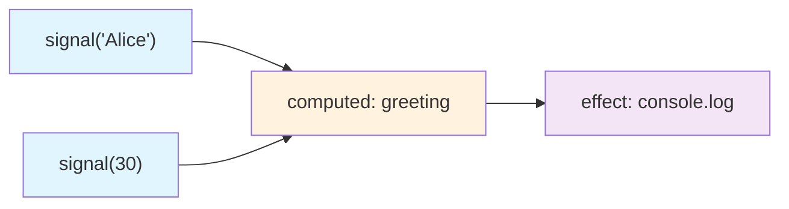
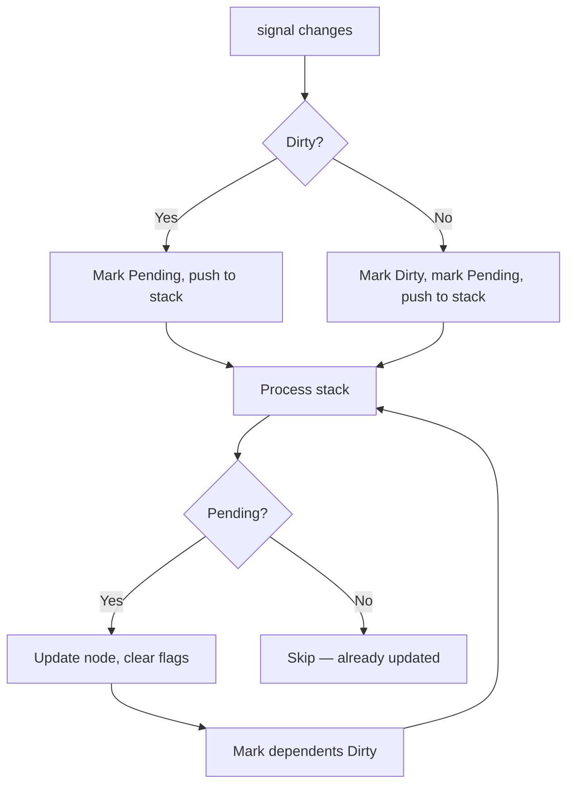
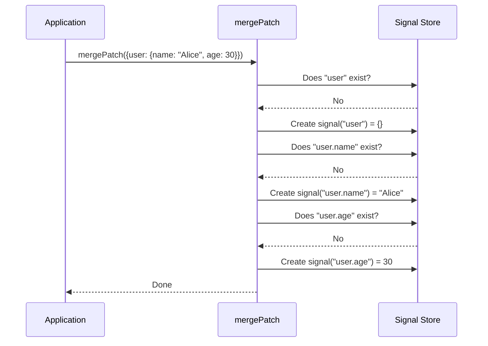

# Datastar -- Reactive Signals

The signal system in `engine/signals.ts` (782 lines) is the heart of Datastar. It implements fine-grained reactivity: instead of re-rendering a virtual DOM on every change, individual DOM nodes update only when the specific signals they depend on change.

**Aha:** Datastar's signal system uses lazy dirty-checking. When signal A changes, it doesn't immediately update its dependents. Instead, it marks them as dirty and only re-evaluates them when their value is actually read. This means if a signal's value is computed but never used, the computation is skipped entirely — a significant optimization for complex dependency graphs.

Source: `library/src/engine/signals.ts` — 781 lines

## Core Types

### ReactiveNode

The fundamental building block. Every signal, computed value, and effect is a `ReactiveNode`.

```typescript
// engine/signals.ts
class ReactiveNode {
  links: Link[] | null = null           // Outgoing dependency links
  flags: ReactiveFlags = ReactiveFlags.Mutable
  version = 0                           // Incremented on each change
  lastCheckedDependencyVersion = 0
  lastValueChanged = false
  transaction = 0
  nesting = 0                           // For recursion detection
  subs: Link[] | null = null            // Incoming subscription links
  nextFreeNode: ReactiveNode | null = null
  prevFreeNode: ReactiveNode | null = null
  computed?: () => any
  effect?: (val: any) => void
  value: any
}
```

### ReactiveFlags

```typescript
// engine/signals.ts
enum ReactiveFlags {
  None = 0,
  Mutable = 1 << 0,       // This is a plain signal (not computed)
  Watching = 1 << 1,      // Has active subscribers
  RecursedCheck = 1 << 2, // Recursion detection in progress
  Recursed = 1 << 3,      // Recursion detected
  Dirty = 1 << 4,         // Needs re-evaluation
  Pending = 1 << 5,       // In the propagation stack
}
```

### Link

A directed edge in the dependency graph connecting a source signal to a dependent node.

```typescript
// engine/signals.ts
class Link {
  constructor(
    public flags: ReactiveFlags,
    public nextSub: Link | null,
    public prevSub: Link | null,
    public nextRt: Link | null,
    public prevRt: Link | null,
    public node: ReactiveNode | null,      // The dependent (consumer)
    public source: ReactiveNode | null,    // The source (producer)
  ) {}
}
```

## Creating Signals

### signal() — Plain mutable signal

```typescript
// engine/signals.ts
export function signal<T>(value: T): ReactiveNode {
  const node = new ReactiveNode()
  node.flags = ReactiveFlags.Mutable
  node.value = value
  return node
}
```

### computed() — Derived signal

```typescript
// engine/signals.ts
export function computed(fn: () => any): ReactiveNode {
  const node = new ReactiveNode()
  node.computed = fn
  node.flags = 0
  return node
}
```

### effect() — Side-effect subscription

```typescript
// engine/signals.ts
export function effect(val: () => void): () => void {
  const node = new ReactiveNode()
  node.effect = val
  node.flags = 0
  updateEffect(node)
  return () => {
    // Cleanup: unlink from all sources
    let link = node.links
    while (link) {
      const next = link.nextRt
      link.unlink()
      link = next
    }
    node.links = null
  }
}
```

## The Dependency Graph



When `effect` runs, it calls `computed.greeting`, which reads both `signal('Alice')` and `signal(30)`. Each read creates a `Link` connecting the source to the dependent. The graph looks like:

```
signal('Alice') --[Link]--> computed(greeting) --[Link]--> effect
signal(30)    --[Link]--> computed(greeting) --[Link]--> effect
```

## Dirty/Pending Flag Propagation

The propagation algorithm uses two flags — `Dirty` and `Pending` — to handle the classic "diamond dependency" problem without over-updating.



```typescript
// engine/signals.ts — propagate()
export function propagate(node: ReactiveNode): void {
  let current = node
  while (current) {
    const flags = current.flags
    if (flags & ReactiveFlags.Dirty) {
      // Already marked dirty — just mark pending and move on
      current.flags |= ReactiveFlags.Pending
      current = current.nextFreeNode
      continue
    }
    // Mark dirty and pending, then push dependents
    current.flags |= ReactiveFlags.Dirty | ReactiveFlags.Pending
    if (current.subs) {
      current.subs.node.flags |= ReactiveFlags.Pending
      push(current.subs.node)
    }
    current = current.nextFreeNode
  }
}
```

**Aha:** The Dirty/Pending flag system elegantly solves the diamond dependency problem. When signal A changes and both computed B and computed C depend on A, and computed D depends on both B and C, naive propagation would update D twice. With Dirty/Pending: B gets marked Dirty+Pending, C gets marked Dirty+Pending, and when B updates D it marks D Dirty, but when C tries to update D it sees D is already Dirty and skips. D gets updated exactly once.

## Batching

Multiple signal updates are batched into a single propagation cycle:

```typescript
// engine/signals.ts
export function beginBatch(): void {
  // Increment transaction counter
}

export function endBatch(): void {
  // Process all pending propagations at once
}
```

When you call `beginBatch()`, update several signals, then call `endBatch()`, all the dirty notifications coalesce into a single propagation pass. Effects only fire once at the end.

## checkDirty — Lazy Re-evaluation

Computed signals don't re-evaluate immediately when their sources change. Instead, when you read a computed signal's value, `checkDirty()` walks the dependency tree:

```typescript
// engine/signals.ts
function checkDirty(node: ReactiveNode): void {
  // Walk dependencies recursively
  // If any source is dirty, re-evaluate this node
  // If sources haven't changed since last check, skip
}
```

This is lazy evaluation: if nobody reads the computed signal, it never re-evaluates, even if its sources changed.

## Deep Signals — Proxy-based Auto-creation

The `deep()` function creates a Proxy around an object that auto-creates signals on property access:

```typescript
// engine/signals.ts
export function deep<T extends Record<string, any>>(obj: T): T {
  return new Proxy(obj, {
    get(target, key) {
      // Auto-create a signal if accessing a property that doesn't exist
      // Return a signal, not the raw value
    },
    set(target, key, value) {
      // Update the signal value, triggering propagation
    },
  })
}
```

This lets you write `$user.profile.name` and have Datastar automatically create the nested signal structure.

## Signal Store — Global State

Datastar maintains a global signal store (a plain object) that all attribute plugins read from and write to. The expression compiler (`genRx`) rewrites `$count` to `$['count']` where `$` is a Proxy around this global store.

### mergePatch() — JSON Merge Patch (RFC 7396)

```typescript
// engine/signals.ts
export function mergePatch(patch: Record<string, any>, options?: { ifMissing?: boolean }): void {
  // Recursively merge patch into the global signal store
  // ifMissing: only create signals that don't already exist
}
```

### mergePaths() — Path-based Updates

```typescript
// engine/signals.ts
export function mergePaths(paths: Paths, options?: { ifMissing?: boolean }): void {
  // paths = [['user.name', 'Alice'], ['user.age', 30]]
  // Updates signals at each path, creating them if needed
}
```

### filtered() — Signal Filtering

```typescript
// engine/signals.ts
export function filtered(options: SignalFilterOptions, patch?: JSONPatch): Record<string, any> {
  // Returns a subset of signals matching include/exclude patterns
  // include = /.*/ — all signals
  // exclude = /(^|\\.)_/ — signals starting with underscore
}
```

Used by the fetch plugin to send only public signals to the server, excluding internal ones like `_loading`.

### peeking — Read Without Subscribing

```typescript
// engine/signals.ts
let peeking = false
export function startPeeking(): void { peeking = true }
export function stopPeeking(): void { peeking = false }
```

When `peeking` is true, reading a signal's value does NOT create a dependency link. This is used by action plugins that need to read the current state without triggering re-evaluation.

## AlienSignal, AlienComputed, AlienEffect — External Integration

These functions integrate signals from outside the Datastar ecosystem (e.g., from a WebWorker or another framework):

```typescript
// engine/signals.ts
export function AlienSignal(): ReactiveNode { ... }
export function AlienComputed(compute: () => any): ReactiveNode { ... }
export function AlienEffect(effectFn: () => void): ReactiveNode { ... }
```

They use the same `ReactiveNode` / `Link` architecture but with special handling for external updates.

## mergePatch Algorithm Walkthrough



See [Expression Compiler](03-expression-compiler.md) for how expressions reference signals.
See [Attribute Plugins](05-attribute-plugins.md) for how plugins use signals.
See [Action Plugins](06-action-plugins.md) for how actions read/write signals.
