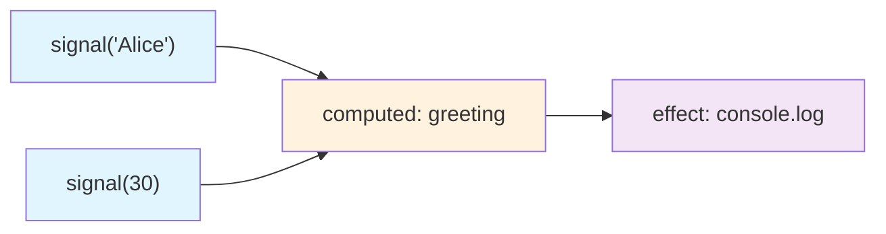
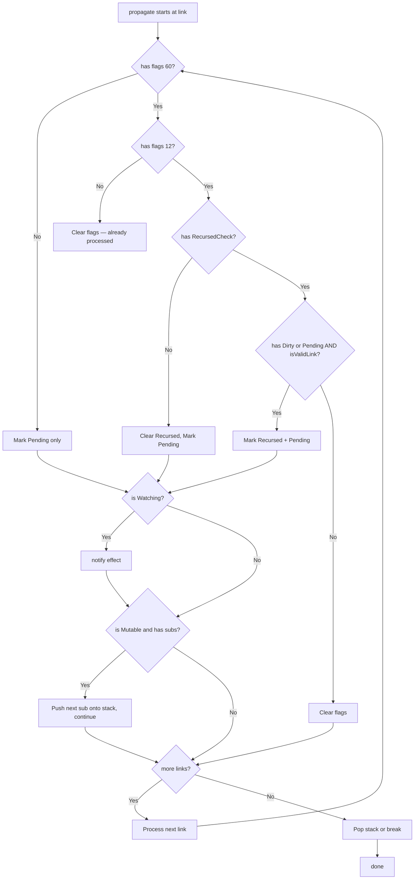

# Datastar -- Reactive Signals

The signal system in `engine/signals.ts` (781 lines) is the heart of Datastar. It implements fine-grained reactivity: instead of re-rendering a virtual DOM on every change, individual DOM nodes update only when the specific signals they depend on change.

**Aha:** Datastar's signal system is built from *interfaces* and *module-level state*, not classes. ReactiveNode and Link are pure interfaces — all the state lives in module-level variables (`activeSub`, `version`, `batchDepth`, etc.) and the actual signal objects are minimal records with underscore-prefixed fields. Operations like `signal()`, `computed()`, and `effect()` return *bound functions*, not node instances. This keeps the runtime overhead per signal extremely low.

Source: `library/src/engine/signals.ts` — 781 lines

## Core Interfaces

### ReactiveNode

The fundamental building block. Every signal, computed value, and effect is a `ReactiveNode` — but it's an interface, not a class:

```typescript
// engine/signals.ts:14-20
interface ReactiveNode {
  deps_?: Link       // Head of dependency linked list (what I depend on)
  depsTail_?: Link   // Tail of dependency list (for O(1) appending)
  subs_?: Link       // Head of subscription list (what depends on me)
  subsTail_?: Link   // Tail of subscription list
  flags_: ReactiveFlags
}
```

### Link

A directed edge connecting a source (dependency) to a consumer (subscriber):

```typescript
// engine/signals.ts:22-30
interface Link {
  version_: number          // Global version at link creation
  dep_: ReactiveNode        // The source (producer)
  sub_: ReactiveNode        // The consumer
  prevSub_?: Link           // Previous link in source's sub list
  nextSub_?: Link           // Next link in source's sub list
  prevDep_?: Link           // Previous link in consumer's dep list
  nextDep_?: Link           // Next link in consumer's dep list
}
```

### ReactiveFlags

```typescript
// engine/signals.ts:37-45
enum ReactiveFlags {
  None = 0,
  Mutable = 1 << 0,       // Plain signal (can be set)
  Watching = 1 << 1,      // Has active subscribers (effect)
  RecursedCheck = 1 << 2, // Currently being traversed (diamond detection)
  Recursed = 1 << 3,      // Already traversed in this propagation
  Dirty = 1 << 4,         // Needs re-evaluation
  Pending = 1 << 5,       // In the propagation stack
}
```

### EffectFlags

```typescript
// engine/signals.ts:47-49
enum EffectFlags {
  Queued = 1 << 6,       // Scheduled for execution
}
```

### Specialized Interfaces

```typescript
// engine/signals.ts:51-63
interface AlienEffect extends ReactiveNode {
  fn_(): void
}

interface AlienComputed<T = unknown> extends ReactiveNode {
  value_?: T
  getter(previousValue?: T): T
}

interface AlienSignal<T = unknown> extends ReactiveNode {
  previousValue: T
  value_: T
}
```

### Stack<T> — Internal propagation tracking

```typescript
// engine/signals.ts:32-35
interface Stack<T> {
  value_: T
  prev_?: Stack<T>
}
```

## Module-Level State

The entire reactive system runs on these module-level variables (lines 65-72):

```typescript
// engine/signals.ts:65-72
const currentPatch: Paths = []                          // Accumulates path changes
const queuedEffects: (AlienEffect | undefined)[] = []   // Effects waiting to run
let batchDepth = 0                                      // Nested batch counter
let notifyIndex = 0                                     // Position in queuedEffects
let queuedEffectsLength = 0                             // Current queue length
let prevSub: ReactiveNode | undefined                   // Previous active subscriber
let activeSub: ReactiveNode | undefined                 // Current tracking context
let version = 0                                         // Global link version counter
```

**Aha:** There are no class instances holding state — the entire reactive system is driven by these 8 module-level variables plus the interfaces above. `activeSub` is the key: when a signal is read, it checks `activeSub` and links itself to whatever is currently tracking. This is how dependencies are discovered implicitly — no explicit `.subscribe()` calls needed.

## Creating Signals — Bound Operations

### signal() — Creates a bound setter/getter function

```typescript
// engine/signals.ts:95-101
export const signal = <T>(initialValue?: T): Signal<T> => {
  return signalOper.bind(0, {
    previousValue: initialValue,
    value_: initialValue,
    flags_: 1 satisfies ReactiveFlags.Mutable,
  }) as Signal<T>
}
```

**Aha:** `signal()` does NOT return a ReactiveNode — it returns `signalOper` bound to a minimal object. Calling the returned function with no arguments *reads* the value; calling it with an argument *sets* it. The binding avoids creating closures per signal.

### computed() — Creates a bound evaluator

```typescript
// engine/signals.ts:103-112
const computedSymbol = Symbol('computed')
export const computed = <T>(getter: (previousValue?: T) => T): Computed<T> => {
  const c = computedOper.bind(0, {
    flags_: 17 as ReactiveFlags.Mutable | ReactiveFlags.Dirty,
    getter,
  }) as Computed<T>
  // @ts-expect-error
  c[computedSymbol] = 1
  return c
}
```

`flags_: 17` = `Mutable | Dirty` — computed starts dirty so it evaluates on first read. The `computedSymbol` marker distinguishes computed nodes during cleanup.

### effect() — Creates a bound disposer with auto-tracking

```typescript
// engine/signals.ts:114-131
export const effect = (fn: () => void): Effect => {
  const e: AlienEffect = {
    fn_: fn,
    flags_: 2 satisfies ReactiveFlags.Watching,
  }
  if (activeSub) {
    link(e, activeSub)
  }
  startPeeking(e)
  beginBatch()
  try {
    e.fn_()
  } finally {
    endBatch()
    stopPeeking()
  }
  return effectOper.bind(0, e)
}
```

Effect immediately runs its function inside a tracking context (`startPeeking` + `beginBatch`). Any signals read during `fn()` automatically link to this effect. Returns a bound disposer function.

## The Dependency Graph



When `effect` runs, it calls `computed.greeting`, which reads both `signal('Alice')` and `signal(30)`. Each read triggers `signalOper`, which checks `activeSub` and calls `link(signal, activeSub)`. The bidirectional `Link` structure means:
- From effect → follow `deps_` → find computed → follow its `deps_` → find both signals
- From signal → follow `subs_` → find computed → follow its `subs_` → find effect

## Linking — Lazy Dependency Discovery

The `link()` function (line 274) creates or reuses a Link between a dependency and a subscriber:

```typescript
// engine/signals.ts:274-313
const link = (dep: ReactiveNode, sub: ReactiveNode): void => {
  // Fast path: dep is already the tail — no-op
  const prevDep = sub.depsTail_
  if (prevDep && prevDep.dep_ === dep) return

  // Check if dep is next in list — bump version, move tail
  const nextDep = prevDep ? prevDep.nextDep_ : sub.deps_
  if (nextDep && nextDep.dep_ === dep) {
    nextDep.version_ = version
    sub.depsTail_ = nextDep
    return
  }

  // Check if link already exists on source's sub side
  const prevSub = dep.subsTail_
  if (prevSub && prevSub.version_ === version && prevSub.sub_ === sub) return

  // Create new link, splice into both doubly-linked lists
  const newLink = (sub.depsTail_ = dep.subsTail_ = {
    version_: version,
    dep_: dep,
    sub_: sub,
    prevDep_: prevDep,
    nextDep_: nextDep,
    prevSub_: prevSub,
  })
  // Splice into dep's doubly-linked list...
  // Splice into sub's doubly-linked list...
}
```

**Aha:** The link function is heavily optimized for the common case — when the same signals are read in the same order during re-evaluation, it's O(1). It uses `version` to detect stale links vs. re-used ones.

## Unlinking — Automatic Cleanup

When a computed or effect re-evaluates, old dependencies that are no longer read are removed:

```typescript
// engine/signals.ts:315-352
const unlink = (link: Link, sub = link.sub_): Link | undefined => {
  // Remove from consumer's dep list
  // Remove from source's sub list
  // If source has no more subs:
  //   - If it's a computed, mark it Dirty and recursively unlink its own deps
  //   - If it's an effect, dispose it
  //   - If it's a plain signal, leave it (value persists)
}
```

When a computed loses all subscribers, it cascades upward: the computed marks itself Dirty and unlinks from its own sources. This is "lazy resource cleanup" — unused computations release their dependencies automatically.

## signalOper — Read/Write Operation

```typescript
// engine/signals.ts:211-239
const signalOper = <T>(s: AlienSignal<T>, ...value: [T]): T | boolean => {
  if (value.length) {
    // SET: if value changed, mark Dirty+Mutable, propagate to subs
    if (s.value_ !== (s.value_ = value[0])) {
      s.flags_ = 17 as ReactiveFlags.Mutable | ReactiveFlags.Dirty
      const subs = s.subs_
      if (subs) {
        propagate(subs)
        if (!batchDepth) { flush() }
      }
      return true
    }
    return false
  }
  // GET: check dirty, lazy re-evaluate, create link if tracking
  const currentValue = s.value_
  if (s.flags_ & (16 satisfies ReactiveFlags.Dirty)) {
    if (updateSignal(s, currentValue)) {
      const subs_ = s.subs_
      if (subs_) { shallowPropagate(subs_) }
    }
  }
  if (activeSub) { link(s, activeSub) }
  return currentValue
}
```

When reading: if dirty, run `updateSignal` (which just confirms value), then `shallowPropagate` to mark dependents Dirty. If `activeSub` is set, create a link. When writing: if value actually changed, set flags and call `propagate()` on the entire sub chain.

## computedOper — Lazy Evaluation

```typescript
// engine/signals.ts:241-260
const computedOper = <T>(c: AlienComputed<T>): T => {
  const flags = c.flags_
  if (flags & (16 satisfies ReactiveFlags.Dirty) ||
      (flags & (32 satisfies ReactiveFlags.Pending) && checkDirty(c.deps_!, c))) {
    if (updateComputed(c)) {
      const subs = c.subs_
      if (subs) { shallowPropagate(subs) }
    }
  } else if (flags & (32 satisfies ReactiveFlags.Pending)) {
    c.flags_ = flags & ~(32 satisfies ReactiveFlags.Pending)
  }
  if (activeSub) { link(c, activeSub) }
  return c.value_!
}
```

**Aha:** `checkDirty()` is only called if the computed is Pending but NOT Dirty. If it's already Dirty, re-evaluation happens unconditionally. If it's Pending, the expensive `checkDirty` walks the dependency tree to see if any source actually changed. This is the lazy evaluation optimization.

## Tracking — startTracking / endTracking

Before an effect or computed runs, `startTracking` prepares for new dependency discovery:

```typescript
// engine/signals.ts:427-437
const startTracking = (sub: ReactiveNode): void => {
  version++
  sub.depsTail_ = undefined
  sub.flags_ = (sub.flags_ & ~(56 as Recursed | Dirty | Pending)) | RecursedCheck
}
```

Increments the global `version`, resets the dependency tail, and sets `RecursedCheck` flag. As the function runs, new links are created with the current `version`.

After the function completes, `endTracking` removes stale links:

```typescript
// engine/signals.ts:439-446
const endTracking = (sub: ReactiveNode): void => {
  const depsTail_ = sub.depsTail_
  let toRemove = depsTail_ ? depsTail_.nextDep_ : sub.deps_
  while (toRemove) {
    toRemove = unlink(toRemove, sub)
  }
  sub.flags_ &= ~(4 satisfies ReactiveFlags.RecursedCheck)
}
```

Any links with a version older than the current one are stale — the dependency was no longer read during this evaluation.

## Peeking — Read Without Subscribing

```typescript
// engine/signals.ts:85-93
export const startPeeking = (sub?: ReactiveNode): void => {
  prevSub = activeSub
  activeSub = sub
}

export const stopPeeking = (): void => {
  activeSub = prevSub
  prevSub = undefined
}
```

`startPeeking` replaces `activeSub` temporarily. Used by `effect()` to set itself as the tracking context, and by `updateComputed`/`updateSignal` so they don't accidentally subscribe to signals they're reading internally. `stopPeeking` restores the previous context.

## Batching

```typescript
// engine/signals.ts:74-83
export const beginBatch = (): void => {
  batchDepth++
}

export const endBatch = (): void => {
  if (!--batchDepth) {
    flush()
    dispatch()
  }
}
```

Nested batches increment `batchDepth`. Only when the outermost batch ends (`batchDepth` reaches 0) do effects flush and patches dispatch. This coalesces multiple signal changes into a single propagation cycle.

## Propagation — Iterative Stack-Based Algorithm

The `propagate()` function (line 354) walks the subscription graph marking nodes as Dirty and Pending. It handles diamond dependencies through the `RecursedCheck` and `Recursed` flags:



Key insight in `propagate` (lines 354-425):

```typescript
// The flags 60 check = RecursedCheck | Recursed | Dirty | Pending
// If none of these are set, just mark Pending (first time seeing this node)
// If RecursedCheck or Recursed IS set, we're in a diamond — use more nuanced logic
// isValidLink() checks: does this specific link still exist in the consumer's dep list?
// This prevents stale links from triggering false notifications
```

**Aha:** The diamond dependency problem is solved through bit-flag gymnastics, not a separate data structure. When a node is reached through multiple paths (diamond), `RecursedCheck` marks that it's being checked, and `Recursed` marks that it's already been processed. When the second path reaches the same node, it sees the flags and skips redundant processing. `isValidLink()` adds an extra guard: it only propagates through links that still exist in the consumer's current dependency list.

## flush — Execute Queued Effects

```typescript
// engine/signals.ts:133-141
const flush = () => {
  while (notifyIndex < queuedEffectsLength) {
    const effect = queuedEffects[notifyIndex]!
    queuedEffects[notifyIndex++] = undefined
    run(effect, (effect.flags_ &= ~EffectFlags.Queued))
  }
  notifyIndex = 0
  queuedEffectsLength = 0
}
```

Effects are queued by `notify()` and executed in order. Each effect is removed from the queue before running (so recursive notifications work correctly).

## run — Effect Execution

```typescript
// engine/signals.ts:180-209
const run = (e: AlienEffect, flags: ReactiveFlags): void => {
  if (flags & Dirty || (flags & Pending && checkDirty(e.deps_!, e))) {
    // Effect is dirty or confirmed dirty by checkDirty:
    // 1. startPeeking — set this effect as active subscriber
    // 2. startTracking — prepare for new dependency discovery
    // 3. beginBatch — start nested batch
    // 4. e.fn_() — run the effect function
    // 5. endBatch — flush nested changes
    // 6. stopPeeking — restore previous subscriber context
    // 7. endTracking — remove stale dependency links
    return
  }
  // Not dirty: clear Pending flag, then recursively run dependent effects
  if (flags & Pending) {
    e.flags_ = flags & ~Pending
  }
  let link = e.deps_
  while (link) {
    const dep = link.dep_
    const depFlags = dep.flags_
    if (depFlags & EffectFlags.Queued) {
      run(dep as AlienEffect, (dep.flags_ = depFlags & ~EffectFlags.Queued))
    }
    link = link.nextDep_
  }
}
```

## checkDirty — Lazy Dirty-Check Walk

The most complex function. When a computed/effect is Pending but not Dirty, `checkDirty` walks the dependency tree to determine if any source actually changed:

```typescript
// engine/signals.ts:448-521
const checkDirty = (link: Link, sub: ReactiveNode): boolean => {
  // Iterative DFS through dependency graph
  // For each dependency:
  //   - If sub itself is Dirty → dirty = true
  //   - If dep is Mutable+Dirty → update it, propagate if changed
  //   - If dep is Mutable+Pending → recurse into dep's own deps
  // After checking all deps:
  //   - If dirty: update computed, propagate
  //   - If not dirty: clear Pending flag
  // Returns true if any value changed
}
```

This is the lazy evaluation mechanism: computed signals only re-evaluate if their dependencies actually changed, not just because a signal somewhere in the graph was set.

## shallowPropagate — Quick Dirty Marking

```typescript
// engine/signals.ts:523-537
const shallowPropagate = (link: Link): void => {
  do {
    const sub = link.sub_
    const flags = sub.flags_
    if ((flags & (Pending | Dirty)) === Pending) {
      sub.flags_ = flags | Dirty
      if (flags & Watching) {
        notify(sub as AlienEffect)
      }
    }
  } while ((link = link.nextSub_!))
}
```

Used after `updateSignal` or `updateComputed` confirms a value actually changed. Marks Pending-only dependents as Dirty, and notifies any watching effects.

## update / updateSignal / updateComputed

```typescript
// engine/signals.ts:143-165
const update = (signal: AlienSignal | AlienComputed): boolean => {
  if ('getter' in signal) {
    return updateComputed(signal)
  }
  return updateSignal(signal, signal.value_)
}

const updateComputed = (c: AlienComputed): boolean => {
  startPeeking(c)
  startTracking(c)
  try {
    const oldValue = c.value_
    return oldValue !== (c.value_ = c.getter(oldValue))
  } finally {
    stopPeeking()
    endTracking(c)
  }
}

const updateSignal = <T>(s: AlienSignal<T>, value: T): boolean => {
  s.flags_ = 1 satisfies ReactiveFlags.Mutable
  return s.previousValue !== (s.previousValue = value)
}
```

`updateSignal` resets the Mutable flag and returns whether the value actually changed. `updateComputed` runs the getter in a tracking context, returning whether the result changed.

## notify — Queue Effects

```typescript
// engine/signals.ts:167-178
const notify = (e: AlienEffect): void => {
  const flags = e.flags_
  if (!(flags & EffectFlags.Queued)) {
    e.flags_ = flags | EffectFlags.Queued
    const subs = e.subs_
    if (subs) {
      notify(subs.sub_ as AlienEffect)  // Chain to next effect in linked list
    } else {
      queuedEffects[queuedEffectsLength++] = e
    }
  }
}
```

Effects are linked through their `subs_` chain for queueing — only the first effect in a chain gets pushed to the array, the rest follow through the link. This avoids array pushes for nested effects.

## Deep Signals — Private Proxy System

The `deep()` function (line 562) is **private** (not exported). It recursively wraps objects and arrays in Proxy-based signal systems:

```typescript
// engine/signals.ts:562-674
const deep = (value: any, prefix = ''): any => {
  const isArr = Array.isArray(value)
  if (isArr || isPojo(value)) {
    const deepObj = (isArr ? [] : {}) as Record<string, Signal<any>>
    for (const key in value) {
      deepObj[key] = signal(deep(value[key], `${prefix + key}.`))
    }
    const keys = signal(0)  // Tracks key count for reactivity
    return new Proxy(deepObj, {
      get(_, prop) {
        // Prevent toJSON from creating signals
        if (isArr && prop in Array.prototype) { keys(); return deepObj[prop] }
        if (typeof prop === 'symbol') return deepObj[prop]
        if (!hasOwn(deepObj, prop) || deepObj[prop]() == null) {
          deepObj[prop] = signal('')
          dispatch(prefix + prop, '')
          keys(keys() + 1)
        }
        return deepObj[prop]()  // Return signal's value
      },
      set(_, prop, newValue) {
        // Handle array length changes, computed symbols, POJO diffs, etc.
      },
      deleteProperty(_, prop) { ... },
      ownKeys() { keys(); return Reflect.ownKeys(deepObj) },
      has(_, prop) { keys(); return prop in deepObj },
    })
  }
  return value
}
```

The `keys` signal is incremented whenever the object's shape changes. Array methods like `.map()` or `.filter()` read `keys()` first, so they react to additions/deletions.

## Global Signal Store

The root of all signals is a deep-wrapped empty object:

```typescript
// engine/signals.ts:781
export const root: Record<string, any> = deep({})
```

### getPath — Path-based access

```typescript
// engine/signals.ts:550-560
export const getPath = <T = any>(path: string): T | undefined => {
  let result = root
  const split = path.split('.')
  for (const path of split) {
    if (result == null || !hasOwn(result, path)) return
    result = result[path]
  }
  return result as T
}
```

### mergePatch — RFC 7396 JSON Merge Patch

```typescript
// engine/signals.ts:691-706
export const mergePatch = (patch: JSONPatch, { ifMissing }: MergePatchArgs = {}): void => {
  beginBatch()
  for (const key in patch) {
    if (patch[key] == null) {
      if (!ifMissing) { delete root[key] }
    } else {
      mergeInner(patch[key], key, root, '', ifMissing)
    }
  }
  endBatch()
}
```

### mergeInner — Recursive patching (private)

```typescript
// engine/signals.ts:711-746
const mergeInner = (patch, target, targetParent, prefix, ifMissing) => {
  if (isPojo(patch)) {
    // Recursively merge objects
    for (const key in patch) { ... }
  } else if (!(ifMissing && hasOwn(targetParent, target))) {
    targetParent[target] = patch
  }
}
```

### mergePaths — Path-based updates

```typescript
// engine/signals.ts:708-709
export const mergePaths = (paths: Paths, options?: MergePatchArgs): void =>
  mergePatch(pathToObj(paths), options)
```

### filtered — Signal filtering

```typescript
// engine/signals.ts:756-779
export const filtered = (
  { include = /.*/, exclude = /(?!)/ }: SignalFilterOptions = {},
  obj: JSONPatch = root,
): Record<string, any> => {
  // Iterative DFS through signal store, filtering by regex patterns
  // include default = /.*/ (match all), exclude default = /(?!)/ (match nothing)
}
```

### dispatch — Private DOM Event Emitter

```typescript
// engine/signals.ts:676-689
const dispatch = (path?: string, value?: any) => {
  if (path !== undefined && value !== undefined) {
    currentPatch.push([path, value])
  }
  if (!batchDepth && currentPatch.length) {
    const detail = pathToObj(currentPatch)
    currentPatch.length = 0
    document.dispatchEvent(
      new CustomEvent<JSONPatch>(DATASTAR_SIGNAL_PATCH_EVENT, { detail })
    )
  }
}
```

Collects path changes in `currentPatch`, then dispatches a CustomEvent when the batch ends. Watcher plugins listen for this event.

## isValidLink — Diamond Guard

```typescript
// engine/signals.ts:539-548
const isValidLink = (checkLink: Link, sub: ReactiveNode): boolean => {
  let link = sub.depsTail_
  while (link) {
    if (link === checkLink) return true
    link = link.prevDep_
  }
  return false
}
```

Walks backward from the dependency tail to check if a specific link still exists in the consumer's dependency list. Used by `propagate()` to skip notifications through stale links.

See [Expression Compiler](03-expression-compiler.md) for how expressions reference signals via the `$` parameter.
See [Attribute Plugins](05-attribute-plugins.md) for how plugins read/write signals.
See [Action Plugins](06-action-plugins.md) for how actions manipulate signals.
