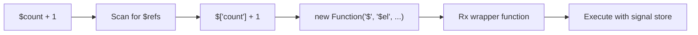

# Datastar -- Expression Compiler (genRx)

The `genRx` function in `engine/engine.ts` is Datastar's expression compiler. It converts the string values of `data-*` attributes into executable JavaScript Functions, with automatic signal reference rewriting.

**Aha:** genRx doesn't use `eval()` on the raw user string. Instead, it wraps the expression in a generated Function that receives the signal store as `$`, and rewrites `$count` to `$['count']` before compilation. This gives you a controlled execution context where `$` is a Proxy around the global signal store, and all other references resolve to the normal JavaScript scope.

Source: `library/src/engine/engine.ts` — `genRx` function

## The Problem

Datastar expressions in HTML look like this:

```html
<div data-text="$count + 1"></div>
<button data-on:click="$count++">Increment</button>
<div data-show="$count > 0"></div>
```

The `$count` syntax needs to:
1. Read from the global signal store (not from JavaScript scope)
2. Create dependency links when read (so the DOM updates when count changes)
3. Write back to the signal store when assigned

## Signal Reference Rewriting

genRx transforms `$count` into `$['count']` and `$user.profile.name` into `$['user']['profile']['name']`.

```typescript
// engine/engine.ts — simplified genRx
export function genRx(
  expression: string,
  argNames: string[] = [],
  statementDelimiter: string | null = null,
): Function {
  // 1. Extract signal references using regex
  // 2. Rewrite $foo to $['foo']
  // 3. Wrap in Function constructor
  // 4. Return compiled function

  const compiled = new Function(
    '$',        // Signal store Proxy
    '$el',      // Element reference
    '$evt',     // Event object
    '$plugins', // Plugin registry
    ...argNames,
    rewrittenBody,
  )

  return function Rx(this: any, ...args: any[]) {
    return compiled.call(this, $, $el, $evt, $plugins, ...args)
  }
}
```

## Template Interpolation

genRx handles template expressions inside `${...}` patterns:

```html
<div data-text="Hello ${$name}, you have ${$count} items"></div>
```

The compiler:
1. Scans for `${...}` patterns
2. Extracts each expression
3. Rewrites signal references in each
4. Joins with `+` concatenation in the compiled function

## Statement Delimiters

For multi-statement expressions (like `data-on:click`), genRx supports a statement delimiter:

```html
<button data-on:click="$count++; $message = 'Clicked!'">Click</button>
```

The delimiter (default `;`) separates multiple statements that all execute in sequence.

## Action Invocation

The `@` prefix invokes an action plugin:

```html
<button data-on:click="@post('/api/save', { contentType: 'json' })">
```

genRx recognizes `@actionName(...)` and compiles it to a call into the action plugin registry:

```typescript
// Compiled form (simplified):
$plugins.action('post', $el, '/api/save', { contentType: 'json' })
```

## Execution Context

Every compiled Rx function receives four implicit arguments:

| Parameter | What it is | Example use |
|-----------|-----------|-------------|
| `$` | Proxy around global signal store | `$['count']` reads/writes the count signal |
| `$el` | The DOM element the attribute is on | `$el.getAttribute('id')` |
| `$evt` | The Event object (for on: handlers) | `$evt.preventDefault()` |
| `$plugins` | Plugin registry | `$plugins.action('fetch', ...)` |

## Compilation Pipeline



## Caching

genRx caches compiled functions by expression string to avoid recompilation:

```typescript
// engine/engine.ts
const rxCache = new Map<string, Function>()

function genRx(expression: string, ...): Function {
  if (rxCache.has(expression)) return rxCache.get(expression)!
  const fn = compile(expression)
  rxCache.set(expression, fn)
  return fn
}
```

**Aha:** The cache key is the raw expression string, not a hash. This means two elements with identical expressions share the same compiled function — but each invocation gets different `$el` and `$evt` arguments, so the function still operates on the correct element.

See [Plugin System](04-plugin-system.md) for how plugins use compiled expressions.
See [Attribute Plugins](05-attribute-plugins.md) for how each plugin invokes rx().
