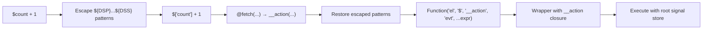

# Datastar -- Expression Compiler (genRx)

The `genRx` function in `engine/engine.ts` (lines 396-551) is Datastar's expression compiler. It converts the string values of `data-*` attributes into executable JavaScript Functions, with automatic signal reference rewriting and action invocation support.

**Aha:** genRx compiles expressions fresh each time — there is no global cache. Instead, the per-attribute `ctx.rx` wrapper in `applyAttributePlugin` (line 354-364) creates a `cachedRx` closure that compiles once per element+attribute combination. This avoids the memory leak risk of a global cache while still avoiding recompilation for the same attribute.

Source: `library/src/engine/engine.ts` — `genRx` function, lines 396-551

## The Problem

Datastar expressions in HTML look like this:

```html
<div data-text="$count + 1"></div>
<button data-on:click="$count++">Increment</button>
<div data-show="$count > 0"></div>
```

The `$count` syntax needs to:
1. Read from the global signal store (not from JavaScript scope)
2. Create dependency links when read (so the DOM updates when count changes)
3. Write back to the signal store when assigned

## Signal Reference Rewriting

genRx transforms `$count` into `$['count']` and `$user.profile.name` into `$['user']['profile']['name']`. The regex handles dot notation, hyphens, bracket notation, and nested signals:

```typescript
// engine/engine.ts:469-486 — signal reference rewriting
expr = expr.replace(
  /("(?:\\.|[^"\\])*"|'(?:\\.|[^'\\])*'|`(?:\\.|[^`\\$]|\$(?!\{))*`)|\$\{([^{}]*)\}|\$([a-zA-Z_\d]\w*(?:[.-]\w+)*)/g,
  (match, quoted, interpolationExpr, signalName) => {
    if (quoted) return match
    if (interpolationExpr !== undefined) {
      return `\${${interpolationExpr.replace(
        /\$([a-zA-Z_\d]\w*(?:[.-]\w+)*)/g,
        (_: string, innerSignalName: string) =>
          innerSignalName
            .split('.')
            .reduce((acc: string, part: string) => `${acc}['${part}']`, '$'),
      )}}`
    }
    return signalName
      .split('.')
      .reduce((acc: string, part: string) => `${acc}['${part}']`, '$')
  },
)
```

The regex has three capture groups:
1. **quoted** — strings/templates (skip rewriting inside them)
2. **interpolationExpr** — `${...}` template interpolation (rewrite signals inside)
3. **signalName** — `$foo`, `$foo.bar`, `$foo-bar` (rewrite to bracket notation)

**Rewriting examples:**

| Input | Output |
|-------|--------|
| `$count` | `$['count']` |
| `$count--` | `$['count']--` |
| `$foo.bar` | `$['foo']['bar']` |
| `$foo-bar` | `$['foo-bar']` |
| `$foo.bar-baz` | `$['foo']['bar-baz']` |
| `$foo-$bar` | `$['foo']-$['bar']` |
| `$arr[$index]` | `$['arr'][$['index']]` |
| `$['foo']` | `$['foo']` (already bracket) |
| `$foo['bar.baz']` | `$['foo']['bar.baz']` |
| `$123` | `$['123']` |
| `$foo.0.name` | `$['foo']['0']['name']` |

## The Function Constructor

After rewriting, the expression is compiled into a Function with four fixed parameters:

```typescript
// engine/engine.ts:495-537
try {
  const fn = Function('el', '$', '__action', 'evt', ...argNames, expr)
  return (el: HTMLOrSVG, ...args: any[]) => {
    const action = (name: string, evt: Event | undefined, ...args: any[]) => {
      const err = error.bind(0, {
        plugin: { type: 'action', name },
        element: { id: el.id, tag: el.tagName },
        expression: { fnContent: expr, value },
      })
      const fn = actions[name]
      if (fn) {
        return fn({ el, evt, error: err, cleanups }, ...args)
      }
      throw err('UndefinedAction')
    }
    try {
      return fn(el, root, action, undefined, ...args)
    } catch (e: any) {
      console.error(e)
      throw error({ element, expression, error: e.message }, 'ExecuteExpression')
    }
  }
} catch (e: any) {
  console.error(e)
  throw error({ expression, error: e.message }, 'GenerateExpression')
}
```

## Execution Context

Every compiled Rx function receives four fixed parameters plus any plugin-specific `argNames`:

| Parameter | What it is | Example use |
|-----------|-----------|-------------|
| `el` | The DOM element the attribute is on | `el.getAttribute('id')` |
| `$` | Global signal store root (from `engine/signals.ts`) | `$['count']` reads/writes the count signal |
| `__action` | Internal action dispatcher (see below) | `__action('setAll', evt, ...)` |
| `evt` | The Event object (for `on:` handlers) | `evt.preventDefault()` |
| `...argNames` | Plugin-specific extra arguments | Varies by plugin |

**Aha:** The `__action` internal function is generated fresh for each compiled expression invocation. It wraps the action plugin lookup with element-aware error handling, so if an action throws, the error includes which element and expression caused it.

## Action Invocation — @ Syntax

The `@` prefix invokes an action plugin:

```html
<button data-on:click="@post('/api/save', { contentType: 'json' })">
```

genRx recognizes `@actionName(...)` and compiles it to `__action("actionName",evt,...)`:

```typescript
// engine/engine.ts:488
expr = expr.replaceAll(/@([A-Za-z_$][\w$]*)\(/g, '__action("$1",evt,')
```

The `__action` function (generated at invocation time, line 498):
1. Looks up the action plugin by name in the `actions` proxy
2. Creates an error factory bound to the element and expression
3. Calls the action plugin with `{ el, evt, error, cleanups }` context
4. Throws `'UndefinedAction'` if the plugin doesn't exist

This is different from a direct call because `__action` is a closure that captures `el`, `expr`, `value`, and `cleanups` — giving every action invocation full context for error reporting and cleanup registration.

## Compilation Pipeline



## Value Mode — Return the Last Expression (Lines 405-439)

When `returnsValue: true` (used by plugins like `data-text`, `data-bind`, `data-show`), the compiler treats the last statement as a return value:

```typescript
// engine/engine.ts:405-439
if (returnsValue) {
  const statementRe =
    /(\/(\\\/|[^/])*\/|"(\\"|[^"])*"|'(\\'|[^'])*'|`(\\`|[^`])*`|\(\s*((function)\s*\(\s*\)|(\(\s*\))\s*=>)\s*(?:\{[\s\S]*?\}|[^;){]*)\s*\)\s*\(\s*\)|[^;])+/gm
  const statements = value.trim().match(statementRe)
  if (statements) {
    const lastIdx = statements.length - 1
    const last = statements[lastIdx].trim()
    if (!last.startsWith('return')) {
      statements[lastIdx] = `return (${last});`
    }
    expr = statements.join(';\n')
  }
} else {
  expr = value.trim()
}
```

The statement regex is carefully crafted to handle:

| Alternative | Pattern | Matches |
|-------------|---------|---------|
| Regex literals | `\/(\\\/|[^/])*\/` | `/foo/g`, `/\d+/` |
| Double-quoted strings | `"(\\"|[^"])*"` | `"hello \"world\""` |
| Single-quoted strings | `'(\\'|[^'])*'` | `'it\'s fine'` |
| Template literals | `` `(\\`|[^`])*` `` | `` `hi ${x}` `` |
| No-arg IIFE function | `\(\s*(function)\s*\(\s*\)\s*...\)\s*\(\s*\)` | `(function() { return 1; })()` |
| No-arg IIFE arrow | `\(\s*\(\s*\)\s*=>\s*...\)\s*\(\s*\)` | `(() => 42)()` |
| Regular code | `[^;]` | Anything except semicolons |

**Aha:** The IIFE support is intentional but limited. Datastar allows expressions like `(() => { return $count * 2; })()` to evaluate to a value, but only no-argument IIFEs. This lets users write complex logic without needing a full JavaScript function in their HTML. The regex `(?:\{[\s\S]*?\}|[^;){]*)` inside the IIFE matches either a block `{...}` or a single expression — covering both `(() => { return x; })()` and `(() => x)()`.

**Execution example — multi-statement:**

```html
<div data-effect="$count++; console.log($count)"></div>
```

Since `returnsValue: false` for `effect`, the expression is used as-is: `$count++; console.log($count)`. But with `data-text`:

```html
<div data-text="x = $count * 2; x > 100 ? 'big' : 'small'"></div>
```

With `returnsValue: true`, this becomes:
```js
x = $['count'] * 2;
return (x > 100 ? 'big' : 'small');
```

The semicolons split statements, and the last one gets wrapped in `return (...)`.

### Non-value mode (line 437-439)

```typescript
} else {
  expr = value.trim()
}
```

For `data-on:click`, `data-effect`, etc. — expressions are used as statement bodies, not return values. No `return` wrapping.

## The Function Constructor — Full Wrapper (Lines 495-551)

After rewriting, the expression is compiled into a Function with four fixed parameters:

```typescript
try {
  const fn = Function('el', '$', '__action', 'evt', ...argNames, expr)
  return (el: HTMLOrSVG, ...args: any[]) => {
    const action = (name: string, evt: Event | undefined, ...args: any[]) => {
      const err = error.bind(0, {
        plugin: { type: 'action', name },
        element: { id: el.id, tag: el.tagName },
        expression: { fnContent: expr, value },
      })
      const fn = actions[name]
      if (fn) {
        return fn(
          { el, evt, error: err, cleanups },
          ...args,
        )
      }
      throw err('UndefinedAction')
    }
    try {
      return fn(el, root, action, undefined, ...args)
    } catch (e: any) {
      console.error(e)
      throw error(
        { element: { id: el.id, tag: el.tagName }, expression: { fnContent: expr, value }, error: e.message },
        'ExecuteExpression',
      )
    }
  }
} catch (e: any) {
  console.error(e)
  throw error(
    { expression: { fnContent: expr, value }, error: e.message },
    'GenerateExpression',
  )
}
```

**Line-by-line walkthrough:**

1. **Line 496:** `Function('el', '$', '__action', 'evt', ...argNames, expr)` creates a new function. `expr` is the function body. The four fixed params are `el` (element), `$` (signal root), `__action` (internal action dispatcher), `evt` (event). `argNames` are plugin-specific extras (e.g., `['evt']` for `data-on`, `['patch']` for `data-on-signal-patch`).

2. **Line 497-520:** Returns a wrapper function that captures `el`, `expr`, `value`, `cleanups` in its closure. This wrapper is what `ctx.rx()` actually calls.

3. **Line 498-519:** The inner `action` function is created fresh on each invocation. It:
   - Creates an error factory (`err`) bound to the plugin name, element, and expression
   - Looks up the action in the `actions` proxy
   - Calls the action with `{ el, evt, error, cleanups }` context
   - Throws `'UndefinedAction'` if no matching plugin

4. **Line 522:** `fn(el, root, action, undefined, ...args)` invokes the compiled function. `root` is the signal store (`export const root = deep({})`). `undefined` is passed for `evt` (the actual event comes from the plugin calling `ctx.rx(evt)`).

5. **Line 523-536:** Execution error handling — catches runtime errors and wraps them with element/expression context as `'ExecuteExpression'`.

6. **Line 538-550:** Compilation error handling — catches syntax errors from the `Function` constructor and wraps them as `'GenerateExpression'`.

**Aha:** Two levels of error handling — `GenerateExpression` for compile-time syntax errors (bad JS in the HTML attribute), and `ExecuteExpression` for runtime errors (the JS is valid but throws when run). Both include the element ID/tag and the original attribute value for debugging.

## Escaping — DSP/DSS Patterns (Lines 441-493)

Before compilation, patterns wrapped in `${DSP}...${DSS}` (Datastar Start Pattern / Datastar Stop Pattern) are escaped to prevent signal rewriting:

```typescript
// engine/engine.ts:441-450
const escaped = new Map<string, string>()
const escapeRe = RegExp(`(?:${DSP})(.*?)(?:${DSS})`, 'gm')
let counter = 0
for (const match of expr.matchAll(escapeRe)) {
  const k = match[1]
  const v = `__escaped${counter++}`
  escaped.set(v, k)
  expr = expr.replace(DSP + k + DSS, v)
}
```

**Example:** If you want a literal `$foo` in your expression (not a signal reference):
```html
<div data-text="${DSP}foo${DSS}"></div>
```

This becomes `$['foo']` during normal processing. But with escaping:
1. `${DSP}foo${DSS}` → replaced with `__escaped0`
2. Signal rewriting runs — `__escaped0` has no `$` prefix, so it's untouched
3. After rewriting: `expr = expr.replace('__escaped0', 'foo')` restores the original

**Why this matters:** Without escaping, any `$` followed by a valid identifier would be treated as a signal reference. This lets you include literal `$` variables from external libraries (e.g., jQuery's `$`).

After all rewriting, escaped values are restored:

```typescript
// engine/engine.ts:490-493
for (const [k, v] of escaped) {
  expr = expr.replace(k, v)
}
```

## Signal Reference Rewriting — Deep Dive (Lines 452-486)

The rewriting regex has three capture groups that handle different contexts:

```typescript
// Line 470
/("(?:\\.|[^"\\])*"|'(?:\\.|[^'\\])*'|`(?:\\.|[^`\\$]|\$(?!\{))*`)|\$\{([^{}]*)\}|\$([a-zA-Z_\d]\w*(?:[.-]\w+)*)/g
```

**Group 1 (quoted):** `("(?:\\.|[^"\\])*"|'(?:\\.|[^'\\])*'|`(?:\\.|[^`\\$]|\$(?!\{))*`)`

Matches string literals of all three types. The template literal pattern `` `(?:\\.|[^`\\$]|\$(?!\{))*` `` is special: it matches backtick strings that don't contain `${` (because `${` starts an interpolation, which is handled separately). If a quoted string matches, it's returned unchanged — signal references inside strings are NOT rewritten.

**Group 2 (interpolationExpr):** `\$\{([^{}]*)\}`

Matches `${...}` template interpolation. The `[^{}]*` ensures non-nested braces. For each signal reference inside the interpolation, it rewrites:
```js
${$user.name} → ${$['user']['name']}
```

The `.reduce()` call splits on `.` and builds bracket notation:
```js
'user.name'.split('.').reduce((acc, part) => acc + "['" + part + "']", '$')
// Result: "$['user']['name']"
```

**Group 3 (signalName):** `\$([a-zA-Z_\d]\w*(?:[.-]\w+)*)`

Matches `$foo`, `$foo.bar`, `$foo-bar`. The pattern `[a-zA-Z_\d]\w*` allows starting with a digit (unusual but valid). The `(?:[.-]\w+)*` allows dot or hyphen-separated segments.

**Aha:** The hyphen support (`$foo-bar`) is important because HTML attributes commonly use hyphens. `data-bind:user-name` maps to signal `$user-name`, which gets rewritten to `$['user-name']`. Without hyphen support, you'd need bracket notation: `$['user-name']`.

## Per-Attribute Caching — No Global Cache

Unlike what you might expect, genRx does NOT cache compiled functions globally. Each call to genRx creates a fresh Function. The caching happens at the attribute plugin level:

```typescript
// engine/engine.ts:353-364 — in applyAttributePlugin
const cleanups = new Map<string, () => void>()
if (valueProvided) {
  let cachedRx: GenRxFn
  ctx.rx = (...args: any[]) => {
    if (!cachedRx) {
      cachedRx = genRx(value, {
        returnsValue: plugin.returnsValue,
        argNames: plugin.argNames,
        cleanups,
      })
    }
    return cachedRx(el, ...args)
  }
}
```

`cachedRx` is a local variable captured by the `ctx.rx` closure. The first time `ctx.rx()` is called, it compiles the expression. Every subsequent call on the same element+attribute reuses that compiled function. This is more precise than a global cache — each element gets its own compiled function, and when the element is removed from the DOM, the cache is garbage collected automatically.

## Template Interpolation

genRx handles template expressions inside `${...}` patterns. The rewriting (shown above) also processes template literals:

```html
<div data-text="Hello ${$name}, you have ${$count} items"></div>
```

Inside `${...}`, signal references are rewritten:
- `${$name}` → `${$['name']}`
- `${$user.profile.name}` → `${$['user']['profile']['name']}`

**Aha:** Template interpolation only supports non-nested braces. `${${foo}}` won't work — the regex `[^{}]*` matches everything between `{` and `}` that doesn't contain `{` or `}`. This prevents infinite recursion in the regex but limits nested expressions inside templates.

## Error Handling

genRx wraps compilation and execution in try/catch, generating detailed error messages:

```typescript
// engine/engine.ts:24-38
const error = (ctx, reason, metadata = {}) => {
  Object.assign(metadata, ctx)
  const e = new Error()
  const r = snake(reason)
  const q = new URLSearchParams({ metadata: JSON.stringify(metadata) }).toString()
  const c = JSON.stringify(metadata, null, 2)
  e.message = `${reason}\nMore info: ${url}/${r}?${q}\nContext: ${c}`
  return e
}
```

Errors include a URL to `datastar.dev/errors/<reason>` with the full context as a query parameter, making debugging production issues straightforward.

See [Plugin System](04-plugin-system.md) for how plugins use compiled expressions.
See [Attribute Plugins](05-attribute-plugins.md) for how each plugin invokes `ctx.rx()`.
See [Signals](02-reactive-signals.md) for how the `$` parameter maps to the signal store.
