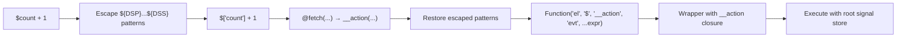

# Datastar -- Expression Compiler (genRx)

The `genRx` function in `engine/engine.ts` (lines 396-551) is Datastar's expression compiler. It converts the string values of `data-*` attributes into executable JavaScript Functions, with automatic signal reference rewriting and action invocation support.

**Aha:** genRx compiles expressions fresh each time — there is no global cache. Instead, the per-attribute `ctx.rx` wrapper in `applyAttributePlugin` (line 354-364) creates a `cachedRx` closure that compiles once per element+attribute combination. This avoids the memory leak risk of a global cache while still avoiding recompilation for the same attribute.

Source: `library/src/engine/engine.ts` — `genRx` function, lines 396-551

## The Problem

Datastar expressions in HTML look like this:

```html
<div data-text="$count + 1"></div>
<button data-on:click="$count++">Increment</button>
<div data-show="$count > 0"></div>
```

The `$count` syntax needs to:
1. Read from the global signal store (not from JavaScript scope)
2. Create dependency links when read (so the DOM updates when count changes)
3. Write back to the signal store when assigned

## Signal Reference Rewriting

genRx transforms `$count` into `$['count']` and `$user.profile.name` into `$['user']['profile']['name']`. The regex handles dot notation, hyphens, bracket notation, and nested signals:

```typescript
// engine/engine.ts:469-486 — signal reference rewriting
expr = expr.replace(
  /("(?:\\.|[^"\\])*"|'(?:\\.|[^'\\])*'|`(?:\\.|[^`\\$]|\$(?!\{))*`)|\$\{([^{}]*)\}|\$([a-zA-Z_\d]\w*(?:[.-]\w+)*)/g,
  (match, quoted, interpolationExpr, signalName) => {
    if (quoted) return match
    if (interpolationExpr !== undefined) {
      return `\${${interpolationExpr.replace(
        /\$([a-zA-Z_\d]\w*(?:[.-]\w+)*)/g,
        (_: string, innerSignalName: string) =>
          innerSignalName
            .split('.')
            .reduce((acc: string, part: string) => `${acc}['${part}']`, '$'),
      )}}`
    }
    return signalName
      .split('.')
      .reduce((acc: string, part: string) => `${acc}['${part}']`, '$')
  },
)
```

The regex has three capture groups:
1. **quoted** — strings/templates (skip rewriting inside them)
2. **interpolationExpr** — `${...}` template interpolation (rewrite signals inside)
3. **signalName** — `$foo`, `$foo.bar`, `$foo-bar` (rewrite to bracket notation)

**Rewriting examples:**

| Input | Output |
|-------|--------|
| `$count` | `$['count']` |
| `$count--` | `$['count']--` |
| `$foo.bar` | `$['foo']['bar']` |
| `$foo-bar` | `$['foo-bar']` |
| `$foo.bar-baz` | `$['foo']['bar-baz']` |
| `$foo-$bar` | `$['foo']-$['bar']` |
| `$arr[$index]` | `$['arr'][$['index']]` |
| `$['foo']` | `$['foo']` (already bracket) |
| `$foo['bar.baz']` | `$['foo']['bar.baz']` |
| `$123` | `$['123']` |
| `$foo.0.name` | `$['foo']['0']['name']` |

## The Function Constructor

After rewriting, the expression is compiled into a Function with four fixed parameters:

```typescript
// engine/engine.ts:495-537
try {
  const fn = Function('el', '$', '__action', 'evt', ...argNames, expr)
  return (el: HTMLOrSVG, ...args: any[]) => {
    const action = (name: string, evt: Event | undefined, ...args: any[]) => {
      const err = error.bind(0, {
        plugin: { type: 'action', name },
        element: { id: el.id, tag: el.tagName },
        expression: { fnContent: expr, value },
      })
      const fn = actions[name]
      if (fn) {
        return fn({ el, evt, error: err, cleanups }, ...args)
      }
      throw err('UndefinedAction')
    }
    try {
      return fn(el, root, action, undefined, ...args)
    } catch (e: any) {
      console.error(e)
      throw error({ element, expression, error: e.message }, 'ExecuteExpression')
    }
  }
} catch (e: any) {
  console.error(e)
  throw error({ expression, error: e.message }, 'GenerateExpression')
}
```

## Execution Context

Every compiled Rx function receives four fixed parameters plus any plugin-specific `argNames`:

| Parameter | What it is | Example use |
|-----------|-----------|-------------|
| `el` | The DOM element the attribute is on | `el.getAttribute('id')` |
| `$` | Global signal store root (from `engine/signals.ts`) | `$['count']` reads/writes the count signal |
| `__action` | Internal action dispatcher (see below) | `__action('setAll', evt, ...)` |
| `evt` | The Event object (for `on:` handlers) | `evt.preventDefault()` |
| `...argNames` | Plugin-specific extra arguments | Varies by plugin |

**Aha:** The `__action` internal function is generated fresh for each compiled expression invocation. It wraps the action plugin lookup with element-aware error handling, so if an action throws, the error includes which element and expression caused it.

## Action Invocation — @ Syntax

The `@` prefix invokes an action plugin:

```html
<button data-on:click="@post('/api/save', { contentType: 'json' })">
```

genRx recognizes `@actionName(...)` and compiles it to `__action("actionName",evt,...)`:

```typescript
// engine/engine.ts:488
expr = expr.replaceAll(/@([A-Za-z_$][\w$]*)\(/g, '__action("$1",evt,')
```

The `__action` function (generated at invocation time, line 498):
1. Looks up the action plugin by name in the `actions` proxy
2. Creates an error factory bound to the element and expression
3. Calls the action plugin with `{ el, evt, error, cleanups }` context
4. Throws `'UndefinedAction'` if the plugin doesn't exist

This is different from a direct call because `__action` is a closure that captures `el`, `expr`, `value`, and `cleanups` — giving every action invocation full context for error reporting and cleanup registration.

## Compilation Pipeline



## Value Mode — Return the Last Expression

When `returnsValue: true` (used by plugins like `data-text`, `data-bind`), the compiler treats the last statement as a return value:

```typescript
// engine/engine.ts:426-436
const statementRe =
  /(\/(\\\/|[^/])*\/|"(\\"|[^"])*"|'(\\'|[^'])*'|`(\\`|[^`])*`|\(\s*((function)\s*\(\s*\)|(\(\s*\))\s*=>)\s*(?:\{[\s\S]*?\}|[^;){]*)\s*\)\s*\(\s*\)|[^;])+/gm
const statements = value.trim().match(statementRe)
if (statements) {
  const lastIdx = statements.length - 1
  const last = statements[lastIdx].trim()
  if (!last.startsWith('return')) {
    statements[lastIdx] = `return (${last});`
  }
  expr = statements.join(';\n')
}
```

The statement regex is carefully crafted to handle:
- **Regular expressions**: `\/(\\\/|[^/])*\/` — avoids splitting on `/` inside regex literals
- **Double-quoted strings**: `"(\\"|[^"])*"` — handles escaped quotes
- **Single-quoted strings**: `'(\\'|[^'])*'` — handles escaped quotes
- **Template literals**: `` `(\\`|[^`])*` `` — handles backticks
- **IIFEs**: `\(\s*((function)\s*\(\s*\)|(\(\s*\))\s*=>)\s*...\(\s*\)` — limited IIFE support (no args, no nesting)
- **Regular code**: `[^;]` — everything except semicolons

**Aha:** The IIFE support is intentional but limited. Datastar allows expressions like `(() => { return $count * 2; })()` to evaluate to a value, but only no-argument IIFEs. This lets users write complex logic without needing a full JavaScript function in their HTML.

## Escaping — DSP/DSS Patterns

Before compilation, patterns wrapped in `${DSP}...${DSS}` (Datastar Start Pattern / Datastar Stop Pattern) are escaped to prevent signal rewriting:

```typescript
// engine/engine.ts:442-450
const escaped = new Map<string, string>()
const escapeRe = RegExp(`(?:${DSP})(.*?)(?:${DSS})`, 'gm')
let counter = 0
for (const match of expr.matchAll(escapeRe)) {
  const k = match[1]
  const v = `__escaped${counter++}`
  escaped.set(v, k)
  expr = expr.replace(DSP + k + DSS, v)
}
// ... after compilation, restore ...
for (const [k, v] of escaped) {
  expr = expr.replace(k, v)
}
```

This lets users include literal `$foo` text without it being treated as a signal reference.

## Per-Attribute Caching — No Global Cache

Unlike what you might expect, genRx does NOT cache compiled functions globally. Each call to genRx creates a fresh Function. The caching happens at the attribute plugin level:

```typescript
// engine/engine.ts:353-364 — in applyAttributePlugin
const cleanups = new Map<string, () => void>()
if (valueProvided) {
  let cachedRx: GenRxFn
  ctx.rx = (...args: any[]) => {
    if (!cachedRx) {
      cachedRx = genRx(value, {
        returnsValue: plugin.returnsValue,
        argNames: plugin.argNames,
        cleanups,
      })
    }
    return cachedRx(el, ...args)
  }
}
```

`cachedRx` is a local variable captured by the `ctx.rx` closure. The first time `ctx.rx()` is called, it compiles the expression. Every subsequent call on the same element+attribute reuses that compiled function. This is more precise than a global cache — each element gets its own compiled function, and when the element is removed from the DOM, the cache is garbage collected automatically.

## Template Interpolation

genRx handles template expressions inside `${...}` patterns. The rewriting (shown above) also processes template literals:

```html
<div data-text="Hello ${$name}, you have ${$count} items"></div>
```

Inside `${...}`, signal references are rewritten:
- `${$name}` → `${$['name']}`
- `${$user.profile.name}` → `${$['user']['profile']['name']}`

**Aha:** Template interpolation only supports non-nested braces. `${${foo}}` won't work — the regex `[^{}]*` matches everything between `{` and `}` that doesn't contain `{` or `}`. This prevents infinite recursion in the regex but limits nested expressions inside templates.

## Error Handling

genRx wraps compilation and execution in try/catch, generating detailed error messages:

```typescript
// engine/engine.ts:24-38
const error = (ctx, reason, metadata = {}) => {
  Object.assign(metadata, ctx)
  const e = new Error()
  const r = snake(reason)
  const q = new URLSearchParams({ metadata: JSON.stringify(metadata) }).toString()
  const c = JSON.stringify(metadata, null, 2)
  e.message = `${reason}\nMore info: ${url}/${r}?${q}\nContext: ${c}`
  return e
}
```

Errors include a URL to `datastar.dev/errors/<reason>` with the full context as a query parameter, making debugging production issues straightforward.

See [Plugin System](04-plugin-system.md) for how plugins use compiled expressions.
See [Attribute Plugins](05-attribute-plugins.md) for how each plugin invokes `ctx.rx()`.
See [Signals](02-reactive-signals.md) for how the `$` parameter maps to the signal store.
