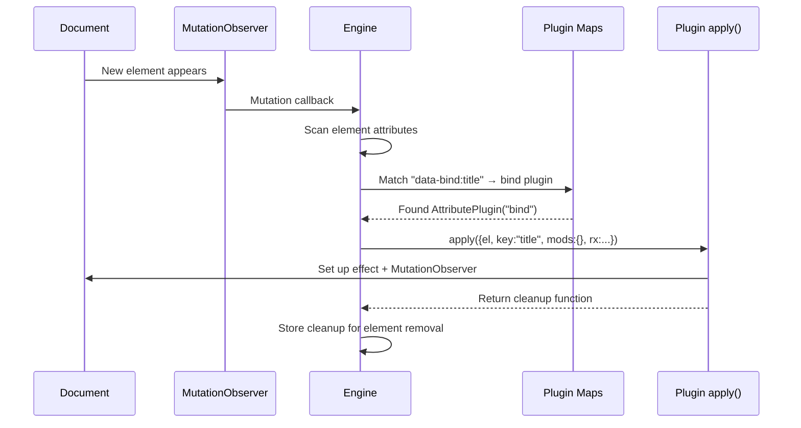
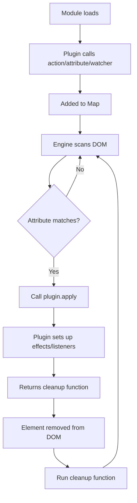

# Datastar -- Plugin System

Datastar's plugin system has three types: ActionPlugin, AttributePlugin, and WatcherPlugin. Each registers at module load time by calling `action()`, `attribute()`, or `watcher()` from `engine.ts`.

**Aha:** There is no central "plugin manager" object. Plugins register themselves via module-level function calls that add entries to Maps (`actionPlugins`, `attributePlugins`, `watcherPlugins`). The engine discovers plugins by matching DOM attribute names against Map keys — no plugin registry needs to be maintained manually.

Source: `library/src/engine/engine.ts` — plugin registration and DOM scanning

## Plugin Registration

```typescript
// engine/engine.ts
const actionPlugins = new Map<string, ActionPlugin>()
const attributePlugins = new Map<string, AttributePlugin>()
const watcherPlugins = new Map<string, WatcherPlugin>()

export const action = (plugin: ActionPlugin) => actionPlugins.set(plugin.name, plugin)
export const attribute = (plugin: AttributePlugin) => attributePlugins.set(plugin.name, plugin)
export const watcher = (plugin: WatcherPlugin) => watcherPlugins.set(plugin.name, plugin)
```

Each plugin is just an object with `name`, `apply`, and optional metadata:

```typescript
// Example plugin
attribute({
  name: 'bind',
  requirement: 'exclusive',
  apply({ el, key, mods, rx }) {
    // Plugin logic
    return () => { /* cleanup */ }
  },
})
```

## Three Plugin Types

### AttributePlugin — Reactive DOM bindings

Bound to `data-{name}` or `data-{name}:key` attributes on elements.

| Field | Type | Purpose |
|-------|------|---------|
| `name` | `string` | The attribute name (without `data-` prefix) |
| `requirement` | `'must' \| 'exclusive' \| { key: 'must' \| 'denied', value: 'must' \| 'denied' }` | Whether the plugin requires a key or value |
| `returnsValue` | `boolean` | Whether the expression returns a value |
| `argNames` | `string[]` | Named arguments for the compiled function |
| `apply` | `function` | Called when the attribute is found on an element |

The `apply` function receives a context object and returns an optional cleanup function:

```typescript
apply({ el, key, rawKey, mods, rx, error, cleanups }) {
  // el: the DOM element
  // key: the attribute key (e.g., "title" from data-bind:title)
  // rawKey: unprocessed key before case modification
  // mods: Set of modifiers (e.g., data-on:click.prevent → mods.has('prevent') === true)
  // rx: compiled expression function
  // error: error factory
  // cleanups: Map for storing cleanup functions

  return () => { /* cleanup on element removal */ }
}
```

### ActionPlugin — Invokable commands

Invoked via `@actionName(...)` syntax in expressions.

| Field | Type | Purpose |
|-------|------|---------|
| `name` | `string` | Action name (e.g., "get", "post", "peek") |
| `apply` | `function` | Called when `@name(...)` is invoked |

The `apply` function receives:

```typescript
apply({ el, evt, error, cleanups }, ...args) {
  // el: the element that triggered the action
  // evt: the event that triggered it
  // error: error factory
  // cleanups: Map for cleanup functions
  // ...args: arguments from the expression
}
```

### WatcherPlugin — Event listeners on document

Listens for custom events dispatched on the `document`.

| Field | Type | Purpose |
|-------|------|---------|
| `name` | `string` | Event name to listen for |
| `apply` | `function` | Called when the event fires |

The `apply` function:

```typescript
apply({ error }, args) {
  // args: deserialized event detail
  // error: error factory
}
```

## DOM Scanning Flow



## MutationObserver Integration

The engine uses a `MutationObserver` to watch for DOM changes:

```typescript
// engine/engine.ts — simplified
const observer = new MutationObserver((mutations) => {
  for (const mutation of mutations) {
    if (mutation.type === 'childList') {
      for (const node of mutation.addedNodes) {
        if (node instanceof Element) {
          applyPlugins(node)  // Scan and register plugins
        }
      }
      for (const node of mutation.removedNodes) {
        if (node instanceof Element) {
          runCleanups(node)  // Call cleanup functions
        }
      }
    }
  }
})

observer.observe(document.documentElement, {
  childList: true,
  subtree: true,
  attributes: true,
  attributeFilter: ['data-*'],  // Watch for attribute changes
})
```

## Modifier System

Modifiers are colon-separated suffixes on attribute names:

```html
<!-- data-on:click.prevent.delay:500ms.capture -->
<!--     ^name  ^key    ^mods                        -->
```

The modifier parser splits on `.` and stores them in a `Set<string>`:

```typescript
// Parsed from "data-on:click.prevent.delay:500ms.capture":
// name = "on"
// key = "click"
// mods = { "prevent", "delay:500ms", "capture" }
```

Plugins access modifiers via:

```typescript
mods.has('prevent')        // → true
mods.get('delay')          // → Set { "500ms" }
```

## Plugin Lifecycle



See [Attribute Plugins](05-attribute-plugins.md) for all 17 attribute plugins.
See [Action Plugins](06-action-plugins.md) for all 4 action plugins.
See [Watchers](09-watchers.md) for the 2 watcher plugins.
