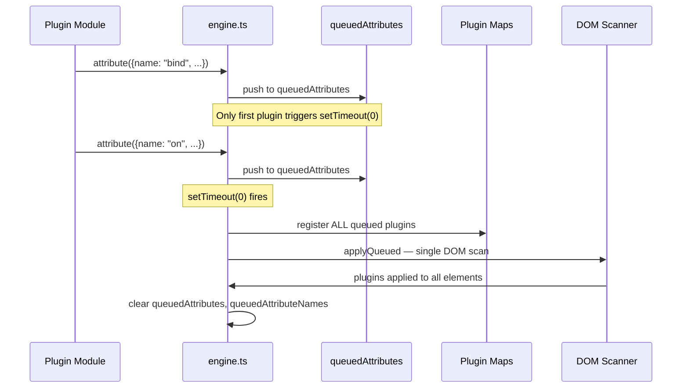

# Datastar -- Plugin System

Datastar's plugin system has three types: ActionPlugin, AttributePlugin, and WatcherPlugin. Each registers at module load time by calling `action()`, `attribute()`, or `watcher()` from `engine.ts`.

**Aha:** There is no central "plugin manager" object. Plugins register themselves via module-level function calls that add entries to Maps (`actionPlugins`, `attributePlugins`, `watcherPlugins`). The engine discovers plugins by matching DOM attribute names against Map keys — no plugin registry needs to be maintained manually.

Source: `library/src/engine/engine.ts` — plugin registration and DOM scanning

## Plugin Registration — Full Source Walkthrough

### Module-Level Maps (Lines 40-42)

```typescript
// engine/engine.ts:40-42
const actionPlugins: Map<string, ActionPlugin> = new Map()
const attributePlugins: Map<string, AttributePlugin> = new Map()
const watcherPlugins: Map<string, WatcherPlugin> = new Map()
```

Three module-scoped Maps — not exported directly. The only public interface to action plugins is the `actions` Proxy (line 44).

### The `actions` Proxy (Lines 44-56)

```typescript
// engine/engine.ts:44-56
export const actions: Record<
  string,
  (ctx: ActionContext, ...args: any[]) => any
> = new Proxy(
  {},
  {
    get: (_, prop: string) => actionPlugins.get(prop)?.apply,
    has: (_, prop: string) => actionPlugins.has(prop),
    ownKeys: () => Reflect.ownKeys(actionPlugins),
    set: () => false,
    deleteProperty: () => false,
  },
)
```

**Aha:** The `actions` Proxy is a read-only facade over the action plugins. When `@post(...)` is compiled, the expression calls `actions['post']` — the Proxy's `get` trap intercepts this and returns `actionPlugins.get('post')?.apply`. The `set` and `deleteProperty` traps always return `false`, making the Proxy immutable at runtime. `ownKeys` returns the actual plugin names, enabling `Object.keys(actions)` for debugging.

### Removals Map — Three-Level Cleanup Tracking (Line 59)

```typescript
// engine/engine.ts:59
const removals = new Map<HTMLOrSVG, Map<string, Map<string, () => void>>>()
```

Three-level nested Map structure:
- **Level 1:** Element → Map of attribute cleanups
- **Level 2:** Attribute name (e.g., `"bind:title"`) → Map of named cleanup functions
- **Level 3:** Cleanup name (e.g., `"attribute"`) → The actual cleanup function

This allows multiple cleanup functions per attribute (the plugin's cleanup + any registered via `cleanups.set()`), and batch cleanup when an element is removed.

### Queued Attribute Registration (Lines 61-64)

```typescript
// engine/engine.ts:61-64
const queuedAttributes: AttributePlugin[] = []
const queuedAttributeNames = new Set<string>()
const observedRoots = new Set<HTMLOrSVG | ShadowRoot>()
let datastarReadyDispatched = false
```

`queuedAttributes` holds plugins that have been registered but not yet activated. `queuedAttributeNames` tracks their names for the `onlyNew` optimization during initial DOM scan. `observedRoots` tracks which roots already have MutationObservers attached.

### `attribute()` — Registration with Deferred Activation (Lines 66-87)

```typescript
// engine/engine.ts:66-87
export const attribute = <R extends Requirement, B extends boolean>(
  plugin: AttributePlugin<R, B>,
): void => {
  queuedAttributes.push(plugin as unknown as AttributePlugin)

  if (queuedAttributes.length === 1) {
    setTimeout(() => {
      for (const attribute of queuedAttributes) {
        queuedAttributeNames.add(attribute.name)
        attributePlugins.set(attribute.name, attribute)
      }
      queuedAttributes.length = 0
      const roots = observedRoots.size
        ? [...observedRoots]
        : [document.documentElement]
      for (const root of roots) {
        applyQueued(root, !observedRoots.has(root))
      }
      queuedAttributeNames.clear()
    })
  }
}
```

**Aha:** The `queuedAttributes.length === 1` check is a debounce mechanism. When the first attribute plugin registers, it schedules a `setTimeout(0)`. Subsequent plugins that register before the timeout fires just get pushed to the queue. When the timeout fires, ALL queued plugins are registered and scanned in a single DOM pass. This prevents multiple DOM scans when many plugins register at module load time.

`applyQueued` (vs `apply`) passes `onlyNew = true` for existing roots, meaning it only applies plugins whose names are in `queuedAttributeNames` — it skips re-applying plugins that are already set up. For new roots (not yet observed), it observes them from scratch.

### `action()` — Immediate Registration (Lines 89-91)

```typescript
// engine/engine.ts:89-91
export const action = <T>(plugin: ActionPlugin<T>): void => {
  actionPlugins.set(plugin.name, plugin)
}
```

Action plugins register immediately — no queuing needed because they're invoked imperatively, not bound to DOM elements.

### Watcher Event Listener (Lines 93-111)

```typescript
// engine/engine.ts:93-111
document.addEventListener(DATASTAR_FETCH_EVENT, ((
  evt: CustomEvent<DatastarFetchEvent>,
) => {
  const plugin = watcherPlugins.get(evt.detail.type)
  if (plugin) {
    plugin.apply(
      {
        error: error.bind(0, {
          plugin: { type: 'watcher', name: plugin.name },
          element: {
            id: (evt.target as Element).id,
            tag: (evt.target as Element).tagName,
          },
        }),
      },
      evt.detail.argsRaw,
    )
  }
}) as EventListener)
```

**Aha:** Watchers don't register their own event listeners. There is a SINGLE listener on `document` for `datastar-fetch` events. When a fetch plugin dispatches a `datastar-fetch` event, this handler looks up the watcher by `evt.detail.type` and calls its `apply` with a bound error factory that includes the triggering element's ID and tag.

### `watcher()` — Immediate Registration (Lines 113-115)

```typescript
// engine/engine.ts:113-115
export const watcher = (plugin: WatcherPlugin): void => {
  watcherPlugins.set(plugin.name, plugin)
}
```

Watchers register immediately. The single event listener on line 93 routes to them by name.

## Cleanup System — Element Removal (Lines 117-128)

```typescript
// engine/engine.ts:117-128
const cleanupEls = (els: Iterable<HTMLOrSVG>): void => {
  for (const el of els) {
    const elCleanups = removals.get(el)
    if (elCleanups && removals.delete(el)) {
      for (const attrCleanups of elCleanups.values()) {
        for (const cleanup of attrCleanups.values()) {
          cleanup()
        }
      }
    }
  }
}
```

**Aha:** The `removals.delete(el)` check is critical — it ensures cleanup only runs once per element. If `removals.get(el)` returns undefined (already cleaned up), the `&&` short-circuits and `removals.delete(el)` is never called. The deletion happens before iterating, so if a cleanup function itself triggers another cleanup (e.g., removing a child), the guard prevents infinite recursion.

## Ignore Logic (Lines 130-133)

```typescript
// engine/engine.ts:130-133
const aliasedIgnore = aliasify('ignore')
const aliasedIgnoreAttr = `[${aliasedIgnore}]`
const shouldIgnore = (el: HTMLOrSVG) =>
  el.hasAttribute(`${aliasedIgnore}__self`) || !!el.closest(aliasedIgnoreAttr)
```

Two ignore mechanisms:
- `[data-ignore__self]` — skip this element only (children still scan)
- `[data-ignore]` — skip this element AND all descendants (via `.closest()`)

## `applyEls` — Two-Pass Attribute Scanning (Lines 135-152)

```typescript
// engine/engine.ts:135-152
const applyEls = (els: Iterable<HTMLOrSVG>, onlyNew?: boolean): void => {
  for (const el of els) {
    if (!shouldIgnore(el)) {
      const appliedKeys = new Set<string>()
      // Pass 1: dataset properties (camelCase keys)
      for (const key in el.dataset) {
        const attrKey = key.replace(/[A-Z]/g, '-$&').toLowerCase()
        appliedKeys.add(attrKey)
        applyAttributePlugin(el, attrKey, el.dataset[key]!, onlyNew)
      }
      // Pass 2: raw attributes (for attributes not in dataset)
      for (const attr of Array.from(el.attributes)) {
        if (!attr.name.startsWith('data-')) continue
        const attrKey = attr.name.slice(5)
        if (appliedKeys.has(attrKey)) continue
        applyAttributePlugin(el, attrKey, attr.value, onlyNew)
      }
    }
  }
}
```

**Aha:** Two passes are needed because `el.dataset` only exposes attributes that are valid JavaScript property names. Attributes with hyphens that don't map cleanly to camelCase (like `data-foo--bar`) or attributes with special characters won't appear in `dataset`. Pass 2 catches those via `el.attributes`. The `appliedKeys` Set prevents double-processing.

The `key.replace(/[A-Z]/g, '-$&').toLowerCase()` converts camelCase dataset keys back to kebab-case: `fooBar` → `foo-bar`.

## MutationObserver Callback (Lines 154-203)

```typescript
// engine/engine.ts:154-203
const observe = (mutations: MutationRecord[]) => {
  for (const {
    target,
    type,
    attributeName,
    addedNodes,
    removedNodes,
  } of mutations) {
    // Type 1: childList — nodes added or removed
    if (type === 'childList') {
      // Step 1: Clean up removed nodes
      for (const node of removedNodes) {
        if (isHTMLOrSVG(node)) {
          cleanupEls([node])
          cleanupEls(node.querySelectorAll<HTMLOrSVG>('*'))
        }
      }

      // Step 2: Apply plugins to added nodes
      for (const node of addedNodes) {
        if (isHTMLOrSVG(node)) {
          applyEls([node])
          applyEls(node.querySelectorAll<HTMLOrSVG>('*'))
        }
      }
    }
    // Type 2: attribute change on a data-* attribute
    else if (
      type === 'attributes' &&
      attributeName!.startsWith('data-') &&
      isHTMLOrSVG(target) &&
      !shouldIgnore(target)
    ) {
      const rawAttrKey = attributeName!.slice(5)  // Skip 'data-'
      const key = unaliasify(rawAttrKey)
      if (!key) continue
      const value = target.getAttribute(attributeName!)
      if (value === null) {
        // Attribute was removed — run cleanups
        const elCleanups = removals.get(target)
        if (elCleanups) {
          const attrCleanups = elCleanups.get(key)
          if (attrCleanups) {
            for (const cleanup of attrCleanups.values()) {
              cleanup()
            }
            elCleanups.delete(key)
          }
        }
      } else {
        // Attribute value changed — re-apply
        applyAttributePlugin(target, rawAttrKey, value)
      }
    }
  }
}
```

The MutationObserver handles three scenarios:
1. **Element removal** — calls `cleanupEls` on the removed node and all descendants
2. **Element addition** — calls `applyEls` on the new node and all descendants
3. **Attribute change** — if the attribute was removed, runs cleanups; if changed, re-applies the plugin

**Aha:** Cleanup runs BEFORE the DOM node is garbage collected, so the element is still accessible in the cleanup function. This is important — the cleanup can still read element state (e.g., `el.value`) before the element disappears.

## MutationObserver Setup (Lines 206, 227-254)

```typescript
// engine/engine.ts:206
const mutationObserver = new MutationObserver(observe)

// engine/engine.ts:227-228
export const isDocumentObserverActive = () =>
  observedRoots.has(document.documentElement)

// engine/engine.ts:236-254
const applyQueued = (
  root: HTMLOrSVG | ShadowRoot = document.documentElement,
  observeRoot = true,
): void => {
  if (isHTMLOrSVG(root)) {
    applyEls([root], true)
  }
  applyEls(root.querySelectorAll<HTMLOrSVG>('*'), true)

  if (observeRoot) {
    mutationObserver.observe(root, {
      subtree: true,
      childList: true,
      attributes: true,
    })
    observedRoots.add(root)
    dispatchDatastarReady()
  }
}
```

`applyQueued` uses `onlyNew = true` (the second argument to `applyEls`) — it only applies plugins whose names are in `queuedAttributeNames`. This is the optimization that avoids re-scanning already-processed attributes when new plugins register.

### `apply` vs `applyQueued` (Lines 256-274)

```typescript
// engine/engine.ts:256-274
export const apply = (
  root: HTMLOrSVG | ShadowRoot = document.documentElement,
  observeRoot = true,
): void => {
  if (isHTMLOrSVG(root)) {
    applyEls([root])
  }
  applyEls(root.querySelectorAll<HTMLOrSVG>('*'))

  if (observeRoot) {
    mutationObserver.observe(root, {
      subtree: true,
      childList: true,
      attributes: true,
    })
    observedRoots.add(root)
    dispatchDatastarReady()
  }
}
```

`apply` is the public API — it scans ALL attributes (no `onlyNew` filter). `applyQueued` is internal and only scans newly-registered plugins. The difference: `apply` is for manual initialization on a specific root; `applyQueued` is for automatic plugin registration.

### `datastar:ready` Event (Lines 230-234)

```typescript
// engine/engine.ts:230-234
const dispatchDatastarReady = () => {
  if (datastarReadyDispatched || !isDocumentObserverActive()) return
  datastarReadyDispatched = true
  document.dispatchEvent(new Event(DATASTAR_READY_EVENT))
}
```

Dispatched once when the document root becomes observed. The guard ensures it fires exactly once — if already dispatched or if the document root isn't being observed, it returns early.

### `parseAttributeKey` — Modifier Parser (Lines 208-225)

```typescript
// engine/engine.ts:208-225
export const parseAttributeKey = (
  rawKey: string,
): {
  pluginName: string
  key: string | undefined
  mods: Modifiers
} => {
  const [namePart, ...rawModifiers] = rawKey.split('__')
  const [pluginName, key] = namePart.split(/:(.+)/)
  const mods: Modifiers = new Map()

  for (const rawMod of rawModifiers) {
    const [label, ...mod] = rawMod.split('.')
    mods.set(label, new Set(mod))
  }

  return { pluginName, key, mods }
}
```

**Aha:** The `split(/:(.+)/)` uses a capturing group so the `:` separator is consumed but everything after it becomes the key. For `bind:title`, this gives `['bind', 'title']`. For `on:click`, it gives `['on', 'click']`. For `show` (no colon), it gives `['show', undefined]`.

Modifiers use `__` as separator from the name:key part. `on:click__delay.500ms.passive` splits into:
- `namePart = "on:click"`
- `rawModifiers = ["delay.500ms.passive"]`
- Then `delay.500ms.passive` splits into `label = "delay"`, `mod = ["500ms", "passive"]`
- Result: `mods = Map { "delay" → Set { "500ms", "passive" } }`

## `applyAttributePlugin` — Full 8-Step Flow (Lines 280-386)

```typescript
// engine/engine.ts:280-386
const applyAttributePlugin = (
  el: HTMLOrSVG,
  attrKey: string,
  value: string,
  onlyNew?: boolean,
): void => {
  // Step 1: Unaliasify and parse
  const rawKey = unaliasify(attrKey)
  if (!rawKey) return
  const { pluginName, key, mods } = parseAttributeKey(rawKey)
  const plugin = attributePlugins.get(pluginName)

  // Step 2: Should we apply? (onlyNew filter + plugin exists)
  const shouldApply =
    (!onlyNew || queuedAttributeNames.has(pluginName)) && !!plugin
  if (shouldApply) {
```

**Step 3:** Build context with error factory:
```typescript
    const ctx = {
      el,
      rawKey,
      mods,
      error: error.bind(0, {
        plugin: { type: 'attribute', name: plugin.name },
        element: { id: el.id, tag: el.tagName },
        expression: { rawKey, key, value },
      }),
      key,
      value,
      loadedPluginNames: {
        actions: new Set(actionPlugins.keys()),
        attributes: new Set(attributePlugins.keys()),
      },
      rx: undefined,
    } as AttributeContext
```

**Step 4:** Validate key/value requirements:
```typescript
    const keyReq =
      (plugin.requirement &&
        (typeof plugin.requirement === 'string'
          ? plugin.requirement
          : plugin.requirement.key)) ||
      'allowed'
    const valueReq =
      (plugin.requirement &&
        (typeof plugin.requirement === 'string'
          ? plugin.requirement
          : plugin.requirement.value)) ||
      'allowed'

    const keyProvided = key !== undefined && key !== null && key !== ''
    const valueProvided = value !== undefined && value !== null && value !== ''

    if (keyProvided) {
      if (keyReq === 'denied') throw ctx.error('KeyNotAllowed')
    } else if (keyReq === 'must') {
      throw ctx.error('KeyRequired')
    }

    if (valueProvided) {
      if (valueReq === 'denied') throw ctx.error('ValueNotAllowed')
    } else if (valueReq === 'must') {
      throw ctx.error('ValueRequired')
    }

    if (keyReq === 'exclusive' || valueReq === 'exclusive') {
      if (keyProvided && valueProvided) {
        throw ctx.error('KeyAndValueProvided')
      }
      if (!keyProvided && !valueProvided) {
        throw ctx.error('KeyOrValueRequired')
      }
    }
```

**Step 5:** Create per-attribute cleanup Map and rx wrapper:
```typescript
    const cleanups = new Map<string, () => void>()
    if (valueProvided) {
      let cachedRx: GenRxFn
      ctx.rx = (...args: any[]) => {
        if (!cachedRx) {
          cachedRx = genRx(value, {
            returnsValue: plugin.returnsValue,
            argNames: plugin.argNames,
            cleanups,
          })
        }
        return cachedRx(el, ...args)
      }
    }
```

**Aha:** The `cachedRx` closure is the caching mechanism. The first call to `ctx.rx()` compiles the expression via `genRx`. Every subsequent call reuses the compiled function. This is per-element, per-attribute — two elements with the same expression each have their own compiled function.

**Step 6:** Call plugin apply and capture cleanup:
```typescript
    const cleanup = plugin.apply(ctx)
    if (cleanup) {
      cleanups.set('attribute', cleanup)
    }
```

**Step 7:** Run old cleanups for this attribute (re-application case):
```typescript
    let elCleanups = removals.get(el)
    if (elCleanups) {
      const attrCleanups = elCleanups.get(rawKey)
      if (attrCleanups) {
        for (const oldCleanup of attrCleanups.values()) {
          oldCleanup()
        }
      }
    } else {
      elCleanups = new Map()
      removals.set(el, elCleanups)
    }
```

**Step 8:** Store new cleanups:
```typescript
    elCleanups.set(rawKey, cleanups)
```

## Error Builder (Lines 24-38)

```typescript
// engine/engine.ts:24-38
const error = (
  ctx: Record<string, any>,
  reason: string,
  metadata: Record<string, any> = {},
) => {
  Object.assign(metadata, ctx)
  const e = new Error()
  const r = snake(reason)
  const q = new URLSearchParams({
    metadata: JSON.stringify(metadata),
  }).toString()
  const c = JSON.stringify(metadata, null, 2)
  e.message = `${reason}\nMore info: ${url}/${r}?${q}\nContext: ${c}`
  return e
}
```

**Aha:** Every error includes a URL to `datastar.dev/errors/<reason>` with full context as a JSON-encoded query parameter. The `snake()` function converts the reason to snake_case (e.g., `KeyRequired` → `key_required`). This makes production debugging straightforward — the URL contains enough context to reproduce the issue.

## Plugin Registration Flow



## Plugin Lifecycle

```mermaid
flowchart TD
    LOAD[Module loads] --> REG[Plugin calls action/attribute/watcher]
    REG --> QUEUE{Attribute plugin?}
    QUEUE -->|Yes| QUEUED[Push to queue, setTimeout(0)]
    QUEUE -->|No| MAP[Added to Map immediately]
    QUEUED --> BATCH[All queued plugins registered together]
    BATCH --> SCAN[Single DOM scan via applyQueued]
    MAP --> SCAN
    SCAN --> MATCH{Attribute matches?}
    MATCH -->|Yes| APPLY[Call plugin.apply]
    MATCH -->|No| SCAN
    APPLY --> SETUP[Plugin sets up effects/listeners]
    SETUP --> CLEANUP[Returns cleanup function]
    CLEANUP --> STORE[Stored in removals Map]
    STORE --> REMOVE[Element removed from DOM]
    REMOVE --> RUN[Run all cleanup functions]
    RUN --> DELETE[Remove from removals Map]
```

## Modifier System

Modifiers are colon-separated suffixes on attribute names:

```html
<!-- data-on:click.prevent.delay:500ms.passive -->
<!--     ^name  ^key    ^mods                        -->
```

The modifier parser splits on `.` and stores them in a `Set<string>`:

```typescript
// Parsed from "data-on:click__prevent.delay:500ms.passive":
// name = "on"
// key = "click"
// mods = Map { "prevent" → Set {}, "delay" → Set { "500ms" }, "passive" → Set {} }
```

Plugins access modifiers via:

```typescript
mods.has('prevent')        // → true
mods.get('delay')          // → Set { "500ms" }
```

**Aha:** The modifier label is the first segment before `.`, and the remaining segments form a Set. This allows multiple sub-modifiers per label: `delay:500ms.leading` gives `mods.get('delay') = Set { "500ms", "leading" }`. The `tagToMs` and `tagHas` utilities in `utils/tags.ts` parse these sets.

## Three Plugin Types

### AttributePlugin — Reactive DOM bindings

Bound to `data-{name}` or `data-{name}:key` attributes on elements.

| Field | Type | Purpose |
|-------|------|---------|
| `name` | `string` | The attribute name (without `data-` prefix) |
| `requirement` | `'must' \| 'exclusive' \| { key: 'must' \| 'denied', value: 'must' \| 'denied' }` | Whether the plugin requires a key or value |
| `returnsValue` | `boolean` | Whether the expression returns a value |
| `argNames` | `string[]` | Named arguments for the compiled function |
| `apply` | `function` | Called when the attribute is found on an element |

The `apply` function receives a context object and returns an optional cleanup function:

```typescript
apply({ el, key, rawKey, mods, rx, error, cleanups }) {
  // el: the DOM element
  // key: the attribute key (e.g., "title" from data-bind:title)
  // rawKey: unprocessed key before case modification
  // mods: Map of modifier labels to Sets of modifier values
  // rx: compiled expression function (cached per element+attribute)
  // error: error factory bound to plugin/element/expression context
  // cleanups: Map for storing named cleanup functions

  return () => { /* cleanup on element removal */ }
}
```

### ActionPlugin — Invokable commands

Invoked via `@actionName(...)` syntax in expressions.

| Field | Type | Purpose |
|-------|------|---------|
| `name` | `string` | Action name (e.g., "get", "post", "peek") |
| `apply` | `function` | Called when `@name(...)` is invoked |

The `apply` function receives:

```typescript
apply({ el, evt, error, cleanups }, ...args) {
  // el: the element that triggered the action
  // evt: the event that triggered it (or undefined)
  // error: error factory
  // cleanups: Map for cleanup functions
  // ...args: arguments from the expression
}
```

### WatcherPlugin — Event listeners on document

Listens for custom events dispatched on the `document`.

| Field | Type | Purpose |
|-------|------|---------|
| `name` | `string` | Event type to match in `datastar-fetch` events |
| `apply` | `function` | Called when the event fires |

The `apply` function:

```typescript
apply({ error }, argsRaw) {
  // argsRaw: raw deserialized event detail arguments
  // error: error factory bound to watcher/element context
}
```

See [Attribute Plugins](05-attribute-plugins.md) for all 17 attribute plugins.
See [Action Plugins](06-action-plugins.md) for all 4 action plugins.
See [Watchers](09-watchers.md) for the 2 watcher plugins.
