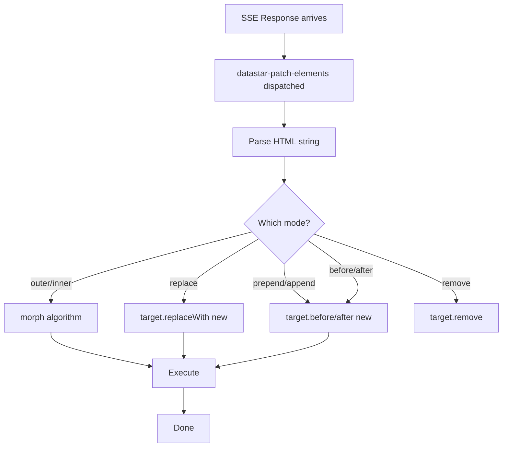

# Datastar -- DOM Morphing

The DOM morphing algorithm in `patchElements.ts` (729 lines) is Datastar's approach to updating the DOM while preserving component state. Rather than innerHTML replacement (which destroys all state), morphing matches old and new nodes by ID and tag name, updating only what changed.

**Aha:** Datastar's morph algorithm uses ID-set matching — a bottom-up algorithm that builds a map of "which IDs live under which element" and uses this to find the best match for each new node among old siblings. This is more precise than simple tag-name matching (like morphdom's soft match) because it considers the semantic structure of the tree, not just the immediate node.

Source: `library/src/plugins/watchers/patchElements.ts` — 729 lines

## Patch Modes

The `datastar-patch-elements` watcher accepts 8 modes:

| Mode | What it does | Requires Selector |
|------|-------------|-------------------|
| `remove` | Removes target elements | Yes |
| `outer` | Morphs target's outer HTML (default) | No (uses ID matching) |
| `inner` | Morphs target's inner HTML | Yes |
| `replace` | Replaces target with new content | No (uses ID matching) |
| `prepend` | Prepends new content | Yes |
| `append` | Appends new content | Yes |
| `before` | Inserts before target | Yes |
| `after` | Inserts after target | Yes |

## High-Level Flow



## The Morph Algorithm — Full Source Walkthrough

Source: `plugins/watchers/patchElements.ts` — 729 lines

### onPatchElements Entry (lines 82-177)

```typescript
const onPatchElements = ({ error }, { selector, mode, namespace, elements }) => {
  let newContent = document.createDocumentFragment()
  let consume = typeof elements !== 'string' && !!elements
```

**What:** `consume` tracks whether the `newContent` can be moved (not cloned). If elements come from a DocumentFragment or Element directly, they can be consumed. If from an HTML string, they must be cloned for multiple targets.

### HTML Parsing Strategy (lines 89-136)

```typescript
if (typeof elements === 'string') {
  // Remove SVGs before detecting full HTML (SVG contains <title> which looks like </head>)
  const elementsWithSvgsRemoved = elements.replace(/<svg(\s[^>]*>|>)([\s\S]*?)<\/svg>/gim, '')
  const hasHtml = /<\/html>/.test(elementsWithSvgsRemoved)
  const hasHead = /<\/head>/.test(elementsWithSvgsRemoved)
  const hasBody = /<\/body>/.test(elementsWithSvgsRemoved)

  const wrapperTag = namespace === 'svg' ? 'svg' : namespace === 'mathml' ? 'math' : ''
  const wrappedEls = wrapperTag ? `<${wrapperTag}>${elements}</${wrapperTag}>` : elements

  const newDocument = new DOMParser().parseFromString(
    hasHtml || hasHead || hasBody
      ? elements
      : `<body><template>${wrappedEls}</template></body>`,
    'text/html',
  )
```

**Aha:** SVG content is stripped before detection because `<svg><title>...</title></svg>` can falsely match `</head>` regex. The `<template>` wrapper is used because `DOMParser` strips whitespace and restructures HTML — wrapping in a template preserves the exact content.

### Target Resolution (lines 138-176)

When no selector and mode is `outer` or `replace`, targets are found by ID:

```typescript
if (!selector && (mode === 'outer' || mode === 'replace')) {
  const children = Array.from(newContent.children)
  for (const child of children) {
    let target: Element
    if (child instanceof HTMLHtmlElement) target = document.documentElement
    else if (child instanceof HTMLBodyElement) target = document.body
    else if (child instanceof HTMLHeadElement) target = document.head
    else target = document.getElementById(child.id)!

    // Consume prevents cloning — move the new content directly
    applyToTargets(mode, child, [target], true)
  }
}
```

When a selector exists, `querySelectorAll` finds targets:

```typescript
const targets = document.querySelectorAll(selector)
// Single target can consume (no cloning needed)
const targetList = consume && mode !== 'remove' ? [targets[0]!] : targets
if (targetList.length === 1) consume = true
applyToTargets(mode, newContent, targetList, consume)
```

**Aha:** When there's only one target, `consume = true` — the new content is moved rather than cloned. This preserves element identity and state (e.g., input focus, canvas state) for single-target morphs.

### applyToTargets — Mode Dispatch (lines 221-265)

```typescript
const applyToTargets = (mode, element, targets, consume) => {
  switch (mode) {
    case 'remove':
      for (const target of targets) { target.remove() }
      break
    case 'outer':
    case 'inner':
      for (const target of targets) {
        if (consume && used) break
        const nextNode = consume ? element : element.cloneNode(true)
        morph(target, nextNode, mode)
        execute(target)  // Run new scripts
        // Dispatch scope-children event if marker present
        const scopeHost = target.closest('[data-scope-children]')
        if (scopeHost) scopeHost.dispatchEvent(...)
        used = true
      }
      break
    case 'replace':
      applyPatchMode(targets, element, 'replaceWith', consume)
      break
    case 'prepend': case 'append': case 'before': case 'after':
      applyPatchMode(targets, element, mode, consume)
  }
}
```

For `outer`/`inner` modes, the `morph()` function does the ID-set matching. For other modes, `applyPatchMode` calls the native DOM method directly (`replaceWith`, `prepend`, `append`, `before`, `after`).

### Phase 1: ID Collection (lines 267-328)

```typescript
const ctxIdMap = new Map<Node, Set<string>>()        // Node → set of descendant IDs
const ctxPersistentIds = new Set<string>()            // IDs in both old and new
const oldIdTagNameMap = new Map<string, string>()     // id → tagName (for matching)
const duplicateIds = new Set<string>()                // Duplicate IDs (excluded)
const ctxPantry = document.createElement('div')       // Hidden scratchpad
ctxPantry.hidden = true
```

Module-level context variables — these are reused across morph calls and cleared each time.

**Duplicate detection:**
```typescript
for (const { id, tagName } of oldIdElements) {
  if (oldIdTagNameMap.has(id)) { duplicateIds.add(id) }
  else { oldIdTagNameMap.set(id, tagName) }
}
```

If the same ID appears twice in old content, it's flagged as duplicate and excluded from persistent IDs. This prevents ambiguous matching.

**Persistent ID computation:**
```typescript
for (const { id, tagName } of newIdElements) {
  if (ctxPersistentIds.has(id)) { duplicateIds.add(id) }
  else if (oldIdTagNameMap.get(id) === tagName) {
    ctxPersistentIds.add(id)  // Same ID, same tag → persistent
  }
}
```

Only IDs that exist in BOTH old and new content with the SAME tag name are persistent. If the tag changed (e.g., `<div id="foo">` → `<span id="foo">`), it's not persistent — the old element will be replaced.

### morphChildren — Core Algorithm (lines 348-441)

```typescript
const morphChildren = (oldParent, newParent, insertionPoint, endPoint) => {
  // Normalize template elements
  if (oldParent instanceof HTMLTemplateElement && newParent instanceof HTMLTemplateElement) {
    oldParent = oldParent.content as unknown as Element
    newParent = newParent.content as unknown as Element
  }
  insertionPoint ??= oldParent.firstChild

  for (const newChild of newParent.childNodes) {
    if (insertionPoint && insertionPoint !== endPoint) {
      const bestMatch = findBestMatch(newChild, insertionPoint, endPoint)
      if (bestMatch) {
        // Remove nodes between insertionPoint and bestMatch
        if (bestMatch !== insertionPoint) {
          let cursor = insertionPoint
          while (cursor && cursor !== bestMatch) {
            const tempNode = cursor
            cursor = cursor.nextSibling
            removeNode(tempNode)
          }
        }
        morphNode(bestMatch, newChild)
        insertionPoint = bestMatch.nextSibling
        continue
      }
    }
```

For each new child, try to find a matching old node. If found, remove intervening nodes (they're no longer needed), morph the match, and advance the insertion point.

### isSoftMatch (lines 525-532)

```typescript
const isSoftMatch = (oldNode, newNode) =>
  oldNode.nodeType === newNode.nodeType &&
  (oldNode as Element).tagName === (newNode as Element).tagName &&
  (!(oldNode as Element).id || (oldNode as Element).id === (newNode as Element).id)
```

A soft match requires: same node type, same tag name, and either no ID on the old node OR matching IDs. An old node with an ID that doesn't match the new node's ID is NOT a soft match — it has state we shouldn't overwrite.

### Script Execution

Newly added `<script>` elements are cloned and executed:

```typescript
const scripts = new WeakSet<HTMLScriptElement>()
// Initially populated with all existing scripts

const execute = (target: Element) => {
  for (const old of target.querySelectorAll('script')) {
    if (!scripts.has(old)) {
      const script = document.createElement('script')
      // Copy all attributes
      script.text = old.text
      old.replaceWith(script)  // Clone + replace = execute
      scripts.add(script)
    }
  }
}
```

Scripts are tracked in a `WeakSet` so the same script is never executed twice, even if it's morphed multiple times.

### The Pantry Pattern

Persistent-ID elements that need to be preserved but aren't currently in the DOM are moved to a hidden "pantry" element:

```typescript
const ctxPantry = document.createElement('div')
ctxPantry.hidden = true

const removeNode = (node: Node) => {
  ctxIdMap.has(node)
    ? moveBefore(ctxPantry, node, null)  // Move to pantry for later reuse
    : node.parentNode?.removeChild(node)   // Permanently remove
}
```

This is like a DOM "scratchpad" — elements are temporarily shelved rather than destroyed, so they can be moved back into the DOM later if the morph needs them.

### data-ignore-morph and data-preserve-attr

Two special attributes control morph behavior:

```html
<!-- Skip morphing entirely -->
<div data-ignore-morph data-ignore-morph>...</div>

<!-- Preserve specific attributes during morph -->
<div data-preserve-attr="data-custom-state">...</div>
```

### data-scope-children

After morphing, elements with `data-scope-children` dispatch a `datastar-scope-children` event:

```typescript
if (shouldScopeChildren) {
  oldElt.dispatchEvent(new CustomEvent(DATASTAR_SCOPE_CHILDREN_EVENT, { bubbles: false }))
}
```

This allows plugins to know when their scoped children have been morphed, enabling them to re-bind or re-initialize.

See [Watchers](09-watchers.md) for how morph is invoked.
See [SSE Streaming](08-sse-streaming.md) for how morph content arrives from the server.
