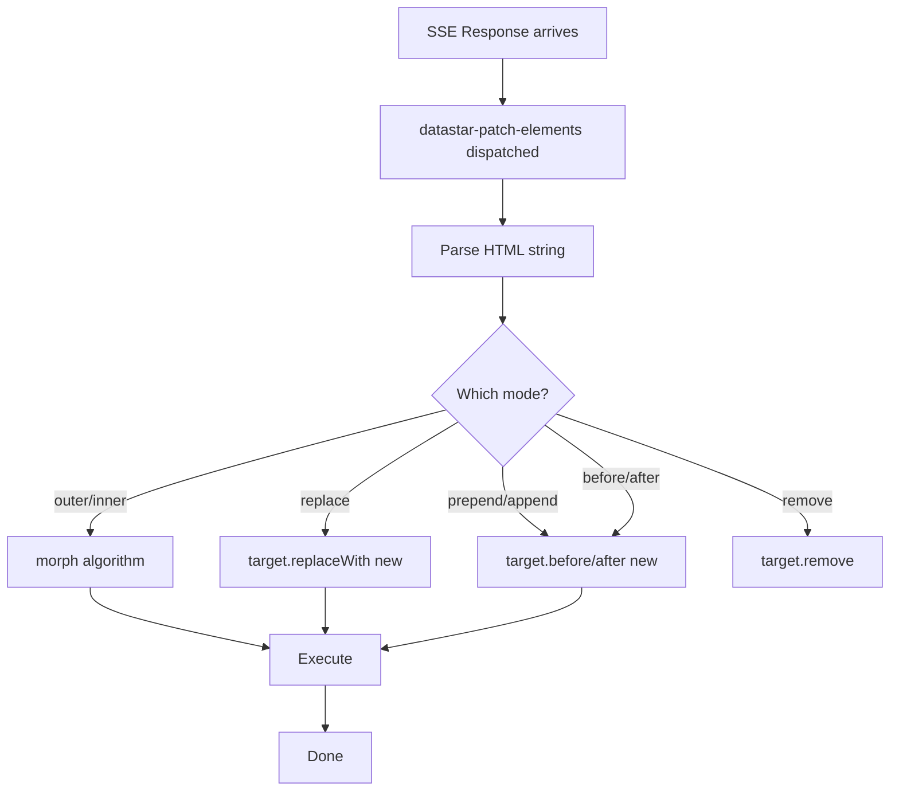
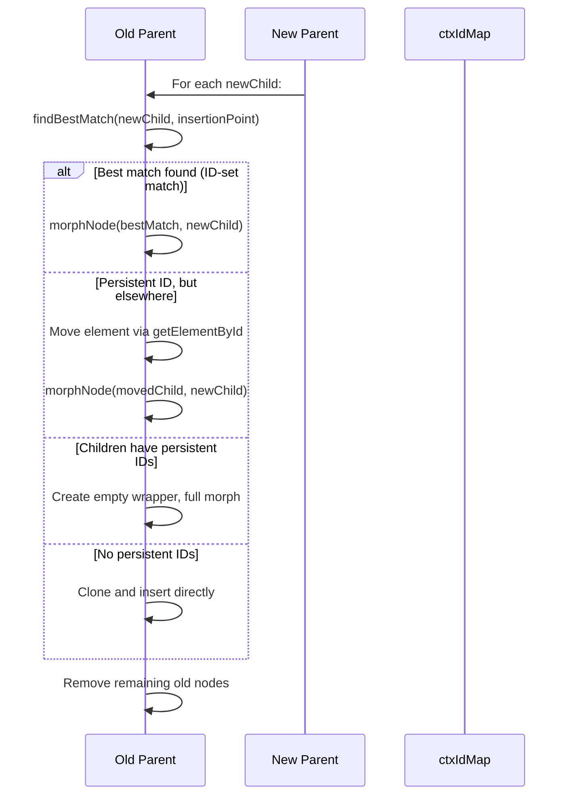

# Datastar -- DOM Morphing

The DOM morphing algorithm in `patchElements.ts` (729 lines) is Datastar's approach to updating the DOM while preserving component state. Rather than innerHTML replacement (which destroys all state), morphing matches old and new nodes by ID and tag name, updating only what changed.

**Aha:** Datastar's morph algorithm uses ID-set matching — a bottom-up algorithm that builds a map of "which IDs live under which element" and uses this to find the best match for each new node among old siblings. This is more precise than simple tag-name matching (like morphdom's soft match) because it considers the semantic structure of the tree, not just the immediate node.

Source: `library/src/plugins/watchers/patchElements.ts` — 729 lines

## Patch Modes

The `datastar-patch-elements` watcher accepts 8 modes:

| Mode | What it does | Requires Selector |
|------|-------------|-------------------|
| `remove` | Removes target elements | Yes |
| `outer` | Morphs target's outer HTML (default) | No (uses ID matching) |
| `inner` | Morphs target's inner HTML | Yes |
| `replace` | Replaces target with new content | No (uses ID matching) |
| `prepend` | Prepends new content | Yes |
| `append` | Appends new content | Yes |
| `before` | Inserts before target | Yes |
| `after` | Inserts after target | Yes |

## High-Level Flow



## The Morph Algorithm

The morph algorithm has three phases:

### Phase 1: ID Collection

```typescript
// Collect all IDs in old content
const oldIdElements = oldElt.querySelectorAll('[id]')
for (const { id, tagName } of oldIdElements) {
  oldIdTagNameMap.set(id, tagName)
}

// Collect all persistent IDs (exist in both old and new with same tag)
const newIdElements = normalizedElt.querySelectorAll('[id]')
for (const { id, tagName } of newIdElements) {
  if (oldIdTagNameMap.get(id) === tagName) {
    ctxPersistentIds.add(id)
  }
}
```

A "persistent ID" is one that exists in both old and new content with the same tag name. These are the IDs that should be preserved across the morph.

### Phase 2: ID-Set Map Construction

```typescript
// populateIdMapWithTree: bottom-up algorithm
for (const elt of elements) {
  if (ctxPersistentIds.has(elt.id)) {
    let current = elt
    while (current && current !== root) {
      let idSet = ctxIdMap.get(current)
      if (!idSet) { idSet = new Set(); ctxIdMap.set(current, idSet) }
      idSet.add(elt.id)
      current = current.parentElement
    }
  }
}
```

This walks up from each persistent-ID element to the root, adding the ID to every ancestor's set. The result is a map where each element knows "which persistent IDs live under me."

### Phase 3: Morph Children



### findBestMatch — The Core Matching Logic

```typescript
const findBestMatch = (node, startPoint, endPoint) => {
  let bestMatch = null
  let softMatchCount = 0
  let displaceMatchCount = 0
  const nodeMatchCount = ctxIdMap.get(node)?.size || 0

  for (let cursor = startPoint; cursor && cursor !== endPoint; cursor = cursor.nextSibling) {
    if (isSoftMatch(cursor, node)) {
      // Check for ID-set match
      const oldSet = ctxIdMap.get(cursor)
      const newSet = ctxIdMap.get(node)
      if (newSet && oldSet) {
        for (const id of oldSet) {
          if (newSet.has(id)) return cursor  // ID-set match!
        }
      }

      // Save soft match as fallback
      if (!bestMatch && !ctxIdMap.has(cursor)) {
        if (!nodeMatchCount) return cursor  // Can't ID-match, return soft match
        bestMatch = cursor
      }
    }

    // Don't displace more IDs than the node contains
    displaceMatchCount += ctxIdMap.get(cursor)?.size || 0
    if (displaceMatchCount > nodeMatchCount) break

    // Block soft matching after 2 future soft matches
    if (bestMatch === null && nextSibling && isSoftMatch(cursor, nextSibling)) {
      siblingSoftMatchCount++
      if (siblingSoftMatchCount >= 2) bestMatch = undefined
    }
  }

  return bestMatch || null
}
```

**Aha:** The displacement guard (`displaceMatchCount > nodeMatchCount`) prevents the algorithm from greedily matching nodes at the cost of displacing more important matches downstream. If matching this node would push 3 persistent-ID elements out of position but the node itself only contains 1 persistent ID, it's better to skip and let the downstream elements match first.

### morphNode — Attribute Syncing

Once a match is found, `morphNode` syncs the old node to the new:

1. **Attribute comparison**: Every attribute from the new node is compared and applied to the old
2. **Attribute removal**: Attributes on the old node but not the new are removed
3. **Special element handling**: input values, textarea values, option selected state — synced via DOM properties, not attributes
4. **Recursive morph**: If children differ, `morphChildren` recurses

### Special Element Handling

The morph algorithm has special cases for form elements:

```typescript
// HTMLInputElement (non-file)
if (oldElt.value !== newElt.getAttribute('value')) {
  oldElt.value = newValue ?? ''  // Sync via property, not attribute
}
oldElt.checked = newElt.hasAttribute('checked')
oldElt.disabled = newElt.hasAttribute('disabled')

// HTMLTextAreaElement
if (oldElt.defaultValue !== newElt.value) {
  oldElt.value = newValue
}

// HTMLOptionElement
oldElt.selected = newElt.hasAttribute('selected')
```

**Aha:** For `<input>` elements, the morph sets `.value` directly rather than the `value` attribute. This matters because the browser tracks the current input value separately from the attribute — setting the attribute alone wouldn't update what the user sees in the input field.

### Script Execution

Newly added `<script>` elements are cloned and executed:

```typescript
const scripts = new WeakSet<HTMLScriptElement>()
// Initially populated with all existing scripts

const execute = (target: Element) => {
  for (const old of target.querySelectorAll('script')) {
    if (!scripts.has(old)) {
      const script = document.createElement('script')
      // Copy all attributes
      script.text = old.text
      old.replaceWith(script)  // Clone + replace = execute
      scripts.add(script)
    }
  }
}
```

Scripts are tracked in a `WeakSet` so the same script is never executed twice, even if it's morphed multiple times.

### The Pantry Pattern

Persistent-ID elements that need to be preserved but aren't currently in the DOM are moved to a hidden "pantry" element:

```typescript
const ctxPantry = document.createElement('div')
ctxPantry.hidden = true

const removeNode = (node: Node) => {
  ctxIdMap.has(node)
    ? moveBefore(ctxPantry, node, null)  // Move to pantry for later reuse
    : node.parentNode?.removeChild(node)   // Permanently remove
}
```

This is like a DOM "scratchpad" — elements are temporarily shelved rather than destroyed, so they can be moved back into the DOM later if the morph needs them.

### data-ignore-morph and data-preserve-attr

Two special attributes control morph behavior:

```html
<!-- Skip morphing entirely -->
<div data-ignore-morph data-ignore-morph>...</div>

<!-- Preserve specific attributes during morph -->
<div data-preserve-attr="data-custom-state">...</div>
```

### data-scope-children

After morphing, elements with `data-scope-children` dispatch a `datastar-scope-children` event:

```typescript
if (shouldScopeChildren) {
  oldElt.dispatchEvent(new CustomEvent(DATASTAR_SCOPE_CHILDREN_EVENT, { bubbles: false }))
}
```

This allows plugins to know when their scoped children have been morphed, enabling them to re-bind or re-initialize.

See [Watchers](09-watchers.md) for how morph is invoked.
See [SSE Streaming](08-sse-streaming.md) for how morph content arrives from the server.
