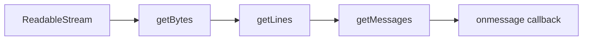
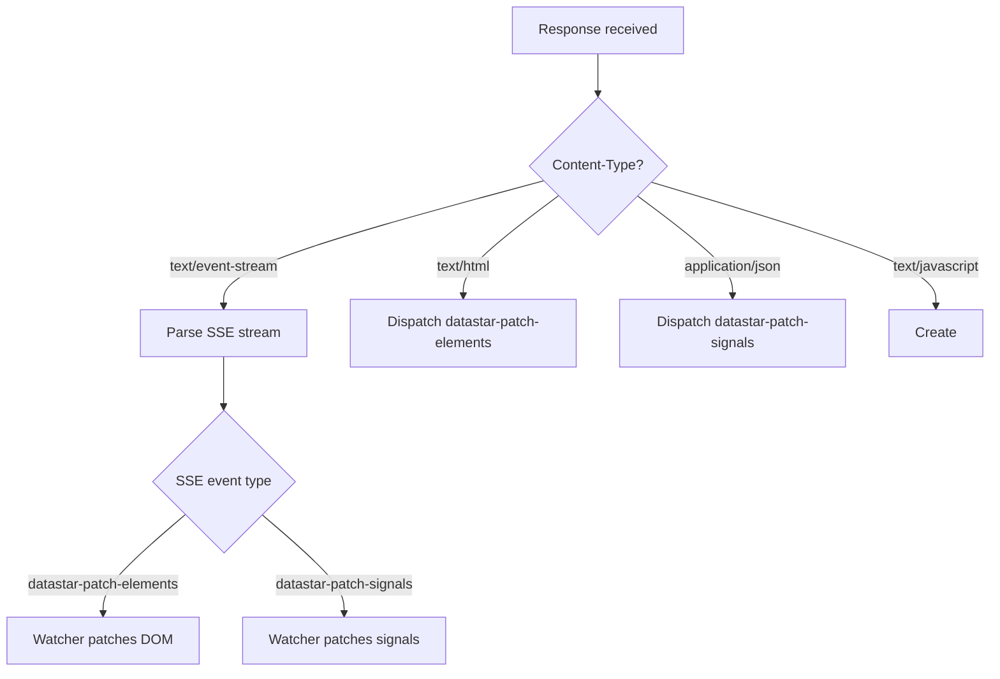

# Datastar -- SSE Streaming

The fetch action plugin implements a complete Server-Sent Events client built on the `fetch` API rather than the browser's `EventSource`. This enables POST/PUT/PATCH/DELETE requests with request bodies while receiving streaming responses.

**Aha:** The browser's native `EventSource` only supports GET requests. Datastar needs to send signal state (via POST/PUT/PATCH) to the server and receive streaming DOM updates back. By building an SSE parser on top of `fetch` + `ReadableStream`, the fetch plugin gets full HTTP method support with the same streaming semantics.

Source: `library/src/plugins/actions/fetch.ts` — fetchEventSource function (lines 455-692)

## SSE Wire Format

SSE responses follow the W3C Event Stream format:

```
event: datastar-patch-elements
data: selector #main-content
data: mode inner
data: elements <div>Hello World</div>

event: datastar-patch-signals
data: signals {"count":42,"message":"Hello"}

```

Each message is a block of `field: value` lines separated by an empty line. Fields:

| Field | Purpose |
|-------|---------|
| `event` | Event type name |
| `data` | Payload (can span multiple lines) |
| `id` | Event ID (for reconnection) |
| `retry` | Reconnection interval in ms |

## SSE Parsing Pipeline

The fetch plugin implements a 3-stage pipeline:



### Stage 1: getBytes

Reads the `ReadableStream<Uint8Array>` chunk by chunk:

```typescript
const getBytes = async (stream, onChunk) => {
  const reader = stream.getReader()
  let result = await reader.read()
  while (!result.done) {
    onChunk(result.value)
    result = await reader.read()
  }
}
```

### Stage 2: getLines

Converts byte chunks into lines, handling the SSE line-splitting protocol:

```typescript
const getLines = (onLine) => {
  let buffer, position, fieldLength, discardTrailingNewline

  return (arr) => {
    // Append new bytes to buffer
    // Scan for \r\n or \n line endings
    // For each complete line, call onLine(line, fieldLength)
    // fieldLength = position of first ":" in line (for "field: value" parsing)
  }
}
```

Key SSE detail: A colon (`:`) in the stream marks the field/value separator. The parser records the field length when it sees the first colon, then passes it to `onLine` so the value can be extracted without re-scanning.

### Stage 3: getMessages

Assembles lines into SSE messages:

```typescript
const getMessages = (onId, onRetry, onMessage) => {
  let message = { data: '', event: '', id: '', retry: undefined }

  return (line, fieldLength) => {
    if (!line.length) {
      // Empty line = end of message
      onMessage?.(message)
      message = newMessage()
    } else if (fieldLength > 0) {
      const field = decoder.decode(line.subarray(0, fieldLength))
      const value = decoder.decode(line.subarray(valueOffset))
      switch (field) {
        case 'data': message.data = message.data ? `${message.data}\n${value}` : value; break
        case 'event': message.event = value; break
        case 'id': onId(message.id = value); break
        case 'retry': onRetry(message.retry = +value); break
      }
    }
  }
}
```

Multiple `data:` lines are joined with `\n` per the SSE spec.

## Response Content-Type Handling

After the response arrives, the fetch plugin checks the Content-Type header:



### Non-SSE Responses

| Content-Type | Behavior |
|-------------|----------|
| `text/html` | Dispatches `datastar-patch-elements` with the HTML string as `elements` |
| `application/json` | Dispatches `datastar-patch-signals` with the JSON string as `signals` |
| `text/javascript` | Creates a `<script>` element, sets `textContent`, appends to `<head>` |

This means a server can return a simple HTML fragment without SSE wrapping, and Datastar will still patch it into the DOM.

## Retry with Exponential Backoff

```typescript
// On error
retryInterval = Math.min(retryInterval * retryScaler, retryMaxWait)
retryTimer = setTimeout(create, retryInterval)
if (++retries >= retryMaxCount) {
  dispatchFetch('retries-failed', el, {})
  reject('Max retries reached.')
}
```

Default retry parameters:

| Parameter | Default | Purpose |
|-----------|---------|---------|
| `retryInterval` | 1000ms | Initial delay |
| `retryScaler` | 2 | Exponential multiplier |
| `retryMaxWait` | 30000ms | Maximum delay cap |
| `retryMaxCount` | 10 | Maximum retry attempts |

The retry sequence: 1s, 2s, 4s, 8s, 16s, 30s (capped), 30s, 30s, 30s, 30s.

## Last-Event-ID Header

For reconnection, the `id` field from SSE messages is sent back as the `Last-Event-ID` header:

```typescript
case 'id':
  if (id) headers['last-event-id'] = id
  else delete headers['last-event-id']
```

This allows the server to resume from the last known event position when the client reconnects.

## Visibility Change Handling

```typescript
const onVisibilityChange = () => {
  curRequestController.abort() // Close existing request
  if (!document.hidden) {
    create() // Reconnect when tab becomes visible
  }
}
if (!openWhenHidden) {
  document.addEventListener('visibilitychange', onVisibilityChange)
}
```

By default, SSE connections persist when the tab is hidden. Set `openWhenHidden: false` to close and reconnect when the tab becomes visible again.

See [Action Plugins](06-action-plugins.md) for the fetch plugin interface.
See [Watchers](09-watchers.md) for how SSE events trigger DOM/signal patches.
