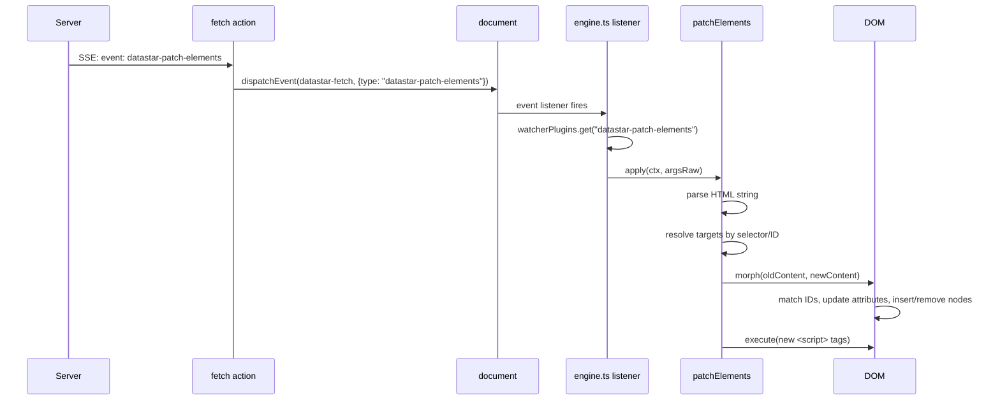

# Datastar -- Watchers

Watcher plugins listen for custom events dispatched on the `document` via the `datastar-fetch` event. Two watchers ship with Datastar: `datastar-patch-elements` and `datastar-patch-signals`.

**Aha:** Unlike attribute plugins which are bound to DOM elements and live as long as the element exists, watchers are one-shot event handlers. They fire when the fetch plugin dispatches a `datastar-fetch` event with a matching `type`, process their work, and return. There is no cleanup function — watchers are stateless.

Source: `library/src/engine/engine.ts` (lines 93-115 — event routing), `library/src/plugins/watchers/patchElements.ts` (729 lines), `library/src/plugins/watchers/patchSignals.ts` (20 lines)

## How Watchers Work — Engine-Level Event Routing

### Single Event Listener (Lines 93-111)

```typescript
// engine/engine.ts:93-111
document.addEventListener(DATASTAR_FETCH_EVENT, ((
  evt: CustomEvent<DatastarFetchEvent>,
) => {
  const plugin = watcherPlugins.get(evt.detail.type)
  if (plugin) {
    plugin.apply(
      {
        error: error.bind(0, {
          plugin: { type: 'watcher', name: plugin.name },
          element: {
            id: (evt.target as Element).id,
            tag: (evt.target as Element).tagName,
          },
        }),
      },
      evt.detail.argsRaw,
    )
  }
}) as EventListener)
```

**Aha:** There is only ONE event listener for ALL watchers. When the fetch plugin dispatches a `datastar-fetch` event, the engine looks up the watcher by `evt.detail.type` and calls its `apply`. The error factory is bound with the watcher type and the triggering element's ID/tag, so any watcher error includes full context.

### Watcher Registration (Lines 113-115)

```typescript
// engine/engine.ts:113-115
export const watcher = (plugin: WatcherPlugin): void => {
  watcherPlugins.set(plugin.name, plugin)
}
```

Watchers register immediately at module load time. No queuing is needed — they're discovered via Map lookup, not DOM scanning.

### Event Dispatch from Fetch Plugin

When the fetch plugin receives an SSE event, it dispatches to watchers:

```typescript
// From fetch action plugin SSE handler:
document.dispatchEvent(new CustomEvent(DATASTAR_FETCH_EVENT, {
  detail: {
    type: 'datastar-patch-elements',
    argsRaw: { selector: '#main', mode: 'inner', elements: '<p>Hello</p>' },
  },
}))
```

The engine's single listener receives this, looks up `watcherPlugins.get('datastar-patch-elements')`, and calls its `apply` with `argsRaw`.

## 1. datastar-patch-elements — Full Source Walkthrough

Source: `plugins/watchers/patchElements.ts` — 729 lines

### Imports and Constants (Lines 1-13)

```typescript
import { watcher } from '@engine'
import {
  DATASTAR_PROP_CHANGE_EVENT,
  DATASTAR_SCOPE_CHILDREN_EVENT,
} from '@engine/consts'
import type { WatcherArgsValue, WatcherContext } from '@engine/types'
import { isHTMLOrSVG } from '@utils/dom'
import { aliasify } from '@utils/text'
import { supportsViewTransitions } from '@utils/view-transitions'
```

### Type Guards (Lines 15-33)

```typescript
// patchElements.ts:15-18
const isValidType = <T extends readonly string[]>(
  arr: T,
  value: string,
): value is T[number] => (arr as readonly string[]).includes(value)

// patchElements.ts:20-33
const PATCH_MODES = [
  'remove', 'outer', 'inner', 'replace',
  'prepend', 'append', 'before', 'after',
] as const
type PatchElementsMode = (typeof PATCH_MODES)[number]

const NAMESPACES = ['html', 'svg', 'mathml'] as const
type Namespace = (typeof NAMESPACES)[number]
```

The `isValidType` function is a TypeScript type guard — it narrows `value` to `T[number]` at compile time. This is used to validate that user-provided mode/namespace strings are one of the allowed values.

### Watcher Entry (Lines 43-80)

```typescript
// patchElements.ts:43-80
watcher({
  name: 'datastar-patch-elements',
  apply(ctx, args) {
    // Step 1: Extract and validate arguments
    const selector = typeof args.selector === 'string' ? args.selector : ''
    const mode = typeof args.mode === 'string' ? args.mode : 'outer'
    const namespace =
      typeof args.namespace === 'string' ? args.namespace : 'html'
    const useViewTransitionRaw =
      typeof args.useViewTransition === 'string' ? args.useViewTransition : ''
    const elements = args.elements

    // Step 2: Validate mode
    if (!isValidType(PATCH_MODES, mode)) {
      throw ctx.error('PatchElementsInvalidMode', { mode })
    }

    // Step 3: Require selector for non-outer/replace modes
    if (!selector && mode !== 'outer' && mode !== 'replace') {
      throw ctx.error('PatchElementsExpectedSelector')
    }

    // Step 4: Validate namespace
    if (!isValidType(NAMESPACES, namespace)) {
      throw ctx.error('PatchElementsInvalidNamespace', { namespace })
    }

    const args2: PatchElementsArgs = {
      selector,
      mode,
      namespace,
      useViewTransition: useViewTransitionRaw.trim() === 'true',
      elements,
    }

    // Step 5: View Transitions wrapper
    if (supportsViewTransitions && args2.useViewTransition) {
      document.startViewTransition(() => onPatchElements(ctx, args2))
    } else {
      onPatchElements(ctx, args2)
    }
  },
})
```

The watcher validates inputs then delegates to `onPatchElements`. The View Transitions API wrapper uses `document.startViewTransition` — this creates a CSS transition between the old and new DOM state, automatically animating differences.

### Script Tracking (Lines 179-182)

```typescript
// patchElements.ts:179-182
const scripts = new WeakSet<HTMLScriptElement>()
for (const script of document.querySelectorAll('script')) {
  scripts.add(script)
}
```

**Aha:** At module load time, all existing `<script>` elements are recorded in a `WeakSet`. This allows the morph algorithm to distinguish between scripts that were already on the page (don't re-execute) and new scripts added by the server (execute them). The `WeakSet` ensures that when a script is removed from the DOM, it's automatically garbage collected — no memory leak.

### Script Execution (Lines 184-200)

```typescript
// patchElements.ts:184-200
const execute = (target: Element): void => {
  const elScripts =
    target instanceof HTMLScriptElement
      ? [target]
      : target.querySelectorAll('script')
  for (const old of elScripts) {
    if (!scripts.has(old)) {
      const script = document.createElement('script')
      for (const { name, value } of old.attributes) {
        script.setAttribute(name, value)
      }
      script.text = old.text
      old.replaceWith(script)
      scripts.add(script)
    }
  }
}
```

New scripts are executed by creating a fresh `<script>` element, copying all attributes, setting the text content, and replacing the original. The replacement triggers execution. The new script is added to the `WeakSet` so it's never executed again even if morphed multiple times.

### onPatchElements Entry (Lines 82-177)

```typescript
// patchElements.ts:82-177
const onPatchElements = (
  { error }: WatcherContext,
  { selector, mode, namespace, elements }: PatchElementsArgs,
) => {
  let newContent = document.createDocumentFragment()
  let consume = typeof elements !== 'string' && !!elements
```

The `consume` flag tracks whether `newContent` can be moved rather than cloned. If elements come from a `DocumentFragment` or `Element`, they can be consumed. If from an HTML string, they must be cloned for multiple targets.

### HTML Parsing Strategy (Lines 89-136)

```typescript
// patchElements.ts:89-136
if (typeof elements === 'string') {
  // Remove SVGs before detection — SVG <title> looks like </head>
  const elementsWithSvgsRemoved = elements.replace(
    /<svg(\s[^>]*>|>)([\s\S]*?)<\/svg>/gim,
    '',
  )
  const hasHtml = /<\/html>/.test(elementsWithSvgsRemoved)
  const hasHead = /<\/head>/.test(elementsWithSvgsRemoved)
  const hasBody = /<\/body>/.test(elementsWithSvgsRemoved)

  const wrapperTag =
    namespace === 'svg' ? 'svg' : namespace === 'mathml' ? 'math' : ''
  const wrappedEls = wrapperTag
    ? `<${wrapperTag}>${elements}</${wrapperTag}>`
    : elements

  const newDocument = new DOMParser().parseFromString(
    hasHtml || hasHead || hasBody
      ? elements
      : `<body><template>${wrappedEls}</template></body>`,
    'text/html',
  )
```

**Aha:** SVG content is stripped before HTML detection because `<svg><title>...</title></svg>` can falsely match the `</head>` regex. The `<template>` wrapper is used because `DOMParser` strips whitespace and restructures HTML — wrapping in a template preserves the exact content.

After parsing, the content is extracted based on what was found:

```typescript
  if (hasHtml) {
    newContent.appendChild(newDocument.documentElement)
  } else if (hasHead && hasBody) {
    newContent.appendChild(newDocument.head)
    newContent.appendChild(newDocument.body)
  } else if (hasHead) {
    newContent.appendChild(newDocument.head)
  } else if (hasBody) {
    newContent.appendChild(newDocument.body)
  } else if (wrapperTag) {
    // For SVG/MathML: extract from template wrapper
    const wrapperEl = newDocument
      .querySelector('template')!
      .content.querySelector(wrapperTag)!
    for (const child of wrapperEl.childNodes) {
      newContent.appendChild(child)
    }
  } else {
    newContent = newDocument.querySelector('template')!.content
  }
} else if (elements) {
  // Elements came from a DocumentFragment or Element
  if (elements instanceof DocumentFragment) {
    newContent = elements
  } else if (elements instanceof Element) {
    newContent.appendChild(elements)
  }
}
```

### Target Resolution (Lines 138-176)

**Case 1: No selector, outer/replace mode** — targets found by ID:
```typescript
// patchElements.ts:138-160
if (!selector && (mode === 'outer' || mode === 'replace')) {
  const children = Array.from(newContent.children)
  for (const child of children) {
    let target: Element
    if (child instanceof HTMLHtmlElement) {
      target = document.documentElement
    } else if (child instanceof HTMLBodyElement) {
      target = document.body
    } else if (child instanceof HTMLHeadElement) {
      target = document.head
    } else {
      target = document.getElementById(child.id)!
      if (!target) {
        console.warn(error('PatchElementsNoTargetsFound'), {
          element: { id: child.id },
        })
        continue
      }
    }
    // Consume prevents cloning for single targets
    applyToTargets(mode as PatchElementsMode, child, [target], true)
  }
}
```

**Case 2: Selector present** — targets found by querySelectorAll:
```typescript
// patchElements.ts:161-176
else {
  const targets = document.querySelectorAll(selector)
  if (!targets.length) {
    console.warn(error('PatchElementsNoTargetsFound'), { selector })
    return
  }

  const targetList = consume && mode !== 'remove' ? [targets[0]!] : targets

  // Single target optimization: consume instead of clone
  if (targetList.length === 1) {
    consume = true
  }

  applyToTargets(mode as PatchElementsMode, newContent, targetList, consume)
}
```

**Aha:** When there's only one target, `consume = true` — the new content is moved rather than cloned. This preserves element identity and state (e.g., input focus, canvas state) for single-target patches. This optimization was added specifically to address [issue #1155](https://github.com/starfederation/datastar/issues/1155).

### applyToTargets — Mode Dispatch (Lines 221-265)

```typescript
// patchElements.ts:221-265
const applyToTargets = (
  mode: PatchElementsMode,
  element: DocumentFragment | Element,
  targets: Iterable<Element>,
  consume: boolean,
) => {
  switch (mode) {
    case 'remove':
      for (const target of targets) {
        target.remove()
      }
      break
    case 'outer':
    case 'inner':
      {
        let used = false
        for (const target of targets) {
          if (consume && used) break
          const nextNode = consume ? element : (element.cloneNode(true) as Element)
          morph(target, nextNode, mode)
          execute(target)  // Run new <script> tags
          const scopeHost = target.closest('[data-scope-children]')
          if (scopeHost) {
            scopeHost.dispatchEvent(
              new CustomEvent(DATASTAR_SCOPE_CHILDREN_EVENT, { bubbles: false })
            )
          }
          used = true
        }
      }
      break
    case 'replace':
      applyPatchMode(targets, element, 'replaceWith', consume)
      break
    case 'prepend':
    case 'append':
    case 'before':
    case 'after':
      applyPatchMode(targets, element, mode, consume)
  }
}
```

For `outer`/`inner` modes, the `morph()` function does the ID-set matching. For other modes, `applyPatchMode` calls the native DOM method directly.

### applyPatchMode — Non-Morph Insertion (Lines 202-219)

```typescript
// patchElements.ts:202-219
const applyPatchMode = (
  targets: Iterable<Element>,
  element: DocumentFragment | Element,
  action: string,
  consume: boolean,
) => {
  let used = false
  for (const target of targets) {
    if (consume && used) break
    const nextNode = consume ? element : (element.cloneNode(true) as Element)
    execute(nextNode as Element)  // Run new scripts
    target[action](nextNode)       // replaceWith, prepend, append, before, after
    used = true
  }
}
```

### morph — The DOM Morph Algorithm (Lines 276-342)

The full morph algorithm is covered in [DOM Morphing](07-dom-morphing.md). Here's the entry point:

```typescript
// patchElements.ts:276-342
export const morph = (
  oldElt: Element | ShadowRoot,
  newContent: DocumentFragment | Element,
  mode: 'outer' | 'inner' = 'outer',
): void => {
  // Check data-ignore-morph
  if (/* ... */) return

  // Normalize content into a wrapper div
  const normalizedElt = document.createElement('div')
  normalizedElt.append(newContent)

  // Position pantry
  document.body.insertAdjacentElement('afterend', ctxPantry)

  // Phase 1: Collect old IDs, detect duplicates
  const oldIdElements = oldElt.querySelectorAll('[id]')
  for (const { id, tagName } of oldIdElements) {
    if (oldIdTagNameMap.has(id)) duplicateIds.add(id)
    else oldIdTagNameMap.set(id, tagName)
  }

  // Phase 2: Compute persistent IDs (in both old and new, same tag)
  const newIdElements = normalizedElt.querySelectorAll('[id]')
  for (const { id, tagName } of newIdElements) {
    if (ctxPersistentIds.has(id)) duplicateIds.add(id)
    else if (oldIdTagNameMap.get(id) === tagName) ctxPersistentIds.add(id)
  }

  // Clean up and populate ID map with tree
  for (const id of duplicateIds) ctxPersistentIds.delete(id)
  oldIdTagNameMap.clear()
  duplicateIds.clear()
  ctxIdMap.clear()

  const parent = mode === 'outer' ? oldElt.parentElement! : oldElt
  populateIdMapWithTree(parent, oldIdElements)
  populateIdMapWithTree(normalizedElt, newIdElements)

  // Phase 3: morphChildren — the core algorithm
  morphChildren(parent, normalizedElt,
    mode === 'outer' ? oldElt : null,
    oldElt.nextSibling,
  )

  ctxPantry.remove()
}
```

See [DOM Morphing](07-dom-morphing.md) for the full morphChildren, findBestMatch, morphNode, and populateIdMapWithTree walkthroughs.

## 2. datastar-patch-signals — Full Source Walkthrough

Source: `plugins/watchers/patchSignals.ts` — 20 lines

```typescript
// patchSignals.ts:1-20
import { watcher } from '@engine'
import { mergePatch } from '@engine/signals'
import { jsStrToObject } from '@utils/text'

watcher({
  name: 'datastar-patch-signals',
  apply({ error }, { signals, onlyIfMissing }) {
    if (typeof signals !== 'string') {
      throw error('PatchSignalsExpectedSignals')
    }

    const ifMissing =
      typeof onlyIfMissing === 'string' && onlyIfMissing.trim() === 'true'
    mergePatch(jsStrToObject(signals), { ifMissing })
  },
})
```

This is the simplest watcher — only 20 lines. It:

1. **Validates** that `signals` is a string (the JSON payload from the server)
2. **Parses** the JSON string to an object via `jsStrToObject` (which supports function revival)
3. **Merges** into the global signal store via `mergePatch` with the `ifMissing` option

### mergePatch — JSON Merge Patch (from signals.ts)

```typescript
// engine/signals.ts
const mergePatch = (obj: Record<string, any>, { ifMissing = false } = {}) => {
  beginBatch()
  updateLeaves(obj, (value) => {
    // ... merge logic
  })
  endBatch()
}
```

The `mergePatch` function wraps updates in `beginBatch()`/`endBatch()` so all signal changes propagate in a single pass. The `ifMissing` option only creates signals that don't already exist — useful for servers that want to initialize client state without overwriting user edits.

### jsStrToObject — JSON with Function Revival (from text.ts)

```typescript
// utils/text.ts:30-53
export const jsStrToObject = (raw: string, options: JsStrToObjectOptions = {}) => {
  const { reviveFunctionStrings = false } = options
  try {
    if (!reviveFunctionStrings) return JSON.parse(raw)
    return JSON.parse(raw, (_k, value) => {
      if (typeof value !== 'string') return value
      const trimmed = value.trim()
      if (!RE_FUNCTION_LITERAL.test(trimmed)) return value
      try {
        const revived = Function(`return (${trimmed})`)()
        return typeof revived === 'function' ? revived : value
      } catch { return value }
    })
  } catch {
    // If JSON parsing fails, try to evaluate as a JavaScript object
    return Function(`return (${raw})`)()
  }
}
```

The function literal regex checks for `function` or `=>` patterns at the start of the string:

```typescript
// utils/text.ts:23-24
const RE_FUNCTION_LITERAL =
  /^(?:(?:async\s+)?function\b|(?:async\s*)?(?:\([^)]*\)|[A-Za-z_$][\w$]*)\s*=>)/
```

This matches: `function() {}`, `async function() {}`, `() => {}`, `x => {}`, `async () => {}`.

## Comparison: Watchers vs Attribute Plugins

| Aspect | Watcher Plugin | Attribute Plugin |
|--------|---------------|-----------------|
| Trigger | `datastar-fetch` event on document | Attribute on DOM element |
| Scope | Global (document-level) | Element-local |
| Lifecycle | One-shot per event | Long-lived (effect + cleanup) |
| Cleanup | None needed | Returns cleanup function |
| Registration | `watcher()` → Map lookup | `attribute()` → DOM scan |
| Examples | patchElements, patchSignals | bind, on, show, class, style |

Watchers are for server-pushed changes. Attribute plugins are for element-bound reactivity.

## Event Flow — Complete SSE to DOM Patch



See [DOM Morphing](07-dom-morphing.md) for the full morph algorithm.
See [SSE Streaming](08-sse-streaming.md) for how SSE events trigger watchers.
See [Signals](02-reactive-signals.md) for mergePatch and signal store internals.
