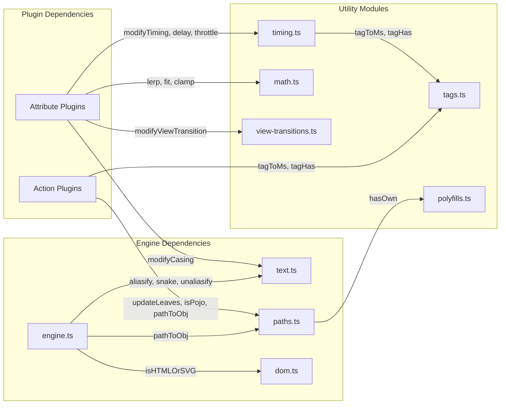

# Datastar -- Utility Systems

Eight utility modules support the engine and plugins with common operations: case conversion, timing, path manipulation, math, and DOM helpers.

**Aha:** The utility modules are pure functions with no side effects — they're the most portable parts of Datastar to other frameworks or to a Rust translation. Each is a self-contained module with a single responsibility.

Source: `library/src/utils/*.ts`

## text.ts — Case Conversion and String Utilities

Source: `utils/text.ts` — 79 lines

### Case Conversion Chain (Lines 3-21)

```typescript
// text.ts:3-10
export const kebab = (str: string): string =>
  str
    .replace(/([A-Z]+)([A-Z][a-z])/g, '$1-$2')  // "HTMLElement" → "HTML-Element"
    .replace(/([a-z0-9])([A-Z])/g, '$1-$2')     // "camelCase" → "camel-Case"
    .replace(/([a-z])([0-9]+)/gi, '$1-$2')      // "item123" → "item-123"
    .replace(/([0-9]+)([a-z])/gi, '$1-$2')      // "123item" → "123-item"
    .replace(/[\s_]+/g, '-')                     // "hello world" → "hello-world"
    .toLowerCase()
```

**Aha:** The first regex handles consecutive uppercase followed by a capitalized word — this is the tricky case that most kebab-case implementations miss. `"HTMLElement"` → `"HTML-Element"` not `"Ht-ml-Element"`. The regex `([A-Z]+)([A-Z][a-z])` matches the boundary between `HTML` and `Element`.

The remaining conversions are all built on top of `kebab`:

```typescript
// text.ts:12-13
export const camel = (str: string): string =>
  kebab(str).replace(/-./g, (x) => x[1].toUpperCase())

// text.ts:15
export const snake = (str: string): string => kebab(str).replace(/-/g, '_')

// text.ts:17-18
export const pascal = (str: string): string =>
  camel(str).replace(/(^.|(?<=\.).)/g, (x) => x[0].toUpperCase())

// text.ts:20-21
export const title = (str: string): string =>
  str.replace(/\b\w/g, (char) => char.toUpperCase())
```

`camel` converts to kebab first, then uppercases each letter after a hyphen. `snake` is kebab with underscores. `pascal` capitalizes the first letter of camelCase. `title` capitalizes each word.

### jsStrToObject — JSON with Function Revival (Lines 23-53)

```typescript
// text.ts:23-24
const RE_FUNCTION_LITERAL =
  /^(?:(?:async\s+)?function\b|(?:async\s*)?(?:\([^)]*\)|[A-Za-z_$][\w$]*)\s*=>)/
```

This regex matches function literals at the start of a string:

| Pattern | Matches |
|---------|---------|
| `(?:async\s+)?function\b` | `function() {}`, `async function() {}` |
| `(?:\([^)]*\)|[A-Za-z_$][\w$]*)\s*=>` | `() => {}`, `(x) => {}`, `x => {}` |
| `(?:async\s*)?` prefix | `async () => {}`, `async x => {}` |

```typescript
// text.ts:30-53
export const jsStrToObject = (
  raw: string,
  options: JsStrToObjectOptions = {},
) => {
  const { reviveFunctionStrings = false } = options
  try {
    if (!reviveFunctionStrings) return JSON.parse(raw)
    return JSON.parse(raw, (_k, value) => {
      if (typeof value !== 'string') return value
      const trimmed = value.trim()
      if (!RE_FUNCTION_LITERAL.test(trimmed)) return value
      try {
        const revived = Function(`return (${trimmed})`)()
        return typeof revived === 'function' ? revived : value
      } catch {
        return value
      }
    })
  } catch {
    // If JSON parsing fails, try to evaluate as a JavaScript object
    return Function(`return (${raw})`)()
  }
}
```

**Aha:** The function has three fallback levels:
1. Standard `JSON.parse` if `reviveFunctionStrings` is false
2. `JSON.parse` with a reviver that evals function strings
3. Direct `Function` eval if the string isn't valid JSON at all (level 3 is the least safe)

The reviver function is called for every value in the JSON tree. Only string values that match the function literal regex are evaluated. Non-function strings pass through unchanged.

### modifyCasing — Runtime Case Transformation (Lines 55-70)

```typescript
// text.ts:55-59
const caseFns: Record<string, (s: string) => string> = {
  camel: (str) => str.replace(/-[a-z]/g, (x) => x[1].toUpperCase()),
  snake: (str) => str.replace(/-/g, '_'),
  pascal: (str) => str[0].toUpperCase() + caseFns.camel(str.slice(1)),
}

// text.ts:61-70
export const modifyCasing = (
  str: string,
  mods: Modifiers,
  defaultCase = 'camel',
): string => {
  for (const c of mods.get('case') || [defaultCase]) {
    str = caseFns[c]?.(str) || str
  }
  return str
}
```

Used by `data-bind:snake` to convert signal key names to attribute names. The `case` modifier is read from `mods.get('case')` — if present, each case function is applied in sequence. The default is `'camel'`.

### aliasify / unaliasify — Build-Time Prefix (Lines 72-79)

```typescript
// text.ts:72-79
export const aliasify = (name: string) =>
  ALIAS ? `data-${ALIAS}-${name}` : `data-${name}`

export const unaliasify = (name: string) => {
  if (!ALIAS) return name
  if (!name.startsWith(`${ALIAS}-`)) return null
  return name.slice(ALIAS.length + 1)
}
```

**Aha:** `ALIAS` is a global constant injected at build time via esbuild's `define` option. When set to `"myapp"`, all attributes become `data-myapp-*` instead of `data-*`. `unaliasify` returns `null` if the name doesn't have the expected prefix, which causes `applyAttributePlugin` to skip the attribute (the `if (!rawKey) return` guard on line 287 of engine.ts).

## timing.ts — Delay, Throttle, Debounce

Source: `utils/timing.ts` — 74 lines

### delay (Lines 4-13)

```typescript
// timing.ts:4-13
export const delay = (
  callback: EventCallbackHandler,
  wait: number,
): EventCallbackHandler => {
  return (...args: any[]) => {
    setTimeout(() => {
      callback(...args)
    }, wait)
  }
}
```

Returns a new function that defers the callback by `wait` milliseconds. Simple wrapper around `setTimeout`.

### throttle — Unified Throttle/Debounce (Lines 15-45)

```typescript
// timing.ts:15-45
export const throttle = (
  callback: EventCallbackHandler,
  wait: number,
  leading = true,
  trailing = false,
  debounce = false,
): EventCallbackHandler => {
  let lastArgs: Parameters<EventCallbackHandler> | null = null
  let timer: ReturnType<typeof setTimeout> | number = 0

  return (...args: any[]) => {
    // Leading edge: fire immediately if no timer is active
    if (leading && !timer) {
      callback(...args)
      lastArgs = null
    } else {
      lastArgs = args
    }

    // Timer management
    if (!timer || debounce) {
      if (timer) {
        clearTimeout(timer)
      }
      timer = setTimeout(() => {
        if (trailing && lastArgs !== null) {
          callback(...lastArgs)
        }
        lastArgs = null
        timer = 0
      }, wait)
    }
  }
}
```

**Aha:** This is a single function that implements three behaviors through flag combinations:

| Mode | leading | trailing | debounce | Behavior |
|------|---------|----------|----------|----------|
| Throttle (leading) | `true` | `false` | `false` | Fire immediately, then once per `wait` |
| Throttle (trailing) | `false` | `true` | `false` | Fire after `wait`, then once per `wait` |
| Debounce | `false` | `true` | `true` | Fire only after `wait` ms of inactivity |

The `debounce` flag causes `clearTimeout(timer)` to run on every call (the `if (timer) clearTimeout(timer)` branch), resetting the wait period. Without `debounce`, the timer is only set if there's no active timer (`!timer`).

The `lastArgs` tracking ensures that the trailing edge fires with the most recent arguments, not the original ones.

### modifyTiming — Modifier Pipeline (Lines 47-74)

```typescript
// timing.ts:47-74
export const modifyTiming = (
  callback: EventCallbackHandler,
  mods: Modifiers,
): EventCallbackHandler => {
  // Apply delay first (outermost wrapper)
  const delayArgs = mods.get('delay')
  if (delayArgs) {
    const wait = tagToMs(delayArgs)
    callback = delay(callback, wait)
  }

  // Apply debounce (wraps the existing callback)
  const debounceArgs = mods.get('debounce')
  if (debounceArgs) {
    const wait = tagToMs(debounceArgs)
    const leading = tagHas(debounceArgs, 'leading', false)
    const trailing = !tagHas(debounceArgs, 'notrailing', false)
    callback = throttle(callback, wait, leading, trailing, true)
  }

  // Apply throttle (innermost wrapper)
  const throttleArgs = mods.get('throttle')
  if (throttleArgs) {
    const wait = tagToMs(throttleArgs)
    const leading = !tagHas(throttleArgs, 'noleading', false)
    const trailing = tagHas(throttleArgs, 'trailing', false)
    callback = throttle(callback, wait, leading, trailing)
  }

  return callback
}
```

**Aha:** The order matters — delay is applied first (outermost), then debounce, then throttle (innermost). This means `data-on:input__delay:100ms.debounce:300ms` wraps as: `delay(debounce(callback))` — the callback fires 300ms after the last input, then delayed by 100ms more.

The debounce defaults: `leading = false`, `trailing = true` (standard debounce behavior). The throttle defaults: `leading = true`, `trailing = false` (standard throttle behavior).

## tags.ts — Tag/Argument Parsing

Source: `utils/tags.ts` — 33 lines

### tagToMs (Lines 1-15)

```typescript
// tags.ts:1-15
export const tagToMs = (args: Set<string>) => {
  if (!args || args.size <= 0) return 0
  for (const arg of args) {
    if (arg.endsWith('ms')) {
      return +arg.replace('ms', '')
    }
    if (arg.endsWith('s')) {
      return +arg.replace('s', '') * 1000
    }
    try {
      return Number.parseFloat(arg)
    } catch (_) {}
  }
  return 0
}
```

**Aha:** The `+` prefix is a concise way to convert a string to a number — `+"500"` → `500`. The function tries each argument in the Set and returns the first parseable value. This means `delay:500ms.leading` would parse `500ms` as 500 and ignore `leading`.

### tagHas (Lines 17-24)

```typescript
// tags.ts:17-24
export const tagHas = (
  tags: Set<string>,
  tag: string,
  defaultValue = false,
) => {
  if (!tags) return defaultValue
  return tags.has(tag.toLowerCase())
}
```

Case-insensitive tag lookup. Used by `modifyTiming` to check for sub-modifiers like `leading`, `notrailing`, `noleading`, `trailing`.

### tagFirst (Lines 26-33)

```typescript
// tags.ts:26-33
export const tagFirst = (tags?: Set<string>, defaultValue = ''): string => {
  if (tags && tags.size > 0) {
    for (const tag of tags) {
      return tag
    }
  }
  return defaultValue
}
```

Returns the first element of a Set. The `for...of` loop with immediate `return` is the idiomatic way to get the first element of a Set in JavaScript (since Sets don't have `.first()` or `[0]`).

## paths.ts — Object Path Utilities

Source: `utils/paths.ts` — 42 lines

### isPojo — Plain Object Check (Lines 4-8)

```typescript
// paths.ts:4-8
export const isPojo = (obj: any): obj is Record<string, any> =>
  obj !== null &&
  typeof obj === 'object' &&
  (Object.getPrototypeOf(obj) === Object.prototype ||
   Object.getPrototypeOf(obj) === null)
```

**Aha:** This check excludes class instances (whose prototype is a custom constructor), arrays (whose prototype is `Array.prototype`), Dates, Maps, etc. Only plain objects created with `{}` or `Object.create(null)` pass. The `Object.getPrototypeOf(obj) === null` case handles objects created with `Object.create(null)` — these are used as safe dictionaries with no inherited methods.

### isEmpty (Lines 10-17)

```typescript
// paths.ts:10-17
export const isEmpty = (obj: Record<string, any>): boolean => {
  for (const prop in obj) {
    if (hasOwn(obj, prop)) {
      return false
    }
  }
  return true
}
```

Short-circuits on the first own property found. Uses `hasOwn` from the polyfill to avoid prototype pollution issues.

### updateLeaves — Recursive Leaf Mapper (Lines 19-31)

```typescript
// paths.ts:19-31
export const updateLeaves = (
  obj: Record<string, any>,
  fn: (oldValue: any) => any,
) => {
  for (const key in obj) {
    const val = obj[key]
    if (isPojo(val) || Array.isArray(val)) {
      updateLeaves(val, fn)
    } else {
      obj[key] = fn(val)
    }
  }
}
```

**Aha:** This function mutates `obj` in place. It recursively walks nested objects and arrays, applying `fn` to every leaf value. Used by `mergePatch` to update all signal values at once, and by `setAll`/`toggleAll` actions to bulk-modify signals.

Arrays are treated as containers (like objects) — the recursion goes into them but the array structure itself is preserved. Only leaf values (non-objects, non-arrays) are transformed.

### pathToObj — Dot-Notation to Nested Object (Lines 33-42)

```typescript
// paths.ts:33-42
export const pathToObj = (paths: Paths): Record<string, any> => {
  const result: Record<string, any> = {}
  for (const [path, value] of paths) {
    const keys = path.split('.')
    const lastKey = keys.pop()!
    const obj = keys.reduce((acc, key) => (acc[key] ??= {}), result)
    obj[lastKey] = value
  }
  return result
}
```

Converts `[['user.name', 'Alice'], ['user.age', 30]]` to `{ user: { name: 'Alice', age: 30 } }`. The `??=` (nullish coalescing assignment) operator creates intermediate objects only if they don't exist.

## math.ts — Interpolation Utilities

Source: `utils/math.ts` — 39 lines

```typescript
// math.ts:1-3
export const clamp = (value: number, min: number, max: number): number => {
  return Math.max(min, Math.min(max, value))
}

// math.ts:5-13
export const lerp = (
  min: number, max: number, t: number, clamped = true,
): number => {
  const v = min + (max - min) * t
  return clamped ? clamp(v, min, max) : v
}

// math.ts:15-25
export const inverseLerp = (
  min: number, max: number, value: number, clamped = true,
): number => {
  if (value < min) return 0
  if (value > max) return 1
  const v = (value - min) / (max - min)
  return clamped ? clamp(v, min, max) : v  // <-- clamped is redundant here
}

// math.ts:27-39
export const fit = (
  value: number, inMin: number, inMax: number,
  outMin: number, outMax: number, clamped = true, rounded = false,
): number => {
  const t = inverseLerp(inMin, inMax, value, clamped)
  const fitted = lerp(outMin, outMax, t, clamped)
  return rounded ? Math.round(fitted) : fitted
}
```

**Aha:** `inverseLerp` has an early return (`if (value < min) return 0; if (value > max) return 1`) before the clamping logic, making the `clamped ? clamp(v, ...) : v` at the end redundant for the common case. The `clamped` parameter still matters for edge cases where `min === max` (division by zero would produce `NaN`, and `clamp(NaN, ...)` returns `NaN`).

`fit` composes `inverseLerp` + `lerp` to map a value from one range to another. For example, `fit(0.5, 0, 1, 0, 255)` maps 0.5 from [0,1] to [0,255], giving 127.5 (or 128 if `rounded = true`).

Used primarily by the `on-intersect` plugin for threshold-to-opacity mapping.

## polyfills.ts — Object.hasOwn

Source: `utils/polyfills.ts` — 1 line

```typescript
// polyfills.ts
export const hasOwn = Object.hasOwn ?? Object.prototype.hasOwnProperty.call
```

**Aha:** `Object.hasOwn` was added in ES2022. The polyfill uses `Object.prototype.hasOwnProperty.call` as a fallback, which is the pre-ES2022 standard way to safely check for own properties (calling `.hasOwnProperty` directly on an object could fail if the object has a shadowed method).

## dom.ts — Type Guard

Source: `utils/dom.ts` — 1 line

```typescript
// dom.ts
export const isHTMLOrSVG = (el: Node): el is HTMLOrSVG =>
  el instanceof HTMLElement || el instanceof SVGElement || el instanceof MathMLElement
```

Used throughout the engine to filter out Text nodes, Comment nodes, and other non-element Node types. The `el is HTMLOrSVG` TypeScript type assertion narrows the type in conditional blocks.

## view-transitions.ts — View Transitions API

Source: `utils/view-transitions.ts` — 7 lines

```typescript
// view-transitions.ts
export const supportsViewTransitions = !!document.startViewTransition

export const modifyViewTransition = (callback, mods) => {
  if (mods.has('viewtransition') && supportsViewTransitions) {
    callback = (...args) => document.startViewTransition(() => callback(...args))
  }
  return callback
}
```

Wraps callbacks in `document.startViewTransition` when the browser supports it and the `.viewtransition` modifier is present. Falls through silently on unsupported browsers (currently Chromium-only).

## Utility Module Dependency Graph



## Modifier Processing Pipeline

```mermaid
flowchart TD
    ATTR["data-on:click__prevent.delay:500ms.passive.viewtransition"] --> PARSE[parseAttributeKey]

    PARSE -->|name| N["on"]
    PARSE -->|key| K["click"]
    PARSE -->|mods| M[Map: prevent{}, delay{500ms, passive}, viewtransition{}]

    M --> TIMING[modifyTiming]
    M --> VT[modifyViewTransition]

    TIMING --> DELAY{has delay?}
    DELAY -->|yes| DL[delay(callback, 500)]
    DELAY -->|no| CB[callback]
    DL --> CB

    VT --> VTCHECK{viewtransition + supported?}
    VTCHECK -->|yes| WRAP[startViewTransition(callback)]
    VTCHECK -->|no| CB

    CB -->|prevent mod| PREV[evt.preventDefault()]
    CB -->|passive mod| PASS[addEventListener passive:true]
```

See [Attribute Plugins](05-attribute-plugins.md) for how plugins use these utilities.
See [Plugin System](04-plugin-system.md) for how modifiers are parsed.
