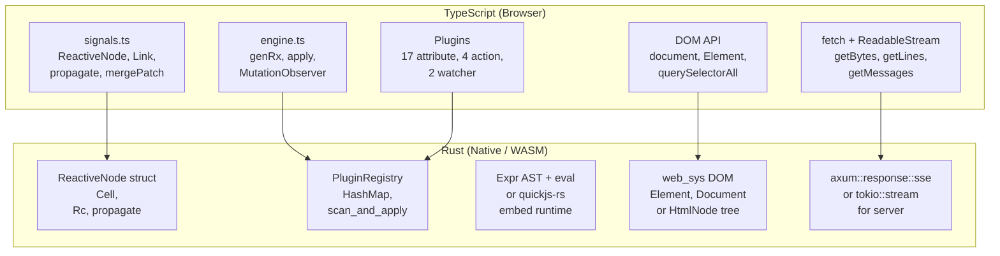
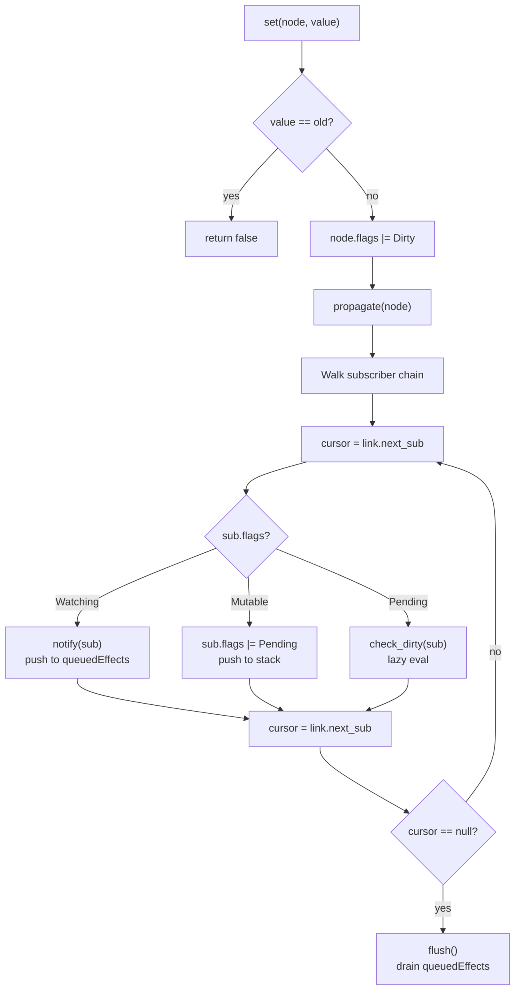

# Datastar -- Rust Equivalents

Translating Datastar's TypeScript architecture to Rust requires mapping JavaScript concepts (Proxy, Function constructor, MutationObserver, DOM API) to Rust equivalents.

**Aha:** The signal system is the easiest part to translate — ReactiveNode is essentially a struct with version tracking and a propagation algorithm that maps cleanly to Rust. The hardest parts are the DOM morphing (requires a DOM abstraction) and the expression compiler (requires a JS runtime or a custom expression parser).

## Signal System → Rust

The ReactiveNode/Link architecture translates almost directly:

### ReactiveNode Struct

```rust
use std::cell::Cell;
use std::rc::Rc;
use std::collections::HashMap;

bitflags::bitflags! {
    #[derive(Clone, Copy, Debug)]
    struct ReactiveFlags: u8 {
        const Mutable       = 1 << 0;  // Can be written (signals, computeds)
        const Watching      = 1 << 1;  // Is an effect (needs re-execution)
        const RecursedCheck = 1 << 2;  // Currently being checked for recursion
        const Recursed      = 1 << 3;  // Detected as recursed
        const Dirty         = 1 << 4;  // Value has changed, needs re-evaluation
        const Pending       = 1 << 5;  // A dependency might have changed
        const Queued        = 1 << 6;  // Effect is in the queue
    }
}

struct Link {
    node: Option<Rc<ReactiveNode>>,
    source: Option<Rc<ReactiveNode>>,
    next_sub: Option<Rc<Link>>,
    prev_sub: Option<Rc<Link>>,
    next_rt: Option<Rc<Link>>,
    prev_rt: Option<Rc<Link>>,
}

struct ReactiveNode {
    links: Option<Vec<Link>>,
    flags: Cell<ReactiveFlags>,
    version: Cell<u64>,
    last_checked_version: Cell<u64>,
    value: serde_json::Value,
    computed: Option<Box<dyn Fn() -> serde_json::Value>>,
    effect: Option<Box<dyn Fn()>>,
}
```

**Key difference:** TypeScript's `Link` is a plain object with circular references (a linked list). Rust needs `Rc<Link>` for shared ownership of link nodes. The `Cell` wrappers provide interior mutability without `Mutex` — since signal updates are single-threaded in the browser model, `Cell` is the correct choice.

### Signal Get/Set

```rust
fn signal<T: Into<serde_json::Value>>(value: T) -> Rc<ReactiveNode> {
    Rc::new(ReactiveNode {
        flags: Cell::new(ReactiveFlags::Mutable),
        value: value.into(),
        ..Default::default()
    })
}

fn get(node: &Rc<ReactiveNode>) -> serde_json::Value {
    // Create dependency link if in tracking scope
    // Equivalent to TypeScript: if (linkStack.length) link()
    if !tracking_context::is_active() {
        return node.value.clone();
    }
    tracking_context::link_to(node);  // Creates Link in doubly-linked list
    node.value.clone()
}

fn set(node: &Rc<ReactiveNode>, value: serde_json::Value) -> bool {
    if node.value == value {
        return false;  // Skip if same value
    }
    node.previous_value.set(node.value.replace(value));
    node.flags.set(node.flags.get() | ReactiveFlags::Dirty);
    propagate(node);
    if batch_depth() == 0 {
        flush();
        dispatch();
    }
    true
}
```

### Propagation Algorithm

The TypeScript `propagate()` function (signals.ts lines 358-446) uses an explicit stack to avoid recursion:

```rust
fn propagate(node: &Rc<ReactiveNode>) {
    let mut cursor = node.subs.as_ref();
    let mut stack = Vec::new();

    while cursor.is_some() || !stack.is_empty() {
        if let Some(link) = cursor.take() {
            let sub = link.sub.as_ref().unwrap();

            if !sub.flags.get().intersects(ReactiveFlags::Pending | ReactiveFlags::Dirty) {
                if sub.flags.get().contains(ReactiveFlags::Watching) {
                    notify(sub);  // Push to queuedEffects
                } else {
                    sub.flags.set(sub.flags.get() | ReactiveFlags::Pending);
                    // Push to stack for later traversal
                    stack.push(sub);
                }
            }

            cursor = link.next_sub.as_ref();
        } else {
            // Walk stack
            let node = stack.pop().unwrap();
            cursor = node.subs.as_ref();
        }
    }
}
```

The explicit stack replaces the TypeScript version's manual cursor manipulation. The algorithm is identical — it walks the subscriber chain, marks nodes as Pending/Dirty, and pushes effects to the queue.

### Computed Lazy Evaluation

```rust
fn computed_get(node: &Rc<ReactiveNode>) -> serde_json::Value {
    if node.flags.get().contains(ReactiveFlags::Dirty) {
        // Clear old dependency links
        unlink_all(node.deps.borrow_mut());
        // Re-evaluate with tracking
        tracking_context::begin(node);
        let value = (node.computed.as_ref().unwrap())();
        tracking_context::end();
        // Update version for lazy checking
        node.version.set(node.version.get() + 1);
        node.value.set(value.clone());
        node.flags.set(node.flags.get() & !ReactiveFlags::Dirty);
        value
    } else if node.flags.get().contains(ReactiveFlags::Pending) {
        if check_dirty(node) {  // Walk dependency chain
            return computed_get(node);  // Re-evaluate
        }
        node.flags.set(node.flags.get() & !ReactiveFlags::Pending);
        node.value.clone()
    } else {
        node.value.clone()  // Cached value, no re-eval needed
    }
}
```

### Deep Proxy → Rust

TypeScript uses ES6 `Proxy` for deep reactivity. In Rust, the closest equivalent depends on the use case:

**For WASM targets:** Use `js_sys` and `wasm_bindgen` to create JavaScript Proxies:
```rust
use wasm_bindgen::prelude::*;
use js_sys::{Object, Proxy, Reflect};

fn create_deep_proxy(store: &SignalStore) -> Result<Proxy, JsValue> {
    let handler = deep_handler()?;  // JS object with get/set/deleteProperty traps
    Proxy::new(&store.to_js_object()?, &handler)
}
```

**For native Rust:** Use a path-based approach instead of Proxy:
```rust
struct SignalStore {
    signals: HashMap<String, Rc<ReactiveNode>>,
}

impl SignalStore {
    fn get(&self, path: &str) -> Option<serde_json::Value> {
        self.signals.get(path).map(|n| n.value.get())
    }

    fn set(&mut self, path: &str, value: serde_json::Value) {
        if let Some(node) = self.signals.get(path) {
            set(node, value);
        } else {
            let node = signal(value);
            self.signals.insert(path.to_string(), node);
        }
    }
}
```

## Expression Compiler → Rust

This is the hardest part. TypeScript's `new Function()` has no direct Rust equivalent. Options:

### Option A: Embed a JS runtime (quickjs-rs, deno_core)

```rust
use quickjs_rust::JSRuntime;

fn compile_expression(expr: &str) -> impl Fn(&SignalStore) -> serde_json::Value {
    let rewritten = rewrite_signal_refs(expr);  // $count → store["count"]
    move |store: &SignalStore| {
        let mut ctx = runtime.create_context();
        ctx.set("$", store.to_js_value());
        ctx.eval(&rewritten).unwrap()
    }
}
```

**Pros:** Full JS semantics, easy to implement.
**Cons:** Adds ~2MB binary size, WASM-unfriendly, runtime overhead.

### Option B: Parse and evaluate a mini-expression language

```rust
enum Expr {
    SignalRef(String),
    Literal(serde_json::Value),
    BinaryOp(Box<Expr>, Operator, Box<Expr>),
    MemberAccess(Box<Expr>, String),
    ArrayIndex(Box<Expr>, Box<Expr>),
    Call(String, Vec<Expr>),
    Template(Vec<Expr>),
    Conditional(Box<Expr>, Box<Expr>, Box<Expr>),
}

fn parse(expr: &str) -> Result<Expr, ParseError> {
    // Hand-written recursive descent parser or tree-sitter grammar
    // Must handle: $foo.bar, $arr[$idx], $a + $b, $x > 0 ? "yes" : "no"
}

fn eval(expr: &Expr, store: &SignalStore) -> serde_json::Value {
    match expr {
        Expr::SignalRef(name) => store.get(name).unwrap_or(serde_json::Value::Null),
        Expr::BinaryOp(left, op, right) => {
            let l = eval(left, store);
            let r = eval(right, store);
            apply_op(&l, op, &r)
        }
        Expr::MemberAccess(obj, field) => {
            let obj = eval(obj, store);
            obj.get(field).cloned().unwrap_or(serde_json::Value::Null)
        }
        // ...
    }
}
```

**Pros:** No JS runtime, fast, WASM-compatible, safe (sandboxed expressions).
**Cons:** Limited to a subset of JS expressions, needs a parser.

### Signal Reference Rewriting → Rust

The TypeScript regex-based approach:
```typescript
// $foo.bar → $['foo']['bar']
expr.replace(/\$([a-zA-Z_\d]\w*(?:[.-]\w+)*)/g,
  (m, name) => name.split('.').reduce((acc, p) => `${acc}['${p}']`, '$'))
```

In Rust, the same transformation:
```rust
fn rewrite_signal_refs(expr: &str) -> String {
    let re = regex::Regex::new(
        r#"\$([a-zA-Z_\d]\w*(?:[.-]\w+)*)"#
    ).unwrap();

    re.replace_all(expr, |caps: &regex::Captures| {
        let name = &caps[1];
        let parts: Vec<&str> = name.split('.').collect();
        let mut result = String::from("$");
        for part in parts {
            result.push_str(&format!("[\"{}\"]", part));
        }
        result
    }).to_string()
}
```

## DOM Morphing → Rust (Web/WASM)

For WASM targets (web-sys):

```rust
use wasm_bindgen::JsCast;
use web_sys::{Element, Node, Document, DocumentFragment};

fn morph(old_elt: &Element, new_content: &DocumentFragment) {
    // Same algorithm as TypeScript, using web_sys DOM APIs
    let old_ids = collect_ids(old_elt);
    let persistent_ids = find_persistent_ids(old_elt, new_content);
    let id_map = build_id_map(old_elt, &persistent_ids);
    morph_children(old_elt, new_content, &id_map, &persistent_ids);
}
```

The morph algorithm itself is algorithmically identical — it just uses `web_sys` DOM APIs instead of browser-native `document.querySelectorAll`.

For headless Rust (no DOM):

```rust
// Represent DOM as a tree of nodes
struct HtmlNode {
    tag: String,
    attributes: HashMap<String, String>,
    children: Vec<HtmlNode>,
    id: Option<String>,
}

fn morph_tree(old: &mut HtmlNode, new: &HtmlNode) {
    // Same ID-set matching algorithm
    // But operates on in-memory tree, not browser DOM
}
```

The key Datastar morph concepts translate directly:

| TypeScript | Rust | Notes |
|-----------|------|-------|
| `ctxIdMap: Map<Node, Set<string>>` | `HashMap<*const HtmlNode, HashSet<String>>` | Raw pointers or arena indices |
| `ctxPersistentIds: Set<string>` | `HashSet<String>` | Same semantics |
| `ctxPantry: HTMLDivElement` | `Vec<HtmlNode>` | In-memory buffer |
| `querySelectorAll('[id]')` | `node.descendants().filter(|n| n.id.is_some())` | Tree traversal |
| `moveBefore(parent, node, after)` | `parent.children.insert(idx, node)` | Vector insert |

### ID-Set Matching in Rust

```rust
fn find_best_match<'a>(
    node: &'a HtmlNode,
    start: &'a HtmlNode,
    end: Option<&'a HtmlNode>,
    id_map: &HashMap<usize, HashSet<String>>,
    persistent_ids: &HashSet<String>,
) -> Option<&'a HtmlNode> {
    let node_match_count = id_map.get(&node.ptr()).map(|s| s.len()).unwrap_or(0);
    let mut best_match = None;
    let mut displace_count = 0;

    for cursor in start.siblings_until(end) {
        if is_soft_match(cursor, node) {
            let old_set = id_map.get(&cursor.ptr());
            let new_set = id_map.get(&node.ptr());

            if let (Some(old), Some(new)) = (old_set, new_set) {
                if old.iter().any(|id| new.contains(id)) {
                    return Some(cursor);  // ID set match
                }
            }

            if best_match.is_none() && !id_map.contains_key(&cursor.ptr()) {
                if node_match_count == 0 {
                    return Some(cursor);  // No ID match possible, soft match immediately
                }
                best_match = Some(cursor);
            }
        }

        displace_count += id_map.get(&cursor.ptr()).map(|s| s.len()).unwrap_or(0);
        if displace_count > node_match_count {
            break;  // Would displace more IDs than we'd gain
        }
    }

    best_match
}
```

## Plugin System → Rust

```rust
use std::collections::HashMap;

type ApplyFn = Box<dyn Fn(PluginContext) -> Box<dyn FnOnce()>>;

struct AttributePlugin {
    name: String,
    requirement: Requirement,
    returns_value: bool,
    arg_names: Vec<String>,
    apply: ApplyFn,
}

struct PluginRegistry {
    attribute_plugins: HashMap<String, AttributePlugin>,
    action_plugins: HashMap<String, ActionPlugin>,
    watcher_plugins: HashMap<String, WatcherPlugin>,
}
```

Plugins register at startup:

```rust
fn register_builtin_plugins(registry: &mut PluginRegistry) {
    registry.register_attribute(AttributePlugin {
        name: "bind".into(),
        requirement: Requirement::Exclusive,
        returns_value: true,
        arg_names: vec![],
        apply: Box::new(bind_apply),
    });
    // ...
}
```

### DOM Scanning → Tree Traversal

TypeScript's MutationObserver has no direct Rust equivalent. For a server-side HTML processor:

```rust
fn scan_and_apply(root: &mut HtmlNode, registry: &PluginRegistry) {
    // Pre-order tree traversal
    let mut stack = vec![root];
    while let Some(node) = stack.pop() {
        if should_ignore(node) { continue; }

        for attr in &node.attributes {
            if attr.name.starts_with("data-") {
                let key = &attr.name[5..];
                if let Some(plugin) = registry.attribute_plugins.get(key) {
                    let cleanup = (plugin.apply)(build_context(node, attr));
                    // Store cleanup for later
                }
            }
        }

        // Push children in reverse order (stack processes last-first)
        for child in node.children.iter().rev() {
            stack.push(child);
        }
    }
}
```

## SSE Streaming → Rust

For client-side (WASM):

```rust
use web_sys::Response;
use wasm_streams::ReadableStream;

async fn fetch_event_source(url: &str) -> Result<impl Stream<Item = SseEvent>> {
    let resp = gloo_net::http::Request::get(url).send().await?;
    let stream = ReadableStream::from(resp.body().unwrap());
    parse_sse_stream(stream)
}
```

For server-side (native):

```rust
use axum::response::sse::{Sse, Event};
use futures::stream;

async fn sse_handler() -> Sse<impl Stream<Item = Result<Event, Infallible>>> {
    Sse::new(stream::iter(vec![
        Ok(Event::default()
            .event("datastar-patch-elements")
            .data("<div>Hello</div>")),
    ]))
}
```

### SSE Parser in Rust

The TypeScript byte-level parser (`getLines` with raw byte values) translates directly:

```rust
struct SseLineParser {
    buffer: Vec<u8>,
    position: usize,
    field_length: i64,
}

impl SseLineParser {
    fn feed(&mut self, chunk: &[u8]) -> Vec<SseLine> {
        self.buffer.extend_from_slice(chunk);
        let mut lines = Vec::new();

        while self.position < self.buffer.len() {
            // Handle \r\n
            if self.buffer[self.position] == b'\r' {
                self.position += 1;
                if self.position < self.buffer.len() && self.buffer[self.position] == b'\n' {
                    self.position += 1;
                }
                continue;
            }

            if self.buffer[self.position] == b'\n' {
                self.position += 1;
                // Process accumulated buffer up to position
                if let Some(line) = self.process_line() {
                    lines.push(line);
                }
                self.buffer.drain(..self.position);
                self.position = 0;
                self.field_length = -1;
                continue;
            }

            // Track first colon position
            if self.buffer[self.position] == b':' && self.field_length == -1 {
                self.field_length = self.position as i64;
            }

            self.position += 1;
        }

        lines
    }
}
```

## Batched Updates → Rust

```rust
thread_local! {
    static BATCH_DEPTH: Cell<u32> = Cell::new(0);
    static QUEUED_EFFECTS: RefCell<Vec<Rc<ReactiveNode>>> = RefCell::new(Vec::new());
}

fn begin_batch() {
    BATCH_DEPTH.with(|d| d.set(d.get() + 1));
}

fn end_batch() {
    BATCH_DEPTH.with(|d| {
        let depth = d.get() - 1;
        d.set(depth);
        if depth == 0 {
            flush_effects();
            dispatch_signal_patch();
        }
    });
}
```

Using `thread_local!` with `Cell` avoids `Mutex` overhead for single-threaded signal updates. The `RefCell` for the queue provides interior mutability without runtime borrow checking conflicts.

## Key Challenges

| Challenge | TypeScript Solution | Rust Challenge |
|-----------|-------------------|----------------|
| Shared mutable state | Closures capture by reference | `Rc<RefCell<>>` or `Arc<Mutex<>>` |
| Dynamic function compilation | `new Function()` | Requires parser or embedded JS runtime |
| DOM mutation | MutationObserver | `web_sys` for WASM, no equivalent for native |
| Event dispatch | CustomEvent on document | Event system needed (tokio::sync::broadcast?) |
| Garbage collection | Automatic | Manual cleanup via Drop trait |
| Async/await | Native | tokio or async-std runtime needed |
| Proxy traps | ES6 Proxy | `js_sys::Proxy` for WASM, manual for native |
| Bitfield flags | `node.flags |= Dirty` | `bitflags` crate or `Cell<u8>` |
| Linked list links | Object references | `Rc<Link>` or arena indices |

See [Production Patterns](12-production-patterns.md) for production-grade considerations.
See [Web Tooling](13-web-tooling.md) for the IDE integration story.
See [Rust SDK](14-datastar-rust-sdk.md) for the official Rust server SDK.

## TypeScript → Rust Architecture Mapping



## Propagation Algorithm — TypeScript vs Rust


