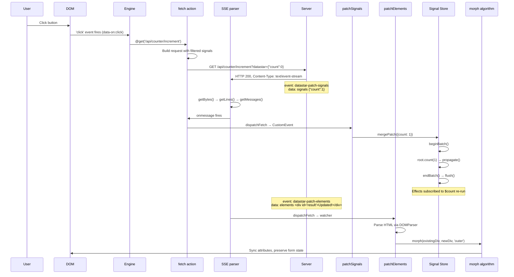

# Datastar -- Production Patterns

Running Datastar in production introduces concerns beyond the core library: state management at scale, security, performance, and error handling.

**Aha:** Datastar's production-readiness comes from its minimal footprint — there's no virtual DOM, no component tree, no build step required. The 11.80 KiB bundle means fast initial load, and the MutationObserver-based plugin system means no runtime overhead for elements without `data-*` attributes.

## Signal Store Organization

In a complex application, the global signal store can grow large. Organizing signals with namespaces prevents collisions:

```html
<!-- data-signals:camel="{ user: { name: '', email: '' }, ui: { modal: false, sidebar: true } }" -->

<!-- Access: $user.name, $ui.modal -->
```

**Underscore convention:** Internal signals start with `_` and are excluded from fetch payloads:

```typescript
// fetch plugin default filter
filterSignals: { include: /.*/, exclude: /(^|\\.)_/ }
```

This means `$user.name` is sent to the server but `$_loading` is not. The exclude regex matches any path segment that starts with `_`, so `$user._internal` is also excluded.

## Memory Management

Each plugin that registers on an element returns a cleanup function. The engine calls these when elements are removed:

```typescript
// From bind plugin (plugins/attributes/bind.ts):
return () => {
  cleanup()  // effect cleanup — removes dependency links
  for (const eventName of adapter.events) {
    el.removeEventListener(eventName, syncSignal)
  }
  el.removeEventListener(DATASTAR_PROP_CHANGE_EVENT, syncSignal)
}
```

**Aha:** Without proper cleanup, every dynamic element that appears and disappears (e.g., via `data-show`) leaks event listeners and effect subscriptions. Datastar's cleanup pattern ensures that `effect()` returned cleanup functions (which call `unlink()` to remove all dependency links) and `removeEventListener` calls are both executed on element removal.

The three-level `removals` Map structure (element → attribute name → cleanup name) ensures:
1. Multiple cleanups per attribute (effect cleanup + event listener removal)
2. Cleanup functions are called in order when the attribute changes (old cleanups run before new ones are registered)
3. Element removal calls ALL cleanups at once

### Cleanup on Attribute Change

When a `data-*` attribute value changes (not element removal), the engine runs old cleanups before re-applying:

```typescript
// engine/engine.ts:372-384
let elCleanups = removals.get(el)
if (elCleanups) {
  const attrCleanups = elCleanups.get(rawKey)
  if (attrCleanups) {
    for (const oldCleanup of attrCleanups.values()) {
      oldCleanup()  // Run old cleanup
    }
  }
}
// ... new cleanups stored
elCleanups.set(rawKey, cleanups)
```

This prevents memory leaks when attribute values change dynamically — e.g., when `data-text="$count"` changes to `data-text="$name"`, the old effect subscription is cleaned up before the new one is registered.

## Error Handling

The engine provides an error factory to plugins:

```typescript
// engine/engine.ts:24-38
const error = (ctx, reason, metadata = {}) => {
  Object.assign(metadata, ctx)
  const e = new Error()
  const r = snake(reason)
  const q = new URLSearchParams({ metadata: JSON.stringify(metadata) }).toString()
  const c = JSON.stringify(metadata, null, 2)
  e.message = `${reason}\nMore info: ${url}/${r}?${q}\nContext: ${c}`
  return e
}
```

Errors include:
- **Reason**: A snake_case error name (e.g., `key_required`, `undefined_action`)
- **URL**: A link to `datastar.dev/errors/<reason>` with full context
- **Context**: JSON-serialized context including plugin name, element ID/tag, expression value

This makes production debugging straightforward — the error message contains everything needed to reproduce the issue.

### Two-Level Error Handling in genRx

```typescript
// engine/engine.ts:538-550 — Compile-time errors
} catch (e: any) {
  throw error({ expression: { fnContent: expr, value }, error: e.message }, 'GenerateExpression')
}

// engine/engine.ts:523-536 — Runtime errors
} catch (e: any) {
  throw error({ element: { id: el.id, tag: el.tagName }, expression: { fnContent: expr, value }, error: e.message }, 'ExecuteExpression')
}
```

`GenerateExpression` = syntax error in the HTML attribute (bad JS). `ExecuteExpression` = the JS is valid but throws when run.

## Performance Considerations

### Expression Caching — Per-Attribute, Not Global

genRx does NOT have a global cache. Each call creates a fresh `Function`. The caching happens at the attribute plugin level:

```typescript
// engine/engine.ts:354-364
let cachedRx: GenRxFn
ctx.rx = (...args: any[]) => {
  if (!cachedRx) {
    cachedRx = genRx(value, {
      returnsValue: plugin.returnsValue,
      argNames: plugin.argNames,
      cleanups,
    })
  }
  return cachedRx(el, ...args)
}
```

**Aha:** `cachedRx` is a local variable captured by the `ctx.rx` closure. The first time `ctx.rx()` is called, it compiles the expression. Every subsequent call on the same element+attribute reuses that compiled function. This is more precise than a global cache — each element gets its own compiled function, and when the element is removed from the DOM, the cache is garbage collected automatically. There is no risk of memory leaks from a global cache that never evicts entries.

### MutationObserver Efficiency

The engine uses a SINGLE `MutationObserver` for the entire document:

```typescript
// engine/engine.ts:206
const mutationObserver = new MutationObserver(observe)
```

This observer watches `document.documentElement` with `{ subtree: true, childList: true, attributes: true }`. All DOM mutations flow through one callback that handles three types:
1. **childList — removed nodes**: `cleanupEls(node)` + `cleanupEls(node.querySelectorAll('*'))`
2. **childList — added nodes**: `applyEls(node)` + `applyEls(node.querySelectorAll('*'))`
3. **attributes — data-* changed**: run old cleanups or re-apply plugin

**Aha:** The single-observer design means there's no per-plugin or per-element observer overhead. The `observe` callback processes mutations in order — cleanup first, then apply — which ensures that when a node is replaced, its cleanup runs before the new node's plugins register.

### Batch Coalescing

Multiple signal updates within `beginBatch()` / `endBatch()` coalesce into a single propagation pass:

```typescript
// engine/signals.ts
let batchDepth = 0
const queuedEffects: Effect[] = []

export const beginBatch = (): void => { batchDepth++ }
export const endBatch = (): void => {
  if (!--batchDepth) {
    flush()      // drain effect queue
    dispatch()   // fire DATASTAR_SIGNAL_PATCH_EVENT
  }
}
```

```html
<!-- Without batching: 3 separate effect fires -->
<div data-init="$count = 0; $message = 'Hello'; $loading = false"></div>

<!-- With explicit batching: 1 combined effect fire -->
<div data-init="beginBatch(); $count = 0; $message = 'Hello'; $loading = false; endBatch()"></div>
```

**Aha:** The `mergePatch()` function (used by the signal patch watcher) wraps all mutations in a batch — so 50 signals updated in one SSE event cause only one round of effect execution. However, `beginBatch()`/`endBatch()` must be called explicitly in expressions — the engine doesn't auto-batch across attribute plugins. Each attribute plugin's `apply()` runs independently, so if two plugins set different signals, each triggers its own propagation.

### DOM Scan Optimization — applyQueued

When plugins register at module load time, the engine uses `setTimeout(0)` to batch all registrations into a single DOM scan:

```typescript
// engine/engine.ts:71-86
if (queuedAttributes.length === 1) {
  setTimeout(() => {
    for (const attribute of queuedAttributes) {
      queuedAttributeNames.add(attribute.name)
      attributePlugins.set(attribute.name, attribute)
    }
    // Single DOM scan for ALL plugins
    for (const root of roots) {
      applyQueued(root, !observedRoots.has(root))
    }
  })
}
```

This prevents 17 separate DOM scans (one per attribute plugin) — instead, there's exactly one scan that applies all 17 plugins at once.

## Security Considerations

### Expression Compilation

genRx-compiled Functions execute with four fixed parameters:
- `el` — the DOM element
- `$` — global signal store root (from `engine/signals.ts`)
- `__action` — internal action dispatcher (generated per-invocation)
- `evt` — the Event object (or undefined)

They do NOT have access to arbitrary global variables unless those are reachable from the `Function` constructor's scope (i.e., global `window` properties).

**Risk:** If user-generated content can influence expression strings in HTML attributes, it becomes XSS:

```html
<!-- DANGEROUS: if $userInput contains "); alert(1); //" -->
<div data-text="somePrefix; ${userInput}//"></div>
```

Datastar's expressions are compiled at attribute-parse time, not at runtime, so user input in signal VALUES is safe (it's just data), but user input in attribute VALUES is not. The server must sanitize any user-controlled content that appears in HTML attribute values.

### Form Validation

The fetch plugin validates forms before submission:

```typescript
// plugins/actions/fetch.ts
if (!formEl.noValidate && !formEl.checkValidity()) {
  formEl.reportValidity()
  return  // Don't submit invalid forms
}
```

This uses the browser's native constraint validation API. If `noValidate` is set on the form, validation is skipped.

### Content-Type Validation

The SSE parser validates Content-Type before processing:

```typescript
// plugins/actions/fetch.ts:585-626
const ct = response.headers.get('Content-Type')
if (ct?.includes('text/event-stream')) { /* parse SSE */ }
else if (ct?.includes('text/html')) { /* dispatch datastar-patch-elements */ }
else if (ct?.includes('application/json')) { /* dispatch datastar-patch-signals */ }
else if (ct?.includes('text/javascript')) { /* create <script>, execute */ }
```

The `text/javascript` path is the most dangerous — it creates and executes a `<script>` element from server response content. Ensure your server is trusted before using this path. The script is created with `document.createElement('script')`, text content is set, and it's appended to `<head>` — all without sanitization.

### Request Detection Header

The fetch plugin sends `Datastar-Request: true` with every request:

```typescript
// plugins/actions/fetch.ts:69-76
const initialHeaders: Record<string, any> = {
  Accept: 'text/event-stream, text/html, application/json',
  'Datastar-Request': true,
}
```

Servers can use this header to distinguish Datastar requests from regular HTTP requests, enabling different response formats (SSE for Datastar, JSON for API clients).

## View Transitions API

```html
<!-- data-init.viewtransition="$animateMount()" -->
<!-- data-on:click.viewtransition="$navigate()" -->
```

The View Transitions API is only supported in Chromium browsers. The `supportsViewTransitions` flag gracefully degrades:

```typescript
// utils/view-transitions.ts
export const supportsViewTransitions = !!document.startViewTransition

// plugins/watchers/patchElements.ts:74-78
if (supportsViewTransitions && args2.useViewTransition) {
  document.startViewTransition(() => onPatchElements(ctx, args2))
} else {
  onPatchElements(ctx, args2)  // Instant, no animation
}
```

When unsupported, the morph runs instantly — no error, no fallback animation.

## Debugging

The engine dispatches a `datastar-ready` event when initialization is complete:

```typescript
document.addEventListener('datastar-ready', () => {
  console.log('Datastar initialized')
})
```

Custom events for observability:

| Event | When | Detail |
|-------|------|--------|
| `datastar-ready` | Engine init complete | None |
| `datastar-fetch` | Fetch lifecycle (started/finished/error/retrying) | `{ type, el, argsRaw }` |
| `datastar-signal-patch` | Signals updated via mergePatch | `{ path: value }` object |
| `datastar-prop-change` | Form property changed during morph | None |
| `datastar-scope-children` | Morph completed on scoped element | None |

### Fetch Event Lifecycle

The fetch action dispatches `datastar-fetch` events for each lifecycle stage:

```typescript
// plugins/actions/fetch.ts
dispatchFetch('datastar-fetch-started', el, {})
dispatchFetch('datastar-fetch-finished', el, {})
dispatchFetch('datastar-fetch-error', el, { error })
dispatchFetch('datastar-fetch-retrying', el, { retry, error })
dispatchFetch('datastar-fetch-retries-failed', el, {})
```

The `data-indicator` attribute plugin listens for these events to create boolean tracking signals:

```html
<div data-indicator:loading>
  <button data-on:click="@get('/api/data')" data-attr:disabled="$loading">
    Load
  </button>
  <span data-show="$loading">Loading...</span>
</div>
```

When a fetch starts, `$loading = true`. When it finishes, `$loading = false`. On error, `$loading = false`. On retry, `$loading = true`.

## Complete Reactive Cycle

Here's the full path from user click to DOM update:



See [Rust Equivalents](11-rust-equivalents.md) for production Rust patterns.
See [Web Tooling](13-web-tooling.md) for IDE support.
See [Signals](02-reactive-signals.md) for the batching and propagation internals.

## Cleanup Lifecycle — Element Removal

```mermaid
flowchart TD
    REMOVE["Element removed from DOM"] --> MO[MutationObserver fires]
    MO --> TYPE{mutation.type?}
    TYPE -->|childList: removed| CLEANUP[cleanupEls(node)]
    TYPE -->|attributes: data-* removed| ATTRCLEAN[run cleanups for attr]

    CLEANUP --> GET[cleanups = removals.get(el)]
    GET --> EXISTS{exists?}
    EXISTS -->|no| DONE[skip]
    EXISTS -->|yes| DELETE[removals.delete(el)]

    DELETE --> ITER1["For each attribute cleanup map"]
    ITER1 --> ITER2["For each named cleanup function"]
    ITER2 --> CALL[cleanup()]

    CALL -->|"effect cleanup"| UNLINK["effect.unlink() removes all Links"]
    CALL -->|"bind cleanup"| REMEL["removeEventListener x3"]
    CALL -->|"@fetch cleanup"| ABORT[controller.abort()]

    UNLINK --> ZERO["Zero remaining subscribers"]
    REMEL --> ZERO
    ABORT --> ZERO
```
