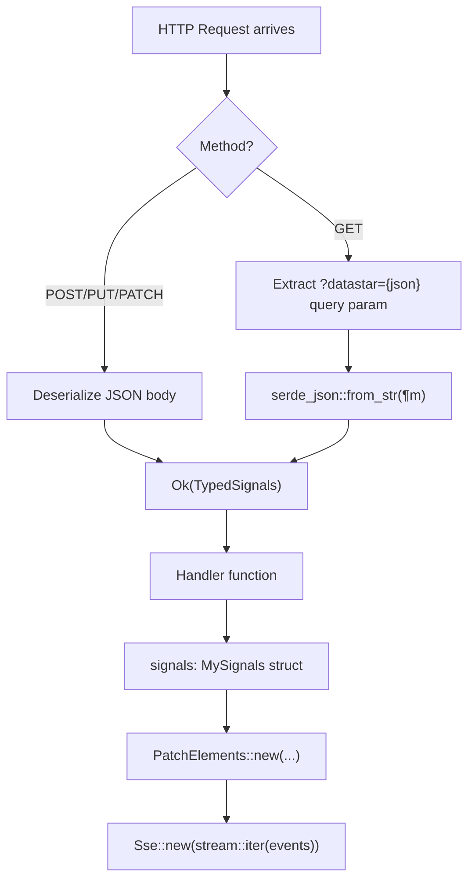

# Datastar -- Rust Server SDK

The `datastar` crate (v0.3.2) is the official Rust implementation of the Datastar server-side SDK. It provides typed builders for SSE events and framework-specific integrations for Axum, Rocket, and Warp.

**Aha:** The Rust SDK is NOT a Rust port of the client-side library. It's a server-side helper that lets Rust backends generate Datastar-compatible SSE responses. The client still runs the TypeScript `datastar.js` bundle — this crate just makes it easier for Rust servers to emit the correct `text/event-stream` format with typed builders instead of string concatenation.

Source: `/home/darkvoid/Boxxed/@formulas/src.rust/src.llamacpp/src.datastar/datastar-rust/`

## Crate Structure

```
datastar-rust/
├── Cargo.toml              # v0.3.2, edition 2024, rust-version 1.85.0
├── src/
│   ├── lib.rs              # DatastarEvent core type, prelude
│   ├── consts.rs           # Constants, enums (auto-generated from SDK schema)
│   ├── patch_elements.rs   # PatchElements builder → DatastarEvent
│   ├── patch_signals.rs    # PatchSignals builder → DatastarEvent
│   ├── execute_script.rs   # ExecuteScript builder → DatastarEvent
│   ├── axum.rs             # Axum: Into<Event>, ReadSignals extractor
│   ├── rocket.rs           # Rocket: Into<Event>
│   └── warp.rs             # Warp: Into<Event>, read_signals filter
└── examples/               # 9 example files
```

## Core Type: DatastarEvent

The central type that all event builders convert into:

```rust
// lib.rs
pub struct DatastarEvent {
    pub event: consts::EventType,    // PatchElements or PatchSignals
    pub id: Option<String>,           // SSE event ID (for replay)
    pub retry: Duration,              // SSE retry duration (default 1000ms)
    pub data: Vec<String>,            // Datalines: "key value" pairs
}
```

The `Display` impl formats it as SSE:

```rust
// Display::fmt
impl Display for DatastarEvent {
    fn fmt(&self, f: &mut Formatter<'_>) -> fmt::Result {
        write!(f, "event: {}", self.event.as_str())?;
        if let Some(id) = &self.id { write!(f, "\nid: {id}")?; }
        let millis = self.retry.as_millis();
        if millis != consts::DEFAULT_SSE_RETRY_DURATION as u128 {
            write!(f, "\nretry: {millis}")?;
        }
        for line in &self.data { write!(f, "\ndata: {line}")?; }
        write!(f, "\n\n")?;
        Ok(())
    }
}
```

This matches the W3C SSE spec exactly — the same format the TypeScript client's `getMessages` parser expects.

## Event Builders

### PatchElements

Builds a `datastar-patch-elements` SSE event:

```rust
let event = PatchElements::new("<div>Hello</div>")
    .selector("#main")
    .mode(ElementPatchMode::Inner)
    .use_view_transition(true)
    .id("update-1")
    .into_datastar_event();
```

| Method | Default | Purpose |
|--------|---------|---------|
| `new(elements)` | — | Create with HTML content |
| `new_remove(selector)` | — | Create a remove directive |
| `id(String)` | `None` | SSE event ID |
| `retry(Duration)` | `1000ms` | SSE retry duration |
| `selector(String)` | `None` | CSS selector |
| `mode(ElementPatchMode)` | `Outer` | Patch mode |
| `use_view_transition(bool)` | `false` | View Transitions API |

The `into_datastar_event()` method builds the datalines:

```rust
// Pseudo-serialization
fn convert_to_datastar_event_inner(&self, id: Option<String>) -> DatastarEvent {
    let mut data: Vec<String> = Vec::new();
    if let Some(selector) = &self.selector {
        data.push(format!("selector {}", selector));
    }
    if self.mode != ElementPatchMode::default() {
        data.push(format!("mode {}", self.mode.as_str()));
    }
    if self.use_view_transition != DEFAULT_ELEMENTS_USE_VIEW_TRANSITIONS {
        data.push(format!("useViewTransition {}", self.use_view_transition));
    }
    for line in self.elements.lines() {
        data.push(format!("elements {}", line));
    }
    DatastarEvent { event: EventType::PatchElements, id, retry: self.retry, data }
}
```

**Aha:** Default values are omitted from the datalines to minimize payload size. The Datastar client uses defaults (`outer` mode, no view transitions) so only non-default values need to be sent.

### PatchSignals

Builds a `datastar-patch-signals` SSE event:

```rust
let event = PatchSignals::new(r#"{"count": 42, "message": "Hello"}"#)
    .only_if_missing(true)
    .id("init-signals")
    .into_datastar_event();
```

| Method | Default | Purpose |
|--------|---------|---------|
| `new(signals)` | — | JSON string or JS object literal |
| `id(String)` | `None` | SSE event ID |
| `retry(Duration)` | `1000ms` | SSE retry duration |
| `only_if_missing(bool)` | `false` | Only create missing signals |

### ExecuteScript

Builds a `datastar-patch-elements` event with a `<script>` element:

```rust
let event = ExecuteScript::new("console.log('Hello from server')")
    .auto_remove(true)
    .attributes(vec![r#"type="module""#.to_string()])
    .into_datastar_event();
```

This is sugar over `PatchElements` — it wraps the script in a `<script>` tag with `data-effect="el.remove()"` to clean up after execution:

```rust
// execute_script.rs:81-113
let mut s = format!("elements <script");
if self.auto_remove.unwrap_or(true) {
    s.push_str(r##" data-effect="el.remove()""##);
}
for attribute in &self.attributes {
    s.push(' ');
    s.push_str(attribute.as_str());
}
s.push('>');
// ... script content as datalines ...
data.last_mut().unwrap().push_str("</script>");
```

## Constants (consts.rs)

Auto-generated from the Datastar SDK schema:

| Constant | Value | Purpose |
|----------|-------|---------|
| `DATASTAR_KEY` | `"datastar"` | Default attribute prefix |
| `DATASTAR_REQ_HEADER_STR` | `"datastar-request"` | Request header name |
| `DEFAULT_SSE_RETRY_DURATION` | `1000` (ms) | Default retry |
| `DEFAULT_ELEMENTS_USE_VIEW_TRANSITIONS` | `false` | Default view transitions |
| `DEFAULT_PATCH_SIGNALS_ONLY_IF_MISSING` | `false` | Default only-if-missing |

### ElementPatchMode enum

```rust
pub enum ElementPatchMode {
    Outer,    // Morphs element into existing (default)
    Inner,    // Replaces inner HTML
    Remove,   // Removes target
    Replace,  // Replaces target with new
    Prepend,  // Prepends inside target
    Append,   // Appends inside target
    Before,   // Inserts before target
    After,    // Inserts after target
}
```

### EventType enum

```rust
pub enum EventType {
    PatchElements,   // → "datastar-patch-elements"
    PatchSignals,    // → "datastar-patch-signals"
}
```

## Framework Integrations

### Axum (feature: "axum")

Two parts: SSE event conversion and signal extraction.

**SSE conversion**: All event types implement `Into<axum::response::sse::Event>`:

```rust
impl From<PatchElements> for axum::response::sse::Event { ... }
impl From<PatchSignals> for axum::response::sse::Event { ... }
impl From<ExecuteScript> for axum::response::sse::Event { ... }
impl From<DatastarEvent> for axum::response::sse::Event { ... }
```

**Signal extraction**: `ReadSignals<T>` extractor:

```rust
// axum.rs
pub struct ReadSignals<T: DeserializeOwned>(pub T);

impl<T: DeserializeOwned, S: Send + Sync> FromRequest<S> for ReadSignals<T> {
    async fn from_request(req: Request, state: &S) -> Result<Self, Response> {
        let json = match *req.method() {
            http::Method::GET => {
                // Extract from ?datastar={json} query param
                let query = Query::<DatastarParam>::from_request(req, state).await?;
                serde_json::from_str(query.0.datastar.as_str()?)
            }
            _ => {
                // Extract from JSON body
                let Json(json) = Json::<T>::from_request(req, state).await?;
                Ok(json)
            }
        }?;
        Ok(Self(json))
    }
}
```

GET requests send signals as `?datastar={"key":"value"}` in the query string. POST/PUT/PATCH send them as JSON body.

**Response headers**: The `header` submodule provides typed headers:

```rust
pub mod header {
    pub const DATASTAR_SELECTOR: HeaderName = HeaderName::from_static("datastar-selector");
    pub const DATASTAR_MODE: HeaderName = HeaderName::from_static("datastar-mode");
    pub const DATASTAR_USE_VIEW_TRANSITION: HeaderName = ...;
    pub const DATASTAR_ONLY_IF_MISSING: HeaderName = ...;
    pub const DATASTAR_SCRIPT_ATTRIBUTES: HeaderName = ...;

    impl From<ElementPatchMode> for HeaderValue { ... }
}
```

### Rocket (feature: "rocket")

SSE event conversion:

```rust
impl From<PatchElements> for rocket::response::stream::Event { ... }
impl From<PatchSignals> for rocket::response::stream::Event { ... }
impl From<ExecuteScript> for rocket::response::stream::Event { ... }
impl From<DatastarEvent> for rocket::response::stream::Event { ... }
```

No signal extractor — Rocket users parse signals manually from the request body.

### Warp (feature: "warp")

SSE event conversion:

```rust
impl From<PatchElements> for warp::filters::sse::Event { ... }
impl From<PatchSignals> for warp::filters::sse::Event { ... }
impl From<ExecuteScript> for warp::filters::sse::Event { ... }
impl From<DatastarEvent> for warp::filters::sse::Event { ... }
```

Signal extraction via filter:

```rust
pub fn read_signals<T>() -> impl Filter<Extract = (ReadSignals<T>,), Error = Rejection> + Clone
```

Also provides `read_signals_optional` (returns `Option<ReadSignals<T>>`) and `handle_rejection` for error recovery.

## Cargo Features

| Feature | Enables | Dependencies |
|---------|---------|-------------|
| `axum` | Axum integration | axum 0.8, serde, serde_json |
| `rocket` | Rocket integration | rocket 0.5 |
| `warp` | Warp integration | warp 0.4, serde, serde_json, serde_urlencoded, bytes |
| `http2` | HTTP/2 support | None |
| `tracing` | Debug logging | tracing 0.1 |

## Usage Example (Axum)

```rust
use datastar::prelude::*;
use datastar::axum::ReadSignals;
use axum::routing::get;
use axum::Router;
use axum::response::sse::{Event, Sse};
use futures::stream;

#[derive(serde::Deserialize)]
struct Signals {
    name: String,
}

async fn handler(ReadSignals(signals): ReadSignals<Signals>) -> Sse<impl Stream<Item = Result<Event, Infallible>>> {
    let event = PatchElements::new(format!("<p>Hello, {}!</p>", signals.name))
        .selector("#greeting")
        .mode(ElementPatchMode::Inner);

    Sse::new(stream::iter(vec![Ok(event.into())]))
}

let app = Router::new().route("/greet", get(handler));
```

## Comparison: Rust SDK vs TypeScript Client

| Aspect | TypeScript Client | Rust SDK |
|--------|------------------|----------|
| Role | Receives and applies SSE events | Emits SSE events |
| DOM access | Full (browser) | None (server) |
| Signal store | Mutable (Proxy-based) | Serialized (JSON) |
| Expression compilation | `new Function()` | N/A |
| DOM morphing | Full ID-set algorithm | N/A |
| SSE parsing | Custom (fetch + ReadableStream) | N/A (uses framework SSE) |

The Rust SDK is purely a server-side event generator — it has no DOM manipulation, no signal reactivity, and no expression compilation. It translates Rust data structures into the Datastar SSE wire format.

See [SSE Streaming](08-sse-streaming.md) for how the client parses these events.
See [Watchers](09-watchers.md) for how events are dispatched.
See [Rust Equivalents](11-rust-equivalents.md) for broader Rust translation patterns.

## SDK Event Building Pipeline

```mermaid
flowchart TD
    subgraph "Builder Creation"
        PE["PatchElements::new(html)"]
        PS["PatchSignals::new(json)"]
        ES["ExecuteScript::new(js)"]
    end

    subgraph "Builder Configuration"
        PE_SEL[".selector('#main')"]
        PE_MODE[".mode(ElementPatchMode::Inner)"]
        PS_OIM[".only_if_missing(true)"]
        ES_AR[".attributes(vec!['type=\"module\"'])"]
        PE_ID[".id('update-1')"]
        PE_RETRY[".retry(Duration::from_millis(2000))"]
    end

    subgraph "DatastarEvent Construction"
        PE_INNER["convert_to_datastar_event_inner()"]
        DATA["data: Vec<String><br/>— selector #main<br/>— mode inner<br/>— elements <div>..."]
        EVENT["DatastarEvent<br/>event: PatchElements<br/>id: Some('update-1')<br/>retry: 2000ms<br/>data: [...]"]
    end

    subgraph "Display / SSE Wire Format"
        FMT["Display::fmt"]
        SSE["event: datastar-patch-elements\nid: update-1\nretry: 2000\ndata: selector #main\ndata: mode inner\ndata: elements <div>...\n\n"]
    end

    subgraph "Framework Integration"
        AXUM["impl Into<axum::sse::Event>"]
        ROCKET["impl Into<rocket::Event>"]
        WARP["impl Into<warp::sse::Event>"]
    end

    PE --> PE_SEL
    PE --> PE_MODE
    PE --> PE_ID
    PE --> PE_RETRY
    PS --> PS_OIM
    PS --> PE_ID
    ES --> ES_AR
    ES --> PE_ID

    PE_SEL --> PE_INNER
    PE_MODE --> PE_INNER
    PE_ID --> DATA
    PE_RETRY --> EVENT
    PE_INNER --> DATA
    DATA --> EVENT
    EVENT --> FMT
    FMT --> SSE

    SSE --> AXUM
    SSE --> ROCKET
    SSE --> WARP
```

## Signal Extraction Flow (Axum)


