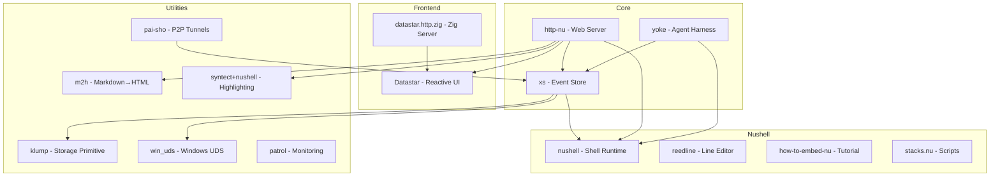

# Ecosystem -- Network & Applications

## pai-sho

**Path**: `src.datastar/pai-sho/`  
**Version**: 0.2.2  
**Repository**: https://github.com/cablehead/pai-sho  
**Language**: Rust (6 source files)  
**License**: MIT

"What happens when you want dumbpipe to stay running, handle a few ports at once, and reconnect when your laptop wakes up."

pai-sho is a persistent port-forwarding/tunneling tool built on iroh (QUIC P2P). It manages multiple connections, auto-reconnects on network changes, and stays running as a daemon. Named after the strategy board game from Avatar.

### Use Cases
- Expose local services through NAT (like ngrok but P2P)
- Persistent tunnels that survive sleep/wake cycles
- Multi-port forwarding in a single process
- Integration with xs for tunnel state management

## datastar.http.zig

**Path**: `src.datastar/datastar.http.zig/`  
**Language**: Zig  
**Dependencies**: httpz (karlseguin/http.zig), logz (karlseguin/log.zig), tokamak

A Zig HTTP server designed for Datastar. Built on karlseguin's http.zig (a high-performance HTTP library) with tokamak for routing. This is an alternative to http-nu for environments where Zig's performance and small binary size are preferred over Nushell's scriptability.

### Key Dependencies
- **httpz** — Karl Seguin's HTTP server library for Zig
- **logz** — Structured logging for Zig
- **tokamak** — HTTP router for Zig (tree-based routing)

### Architecture Difference from http-nu
- **http-nu**: Dynamic (Nushell closures as handlers, hot reload)
- **datastar.http.zig**: Static (compiled Zig handlers, maximum performance)

Both serve Datastar frontends via SSE, but target different use cases.

## www.cross.stream

**Path**: `src.datastar/www.cross.stream/`  
**Language**: Nushell + HTML/CSS (52 files, 2 .nu files)

The website for cross.stream (xs). Likely a documentation/marketing site built with http-nu, serving as both documentation and a living example of the ecosystem in action.

## yoagent-1

**Path**: `src.datastar/yoagent-1/`  
**Language**: Rust (35 source files)

An earlier version of the yoagent library (now at `yoke/yoagent/`). This appears to be v1 of the agent framework before it was refactored into the current architecture. The current version (v0.7.5) lives inside the yoke directory.

### Differences from Current yoagent
- Likely has a different provider abstraction
- May use a different event model
- Probably predates the MCP and sub-agent features
- Kept for reference/comparison

## nushell

**Path**: `src.datastar/nushell/`  
**Language**: Rust (1601 source files in crates/)

A full fork/clone of the Nushell project. This massive codebase is the structured shell that all ecosystem projects embed. Having it local enables:
- Custom patches for embedding use cases
- Pinned version coordination across xs, http-nu, and yoke (all use 0.112.1)
- Source reference for how-to-embed-nu tutorials
- Testing custom commands against the full Nushell test suite

### Why a Full Fork?
All ecosystem projects (xs, http-nu, yoke) embed Nushell at version 0.112.1. Having the full source:
1. Enables debugging Nushell internals
2. Allows testing patches before upstream submission
3. Provides source of truth for embedding patterns
4. Ensures all projects use identical Nushell behavior

## Ecosystem Diagram

