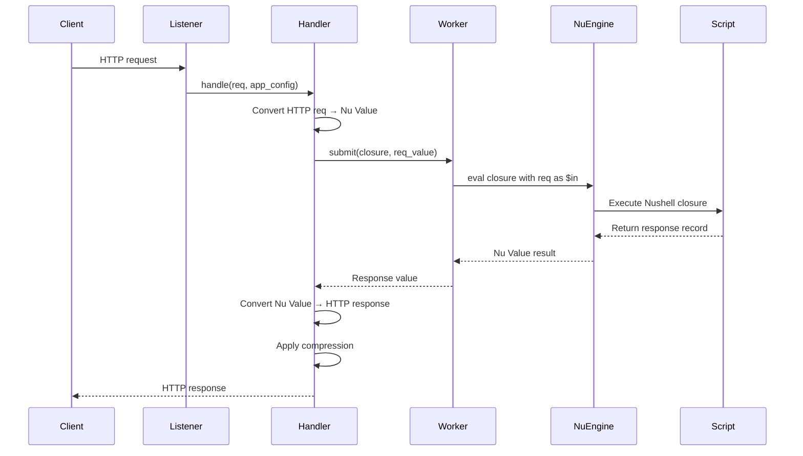

# http-nu -- Architecture

## Request Handling Flow



## Engine Architecture

**File**: `src/engine.rs`

The engine manages Nushell state with hot-swap support:

```rust
pub struct Engine {
    pub state: EngineState,
    pub closure: Option<Closure>,
    pub sse_cancel_token: CancellationToken,
}
```

### ArcSwap for Hot Reload

The `ArcSwap` is held in `handler.rs` (as a field) and instantiated in `main.rs`:

```rust
// In main.rs:
let engine = Arc::new(ArcSwap::from_pointee(first_engine));

// On reload (via file_source or stdin_source):
let new_engine = script_to_engine(&base_engine, &script, file.as_deref());
engine.store(Arc::new(new_engine));
// All new requests use the new engine. In-flight requests finish with old engine.
```

`arc_swap::ArcSwap` provides lock-free atomic pointer swaps — hot reload is zero-downtime.

### HttpNuOptions

```rust
pub struct HttpNuOptions {
    pub dev: bool,
    pub datastar: bool,
    pub watch: bool,
    pub store: Option<String>,
    pub topic: Option<String>,
    pub expose: Option<String>,
    pub tls: Option<String>,
    pub services: bool,
}
```

## Worker Pool

**File**: `src/worker.rs`

Requests are processed on dedicated OS threads (Nushell isn't async-safe):

- Each request gets a cloned `EngineState`
- The handler closure is evaluated with the request as pipeline input
- Results are sent back via oneshot channel

## Request Conversion

**File**: `src/request.rs`

HTTP requests become Nushell records:

```nushell
# The $req value passed to your closure:
{
    method: "GET"
    path: "/api/users"
    query: {page: "1", limit: "10"}
    headers: {content-type: "application/json", host: "localhost:3000"}
    body: ""  # or parsed JSON/form data
    params: {}  # route parameters from router module
    remote_addr: "127.0.0.1:54321"
}
```

## Response Conversion

**File**: `src/response.rs`

Your closure returns a record that maps to an HTTP response:

```nushell
{
    status: 200                    # HTTP status code (default: 200)
    headers: {                     # Response headers
        "content-type": "text/html"
        "x-custom": "value"
    }
    body: "<h1>Hello</h1>"         # String body
}
```

Special response types:
- **Stream**: Return a ListStream for SSE/chunked responses
- **Binary**: Return binary data for file downloads
- **Redirect**: `{status: 302, headers: {location: "/other"}}`

## Listener Layer

**File**: `src/listener.rs`

```rust
pub enum Listener {
    Tcp {
        listener: Arc<TcpListener>,
        tls_config: Option<TlsConfig>,
    },
    #[cfg(unix)]
    Unix(UnixListener),
    #[cfg(windows)]
    Unix(WinUnixListener),
}

pub struct TlsConfig {
    pub config: Arc<ServerConfig>,
    acceptor: TlsAcceptor,
}

impl TlsConfig {
    pub fn from_pem(pem_path: PathBuf) -> io::Result<Self> { /* ... */ }
}
```

Address detection:
- Starts with `/` or `.` → Unix domain socket
- Otherwise → TCP (`[host]:port`)

## Compression

**File**: `src/compression.rs`

Automatic Brotli compression based on:
- `Accept-Encoding` header contains `br`
- Response content-type is compressible (text/*, application/json, etc.)
- Response body exceeds minimum size threshold

## Logging

**File**: `src/logging.rs`

Two formats:
- **human** — Live-updating terminal display (colored, with duration)
- **jsonl** — Structured one-line-per-request JSON

Each request gets a SCRU128 ID for correlation.

## Graceful Shutdown

1. SIGINT/SIGTERM received
2. Stop accepting new connections
3. Wait for in-flight requests (with timeout)
4. Exit

## CLI Arguments

| Arg | Purpose |
|-----|---------|
| `<addr>` | Listen address (`:3000`, `/tmp/sock`, `0.0.0.0:8080`) |
| `<script>` | Nushell script file (or `-` for stdin) |
| `-c <code>` | Inline script |
| `-w` / `--watch` | Hot reload on file changes |
| `--tls <pem>` | TLS certificate+key PEM file |
| `--plugin <path>` | Load Nushell plugin (repeatable) |
| `--log-format` | `human` or `jsonl` |
| `--store <path>` | Enable cross.stream integration |
| `--services` | Enable xs processors (actors/services/actions) |
| `--topic <topic>` | Load handler from xs store topic |
| `--expose <addr>` | Expose xs API on additional address |
| `--dev` | Development mode (relaxed security) |
