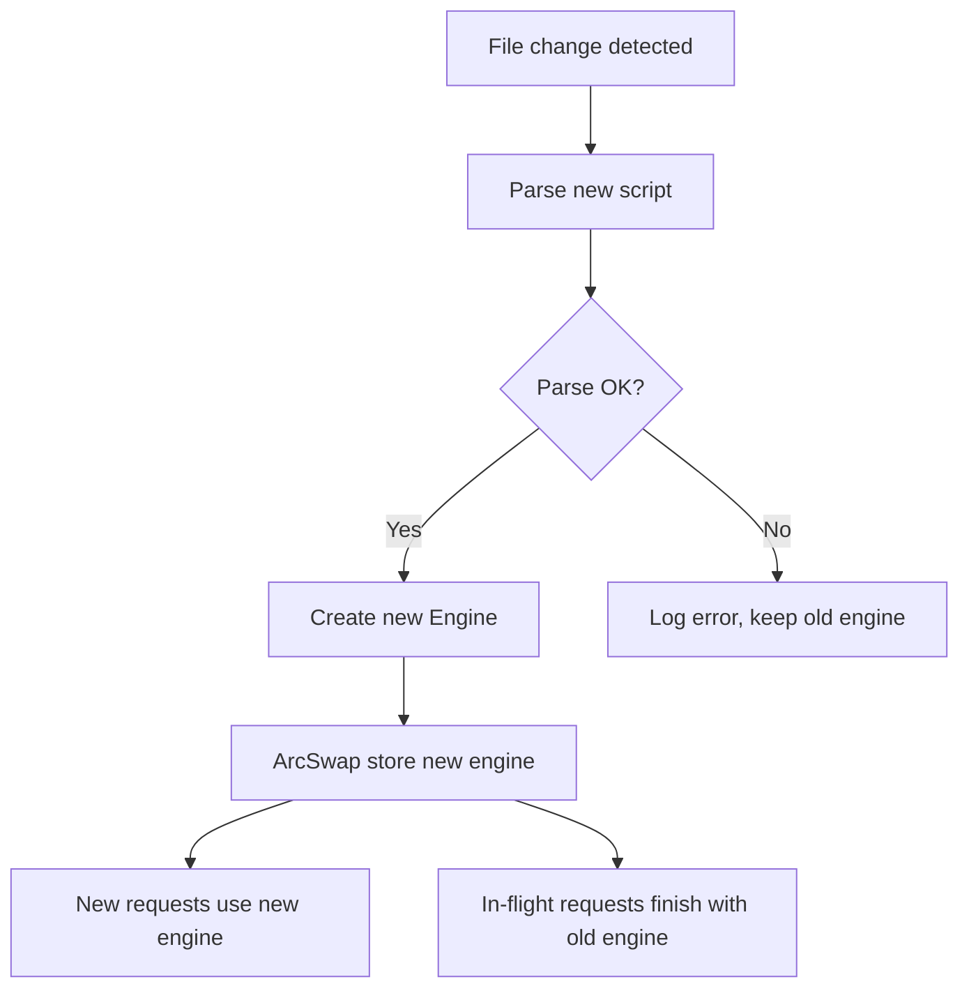

# http-nu -- Features

## Hot Reload

### How It Works



`arc_swap::ArcSwap` provides atomic pointer replacement. Zero lock contention, zero downtime.

### Watch Modes

| Mode | Flag | Trigger |
|------|------|---------|
| File watch | `-w script.nu` | Any file change in script's directory |
| Stdin | `-w -` | Null-terminated (`\0`) new scripts on stdin |
| Store topic | `-w --topic handler` | New frame appended to topic |

## TLS (HTTPS)

```bash
http-nu --tls ./cert.pem :443 serve.nu
```

- Uses rustls (no OpenSSL dependency)
- PEM file contains both certificate and private key
- Automatic ALPN negotiation

## Brotli Compression

Automatic for:
- `Accept-Encoding: br` in request
- Compressible content types: `text/*`, `application/json`, `application/javascript`, `image/svg+xml`
- Response body above minimum size

## cross.stream Integration

When `--store <path>` is specified:

```bash
http-nu --store ./data :3000 serve.nu
```

The handler gains access to xs commands:
- `.cat`, `.append`, `.cas`, `.last`, `.get`, `.remove`
- Full event sourcing: every request/response can be logged as frames
- Reactive patterns: SSE streams fed by xs subscriptions

### With Services

```bash
http-nu --store ./data --services :3000 serve.nu
```

`--services` enables xs processors (actors, services, actions) alongside the HTTP server. Background workers can process events while the HTTP server handles requests.

## Static File Serving

Uses tower-http's ServeDir:

```nushell
# In your handler, fall through to static files
{|req|
    match $req.path {
        "/api" => {body: "api response"}
        _ => null  # Falls through to static file serving
    }
}
```

Static files are served from the script's directory (or configured root).

## MiniJinja Templates

Built-in template engine with:
- Auto-escaping (HTML)
- Template inheritance (``)
- Blocks, loops, conditionals
- Custom filters
- JSON serialization filter
- URL encoding filter

## Syntax Highlighting

Uses syntect with bundled syntax definitions:
- Supports all major languages
- Multiple themes available
- Used by the `html highlight` stdlib command

## Markdown Rendering

Uses pulldown-cmark:
- CommonMark compliant
- Code block highlighting (via syntect)
- Used by the `html md` stdlib command

## Logging

### Human Format (default)

```
14:32:01 200 GET /api/users 3.2ms
14:32:01 404 GET /missing 0.1ms
```

Live-updating terminal display with color.

### JSONL Format

```json
{"id":"0v4fk...","method":"GET","path":"/api/users","status":200,"duration_ms":3.2,"remote_addr":"127.0.0.1:54321"}
```

One JSON line per request. Each request has a SCRU128 ID for correlation.

## Development Mode

```bash
http-nu --dev :3000 serve.nu
```

Relaxes security defaults:
- Omits `Secure` flag on cookies (allows HTTP for local dev)
- More permissive CORS headers
- Verbose error messages in responses

## Graceful Shutdown

1. SIGINT or SIGTERM received
2. Log "stopping"
3. Stop accepting new connections
4. Wait for in-flight requests (timeout)
5. If timeout: log "stop timed out"
6. Log "stopped"
7. Exit

## Performance Characteristics

- **hyper 1** — Modern, fast HTTP implementation
- **Worker threads** — Nushell closures run on OS threads (not blocking the event loop)
- **ArcSwap** — Lock-free hot reload
- **Brotli** — Significant bandwidth savings
- **Minimal overhead** — Request → Nu eval → response with no unnecessary copies

## Examples in Source

| Example | Description |
|---------|-------------|
| `examples/basic.nu` | Minimal hello world |
| `examples/serve.nu` | Router + static files |
| `examples/datastar-counter/serve.nu` | Reactive counter with Datastar |
| `examples/datastar-sdk/serve.nu` | Full Datastar SDK example |
| `examples/blog/serve.nu` | Blog with markdown rendering |
| `examples/cargo-docs/serve.nu` | Serve cargo doc output |
| `examples/mermaid-editor/serve.nu` | Live mermaid diagram editor |
| `examples/quotes/serve.nu` | Quote board with xs persistence |
| `examples/templates/serve.nu` | MiniJinja template usage |
| `examples/tao/serve.nu` | Tao Te Ching reader |
