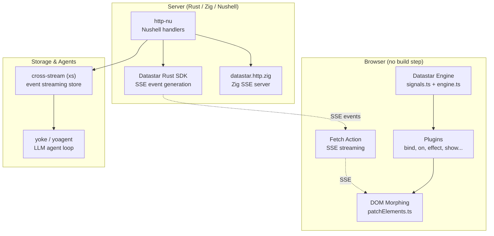
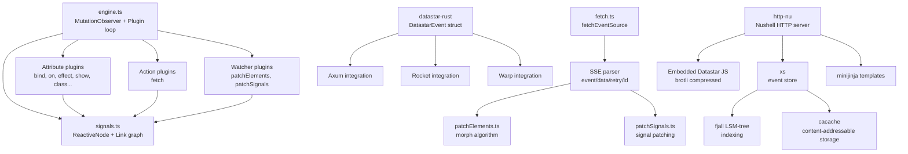

# Datastar Ecosystem -- Architecture and Layer Map

The Datastar ecosystem is not a monolith. It is a collection of independent projects that communicate through well-defined boundaries: HTML attributes, SSE events, JSONL streams, and Nushell pipelines. Understanding the architecture means understanding the data flow between these boundaries.

**Aha:** The ecosystem avoids RPC entirely. Communication happens through three unidirectional streams: client reads SSE from server, client writes HTTP POST to server, and agents read/write JSONL through stdin/stdout. There is no bidirectional socket between client and agent — http-nu bridges them. This eliminates connection state on the server.

## Layer Diagram



## Module Dependency Graph



## Technology Stack

| Concern | Choice | Rationale |
|---------|--------|-----------|
| Frontend reactivity | Custom signal system | No framework dependency, zero build step |
| DOM updates | Morphing (morphdom-inspired) | Preserves element identity, supports persistent IDs |
| Server streaming | SSE (Server-Sent Events) | Native browser support, automatic reconnect |
| Server runtime | Rust (http-nu, xs, yoagent) | Performance, type safety, ecosystem |
| Server scripting | Nushell (via http-nu) | Pipeline-oriented, structured data, embeddable |
| Storage | fjall (LSM-tree) + cacache (CAS) | Append-only, crash-safe, content-deduplicated |
| Agent protocol | JSONL | Unix pipe compatible, streamable, replayable |
| P2P tunneling | iroh (QUIC-based) | NAT traversal, persistent connections |

## Entry Points

### Client Side

Source: `datastar/library/src/engine/engine.ts:1`

```typescript
// Engine initialization scans the DOM and sets up observers
const engine = createEngine({ plugins: [...attributePlugins, ...actionPlugins, ...watcherPlugins] })
engine.apply(document.documentElement)
```

The engine runs a single `MutationObserver` on the document. When `data-*` attributes appear, the corresponding plugin is applied. Expressions in attribute values are compiled to JavaScript `Function` objects via `genRx()`.

### Server Side

Source: `http-nu/src/engine.rs:1`

```rust
// http-nu engine embeds Nushell and registers custom commands
let engine = Engine::new()
    .register_command(StaticCommand)
    .register_command(ReverseProxyCommand)
    .register_command(ToSseCommand)
    .register_command(MinijinjaCommand)
    .serve_datastar_bundle(); // serves /datastar@1.0.1.js
```

Route handlers are Nushell closures. Each HTTP request becomes a Nushell pipeline that produces a response.

### Agent Side

Source: `yoagent-1/src/agent.rs`

The agent reads JSONL from stdin and writes JSONL to stdout. Each input line has a `role` field. Each output line is either a context line (round-trippable) or an observation line (streaming delta from the LLM).

## Key Files

```
datastar/
├── library/src/engine/
│   ├── engine.ts          # Main engine: MutationObserver, plugin application
│   ├── signals.ts         # Reactive signal system: ReactiveNode, Link, Effect
│   └── types.ts           # Type definitions: Signal, Modifiers, HTMLOrSVG
├── library/src/plugins/
│   ├── attributes/        # Attribute plugins: bind, on, effect, show, class, style...
│   ├── actions/           # Action plugins: fetch (SSE streaming)
│   └── watchers/          # Watcher plugins: patchElements, patchSignals
datastar-rust/
├── src/lib.rs             # DatastarEvent struct, framework integrations
├── src/patch_elements.rs  # Element patching event generation
└── src/patch_signals.rs   # Signal patching event generation
xs/
├── src/store/mod.rs       # Event store: Frame, read, append, CAS
├── src/frame.rs           # Frame structure: topic, id, hash, meta, ttl
└── src/api.rs             # HTTP API over Unix domain socket
http-nu/
├── src/engine.rs          # Nushell engine with custom commands
├── src/handler.rs         # HTTP handler: static, SSE, reverse proxy
└── src/store.rs           # Cross-stream topic-backed handlers
yoagent-1/
├── src/agent.rs           # Agent loop: prompt → LLM → tools → loop
└── src/tools/             # Tool implementations: bash, read_file, write_file, edit_file, list_files, search
```

See [Reactive Signals](02-reactive-signals.md) for the signal system deep dive.
See [Plugin System](03-plugin-system.md) for the plugin architecture.
See [SSE Streaming](05-sse-streaming.md) for server-to-client streaming.
