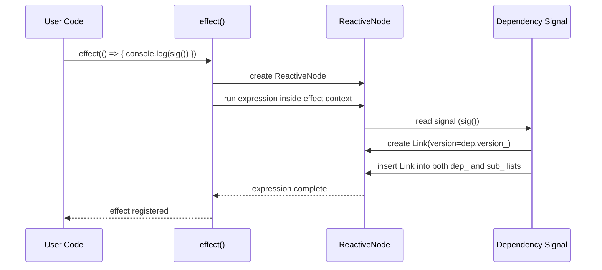
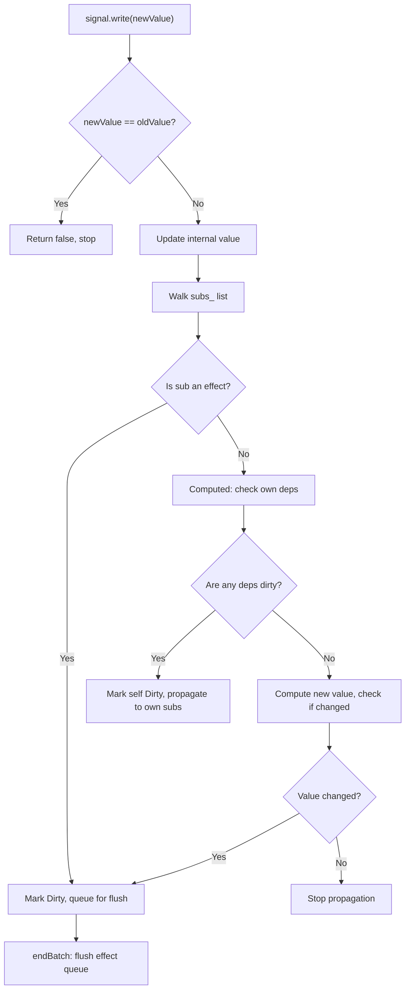

# Datastar -- Reactive Signal System

Datastar implements a fine-grained reactive signal system from scratch. It is not a wrapper around Solid.js or Preact Signals. It uses a doubly-linked dependency graph with version-based staleness tracking and lazy propagation to achieve O(1) signal reads and O(d) effect recomputation where d is the number of dependencies.

**Aha:** The dependency graph is doubly-linked — each `Link` node has both `dep_` (what I depend on) and `sub_` (what depends on me) pointers. This means when a signal changes, it can walk its subscription links directly to find all downstream effects without searching. The version number on each link prevents recomputing effects that haven't actually changed — if a dependency's version hasn't advanced since the last computation, the effect skips it. This is the classic "push-pull" signal pattern.

Source: `datastar/library/src/engine/signals.ts` — `ReactiveNode`, `Link`, `ReactiveFlags`, `effect()`, `signal()`

## Core Data Structures

### ReactiveNode

Every signal is a `ReactiveNode`. It has no value storage — values are held by closures. The node tracks only dependency topology and state flags.

```typescript
// signals.ts:15
interface ReactiveNode {
  deps_?: Link        // Head of dependency linked list (what this node reads)
  depsTail_?: Link    // Tail of dependency list (O(1) append from end)
  subs_?: Link        // Head of subscription linked list (what reads this node)
  subsTail_?: Link    // Tail of subscription list (O(1) append from end)
  flags_: ReactiveFlags  // Bitmask: Mutable, Watching, Dirty, Pending, etc.
}
```

The tail pointers (`depsTail_`, `subsTail_`) enable O(1) appends to the linked list from either direction. Without a tail pointer, appending requires traversing the entire list. The tail is critical when an effect reads many signals during its initial execution — each new dependency can be appended in O(1) rather than O(n) traversal.

### Link

A `Link` connects two `ReactiveNode`s. It exists in two linked lists simultaneously: the dependency list of the subscriber and the subscription list of the dependency.

```typescript
// signals.ts:22
interface Link {
  version_: number      // Version of the dependency at time of last computation
  dep_: ReactiveNode    // The dependency (source signal)
  sub_: ReactiveNode    // The subscriber (effect or computed)
  prevSub_?: Link       // Previous link in subscription list
  nextSub_?: Link       // Next link in subscription list
  prevDep_?: Link       // Previous link in dependency list
  nextDep_?: Link       // Next link in dependency list
}
```

### ReactiveFlags (Bitmask)

```typescript
// signals.ts:5
const enum ReactiveFlags {
  Mutable = 1 << 0,           // Can be written to
  Watching = 1 << 1,          // Currently being observed
  RecursedCheck = 1 << 2,     // Diamond dependency detection flag
  Recursed = 1 << 3,          // Already visited in this propagation
  Dirty = 1 << 4,             // Needs recomputation
  Pending = 1 << 5,           // Queued for propagation
}
```

**Aha:** The `RecursedCheck` and `Recursed` flags solve the diamond dependency problem. When A depends on B and C, and both B and C depend on D, changing D would naively mark A dirty twice. The recursion flags ensure each node is marked at most once per propagation cycle.

## Signal Creation and Access

```typescript
// Creating a signal
const count = signal(0)  // Returns a signal() getter/setter function

// Reading (triggers dependency tracking if inside an effect)
count()  // => 0

// Writing (triggers propagation to all subscribers)
count(5)  // => true (value changed)
count(5)  // => false (value unchanged, no propagation)
```

The signal function is a closure over a `ReactiveNode`. When called with no arguments, it reads. When called with an argument, it writes. If the new value equals the old value, the write returns `false` and propagation stops.

## Dependency Graph Construction



When an effect runs, it sets a global "current context" to its own `ReactiveNode`. Any signal read during that execution creates a `Link` between the signal's node and the effect's node. The effect's `deps_` list points to the signal, and the signal's `subs_` list points back to the effect.

## Dirty Propagation (Lazy)



Propagation is lazy. When a signal changes:

1. It marks all direct effect subscribers as `Dirty`.
2. For computed signals, it checks if any upstream dependency is dirty. If not, it computes immediately to check if the value actually changed. Only if changed does it propagate further.
3. Effects are queued, not executed immediately. They run in `endBatch()`.

This means reading a computed signal that hasn't been invalidated is O(1) — no recomputation needed. The effect only runs once at batch end, even if multiple dependencies changed.

## Deep Reactive Proxy

The `deep()` function wraps objects in a `Proxy` that materializes signals for every property access.

```typescript
// signals.ts:deep
const state = deep({ user: { name: 'Alice', items: [] } })

// state.user.name is a signal — reading it creates a dependency
// state.user.items.push('book') triggers a notification
effect(() => {
  console.log(state.user.name())  // Re-runs when name changes
})
```

The proxy handles:
- Auto-materializing missing properties as signals
- Array length changes with diff patches
- `JSON.stringify` via `toJSON` special case
- Nested object traversal with signal creation at each level

**Aha:** The proxy doesn't deep-scan the entire object upfront. It creates signals lazily on property access. This means `deep({ a: 1, b: 2, c: 3 })` creates zero signals until you read `state.a()`, `state.b()`, or `state.c()`. This is critical for performance with large objects.

## Signal Patching (RFC 7396 Merge Patch)

The `mergePatch()` function applies RFC 7396-style merge patches to deep signal objects.

```typescript
state.mergePatch({ user: { name: 'Bob', age: 30 } })
// Only changes name and adds age — other properties untouched
```

The `filtered()` function creates a view with include/exclude regex patterns. The `dispatch()` function fires `CustomEvent<JSONPatch>` on the document, enabling external systems to patch state.

## Batch System

```typescript
beginBatch()  // Disable automatic effect flushing
count(1)      // Queues propagation
count(2)      // Queues propagation (coalesced with previous)
endBatch()    // Flush all effects at once
```

Batching prevents the "thundering herd" problem where each individual write triggers all effects independently. Inside a batch, multiple writes to the same signal are coalesced. Effects run exactly once at `endBatch()`.

## Comparison with Other Signal Libraries

| Feature | Datastar | Solid.js | Preact Signals | Vue 3 Refs |
|---------|----------|----------|---------------|------------|
| Dependency graph | Doubly-linked list | Doubly-linked list | Doubly-linked list | Dependency tracking |
| Diamond handling | Recursion flags | Recursion flags | Version tracking | Scheduler queue |
| Deep reactivity | Proxy-based | No (explicit stores) | No (explicit stores) | Proxy-based |
| Effect scheduling | Batch queue | Microtask queue | Microtask queue | Scheduler |
| Build step | None | Required | Required | Required |

## Replicating in Rust

A Rust equivalent would need to replace the dynamic `Link` linked lists with a different structure since Rust's borrow checker prevents the bidirectional references. Common approaches:

```rust
// Approach 1: Arena-allocated nodes with indices
struct ReactiveNode {
    deps: Vec<NodeIndex>,
    subs: Vec<NodeIndex>,
    version: u32,
    flags: ReactiveFlags,
}

// Approach 2: Rc<RefCell<>> for shared ownership
struct ReactiveNode {
    deps: Rc<RefCell<Vec<Weak<ReactiveNode>>>>,
    subs: Rc<RefCell<Vec<Weak<ReactiveNode>>>>,
    version: Cell<u32>,
    flags: Cell<ReactiveFlags>,
}
```

The arena approach is preferred for performance — indices are `Copy`, no reference counting overhead, and the graph structure can be serialized.

See [Plugin System](03-plugin-system.md) for how signals interact with plugins.
See [DOM Morphing](04-dom-morphing.md) for how signal patches trigger DOM updates.
See [Rust Equivalents](09-rust-equivalents.md) for a complete Rust implementation pattern.
