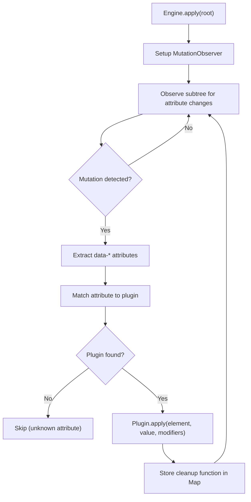

# Datastar -- Plugin System Architecture

Datastar's plugin system is the mechanism by which HTML attributes become reactive behavior. The engine scans the DOM with a `MutationObserver`, and when a `data-*` attribute appears, the corresponding plugin is applied. There are three plugin types: Attribute, Action, and Watcher.

**Aha:** Plugins are not called directly — they are triggered by attribute presence. The engine doesn't know what `data-on-click="..."` means until it finds an attribute plugin that claims it. This means you can add new attribute syntaxes without modifying the engine. The engine is a plugin host, not a framework runtime.

Source: `datastar/library/src/engine/engine.ts` — plugin application loop
Source: `datastar/library/src/plugins/attributes/` — all attribute plugins

## Three Plugin Types

| Type | Trigger | Purpose | Examples |
|------|---------|---------|----------|
| **AttributePlugin** | `data-*` attribute appears | Attach reactive behavior to element | `data-bind`, `data-on`, `data-effect`, `data-show` |
| **ActionPlugin** | Expression invokes `@actionName()` | Perform imperative operations | `@fetch()`, `@executeScript()` |
| **WatcherPlugin** | Signal or DOM changes | React to changes globally | `patchElements`, `patchSignals` |

## Plugin Registration and Discovery

```typescript
// engine.ts — plugin types
interface AttributePlugin { name: string; type: 'attribute'; /* ... */ }
interface ActionPlugin { name: string; type: 'action'; /* ... */ }
interface WatcherPlugin { name: string; type: 'watcher'; /* ... */ }

const engine = createEngine({
  plugins: [...attributePlugins, ...actionPlugins, ...watcherPlugins]
})
```

Attribute plugins are matched by their `name` field against the suffix of `data-*` attributes. `data-on-click` matches the `on` plugin with the `click` event parameter. `data-bind:value` matches the `bind` plugin with the `value` attribute parameter.

## MutationObserver Loop



The observer watches for `attributes: true` mutations. When an attribute changes:

1. The attribute name is parsed to extract the plugin name and parameters.
2. The matching plugin's `apply()` method is called with the element, attribute value, and parsed modifiers.
3. The plugin returns a cleanup function.
4. The cleanup function is stored in a nested `Map<HTMLOrSVG, Map<string, Map<string, () => void>>>` keyed by element, plugin name, and attribute parameter.
5. When the attribute is removed, the cleanup function runs.

## Attribute Plugins

### bind (Two-Way Data Binding)

Source: `datastar/library/src/plugins/attributes/bind.ts`

Adapts different HTML input types to a unified two-way binding:

```html
<input data-bind="$name" />
<input type="checkbox" data-bind="$agree" />
<select data-bind="$color" data-on="change"></select>
```

**Key insight:** The bind plugin detects the input type and uses the appropriate adapter. For checkboxes, it reads/writes the `checked` property. For file inputs, it converts files to base64 data URIs. For selects, it reads the `value` property on `change` events.

### on (Event Listeners)

Source: `datastar/library/src/plugins/attributes/on.ts`

Attaches event listeners with modifiers:

```html
<button data-on:click="submit()" data-on:click:prevent.once="handleSubmit()">
```

Modifiers are parsed from the attribute name after the colon. `prevent` calls `event.preventDefault()`. `stop` calls `event.stopPropagation()`. `once` removes the listener after first invocation. `window` and `document` attach to those global targets instead of the element.

### effect (Run on Signal Change)

Source: `datastar/library/src/plugins/attributes/effect.ts`

Wraps the expression in the signal system's `effect()` function:

```html
<div data-effect="console.log($count())"></div>
```

Every time any signal referenced in the expression changes, the effect re-runs. This is the primary way to execute arbitrary code reactively.

### show, class, style, text, attr (DOM Manipulation)

These plugins manipulate the DOM based on signal values:

- `data-show="$visible"` — toggles `display: none`
- `data:class:error="$hasError"` — adds/removes CSS class
- `data-style:color="$color"` — sets inline style
- `data-text="$message"` — sets `textContent`
- `data-attr:href="$url"` — sets element attribute

### computed (Derived Signals)

Source: `datastar/library/src/plugins/attributes/computed.ts`

```html
<div data-computed:total="$price * $quantity"></div>
```

Creates a computed signal that recalculates when its dependencies change. The computed value is accessible as `$total` in other expressions.

### ref (Element Reference)

Stores a reference to the DOM element in a signal:

```html
<div data-ref="$myDiv"></div>
```

### init (One-Time Initialization)

Runs an expression exactly once when the element first appears:

```html
<div data-init="$count(0)"></div>
```

### jsonSignals (JSON-Encoded Signal Export)

Serializes the signal state as JSON, useful for debugging or external system integration:

```html
<div data-jsonSignals="'$state'"></div>
```

### onIntersect (Intersection Observer)

Runs an expression when the element enters/leaves the viewport:

```html
<div data-on:intersect="loadMore()" data-on:intersect:once></div>
```

### onInterval (Periodic Execution)

Runs an expression on a timer:

```html
<div data-on:interval="'5000'">@fetch({url: '/api/status'})"></div>
```

### onSignalPatch (React to Signal Changes)

Triggers when specific signals are patched:

```html
<div data-on:signal-patch="$count"="console.log('count changed')"></div>
```

### signals (Signal Expression Trigger)

Runs an expression when any referenced signal changes — a declarative alternative to `data-effect`:

```html
<div data-signals="$name">Hello, {$name}</div>
```

### Passive Modifier for `on`

The `on` plugin supports a `passive` modifier that sets `{ passive: true }` on the event listener, enabling better scroll performance:

```html
<div data-on:scroll.passive="handleScroll()"></div>
```

**Aha:** The `passive` modifier tells the browser the handler will never call `event.preventDefault()`. This allows the browser to start scrolling immediately without waiting for the handler to return, improving scroll performance on touch devices.

## Action Plugins

### fetch (HTTP + SSE)

Source: `datastar/library/src/plugins/actions/fetch.ts`

The most complex plugin. Handles HTTP requests with SSE streaming:

```html
<div data-on:click="@fetch({url: '/api/data', signals: {include: '*'}})"></div>
```

**Features:**
- HTTP methods: `get`, `post`, `put`, `patch`, `delete`
- SSE streaming via custom `fetchEventSource` implementation
- Automatic retry with exponential backoff (max 10 retries, 30s cap)
- Request cancellation via `AbortController`
- Signal filtering: `include`/`exclude` patterns for which signals to send
- Auto-dispatches `datastar-fetch` custom events for loading indicators

**Aha:** The fetch action implements its own SSE parser — it doesn't use the browser's `EventSource` API. This is because `EventSource` only supports GET requests and can't send custom headers or body data. The custom implementation wraps `fetch()` and parses the `text/event-stream` response line by line.

```typescript
// fetch.ts — custom SSE parser
function fetchEventSource(url: string, options: FetchOptions) {
  const response = await fetch(url, { ...options, signal: controller.signal })
  const reader = response.body.getReader()
  while (true) {
    const { done, value } = await reader.read()
    if (done) break
    const text = decoder.decode(value)
    // Parse SSE lines: "event:", "data:", "id:", "retry:"
    const events = parseSSE(text)
    for (const event of events) {
      dispatchToWatchers(event)  // Triggers patchElements/patchSignals
    }
  }
}
```

### peek (Read Signal Without Creating Dependency)

Reads a signal's value without registering it as a dependency in the current effect:

```html
<button data-on:click="@peek($tempValue)">Check current value</button>
```

### setAll (Bulk Signal Update)

Sets multiple signals at once in a single batch:

```html
<button data-on:click="@setAll({name: 'Alice', age: 30, active: true})"></div>
```

### toggleAll (Bulk Boolean Toggle)

Toggles multiple boolean signals:

```html
<button data-on:click="@toggleAll($isActive, $isEditing, $isHovering)"></button>
```

## Watcher Plugins

### patchElements (DOM Morphing)

Source: `datastar/library/src/plugins/watchers/patchElements.ts`

Receives HTML from SSE and morphs the DOM in place. See [DOM Morphing](04-dom-morphing.md) for the deep dive.

### patchSignals (Signal Patching)

Source: `datastar/library/src/plugins/watchers/patchSignals.ts`

Receives signal patches from SSE and updates the signal store:

```
event: datastar-patch-signals
data: {"set": {"count": 5, "name": "Alice"}}
```

This is the server-to-client signal synchronization channel. The server can push state changes that update the client's signal store directly.

## Expression Compilation (genRx)

Source: `datastar/library/src/engine/engine.ts` — `genRx()`

Attribute values are compiled to JavaScript `Function` objects:

```typescript
// "$count + 1" becomes:
function() { return $['count']() + 1 }

// "@fetch({url: '/api'})" becomes:
function() { return __actions['fetch']({url: '/api'}) }
```

The compiler handles:
- Signal variable replacement: `$name` → `$['name']()`
- Template literal interpolation: `` `Hello ${$name}` `` → `` `Hello ${$['name']()}` ``
- Action invocation: `@fetch(...)` → `__actions['fetch'](...)`
- DSP/DSS delimiters: `DS[...`P[` for escaped values

## Replicating in Rust

A Rust plugin system would need a different registration pattern since Rust doesn't have dynamic attribute parsing at runtime:

```rust
// Registry pattern
struct PluginRegistry {
    attribute_plugins: HashMap<String, Box<dyn AttributePlugin>>,
    action_plugins: HashMap<String, Box<dyn ActionPlugin>>,
}

trait AttributePlugin {
    fn apply(&self, element: &mut Element, value: &str, modifiers: &Modifiers) -> Box<dyn FnOnce()>;
}
```

For a WASM-based implementation, plugins would be compiled to WASM and loaded dynamically. The attribute matching would use a trie for O(1) lookup.

See [Reactive Signals](02-reactive-signals.md) for the signal system that plugins interact with.
See [SSE Streaming](05-sse-streaming.md) for the fetch action's server communication.
See [DOM Morphing](04-dom-morphing.md) for the patchElements watcher.
