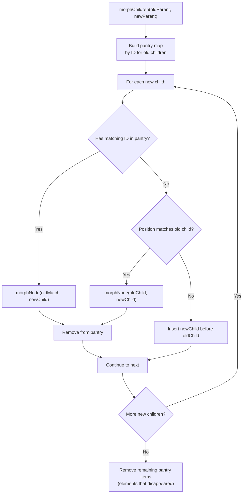
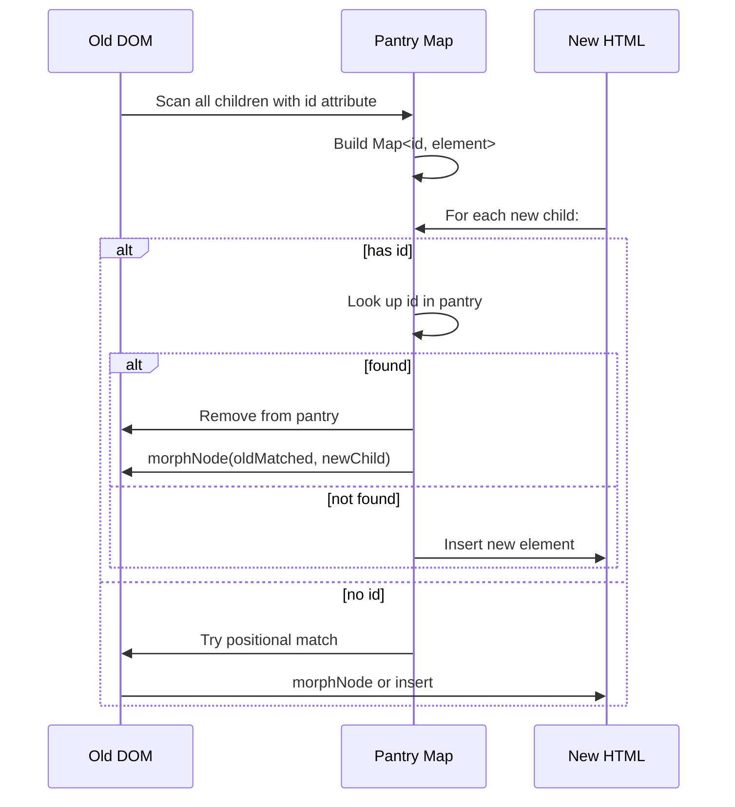

# Datastar -- DOM Morphing Algorithm

Datastar's `patchElements` plugin implements a DOM morphing algorithm inspired by morphdom and idiomorph. Instead of replacing entire subtrees, it surgically updates, inserts, and removes individual nodes to minimize DOM operations while preserving element identity.

**Aha:** The morphing algorithm uses persistent IDs (`id="..."` attributes) to match elements between old and new DOM trees. Elements with the same ID are treated as the same element even if they moved to a different position in the tree. This is fundamentally different from React's key-based reconciliation — there is no virtual DOM intermediate. The morph operates directly on live DOM nodes, and any element not in the pantry (persistent element cache) that doesn't match by ID or position is discarded.

Source: `datastar/library/src/plugins/watchers/patchElements.ts` — `morph()`, `morphChildren()`, `morphNode()`

## The Three Core Functions

```
morph(target, newContent)
  └── morphChildren(target, newChildren)
        └── morphNode(oldNode, newNode)  // For matched pairs
```

### morph() — Entry Point

Takes a target element and new HTML content. Parses the HTML into a document fragment, then calls `morphChildren()` to reconcile the target's existing children with the new children.

### morphChildren() — Reconciliation



### morphNode() — Node Update

Compares two DOM nodes and updates the old one to match the new one:

1. If types differ (element vs text), replace entirely.
2. If tag names differ, replace entirely.
3. Otherwise, update attributes: add new, remove old, update changed.
4. Recurse into children via `morphChildren()`.

## Persistent ID Matching



The pantry is a `Map<string, Element>` containing all old children that have an `id` attribute. After processing all new children, any remaining items in the pantry are elements that existed in the old DOM but don't appear in the new DOM — they are removed.

**Aha:** Elements in the pantry survive even if they move to a different position. A `<div id="chat">` that was the first child can become the third child in the new DOM, and the morph will move it rather than recreate it. This preserves scroll position, input focus, and any external library state attached to the element.

## View Transitions API Support

When the browser supports the View Transitions API, the morph wraps updates in `document.startViewTransition()`:

```typescript
if (supportsViewTransitions) {
  document.startViewTransition(() => {
    morphChildren(target, newParent)
  })
}
```

This enables CSS transitions between morph states without manual animation code.

## Script Execution

Newly inserted `<script>` elements are executed after insertion. The morph detects scripts in the new HTML and evaluates them:

```typescript
if (newNode.tagName === 'SCRIPT') {
  const script = document.createElement('script')
  script.textContent = newNode.textContent
  script.attributes = newNode.attributes
  target.replaceChild(script, newNode)
}
```

This is necessary because `innerHTML` parsing doesn't execute scripts. The morph re-creates script elements to trigger execution.

## Namespace Support

The morph handles three namespaces:
- HTML (default)
- SVG (elements created with `document.createElementNS(svgNS, ...)`)
- MathML (elements created with `document.createElementNS(mathmlNS, ...)`)

When morphing, the namespace of the old node is preserved. This prevents SVG elements from being recreated as HTML elements (which would break rendering).

## Comparison with Other Approaches

| Approach | DOM Operations | Preserves Identity | Preserves Focus | Complexity |
|----------|---------------|-------------------|----------------|------------|
| innerHTML replacement | Full replace | No | No | O(1) |
| React reconciliation | Minimal (keyed) | Yes (with key) | Yes (with key) | O(n) |
| morphdom | Minimal (ID + position) | Yes (with id) | Yes | O(n) |
| idiomorph | Minimal (ID + morphology) | Yes (with id) | Yes | O(n²) worst case |
| Datastar morph | Minimal (ID + position) | Yes (with id) | Yes | O(n) |

## Replicating in Rust

In Rust (for WASM or native), the morph algorithm operates on a DOM abstraction:

```rust
// For WASM: operate on web-sys DOM directly
fn morph_children(old_parent: &Element, new_parent: &Element) {
    let mut pantry: HashMap<String, Element> = HashMap::new();
    for child in old_parent.children() {
        if let Some(id) = child.id() {
            pantry.insert(id, child);
        }
    }

    for new_child in new_parent.children() {
        if let Some(id) = new_child.id() {
            if let Some(old_match) = pantry.remove(&id) {
                morph_node(&old_match, &new_child);
            } else {
                old_parent.append_child(&new_child);
            }
        } else {
            // Positional match or insert
            // ...
        }
    }

    // Remove remaining pantry items
    for (_, old_elem) in pantry {
        old_parent.remove_child(&old_elem);
    }
}
```

For a non-WASM implementation, you'd need your own DOM tree representation with parent/child/sibling pointers.

**Aha:** The morph algorithm's correctness depends on one invariant: every element that appears in both old and new trees must be matched exactly once. The pantry ensures this — every element with an ID is accounted for, and no element is matched twice. Positional matching only applies to elements without IDs.

See [Plugin System](03-plugin-system.md) for how patchElements is triggered.
See [SSE Streaming](05-sse-streaming.md) for how HTML arrives from the server.
See [Algorithms Deep Dive](12-algorithms-deep-dive.md) for the morphing complexity analysis.
